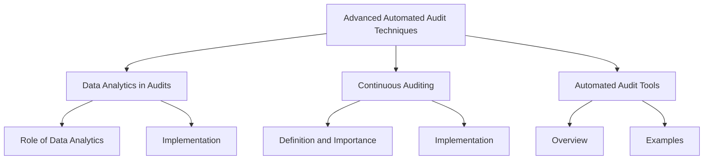
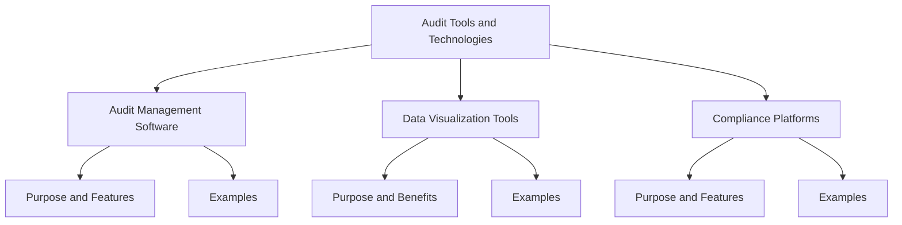
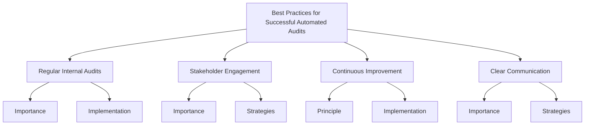

## Advanced Automated Audit Techniques

### Data Analytics in Audits
- **Role of Data Analytics**
  - Using data analytics to identify patterns, anomalies, and risks in large datasets.
  - Leveraging machine learning algorithms to predict potential compliance issues.
- **Implementation**
  - Integrating data analytics tools with existing systems for seamless data flow.
  - Examples: Using tools like Splunk, ElasticSearch, and custom machine learning models.

### Continuous Auditing
- **Definition and Importance**
  - Continuous auditing involves real-time or near-real-time evaluation of controls and transactions.
  - Benefits: Immediate detection of issues, proactive compliance management, and reduced audit fatigue.
- **Implementation**
  - Deploying continuous monitoring tools that integrate with various systems and processes.
  - Examples: Using SIEM systems (e.g., IBM QRadar, ArcSight) to continuously monitor security events.

### Automated Audit Tools
- **Overview**
  - Tools designed to automate various aspects of the audit process, from planning and execution to reporting.
- **Examples**
  - AuditBoard: Streamlines audit management and enhances collaboration.
  - Galvanize (formerly ACL): Provides robust data analytics and continuous control monitoring.
  - SAP GRC: Integrates governance, risk, and compliance into business processes.

## Audit Tools and Technologies

### Audit Management Software
- **Purpose and Features**
  - Centralized platform to manage audit lifecycle, including planning, execution, and reporting.
  - Features: Workflow automation, risk assessment, issue tracking, and documentation management.
- **Examples**
  - TeamMate+ Audit: Comprehensive audit management software with advanced reporting capabilities.
  - MetricStream Audit Management: Provides a unified approach to manage internal and external audits.

### Data Visualization Tools
- **Purpose and Benefits**
  - Transforming complex data sets into visual representations for easier interpretation and analysis.
  - Benefits: Enhanced decision-making, better communication of findings, and identification of trends.
- **Examples**
  - Tableau: Powerful data visualization tool with extensive integration capabilities.
  - Power BI: Microsoft's analytics service providing interactive visualizations and business intelligence capabilities.

### Compliance Platforms
- **Purpose and Features**
  - Integrated platforms that provide tools for managing compliance activities, documentation, and reporting.
  - Features: Policy management, risk assessment, incident management, and compliance tracking.
- **Examples**
  - OneTrust: Comprehensive platform for privacy, security, and third-party risk management.
  - RSA Archer: Suite of integrated risk management solutions focusing on compliance and security.

## Best Practices for Successful Automated Audits

### Regular Internal Audits
- **Importance**
  - Regular internal audits help in identifying and mitigating risks proactively.
  - Ensures continuous compliance and readiness for external audits.
- **Implementation**
  - Schedule periodic internal audits using automated audit management tools.
  - Use automated reporting to track and document findings and corrective actions.

### Stakeholder Engagement
- **Importance**
  - Engaging stakeholders ensures transparency, support, and alignment with business objectives.
- **Strategies**
  - Regularly communicate audit plans, progress, and findings to relevant stakeholders.
  - Use collaboration tools to facilitate communication and documentation sharing.

### Continuous Improvement
- **Principle**
  - Continuous improvement involves regularly evaluating and enhancing compliance processes and controls.
- **Implementation**
  - Use feedback from audits to identify areas for improvement.
  - Implement automated monitoring and feedback loops to ensure ongoing enhancement of controls.

### Clear Communication
- **Importance**
  - Clear communication is essential for effective audit execution and compliance management.
- **Strategies**
  - Develop clear and concise audit reports using automated tools.
  - Ensure that audit findings and recommendations are communicated effectively to all relevant parties.

