## Automated Auditing

## Purpose and Objectives of Automated Audits

### Ensuring Compliance
- **Definition and Importance**
  - Automated audits continuously check if an organization's processes and controls align with regulatory requirements[^1].
  - Importance: Reduces the risk of non-compliance, avoiding legal penalties and reputational damage.
- **Implementation**
  - Use compliance management software to monitor and report compliance status.
  - Integrate automated compliance checks into everyday operations to ensure real-time compliance monitoring.

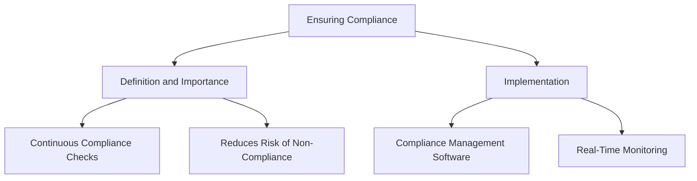

### Identifying Risks
- **Definition and Importance**
  - Automated audits help identify potential risks and vulnerabilities in real-time[^2].
  - Importance: Allows for proactive risk management and mitigation.
- **Implementation**
  - Use automated risk assessment tools to identify and prioritize risks.
  - Implement real-time alerts for identified risks to enable immediate action.

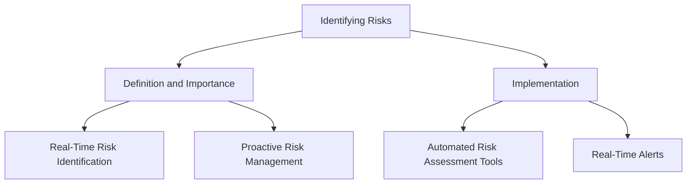

### Improving Processes
- **Definition and Importance**
  - Automated audits provide continuous feedback on process efficiency and effectiveness[^3].
  - Importance: Facilitates continuous improvement and operational excellence.
- **Implementation**
  - Use data analytics to analyze audit results and identify areas for improvement.
  - Implement process automation to streamline and optimize workflows.

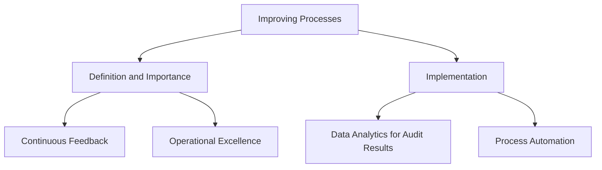

### Building Trust
- **Definition and Importance**
  - Automated audits provide transparent and verifiable records of compliance and performance[^4].
  - Importance: Builds trust with stakeholders, including customers, regulators, and partners.
- **Implementation**
  - Use blockchain technology for immutable audit trails.
  - Provide stakeholders with access to real-time compliance dashboards.

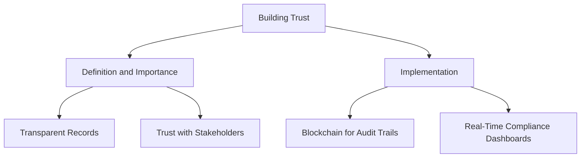

## Types of Automated Audits

### Internal Audits
- **Definition and Importance**
  - Conducted by an organization's own staff to evaluate internal controls and processes[^5].
  - Importance: Identifies internal issues and areas for improvement before external audits.
- **Implementation**
  - Use automated internal audit software to schedule and conduct regular audits.
  - Generate automated reports to summarize findings and recommendations.

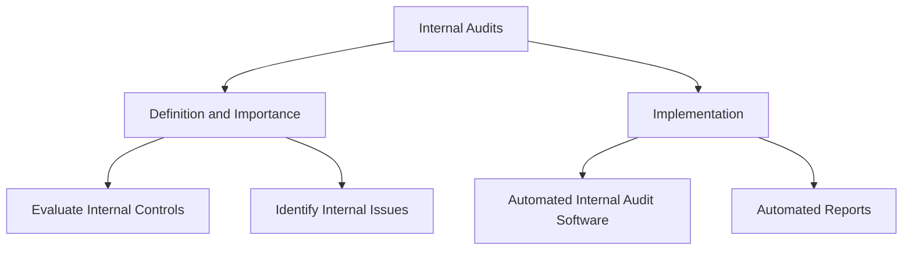

### External Audits
- **Definition and Importance**
  - Performed by independent auditors to provide an unbiased assessment of compliance[^6].
  - Importance: Enhances credibility and ensures compliance with external standards.
- **Implementation**
  - Provide external auditors with access to automated compliance data and reports.
  - Use audit management platforms to facilitate communication and documentation sharing.

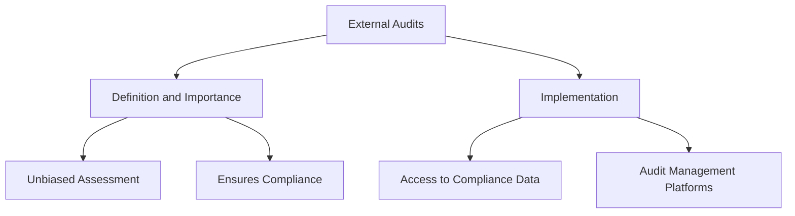

### Third-Party Audits
- **Definition and Importance**
  - Conducted by specialized firms to certify compliance with specific standards (e.g., SOC 2, ISO 27001)[^7].
  - Importance: Essential for building credibility with clients and partners.
- **Implementation**
  - Integrate third-party audit requirements into automated compliance systems.
  - Provide third-party auditors with automated evidence and documentation.

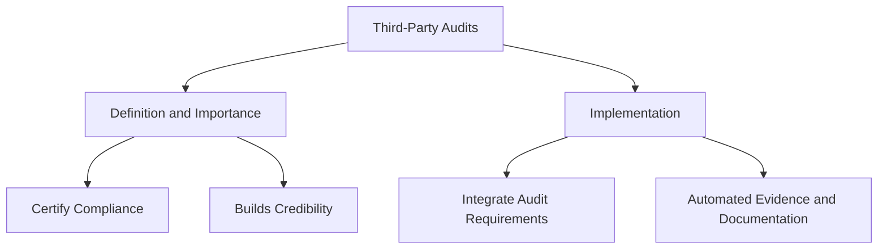

### Compliance Audits
- **Definition and Importance**
  - Focus specifically on verifying adherence to regulatory requirements[^8].
  - Importance: Ensures that the organization meets all legal and regulatory obligations.
- **Implementation**
  - Use compliance management tools to track and report on regulatory compliance.
  - Automate the collection and submission of compliance evidence.

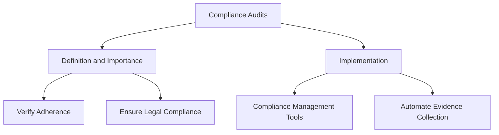

### Operational Audits
- **Definition and Importance**
  - Assess the efficiency and effectiveness of operational processes[^9].
  - Importance: Identifies opportunities for cost savings and process improvements.
- **Implementation**
  - Use performance monitoring tools to automate the assessment of operational processes.
  - Generate automated reports highlighting inefficiencies and recommendations.

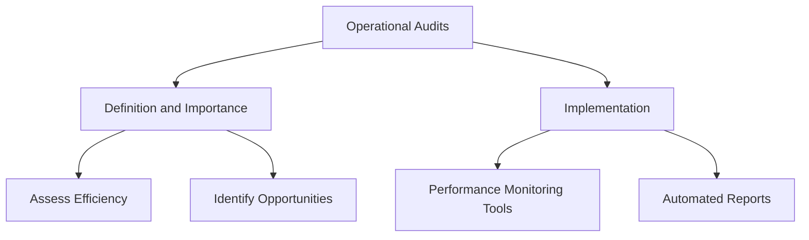

### IT Audits
- **Definition and Importance**
  - Examine the controls and procedures related to the organization's IT systems[^10].
  - Importance: Ensures that IT systems are secure, reliable, and compliant with relevant standards.
- **Implementation**
  - Use IT audit tools to automate the assessment of IT controls and security measures.
  - Conduct automated vulnerability assessments and penetration tests.

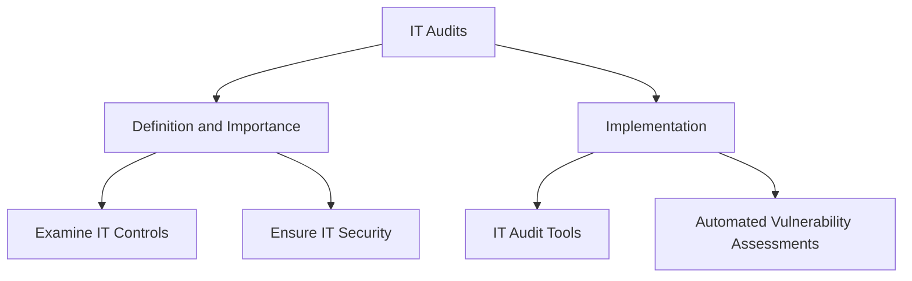

## Understanding Automated Audit Scope and Methodologies

### Audit Scope

#### Definition of Boundaries and Focus Areas
- **Definition and Importance**
  - The audit scope defines what will be audited, including specific systems, processes, and controls[^11].
  - Importance: Ensures that the audit remains focused and relevant, covering all critical areas.
- **Implementation**
  - Use audit management software to define and document the audit scope.
  - Regularly review and update the audit scope to reflect changes in the organization's operations and risks.

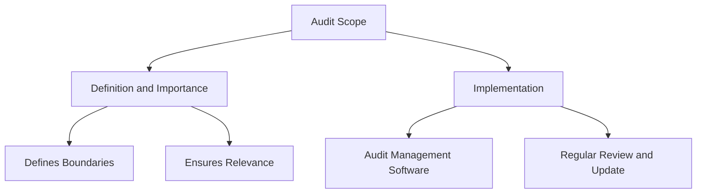

## Audit Methodologies

### Risk-Based Auditing
- **Definition and Importance**
  - Focuses on areas with the highest risk to the organization, prioritizing audit resources accordingly[^12].
  - Importance: Maximizes the impact of the audit by addressing the most significant threats.
- **Implementation**
  - Use risk assessment tools to identify and prioritize high-risk areas.
  - Allocate audit resources based on risk levels to ensure comprehensive coverage.

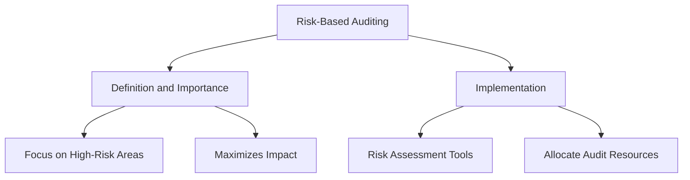

### Substantive Testing
- **Definition and Importance**
  - Involves detailed testing of transactions and balances to verify their accuracy and completeness[^13].
  - Importance: Ensures the reliability and integrity of financial and operational data.
- **Implementation**
  - Use data analytics tools to automate substantive testing processes.
  - Generate automated reports to document testing results and findings.

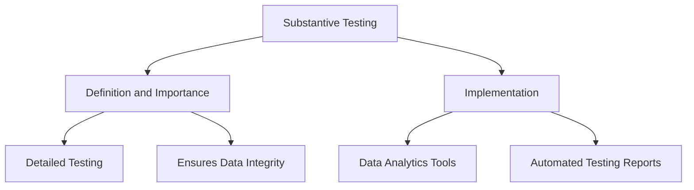

### Control Testing
- **Definition and Importance**
  - Evaluates the design and operating effectiveness of controls to ensure they are functioning as intended[^14].
  - Importance: Validates that controls are adequate to mitigate risks and ensure compliance.
- **Implementation**
  - Use automated control testing tools to assess control effectiveness.
  - Schedule regular automated tests to continuously monitor control performance.

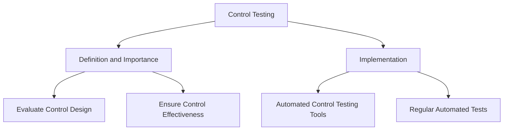
   

---

[^1]: Martha Kendall Custard, "Everything You Need to Know About Audit Automation," FormsOnFire, accessed July 23, 2024, https://www.formsonfire.com/blog/everything-you-need-to-know-about-audit-automation
[^2]: "What Is Audit Automation And How Can It Benefit Firms?," INAA Group, published May 30, 2023, https://www.inaa.org/what-is-audit-automation-and-how-can-it-benefit-firms/
[^3]: Martha Kendall Custard, "Everything You Need to Know About Audit Automation," FormsOnFire, accessed 23, 2023, https://www.formsonfire.com/blog/everything-you-need-to-know-about-audit-automation
[^4]: Martha Kendall Custard, "Everything You Need to Know About Audit Automation," FormsOnFire, accessed 23, 2023, https://www.formsonfire.com/blog/everything-you-need-to-know-about-audit-automation
[^5]: "What is internal audit?," Chartered Institute of Internal Auditors, accessed July 24, 2024, https://www.iia.org.uk/about-us/what-is-internal-audit/
[^6]: "What is an External Audit? All your questions answered," Allen Audit & Advisory, accessed July 24, 2024, https://allenaudit.com.au/what-is-an-external-audit/
[^7]: "Third Party Auditing – Certification of Management Systems," Isonike, accessed July 24, 2024, https://isonike.com/?q=node/76
[^8]: Ariba Iqbal and Christina Ramos, "Compliance Audit: Definition, Types, and What to Expect," AuditBoard, published June 08, 2023, https://www.auditboard.com/blog/compliance-audit/
[^10]: Stephen D. Gantz, "Information Technology Audit - an overview," ScienceDirect, accessed July 24, 2024, https://www.sciencedirect.com/topics/computer-science/information-technology-audit
[^11]: "Scope of an audit: 7 factors to consider," Trust Community, accessed July 24, 2024, https://community.trustcloud.ai/docs/grc-launchpad/grc-101/compliance/how-do-i-determine-the-scope-of-an-audit/
[^12]: Kyle Rober, "Streamline Your Audit Process: Implementing Risk-Based Auditing Best Practices," Learnexus, published February 2024, https://learnexus.com/risk-based-auditing-best-practices/
[^13]: "What is Substantive Testing and Why is it Critical in Audit?," DataSnipper, accessed July 24, 2024, https://www.datasnipper.com/resources/the-importance-of-substantive-testing-in-audits
[^14]: "Introduction To Control Testing," FasterCapital, accessed July 24, 2024, https://fastercapital.com/topics/introduction-to-control-testing.html