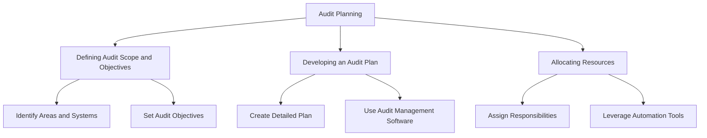
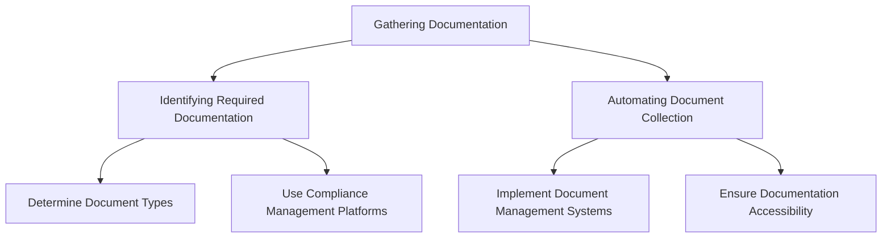
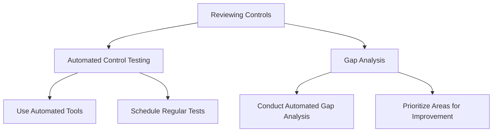
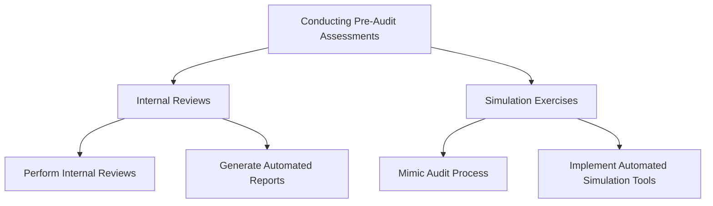
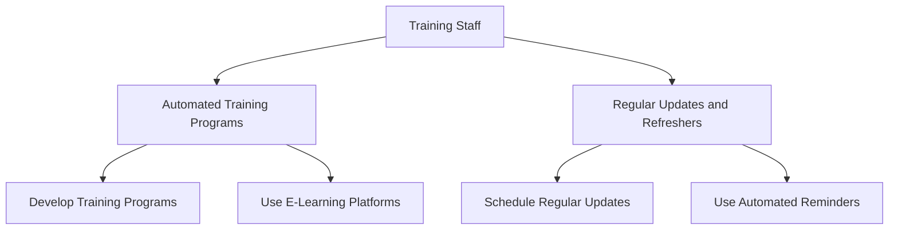
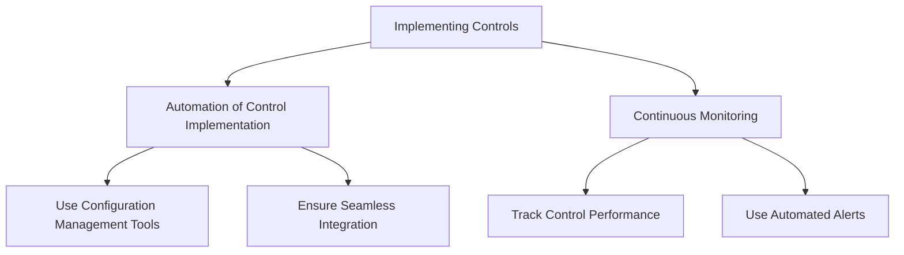
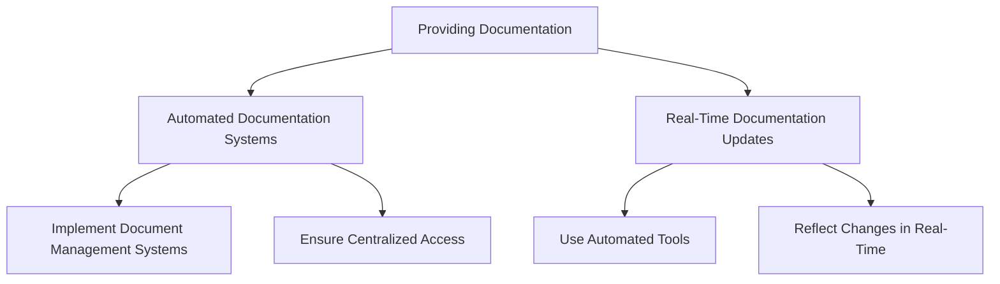
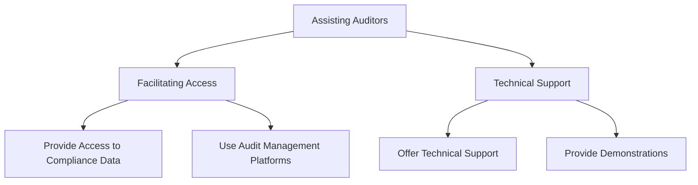
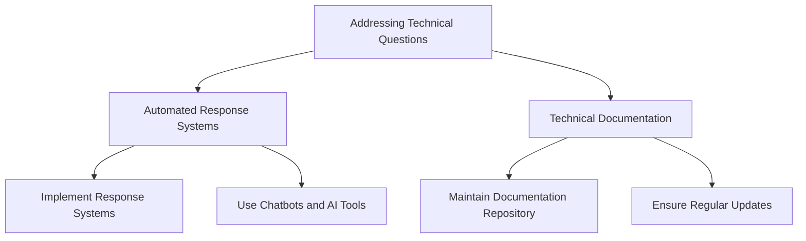
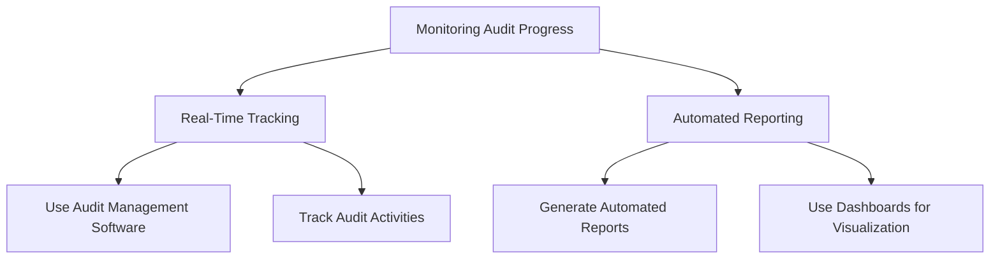

## Steps to Prepare for Automated Compliance Audits

### Audit Planning
- **Defining Audit Scope and Objectives**
  - Identify the specific areas, processes, and systems to be audited.
  - Set clear objectives for what the audit aims to achieve, such as verifying compliance with regulatory standards or assessing the effectiveness of internal controls.
- **Developing an Audit Plan**
  - Create a detailed plan outlining the audit's timeline, resources, and methodologies.
  - Use audit management software to automate the planning process, ensuring all necessary steps are covered.
- **Allocating Resources**
  - Assign responsibilities to team members, ensuring that technical staff, compliance officers, and auditors understand their roles.
  - Leverage automation tools to streamline resource allocation and track progress.

### Gathering Documentation
- **Identifying Required Documentation**
  - Determine the types of documents needed for the audit, such as policies, procedures, logs, and reports.
  - Use compliance management platforms to automatically identify and retrieve necessary documentation.
- **Automating Document Collection**
  - Implement document management systems that support automated collection and organization of compliance documents.
  - Ensure all relevant documentation is up-to-date and accessible to auditors.

### Reviewing Controls
- **Automated Control Testing**
  - Use automated tools to test the effectiveness of existing controls.
  - Schedule regular automated tests to continuously monitor control performance.
- **Gap Analysis**
  - Conduct automated gap analysis to identify areas where controls may be lacking or insufficient.
  - Use the results to prioritize areas for improvement and remediation.

### Conducting Pre-Audit Assessments
- **Internal Reviews**
  - Perform internal reviews using automated tools to assess compliance status and identify potential issues.
  - Generate automated reports to summarize findings and recommend corrective actions.
- **Simulation Exercises**
  - Use simulation exercises to mimic the audit process and identify weaknesses in current practices.
  - Implement automated simulation tools to streamline this process.

### Training Staff
- **Automated Training Programs**
  - Develop and deploy automated training programs to educate staff on compliance requirements and audit procedures.
  - Use e-learning platforms to deliver training modules and track completion.
- **Regular Updates and Refreshers**
  - Schedule regular training updates and refreshers to ensure staff stay informed about the latest compliance standards and audit practices.
  - Use automated reminders and tracking systems to manage training schedules.

## Role of Technical Staff During Audit Preparation and Execution

### Implementing Controls
- **Automation of Control Implementation**
  - Use configuration management tools (e.g., Ansible, Puppet) to automate the deployment and configuration of controls.
  - Ensure controls are integrated into existing systems seamlessly.
- **Continuous Monitoring**
  - Implement continuous monitoring solutions to track control performance and identify any deviations.
  - Use automated alerts to notify technical staff of any issues.

### Providing Documentation
- **Automated Documentation Systems**
  - Implement document management systems to automate the collection, organization, and storage of compliance documentation.
  - Ensure all relevant documents are easily accessible to auditors through a centralized platform.
- **Real-Time Documentation Updates**
  - Use automated tools to keep documentation up-to-date in real-time, reflecting any changes or updates to controls and processes.

### Assisting Auditors
- **Facilitating Access**
  - Provide auditors with access to automated compliance data and reports through secure portals.
  - Use audit management platforms to facilitate communication and documentation sharing.
- **Technical Support**
  - Offer technical support to auditors to help them understand automated systems and processes.
  - Provide demonstrations of how automated controls and monitoring tools work.

### Addressing Technical Questions
- **Automated Response Systems**
  - Implement automated response systems to address common technical questions from auditors.
  - Use chatbots and AI-driven tools to provide instant responses and support.
- **Technical Documentation**
  - Maintain a comprehensive repository of technical documentation to assist in answering more complex questions.
  - Ensure this documentation is regularly updated and accessible.

### Monitoring Audit Progress
- **Real-Time Tracking**
  - Use audit management software to monitor the progress of the audit in real-time.
  - Track the status of audit activities, findings, and corrective actions.
- **Automated Reporting**
  - Generate automated reports to provide updates on audit progress to stakeholders.
  - Use dashboards to visualize key metrics and findings.

