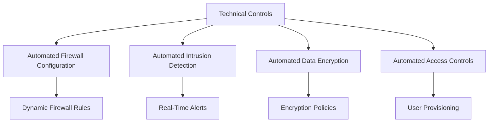
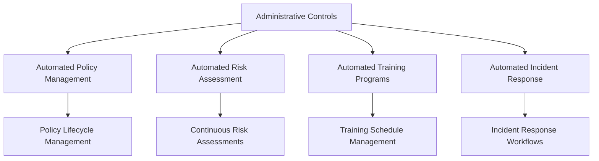
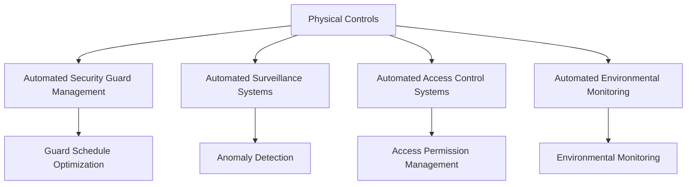
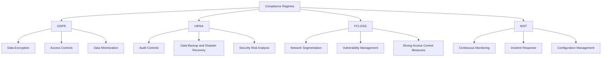

##  Automating Controls

## Automating Technical Controls

### Examples and Implementation

#### Firewalls
- **Automated Firewall Configuration**
  - Firewalls are critical for network security, preventing unauthorized access to the network.
  - Automation tools can configure and manage firewall rules dynamically based on real-time threat intelligence and compliance requirements.
  - Example: Using Ansible to automate the deployment and configuration of firewalls across a network.

#### Intrusion Detection Systems (IDS)
- **Automated Intrusion Detection**
  - IDS tools monitor network traffic for suspicious activities and potential threats.
  - Automated IDS can integrate with SIEM (Security Information and Event Management) systems to provide real-time alerts and responses.
  - Example: Implementing Snort IDS with automated rule updates and integration with a SIEM system like Splunk.

#### Encryption
- **Automated Data Encryption**
  - Ensuring data at rest and in transit is encrypted is a fundamental compliance requirement.
  - Automation tools can enforce encryption policies, manage encryption keys, and ensure data integrity.
  - Example: Using AWS Key Management Service (KMS) for automatic key management and encryption of data stored in S3 buckets.

#### Access Control Mechanisms
- **Automated Access Controls**
  - Access controls regulate who can view or use resources in a computing environment.
  - Automation can streamline user provisioning, role-based access control (RBAC), and multi-factor authentication (MFA) enforcement.
  - Example: Implementing Okta for automated user provisioning and access management across applications.

## Automating Administrative Controls

### Examples and Implementation

#### Policies and Procedures
- **Automated Policy Management**
  - Policies and procedures guide the organization’s compliance efforts.
  - Automation tools can manage policy creation, updates, distribution, and employee acknowledgment.
  - Example: Using PolicyTech for automated policy lifecycle management.

#### Risk Assessments
- **Automated Risk Assessment**
  - Regular risk assessments are crucial for identifying and mitigating potential threats.
  - Automated tools can conduct continuous risk assessments and generate reports.
  - Example: Implementing RSA Archer for automated risk management and assessment.

#### Training Programs
- **Automated Training and Awareness Programs**
  - Employee training ensures everyone is aware of compliance requirements.
  - Automation platforms can manage training schedules, track completion, and assess understanding.
  - Example: Using KnowBe4 for automated security awareness training and phishing simulations.

#### Incident Response Plans
- **Automated Incident Response**
  - Incident response plans outline how to respond to security incidents.
  - Automation tools can orchestrate incident response workflows, from detection to resolution.
  - Example: Implementing IBM Resilient for automated incident response management.

## Automating Physical Controls

### Examples and Implementation

#### Security Guards
- **Automated Security Guard Management**
  - Ensuring physical security often involves deploying security personnel.
  - Automation tools can optimize guard schedules, monitor their activities, and integrate with digital systems.
  - Example: Using Guardso for automated security guard management.

#### Surveillance Cameras
- **Automated Surveillance Systems**
  - Surveillance cameras are essential for monitoring and recording activities.
  - Automated systems can manage camera feeds, detect anomalies, and alert security personnel.
  - Example: Implementing Hikvision’s automated surveillance solutions.

#### Access Control Systems
- **Automated Access Control Systems**
  - Physical access controls regulate entry to facilities and sensitive areas.
  - Automation tools can manage access permissions and integrate with digital security systems.
  - Example: Using HID Global’s access control solutions for automated physical access management.

#### Environmental Controls
- **Automated Environmental Monitoring**
  - Environmental controls ensure that facilities maintain optimal conditions for equipment and personnel.
  - Automation tools can monitor and regulate temperature, humidity, and other environmental factors.
  - Example: Implementing Schneider Electric’s EcoStruxure for automated environmental monitoring.

## Examples of Automated Controls Specific to Different Compliance Regimes

### GDPR
- **Data Encryption**
  - Automated encryption of personal data both at rest and in transit.
  - Example: Using Azure Information Protection for automated data encryption.

- **Access Controls**
  - Automated role-based access control (RBAC) to ensure only authorized users can access personal data.
  - Example: Implementing AWS IAM for automated access control.

- **Data Minimization**
  - Automating data minimization practices to ensure only necessary data is collected and retained.
  - Example: Using automation scripts to regularly purge outdated personal data.

### HIPAA
- **Audit Controls**
  - Automated logging and monitoring of access to electronic health records.
  - Example: Using Splunk for automated audit controls and log management.

- **Data Backup and Disaster Recovery**
  - Automated backup solutions to ensure the availability of electronic health records.
  - Example: Implementing Veeam for automated backup and recovery.

- **Security Risk Analysis**
  - Continuous, automated risk assessments to identify and mitigate potential security threats.
  - Example: Using RiskWatch for automated security risk analysis.

### PCI-DSS
- **Network Segmentation**
  - Automated network segmentation to isolate cardholder data environments.
  - Example: Using VMware NSX for automated network segmentation.

- **Vulnerability Management**
  - Automated scanning and remediation of vulnerabilities.
  - Example: Implementing Qualys for automated vulnerability management.

- **Strong Access Control Measures**
  - Automated enforcement of access control policies.
  - Example: Using BeyondTrust for automated privileged access management.

### NIST
- **Continuous Monitoring**
  - Implementing automated continuous monitoring solutions.
  - Example: Using SolarWinds for automated continuous monitoring.

- **Incident Response**
  - Automating incident detection and response workflows.
  - Example: Using Rapid7 InsightIDR for automated incident response.

- **Configuration Management**
  - Automated configuration management to ensure systems are securely configured.
  - Example: Using Puppet for automated configuration management.

