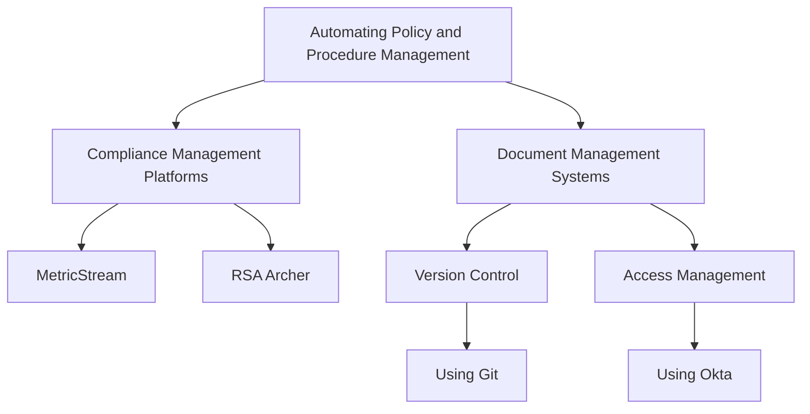
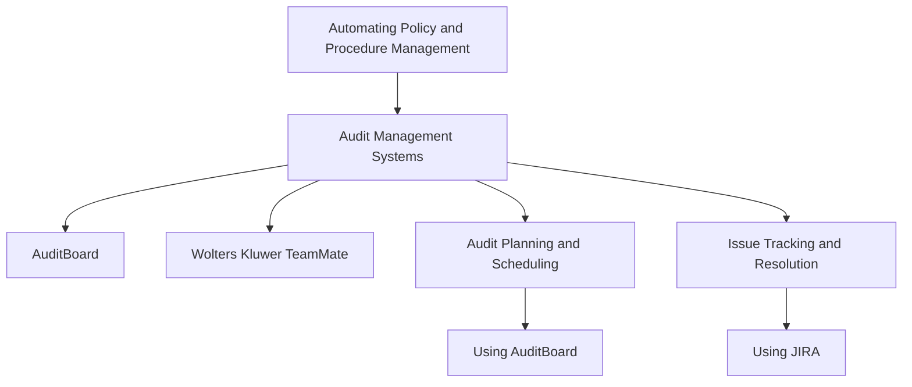
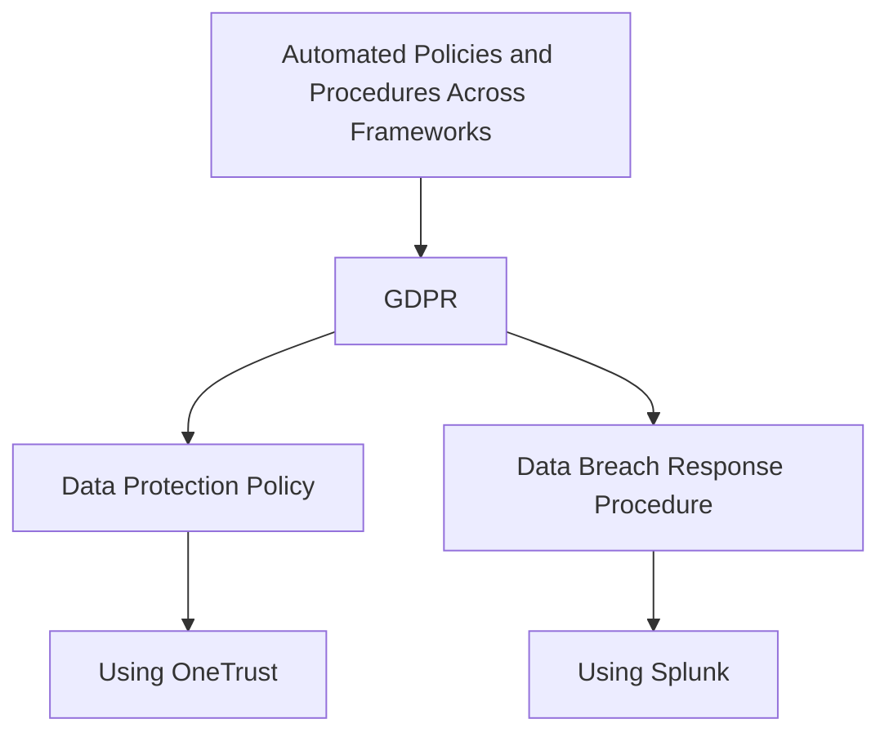
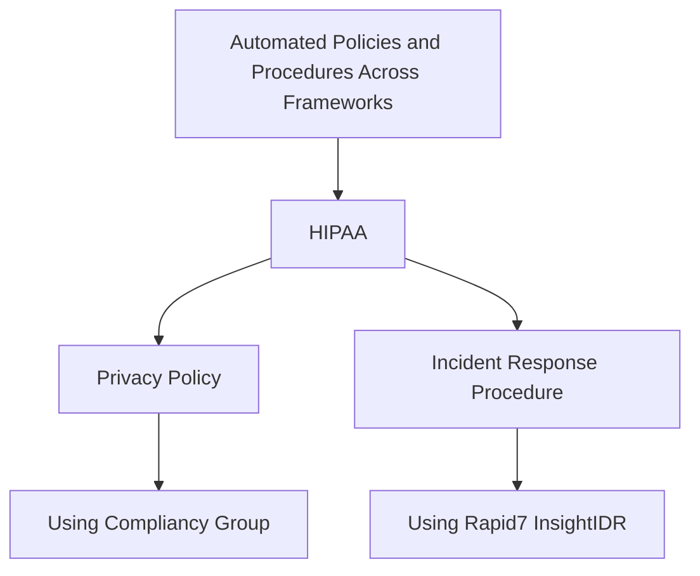
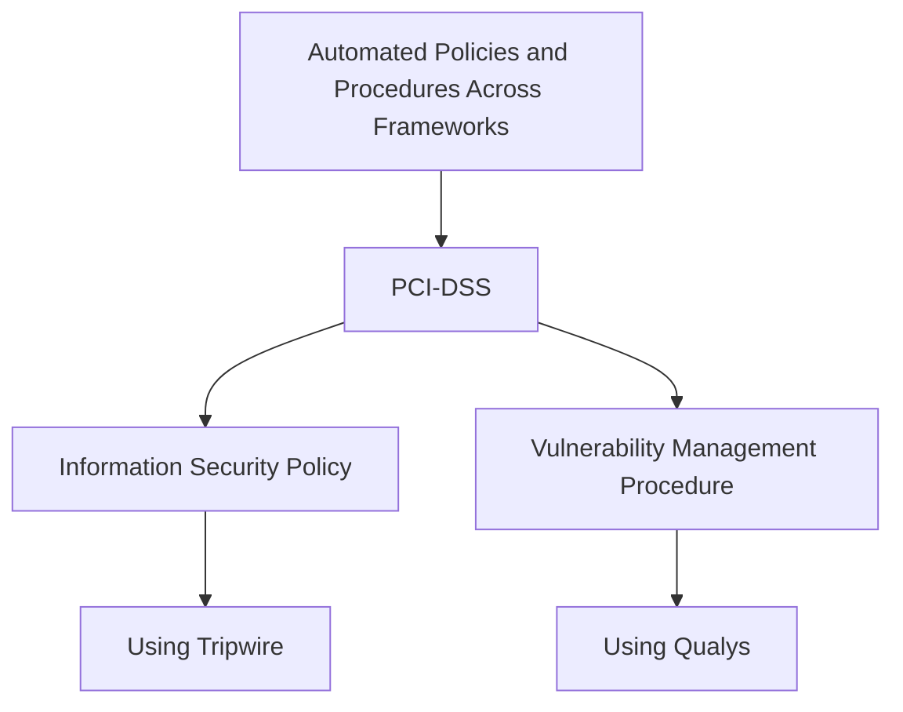
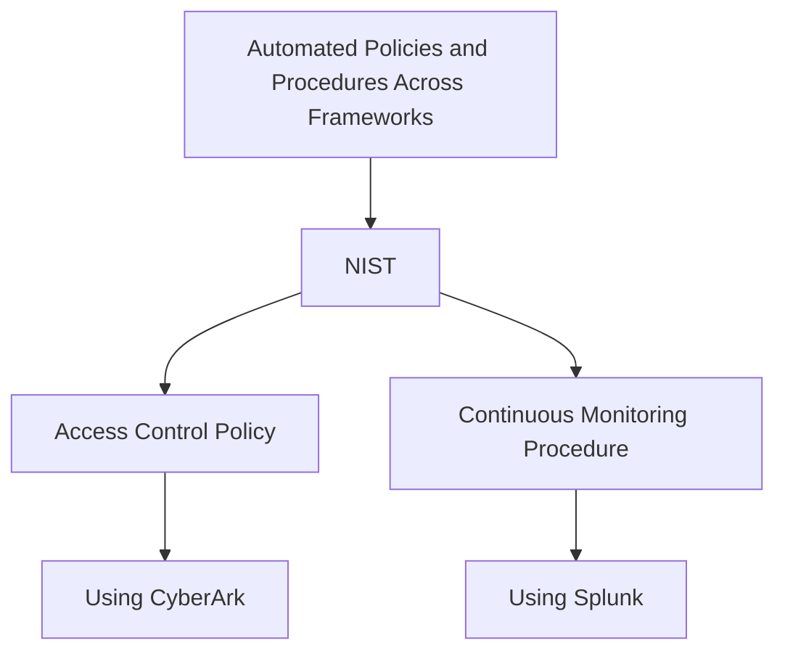

## Automating Policy and Procedure Management

### Tools and Techniques

#### Compliance Management Platforms
- **Overview**
  - These platforms centralize and streamline the management of compliance-related tasks, ensuring that policies and procedures are consistently applied across the organization.
  - Example: MetricStream, RSA Archer.

#### Document Management Systems (DMS)
- **Overview**
  - DMS are designed to manage, store, and track electronic documents and images of paper documents. They ensure that compliance documents are easily accessible, properly versioned, and securely stored.
  - Example: SharePoint, DocuWare.
- **Automated Features**
  - **Version Control**
    - Automatically tracks changes and maintains version history, ensuring that the latest version is always available.
    - Example: Using Git for version control of policy documents.
  - **Access Management**
    - Automates the assignment of access permissions based on roles, ensuring that only authorized personnel can access sensitive compliance documents.
    - Example: Implementing role-based access controls (RBAC) using Okta.

#### Audit Management Systems
- **Overview**
  - These systems automate the planning, execution, and documentation of audits, ensuring compliance with internal policies and external regulations.
  - Example: AuditBoard, Wolters Kluwer TeamMate.
- **Automated Features**
  - **Audit Planning and Scheduling**
    - Automates the creation of audit plans and schedules, ensuring that audits are conducted regularly and on time.
    - Example: Using AuditBoard to automate the audit schedule.
  - **Issue Tracking and Resolution**
    - Tracks identified issues and their resolution status, ensuring that all compliance gaps are addressed promptly.
    - Example: Implementing JIRA for automated issue tracking and resolution.

## Examples of Automated Policies and Procedures Across Frameworks

### GDPR
- **Data Protection Policy**
  - Automating the enforcement and monitoring of data protection policies.
  - Example: Using OneTrust to automate GDPR compliance tasks, including data protection policy enforcement.

- **Data Breach Response Procedure**
  - Automating the detection and response to data breaches.
  - Example: Implementing Splunk to automate the detection of potential data breaches and initiating predefined response procedures.

### HIPAA
- **Privacy Policy**
  - Automating the management and enforcement of privacy policies to ensure the protection of patient health information.
  - Example: Using Compliancy Group to automate HIPAA privacy policy management and enforcement.

- **Incident Response Procedure**
  - Automating the process of incident detection, reporting, and response in healthcare settings.
  - Example: Implementing Rapid7 InsightIDR for automated incident detection and response in compliance with HIPAA requirements.

### PCI-DSS
- **Information Security Policy**
  - Automating the creation, distribution, and enforcement of information security policies to protect cardholder data.
  - Example: Using Tripwire to automate compliance with PCI-DSS information security policies.

- **Vulnerability Management Procedure**
  - Automating the identification, assessment, and remediation of vulnerabilities in payment systems.
  - Example: Implementing Qualys for automated vulnerability management in compliance with PCI-DSS.

### NIST
- **Access Control Policy**
  - Automating the implementation and monitoring of access control policies to ensure that only authorized users have access to sensitive systems and data.
  - Example: Using CyberArk for automated management of access control policies in compliance with NIST standards.

- **Continuous Monitoring Procedure**
  - Automating the continuous monitoring of systems to detect and respond to security incidents.
  - Example: Implementing Splunk for automated continuous monitoring and incident response.

