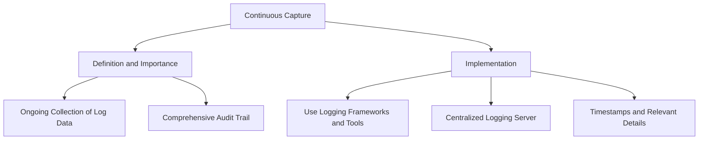
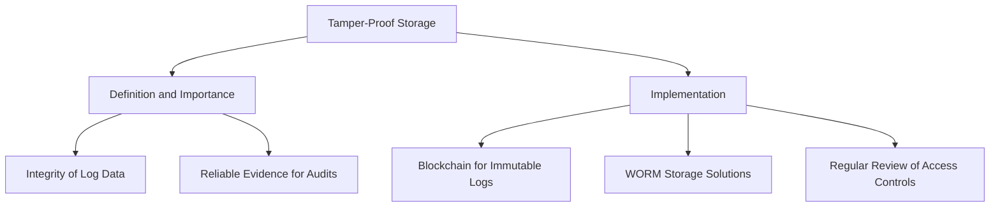
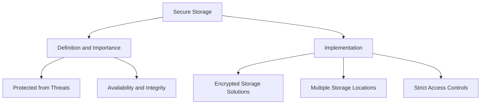
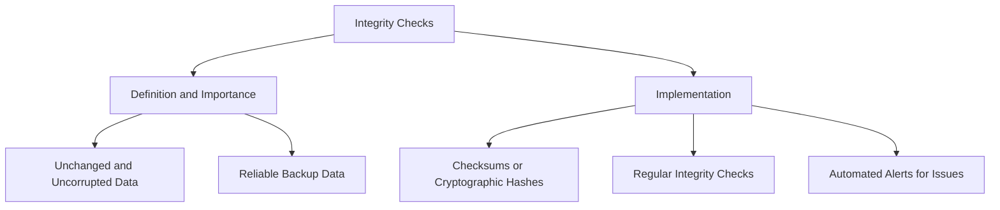
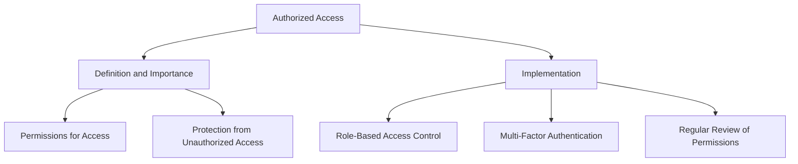
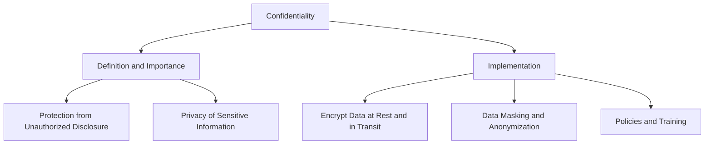
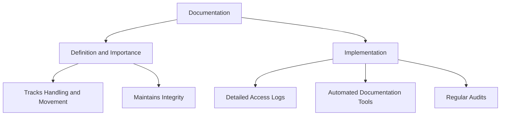
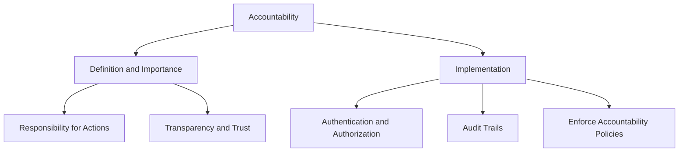

## Automated Logging

### Continuous Capture
- **Definition and Importance**
  - Continuous capture involves the automated and ongoing collection of log data from various systems and applications[^1].
  - Importance: Ensures that every event and action within the system is recorded, providing a comprehensive audit trail for compliance purposes.
- **Implementation**
  - Use logging frameworks and tools (e.g., [ELK Stack](https://www.elastic.co/elastic-stack), [Splunk](https://www.splunk.com/)) to set up continuous logging.
  - Configure systems to send logs to a centralized logging server.
  - Ensure logs are timestamped and include all relevant details (e.g., user actions, system events).

### Tamper-Proof Storage
- **Definition and Importance**
  - Tamper-proof storage ensures that once log data is captured, it cannot be altered or deleted without proper authorization[^2].
  - Importance: Protects the integrity of log data, making it reliable evidence for compliance audits.
- **Implementation**
  - Use technologies like blockchain to create immutable logs.
  - Implement write-once-read-many (WORM) storage solutions.
  - Regularly review and update access controls to prevent unauthorized changes.

## Regular Backups

### Secure Storage
- **Definition and Importance**
  - Secure storage involves keeping backups in locations that are protected from physical and digital threats[^3].
  - Importance: Ensures that backup data is available and intact when needed for recovery or audit purposes.
- **Implementation**
  - Use encrypted storage solutions for backups.
  - Store backups in multiple locations (e.g., on-premises and cloud) to protect against data loss.
  - Implement strict access controls to limit who can access and modify backup data.

### Integrity Checks
- **Definition and Importance**
  - Integrity checks involve verifying that backup data remains unchanged and uncorrupted over time[^4].
  - Importance: Ensures that backup data is reliable and can be restored accurately.
- **Implementation**
  - Use checksums or cryptographic hashes to verify the integrity of backup files.
  - Schedule regular integrity checks and audits of backup data.
  - Implement automated tools to alert administrators if integrity issues are detected.

## Access Controls

### Authorized Access
- **Definition and Importance**
  - Authorized access ensures that only individuals with the necessary permissions can access sensitive data and systems[^5].
  - Importance: Protects data from unauthorized access and potential breaches.
- **Implementation**
  - Use role-based access control (RBAC) to assign permissions based on job roles.
  - Implement multi-factor authentication (MFA) to enhance security.
  - Regularly review and update access permissions to reflect changes in personnel and roles.

### Confidentiality
- **Definition and Importance**
  - Confidentiality involves protecting sensitive data from unauthorized disclosure[^6].
  - Importance: Ensures that sensitive information remains private and is only accessible to authorized individuals.
- **Implementation**
  - Encrypt sensitive data both at rest and in transit.
  - Use data masking and anonymization techniques where appropriate.
  - Implement policies and training to ensure employees understand confidentiality requirements.

## Chain of Custody

### Documentation
- **Definition and Importance**
  - Chain of custody documentation tracks the handling and movement of evidence from collection to storage and use[^7].
  - Importance: Ensures that evidence remains untampered and its integrity is maintained.
- **Implementation**
  - Record detailed logs of who accessed the evidence, when, and why.
  - Use automated tools to maintain accurate and up-to-date documentation.
  - Regularly audit chain of custody records to ensure compliance.

### Accountability
- **Definition and Importance**
  - Accountability involves ensuring that individuals who handle evidence are responsible for their actions[^8].
  - Importance: Enhances transparency and trust in the evidence management process.
- **Implementation**
  - Implement access controls that require authentication and authorization for evidence handling.
  - Use audit trails to track and record all actions taken with evidence.
  - Enforce policies that hold individuals accountable for their actions.

   

---

[^1]: "What is Continuous Monitoring?," StrongDM, accessed July 23, 2024, https://www.strongdm.com/what-is/continuous-monitoring
[^2]: "Tamper-proof logs," The World Bank, accessed July 23, 2024, https://id4d.worldbank.org/guide/tamper-proof-logs
[^3]: "Data Storage Security," Hypertec Solutions Partner, accessed July 23, 2024, https://hypertecsp.com/knowledge-base/data-storage-security/
[^4]: "Data Integrity," Imperva, accessed July 23, 2024, https://www.imperva.com/learn/data-security/data-integrity/
[^5]: "Only authorised users should have access to data and functionality," National Cyber Security Center, accessed July 23, 2024, https://www.ncsc.gov.uk/collection/technology-assurance/principles-product-design-and-functionality/2-only-authorised-users-should-have-access-to-data-and-functionality
[^6]: Christie Rae, "Confidentiality," isms.online, accessed April 16, 2024, https://www.isms.online/glossary/confidentiality/
[^7]: Ashish Badiye; Neeti Kapoor; Ritesh G. M, "Chain of Custody," National Library of Medicine, accessed February 13, 2023, https://www.ncbi.nlm.nih.gov/books/NBK551677/
[^8]: "What are our responsibilities in terms of accountability?," Information Commisioner's Office, accessed July 23, 2024, https://ico.org.uk/for-organisations/uk-gdpr-guidance-and-resources/cctv-and-video-surveillance/guidance-on-video-surveillance-including-cctv/what-are-our-responsibilities-in-terms-of-accountability/

