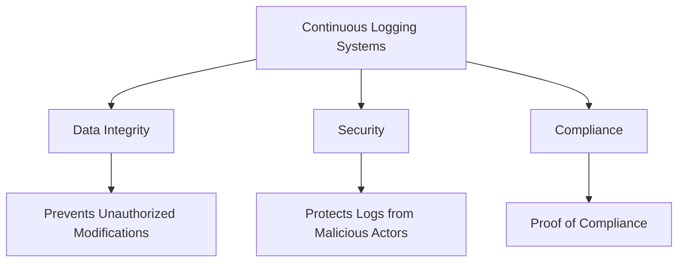
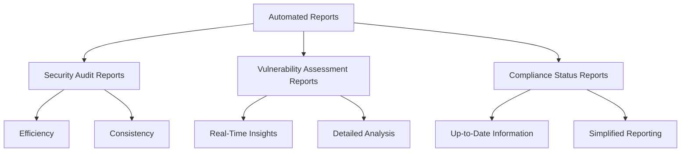
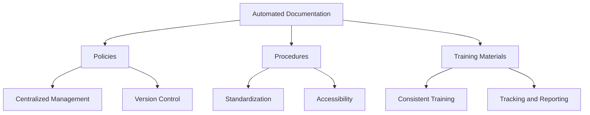

## Types of Evidence in Automated Compliance

## Automated Logging

### Continuous Logging Systems
- **Definition and Importance**
  - Continuous logging systems are automated tools that record all system activities in real-time, providing a comprehensive and chronological record of events[^1].
  - Importance: Continuous logging ensures that no activity goes unrecorded, making it easier to trace actions, detect anomalies, and ensure compliance with regulatory requirements.

#### Benefits of Tamper-Proof Logs
- **Data Integrity**
  - Tamper-proof logs prevent unauthorized modifications, ensuring that the data remains accurate and reliable[^2].
  - Importance: This integrity is crucial for forensic investigations and compliance audits.
- **Security**
  - Protects logs from being altered by malicious actors, which could otherwise hide evidence of unauthorized activities.
  - Example: Implementing blockchain technology to create immutable logs that cannot be tampered with.
- **Compliance**
  - Many regulations require the maintenance of tamper-proof logs as proof of compliance with security standards.
  - Example: [PCI-DSS](https://www.pcisecuritystandards.org/) mandates secure logging mechanisms to ensure data integrity and accountability.

## Automated Reports

### Security Audit Reports
- **Definition and Purpose**
  - Security audit reports provide a detailed analysis of an organization’s security posture by examining controls, policies, and procedures[^3].
  - Purpose: To identify vulnerabilities, ensure compliance, and recommend improvements.
- **Automation Benefits**
  - Efficiency: Automated tools can quickly generate comprehensive security audit reports.
  - Consistency: Reduces the risk of human error and ensures that reports are consistently accurate.
  - Example: Using tools like [Opsfolio Suite](https://opsfolio.com/) to automatically scan for vulnerabilities and generate detailed reports.
  <!-- - Example: Using tools like [Nessus](https://www.tenable.com/products/nessus) or [Qualys](https://www.qualys.com/) to automatically scan for vulnerabilities and generate detailed reports. -->

### Vulnerability Assessment Reports
- **Definition and Purpose**
  - Vulnerability assessment reports identify and evaluate vulnerabilities within the organization’s IT infrastructure[^4].
  - Purpose: To prioritize and mitigate security risks.
- **Automation Benefits**
  - Real-Time Insights: Automated tools provide continuous monitoring and instant reporting on vulnerabilities.
  - Detailed Analysis: Offers comprehensive data on the severity and potential impact of identified vulnerabilities.
  - Example: Deploying automated vulnerability assessment tools like [Tenable.io](https://www.tenable.com/) to continuously scan for vulnerabilities and generate reports.

### Compliance Status Reports
- **Definition and Purpose**
  - Compliance status reports provide an overview of the organization’s adherence to regulatory requirements.
  - Purpose: To demonstrate compliance and identify areas requiring improvement[^5].
- **Automation Benefits**
  - Up-to-Date Information: Automated tools ensure that compliance status is always current.
  - Simplified Reporting: Streamlines the process of compiling data from various sources to produce comprehensive reports.
  - Example: Using compliance management platforms like [Opsfolio Suite](https://opsfolio.com/) to automate the generation of compliance status reports.
  <!-- - Example: Using compliance management platforms like [MetricStream](https://www.metricstream.com/) or [RSA Archer](https://www.archerirm.com/) to automate the generation of compliance status reports. -->

## Automated Documentation

### Policies
- **Definition and Importance**
  - Policies are high-level documents that outline the organization’s approach to compliance and security[^6].
  - Importance: Ensures that all employees understand their responsibilities and the organization’s commitment to compliance.
- **Automation Benefits**
  - Centralized Management: Automated tools allow for centralized management and updating of policies.
  - Version Control: Ensures that the most current policies are in use and that changes are tracked.
  - Example: Using document management systems like [Opsfolio Suite](https://opsfolio.com/) to automate the management of compliance policies.
  <!-- - Example: Using document management systems like [SharePoint](https://www.microsoft.com/en-us/microsoft-365/sharepoint/collaboration) or [Confluence](https://www.atlassian.com/software/confluence) to automate the management of compliance policies. -->

### Procedures
- **Definition and Importance**
  - Procedures are detailed, step-by-step instructions on how to implement policies and controls[^7].
  - Importance: Provides clear guidance to employees on how to perform tasks in compliance with regulations.
- **Automation Benefits**
  - Standardization: Ensures procedures are applied consistently across the organization.
  - Accessibility: Makes procedures easily accessible to all employees, regardless of location.
  - Example: Implementing workflow automation tools like [Opsfolio Suite](https://opsfolio.com/) to manage and update compliance procedures.
  <!-- - Example: Implementing workflow automation tools like [ServiceNow](https://www.servicenow.com/) or [JIRA](https://www.atlassian.com/software/jira) to manage and update compliance procedures. -->

### Training Materials
- **Definition and Importance**
  - Training materials educate employees on compliance requirements and best practices.
  - Importance: Ensures that all employees are knowledgeable about compliance and can perform their duties accordingly.
- **Automation Benefits**
  - Consistent Training: Automated training platforms ensure that all employees receive the same information.
  - Tracking and Reporting: Tracks employee progress and completion of training programs.
  - Example: Using learning management systems (LMS) like [Opsfolio Suite](https://opsfolio.com/) to automate compliance training.
  <!-- - Example: Using learning management systems (LMS) like [Moodle](https://moodle.org/) or [Cornerstone](https://www.cornerstoneondemand.com/platform/learning-management-lms/) to automate compliance training. -->

   

---

[^1]: "Audit Logs: The Unsung Hero of Your Business's Cybersecurity Arsenal," Kiteworks, accessed July 23, 2024, https://www.kiteworks.com/risk-compliance-glossary/what-are-audit-logs/
[^2]: Alex Cawthorne, "The importance of immutable and tamper-proof data in compliance," LogLocker, published March 07, 2024, https://purplesec.us/security-controls/
[^3]: Vice Vicente, "Security Audits: A Comprehensive Overview," Auditboard, published April 19, 2024, https://www.auditboard.com/blog/what-is-security-audit/
[^4]: "What is Vulnerability Assessment," Imperva, accessed July 23, 2024, https://www.imperva.com/learn/application-security/vulnerability-assessment/
[^5]: Keith Acfalle, "Regulatory Compliance: Overview and Guide," Auditboard, published February 12, 2024, https://www.auditboard.com/blog/regulatory-compliance/
[^6]: Shannon Lane, "The Purpose of Policies and Procedures," KirkpatrickPrice, published December o5, 2023, https://kirkpatrickprice.com/blog/the-purpose-of-policies-procedures/
[^7]: "Standard operating procedure," Wikipedia, accessed July 23, 2024, https://en.wikipedia.org/wiki/Standard_operating_procedure