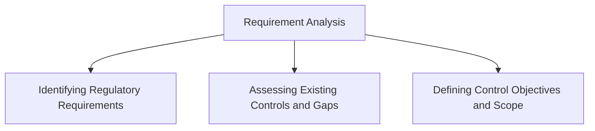
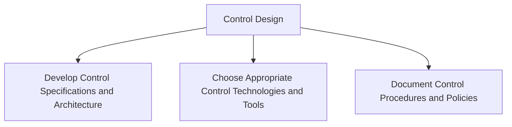
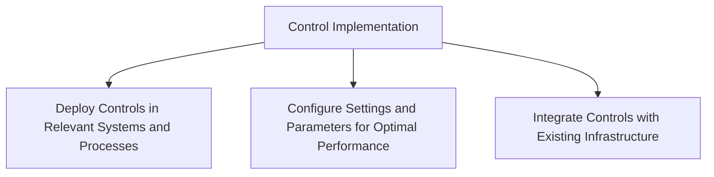
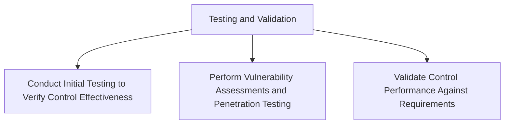
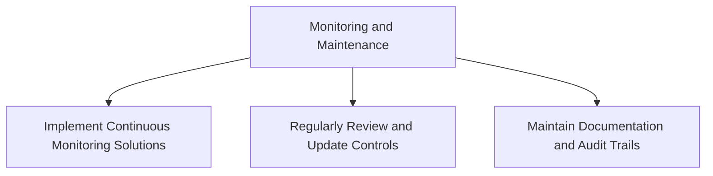

## Implementing Automated Controls

## Steps to Implement Automated Controls Effectively

### Requirement Analysis
- **Identifying Regulatory Requirements**
  - Determine which regulations and standards apply to the organization (e.g., GDPR, HIPAA, PCI-DSS, NIST).
  - Understand the specific requirements of these regulations.
  - **Example:** For a healthcare provider, identify HIPAA requirements such as patient data protection and privacy rules.

- **Assessing Existing Controls and Gaps**
  - Evaluate current controls to determine their effectiveness.
  - Identify any gaps where controls are lacking or insufficient.
  - **Example:** Conduct a security audit to check if existing firewalls and access controls meet regulatory standards.

- **Defining Control Objectives and Scope**
  - Clearly define what each control aims to achieve and the extent of its application.
  - Ensure that control objectives align with regulatory requirements and organizational goals.
  - **Example:** Define the objective of encryption controls to protect data at rest and in transit.

### Control Design
- **Develop Control Specifications and Architecture**
  - Design controls that meet identified requirements.
  - Create detailed specifications and an architecture outlining the control implementation.
  - **Example:** Design a network segmentation plan to isolate sensitive data from the rest of the network.

- **Choose Appropriate Control Technologies and Tools**
  - Select the technologies and tools that will be used to implement the controls.
  - Ensure that the chosen tools are compatible with existing systems.
  - **Example:** Choose encryption software that supports the required data formats and can integrate with existing databases.

- **Document Control Procedures and Policies**
  - Create comprehensive documentation outlining how the controls will be implemented, monitored, and maintained.
  - Ensure that the documentation is accessible to all relevant stakeholders.
  - **Example:** Document the steps for configuring and maintaining firewalls, including access rules and monitoring procedures.

### Control Implementation
- **Deploy Controls in Relevant Systems and Processes**
  - Integrate the designed controls into the appropriate systems and workflows.
  - Ensure minimal disruption to existing operations during deployment.
  - **Example:** Implement access controls in the company’s HR system to restrict access to employee data.

- **Configure Settings and Parameters for Optimal Performance**
  - Fine-tune the control settings to ensure they operate effectively and efficiently.
  - **Example:** Configure IDS (Intrusion Detection System) to detect and alert on suspicious network activities.

- **Integrate Controls with Existing Infrastructure**
  - Ensure seamless integration of new controls with the existing IT infrastructure.
  - Address any compatibility issues that arise during integration.
  - **Example:** Integrate a new SIEM (Security Information and Event Management) system with existing logging and monitoring tools.

### Testing and Validation
- **Conduct Initial Testing to Verify Control Effectiveness**
  - Perform initial tests to ensure the controls work as intended.
  - **Example:** Test encryption by verifying that data is encrypted and decrypted correctly.

- **Perform Vulnerability Assessments and Penetration Testing**
  - Conduct thorough assessments to identify potential vulnerabilities.
  - Use penetration testing to simulate attacks and test the control’s robustness.
  - **Example:** Perform penetration testing on the network to identify and address security weaknesses.

- **Validate Control Performance Against Requirements**
  - Ensure that the controls meet all defined requirements and performance criteria.
  - **Example:** Validate that the implemented firewall rules effectively block unauthorized access attempts.

### Monitoring and Maintenance
- **Implement Continuous Monitoring Solutions**
  - Use automated tools to continuously monitor the performance and effectiveness of the controls.
  - **Example:** Implement a SIEM system to monitor and analyze security events in real time.

- **Regularly Review and Update Controls**
  - Periodically review the controls to ensure they remain effective and relevant.
  - Update controls as necessary to address new threats or changes in regulatory requirements.
  - **Example:** Regularly update antivirus software to protect against the latest threats.

- **Maintain Documentation and Audit Trails**
  - Keep detailed records of all control activities, updates, and incidents.
  - Ensure documentation is up-to-date and audit trails are maintained for compliance verification.
  - **Example:** Document all changes to access control lists and keep a log of access requests and approvals.

