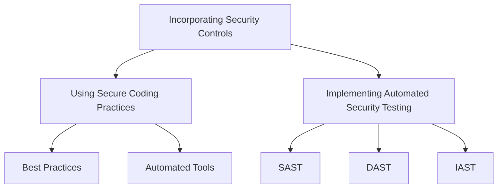
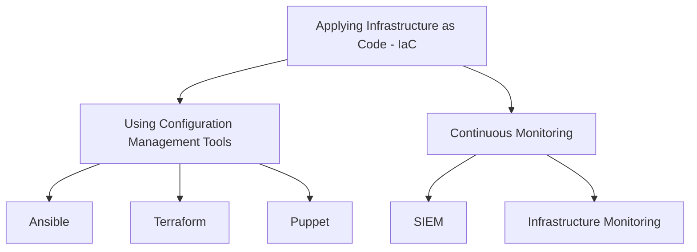
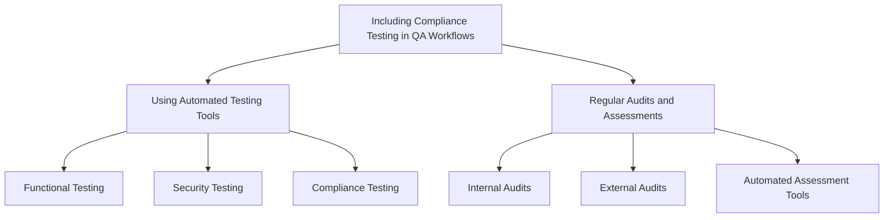

## Software Development (DevSecOps)

### Incorporating Security Controls

#### Using Secure Coding Practices
- **Definition and Importance**
  - Secure coding practices involve writing software in a way that protects against vulnerabilities.
  - Importance: Prevents common security issues like SQL injection, buffer overflows, and cross-site scripting (XSS).
- **Best Practices**
  - Validate all inputs to ensure they meet expected formats and ranges.
  - Use parameterized queries to prevent SQL injection attacks.
  - Implement proper error handling to avoid information leakage.
  - **Automated Tools**
    - Static Application Security Testing (SAST) tools: Automatically scan source code for security vulnerabilities during the development process.
    - Example: Using tools like SonarQube to detect and fix vulnerabilities early in the development lifecycle.

#### Implementing Automated Security Testing
- **Definition and Importance**
  - Automated security testing integrates security checks into the CI/CD pipeline, ensuring that vulnerabilities are identified and mitigated continuously.
  - Importance: Helps catch security flaws early, reducing the risk of security breaches in production.
- **Types of Automated Security Testing**
  - **Static Application Security Testing (SAST)**
    - Scans source code for vulnerabilities without executing the program.
    - **Example:** Running SAST tools like Checkmarx or Fortify on the codebase to identify security issues during the coding phase.
  - **Dynamic Application Security Testing (DAST)**
    - Analyzes running applications for vulnerabilities by simulating attacks.
    - **Example:** Using DAST tools like OWASP ZAP or Burp Suite to test web applications for runtime vulnerabilities.
  - **Interactive Application Security Testing (IAST)**
    - Combines SAST and DAST by analyzing applications in real-time while they run.
    - **Example:** Deploying tools like Contrast Security to monitor applications for security issues during runtime.

## Operations (DevOps)

### Applying Infrastructure as Code (IaC)

#### Using Configuration Management Tools
- **Definition and Importance**
  - IaC involves managing and provisioning computing infrastructure through machine-readable definition files, rather than physical hardware configuration or interactive configuration tools.
  - Importance: Ensures consistency and reduces errors by automating infrastructure setup.
- **Tools and Examples**
  - **Ansible**
    - An open-source tool for automation of software provisioning, configuration management, and application deployment.
    - **Example:** Writing Ansible playbooks to automate the configuration of servers and network devices.
  - **Terraform**
    - An open-source IaC software tool that enables users to define and provision infrastructure using a high-level configuration language.
    - **Example:** Using Terraform scripts to provision cloud infrastructure on AWS, Azure, or GCP.
  - **Puppet**
    - A configuration management tool for automating the management of infrastructure.
    - **Example:** Deploying Puppet manifests to manage the configuration state of servers.

#### Continuous Monitoring
- **Definition and Importance**
  - Continuous monitoring involves continuously assessing an organization's IT infrastructure to identify security threats and compliance violations.
  - Importance: Provides real-time insights into security posture and ensures compliance with regulatory standards.
- **Tools and Techniques**
  - **Security Information and Event Management (SIEM)**
    - Aggregates and analyzes activity from multiple resources across the IT infrastructure.
    - **Example:** Implementing SIEM tools like Splunk or IBM QRadar to monitor security events in real time.
  - **Infrastructure Monitoring**
    - Tools that provide visibility into the performance and health of the infrastructure.
    - **Example:** Using tools like Nagios or Prometheus to continuously monitor server performance and detect anomalies.

## Quality Assurance (QA)

### Including Compliance Testing in QA Workflows

#### Using Automated Testing Tools
- **Definition and Importance**
  - Automated testing tools facilitate the automatic execution of tests and comparison of actual outcomes with expected outcomes.
  - Importance: Ensures that compliance requirements are continuously met throughout the development lifecycle.
- **Types of Automated Testing**
  - **Functional Testing**
    - Validates that software performs as expected.
    - **Example:** Using Selenium to automate functional tests for web applications.
  - **Security Testing**
    - Ensures that the software is secure and free from vulnerabilities.
    - **Example:** Employing tools like OWASP ZAP for automated security testing of web applications.
  - **Compliance Testing**
    - Ensures that software complies with regulatory requirements.
    - **Example:** Using tools like VeraCode to verify compliance with standards such as PCI-DSS or HIPAA.

#### Regular Audits and Assessments
- **Definition and Importance**
  - Regular audits and assessments involve systematically reviewing processes, systems, and controls to ensure compliance with standards and regulations.
  - Importance: Identifies areas of non-compliance and opportunities for improvement.
- **Processes and Tools**
  - **Internal Audits**
    - Conducted by internal teams to evaluate the effectiveness of controls.
    - **Example:** Performing regular internal audits using checklists aligned with regulatory requirements.
  - **External Audits**
    - Conducted by third-party auditors to provide an independent assessment of compliance.
    - **Example:** Engaging external auditors to conduct annual compliance audits for certifications like SOC 2.
  - **Automated Assessment Tools**
    - Tools that automatically assess compliance and generate reports.
    - **Example:** Utilizing tools like Nessus or Qualys to perform automated vulnerability assessments and compliance checks.

