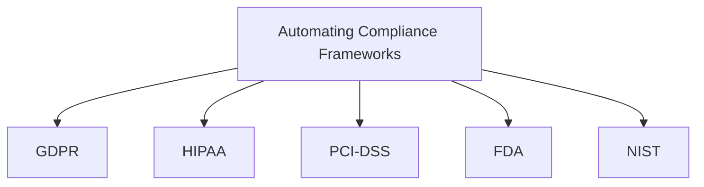
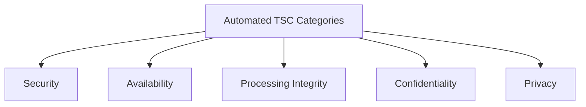

## Overview of Automating Compliance Frameworks

### Introduction to Compliance Frameworks

#### Definition and Importance of Automating Compliance Frameworks

Automating compliance frameworks involves integrating automated systems and tools to manage and enforce compliance requirements. These frameworks ensure that organizations adhere to regulatory standards efficiently and effectively. By automating compliance processes, organizations can reduce the risk of human error, enhance accuracy, and achieve greater scalability.

#### Key Regulatory Bodies and Their Automated Compliance Requirements

Several regulatory bodies mandate specific compliance requirements that can benefit significantly from automation:

- **GDPR (General Data Protection Regulation)**: Emphasizes data protection and privacy for individuals within the European Union. Automation helps in managing data access, performing regular audits, and ensuring data protection through encryption and other technical measures.
- **HIPAA (Health Insurance Portability and Accountability Act)**: Sets standards for protecting sensitive patient data. Automated systems enforce access controls, monitor data use, and maintain detailed logs to ensure compliance.
- **PCI-DSS (Payment Card Industry Data Security Standard)**: Ensures secure handling of credit card information. Automation aids in continuous monitoring of transactions, managing encryption, and performing vulnerability assessments.
- **FDA (Food and Drug Administration)**: Regulates electronic records and signatures for pharmaceutical and healthcare products. Automation streamlines validation processes and maintains secure records.
- **NIST (National Institute of Standards and Technology)**: Provides a framework for improving critical infrastructure cybersecurity. Automated compliance tools help in implementing and maintaining NIST security controls.

### Importance of Compliance Automation for Technical Roles

#### Impact of Automation on Software Development, IT Operations, and System Engineering

Automating compliance impacts several technical areas within an organization:

- **Software Development**: Integrating automated compliance checks into the software development lifecycle (SDLC) ensures that code meets security and compliance standards from the outset. Tools like static code analysis and automated testing can identify potential issues early.
- **IT Operations**: Automation in IT operations includes continuous monitoring, automated incident response, and real-time compliance reporting. These tools help maintain compliance without significant manual intervention.
- **System Engineering**: Automated compliance in system engineering involves implementing infrastructure as code (IaC), automated configuration management, and continuous security assessments to ensure systems are compliant by design.

#### Benefits of Automating Compliance: Efficiency, Accuracy, and Scalability

Automating compliance offers several advantages:

- **Efficiency**: Automation reduces the time and effort required to perform compliance tasks, allowing staff to focus on more strategic activities.
- **Accuracy**: Automated systems are less prone to human error, ensuring more reliable compliance.
- **Scalability**: Automation enables organizations to scale their compliance efforts efficiently, handling larger volumes of data and more complex environments without proportionally increasing the workload.

#### Role of Technical Staff in Implementing and Maintaining Automated Compliance Systems

Technical staff play a critical role in the success of automated compliance systems:

- **Implementation**: Technical teams are responsible for selecting and deploying automation tools that fit the organization’s compliance requirements.
- **Maintenance**: Ongoing maintenance of these systems involves regular updates, monitoring for compliance breaches, and ensuring that automated processes are functioning correctly.
- **Integration**: Ensuring that automated compliance tools integrate seamlessly with existing systems and workflows is crucial for effective operation.

## Key Components of Automated Compliance Frameworks

### Automated Trust Service Criteria (TSC)

#### Explanation of the Five TSC Categories in an Automated Context

The Trust Service Criteria (TSC) encompass five key areas where automation can enhance compliance efforts:

- **Security**: Automated tools can continuously monitor and detect security threats, apply patches, and enforce security policies.
- **Availability**: Automation ensures systems are available by using tools for uptime monitoring, automatic failover, and resource management.
- **Processing Integrity**: Ensures that automated processes handle data accurately and without unauthorized changes, through validation checks and process automation.
- **Confidentiality**: Automated encryption and access controls protect sensitive data from unauthorized access.
- **Privacy**: Automated tools ensure that personal data is handled according to privacy policies and regulations, with features like data anonymization and consent management.

#### Role of Automation in Meeting TSC Requirements Across Different Frameworks

Automation helps in consistently applying the TSC requirements across various compliance frameworks by providing continuous monitoring, real-time reporting, and automated remediation. This ensures that compliance controls are always active and effective.

### Common Controls Framework in Automation

#### Overview of Common Automated Controls Shared Across Multiple Compliance Frameworks

Common controls are foundational security and compliance measures that apply across different regulatory frameworks. Automating these controls enhances their effectiveness and efficiency:

- **Technical Controls**: Automated security controls like firewalls, intrusion detection/prevention systems (IDS/IPS), and endpoint protection.
- **Administrative Controls**: Automating policy enforcement, employee training programs, and compliance reporting.
- **Physical Controls**: Automated access control systems, surveillance, and environmental monitoring.

#### Examples of Automated Controls and Their Applicability in Different Regulatory Contexts

- **Encryption**: Automated encryption tools can be used to protect data across various frameworks like GDPR, HIPAA, and PCI-DSS.
- **Access Controls**: Automated systems manage user access based on predefined rules and roles, ensuring compliance with frameworks like NIST and ISO 27001.
- **Logging and Monitoring**: Continuous logging and monitoring tools help maintain an audit trail and detect anomalies, applicable across all major compliance frameworks.

#### Mapping Common Automated Controls to Specific Compliance Frameworks

To achieve compliance, organizations can map their automated controls to the specific requirements of each framework. For instance:

- **GDPR**: Automated data encryption, access controls, and breach detection.
- **HIPAA**: Automated logging of access to electronic health records, regular backups, and audit trails.
- **PCI-DSS**: Automated transaction monitoring, vulnerability scanning, and encryption of payment data.
- **NIST**: Continuous monitoring, automated incident response, and configuration management.

