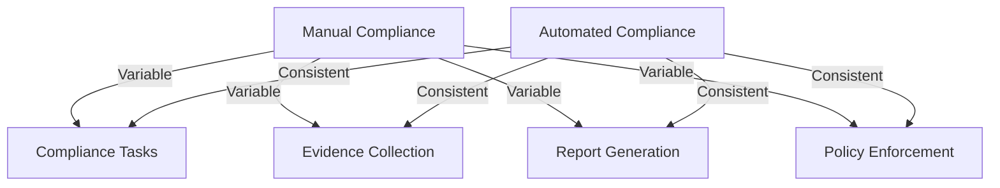
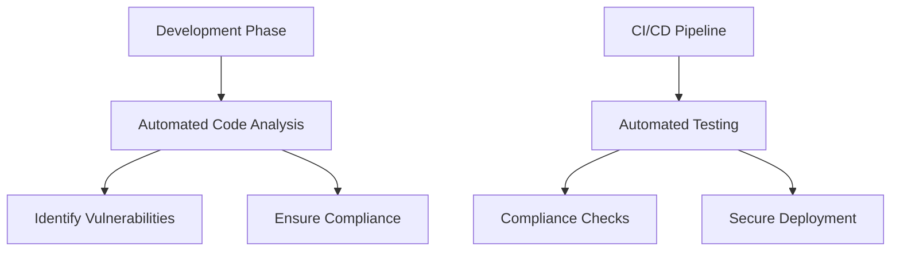

## Overview of Automating Compliance Frameworks

### Definition and Importance of Automating Compliance Frameworks

#### Transition from Traditional to Automated Compliance Methods

In traditional compliance methods, many processes rely heavily on manual effort. This includes gathering evidence, documenting policies and procedures, conducting audits, and ensuring ongoing adherence to regulatory requirements. While effective, these methods are often time-consuming, prone to human error, and difficult to scale.

Automating compliance transforms these manual processes by leveraging technology to manage and enforce compliance requirements. This transition involves using software tools and systems to:
- Automatically collect and store evidence.
- Continuously monitor compliance controls.
- Generate and manage compliance reports.
- Ensure that policies and procedures are consistently followed.

By automating these tasks, organizations can achieve greater efficiency and accuracy in their compliance efforts.

#### Benefits of Automating compliance

1. **Consistency:** Automated systems ensure that compliance processes are performed the same way every time. This reduces variability and ensures that all regulatory requirements are consistently met.

2. **Efficiency:** Automation reduces the time and effort required to perform compliance tasks. For example, automated logging and monitoring tools can collect and analyze data in real-time, eliminating the need for manual data entry and review.

3. **Accuracy:** Automated systems are less prone to human error. They can process large volumes of data quickly and accurately, ensuring that all compliance requirements are met and documented correctly.

4. **Scalability:** As organizations grow, their compliance requirements often become more complex. Automated systems can easily scale to handle increased workloads, ensuring that compliance processes remain efficient and effective.

#### Key Regulatory Bodies and Their Automated Compliance Requirements

Many regulatory bodies recognize the benefits of automation and have incorporated automated compliance requirements into their frameworks. Some key regulatory bodies include:

- **GDPR (General Data Protection Regulation)**
  - Requires automated data protection measures, such as encryption and access controls[^1].
  - Emphasizes the importance of continuous monitoring and real-time reporting.

- **HIPAA (Health Insurance Portability and Accountability Act)**
  - Mandates the use of automated audit controls and security measures to protect patient data[^2].
  - Requires regular, automated risk assessments and vulnerability scans.

- **PCI-DSS (Payment Card Industry Data Security Standard)**
  - Enforces automated logging and monitoring of all access to cardholder data[^3].
  - Requires automated vulnerability management and regular automated scans.

- **FDA (Food and Drug Administration)**
  - Stipulates the use of automated systems for managing electronic records and signatures[^4].
  - Requires automated compliance tracking and reporting for pharmaceutical and medical device companies.

- **NIST (National Institute of Standards and Technology)**
  - Recommends the use of automated tools for continuous monitoring and incident response[^5].
  - Provides guidelines for implementing automated security controls and compliance frameworks.

### Importance of Compliance Automation for Technical Roles

#### Impact on Technical Processes

##### Effects on Software Development

Automating compliance has a significant impact on software development processes. Developers must integrate compliance requirements into their workflows, using tools and practices that ensure code is secure, documented, and compliant from the start. This includes:

- **Automated Code Analysis**: Tools that scan code for security vulnerabilities and compliance issues during development.
- **Continuous Integration/Continuous Deployment (CI/CD)**: Pipelines that automate the testing and deployment of code, ensuring compliance checks are performed at each stage.
- **Secure Coding Practices**: Guidelines and training for developers to write secure and compliant code.

##### Effects on IT Operations

In IT operations, automation helps manage and enforce compliance controls across the entire infrastructure. This includes:

- **Automated Configuration Management**: Tools that ensure all systems are configured according to compliance requirements.
- **Real-Time Monitoring**: Systems that continuously monitor network traffic, access logs, and other activities for compliance.
- **Automated Incident Response**: Solutions that detect and respond to compliance breaches in real-time.

##### Effects on System Engineering

System engineers play a crucial role in designing and maintaining the automated systems that support compliance. This includes:

- **Designing Secure Architectures**: Ensuring that systems are designed to meet compliance requirements from the ground up.
- **Implementing Automated Controls**: Deploying and configuring tools that automate compliance tasks.
- **Maintaining and Updating Systems**: Regularly updating systems to address new compliance requirements and emerging threats.

##### Role of Technical Staff in Implementing and Maintaining Automated Systems

Technical staff are essential for the successful implementation and maintenance of automated compliance systems. Their roles include:

- **System Administrators**: Configure and manage automated compliance tools, ensuring they are properly integrated into the organization’s infrastructure.
- **Developers**: Write secure code and integrate compliance checks into the development process.
- **Security Analysts**: Monitor automated systems for compliance issues and respond to incidents.
- **Compliance Officers**: Work with technical staff to ensure that automated systems meet regulatory requirements and support the organization’s compliance goals.

   

---

[^1]: "Art. 32 GDPR – Security of processing - General Data Protection Regulation (GDPR)," InterSoft Consulting, accessed July 22, 2024, https://gdpr-info.eu/art-32-gdpr/
[^2]: "What is GDPR, the EU’s new data protection law? - GDPR.eu," GDPR.EU, accessed July 22, 2024, https://gdpr.eu/what-is-gdpr/
[^3]: "PCI Security Standards Council – Protect Payment Data with Industry-driven Security Standards, Training, and Programs," PCI Security Standards Council, accessed July 22, 2024, https://www.pcisecuritystandards.org/
[^4]: "U.S. Food and Drug Administration, Training, and Programs," U.S Food & Drug Administration, accessed July 22, 2024, https://www.fda.gov/
[^5]: "National Institute of Standards and Technology," National Institute of Standards and Technology, accessed July 22, 2024, https://www.nist.gov/