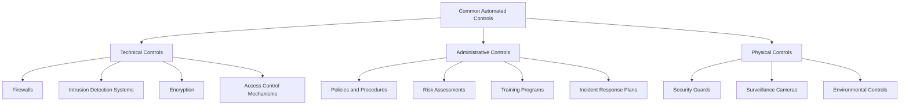
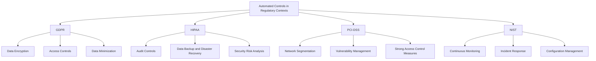
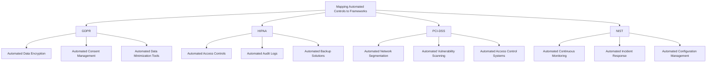

## Automated Trust Service Criteria (TSC)

### Explanation of the Five TSC Categories in an Automated Context

The Trust Service Criteria (TSC) are a set of principles and criteria developed to guide organizations in ensuring the security, availability, processing integrity, confidentiality, and privacy of their systems and data[^1]. Automating these criteria involves using technology to consistently and accurately meet these standards, reducing the reliance on manual processes and minimizing human error.

1. **Security**
   - **Definition**: Protecting information and systems against unauthorized access, breaches, and attacks[^1].
   - **Automation Examples**: 
     - Implementing automated access controls to ensure only authorized individuals can access sensitive data.
     - Using automated intrusion detection systems (IDS) to monitor network traffic for suspicious activity.
     - Employing automated patch management tools to keep systems up-to-date with security patches.

2. **Availability**
   - **Definition**: Ensuring that information and systems are available for operation and use as committed or agreed[^1].
   - **Automation Examples**: 
     - Using automated monitoring tools to track system uptime and performance.
     - Implementing redundancy and failover mechanisms to ensure continuous availability.
     - Deploying automated backup solutions to maintain data availability in case of failures.

3. **Processing Integrity**
   - **Definition**: Ensuring that system processing is complete, valid, accurate, timely, and authorized[^1].
   - **Automation Examples**: 
     - Implementing automated data validation checks to ensure data integrity.
     - Using workflow automation to enforce process integrity and consistency.
     - Employing automated logging to track and verify processing activities.

4. **Confidentiality**
   - **Definition**: Protecting information designated as confidential from unauthorized access and disclosure[^1].
   - **Automation Examples**: 
     - Using encryption to protect data at rest and in transit.
     - Implementing automated data classification tools to identify and protect sensitive information.
     - Deploying automated access control systems to enforce confidentiality policies.

5. **Privacy**
   - **Definition**: Ensuring the collection, use, retention, and disposal of personal information conforms with commitments in the entity’s privacy notice[^1].
   - **Automation Examples**: 
     - Using automated consent management systems to track and manage user consent for data processing.
     - Implementing automated data anonymization and pseudonymization tools to protect personal data.
     - Deploying privacy impact assessment (PIA) tools to evaluate and manage privacy risks.

```mermaid
graph TD;
    A[Automated Trust Service Criteria] --> B[Security]
    A --> C[Availability]
    A --> D[Processing Integrity]
    A --> E[Confidentiality]
    A --> F[Privacy]
    B --> G[Automated Access Controls]
    B --> H[Intrusion Detection Systems]
    B --> I[Patch Management Tools]
    C --> J[Automated Monitoring Tools]
    C --> K[Redundancy and Failover Mechanisms]
    C --> L[Automated Backup Solutions]
    D --> M[Automated Data Validation]
    D --> N[Workflow Automation]
    D --> O[Automated Logging]
    E --> P[Encryption]
    E --> Q[Automated Data Classification]
    E --> R[Automated Access Control Systems]
    F --> S[Automated Consent Management]
    F --> T[Data Anonymization and Pseudonymization]
    F --> U[Privacy Impact Assessment Tools]
```

### Role of Automation in Meeting TSC Requirements Across Different Frameworks

Automation plays a crucial role in ensuring organizations meet the Trust Service Criteria by providing consistent, reliable, and efficient mechanisms to enforce security, availability, processing integrity, confidentiality, and privacy across various compliance frameworks[^1]. This ensures that organizations can meet their regulatory requirements while reducing the burden on manual processes.

## Common Controls Framework in Automation

### Overview of Common Automated Controls Shared Across Multiple Compliance Frameworks

Common controls are standardized practices and procedures that can be applied across multiple compliance frameworks to ensure regulatory requirements are met[^2]. Automating these controls can significantly enhance their effectiveness and efficiency.

1. **Technical Controls**
   - **Definition**: Controls implemented through technical means to protect information systems and data[^3].
   - **Examples**:
     - **Firewalls**: Automated configuration and management of firewalls to block unauthorized access.
     - **Intrusion Detection Systems (IDS)**: Continuous monitoring and automated alerting for suspicious activities.
     - **Encryption**: Automated encryption of data at rest and in transit to protect against unauthorized access.
     - **Access Control Mechanisms**: Automated management of user access rights and privileges.

2. **Administrative Controls**
   - **Definition**: Policies, procedures, and practices designed to manage and control an organization’s compliance efforts[^4].
   - **Examples**:
     - **Policies and Procedures**: Automated policy management systems to ensure up-to-date and enforced policies.
     - **Risk Assessments**: Automated risk assessment tools to identify and evaluate compliance risks.
     - **Training Programs**: Automated delivery and tracking of compliance training for employees.
     - **Incident Response Plans**: Automated incident response systems to detect, respond to, and document security incidents.

3. **Physical Controls**
   - **Definition**: Physical measures taken to protect information systems and data[^11].
   - **Examples**:
     - **Security Guards**: Automated access control systems to manage physical access to facilities.
     - **Surveillance Cameras**: Automated monitoring and recording of physical premises.
     - **Environmental Controls**: Automated systems to manage and monitor environmental conditions like temperature and humidity.

### Examples of Automated Controls and Their Applicability in Different Regulatory Contexts

Automated controls can be tailored to meet the specific requirements of various regulatory frameworks, ensuring that organizations comply with relevant laws and standards.

1. **GDPR (General Data Protection Regulation)**
   - **Data Encryption**: Automated encryption tools to protect personal data.
   - **Access Controls**: Automated access management systems to enforce data access policies.
   - **Data Minimization**: Automated data processing tools to ensure only necessary data is collected and processed.

2. **HIPAA (Health Insurance Portability and Accountability Act)**
   - **Audit Controls**: Automated logging and monitoring of access to electronic health records (EHR).
   - **Data Backup and Disaster Recovery**: Automated backup solutions to ensure data availability and integrity.
   - **Security Risk Analysis**: Automated risk assessment tools to identify and mitigate security risks.

3. **PCI-DSS (Payment Card Industry Data Security Standard)**
   - **Network Segmentation**: Automated network configuration tools to segment payment card data environments.
   - **Vulnerability Management**: Continuous automated vulnerability scanning and remediation tools.
   - **Strong Access Control Measures**: Automated access control systems to enforce [PCI-DSS](https://www.pcisecuritystandards.org/document_library/?document=pci_dss) access requirements.

4. **NIST (National Institute of Standards and Technology)**
   - **Continuous Monitoring**: Automated monitoring tools to continuously assess and report on security posture.
   - **Incident Response**: Automated incident response systems to detect and respond to security incidents.
   - **Configuration Management**: Automated configuration management tools to ensure systems are securely configured and maintained.

### Mapping Common Automated Controls to Specific Compliance Frameworks

Mapping automated controls to specific compliance frameworks helps organizations understand how their existing controls align with regulatory requirements and identify any gaps that need to be addressed.

- **GDPR**:
  - **Automated Data Encryption**: Ensures personal data is protected during storage and transmission.
  - **Automated Consent Management**: Tracks and manages user consent for data processing.
  - **Automated Data Minimization Tools**: Ensures that only necessary data is collected and processed.

- **HIPAA**:
  - **Automated Access Controls**: Ensures that only authorized personnel can access electronic health records.
  - **Automated Audit Logs**: Tracks access and modifications to health records for auditing purposes.
  - **Automated Backup Solutions**: Ensures data availability and integrity in case of data loss or corruption.

- **PCI-DSS**:
  - **Automated Network Segmentation**: Isolates payment card data environments to protect them from unauthorized access.
  - **Automated Vulnerability Scanning**: Continuously scans for and remediates vulnerabilities in payment systems.
  - **Automated Access Control Systems**: Enforces access controls to meet PCI-DSS requirements.

- **NIST**:
  - **Automated Continuous Monitoring**: Continuously assesses and reports on security posture.
  - **Automated Incident Response**: Detects and responds to security incidents in real-time.
  - **Automated Configuration Management**: Ensures systems are securely configured and maintained.

   

---

[^1]: "System and Organization Controls," Wikipedia, accessed July 29, 2024, https://en.wikipedia.org/wiki/System_and_Organization_Controls#Trust_Service_Criteria
[^2]: "What are 6 types of common controls and why do you need them?," Trust Community, accessed July 23, 2024, https://community.trustcloud.ai/docs/grc-launchpad/grc-101/compliance/what-are-common-controls-and-why-do-you-need-one.
[^3]: "Technical Controls — Cybersecurity Resilience," Resilient Energy Platform, accessed July 23, 2024, https://resilient-energy.org/cybersecurity-resilience/building-blocks/technical-controls 
[^4]: Michael Swanagan, "Types Of Security Controls Explained," PurpleSec,s published December 07, 2023, https://purplesec.us/security-controls/#Admin
[^5]: Michael Swanagan, "Types Of Security Controls Explained," PurpleSec, published December 07, 2023, https://purplesec.us/security-controls/#Physical
