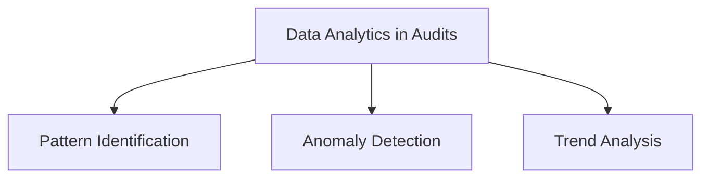
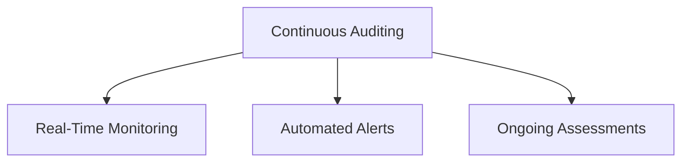
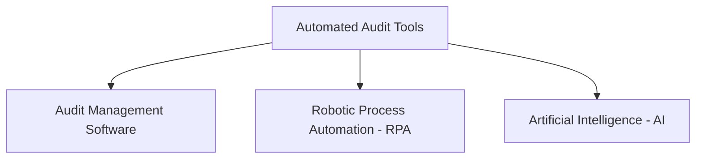
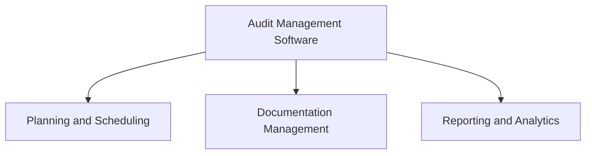
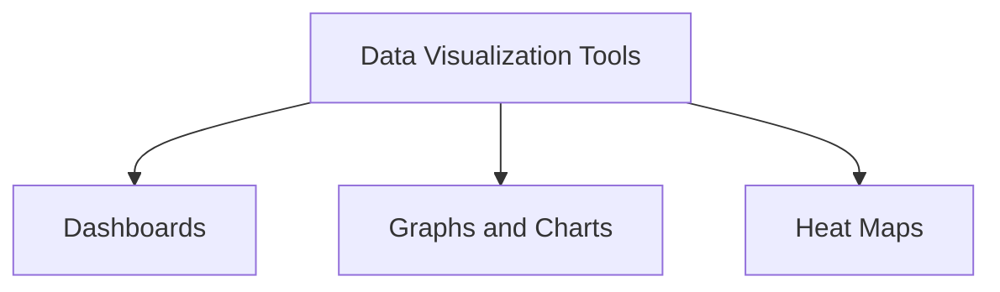
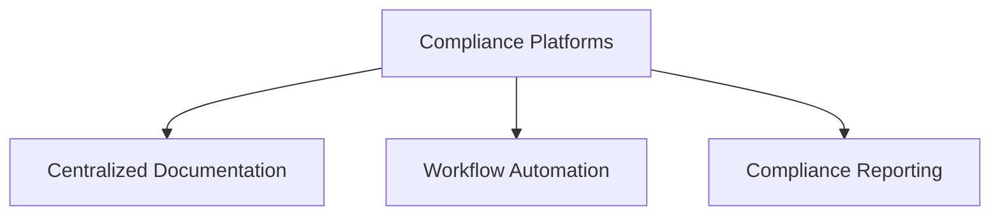
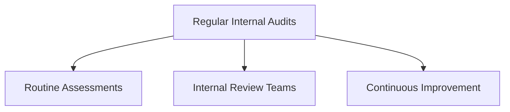
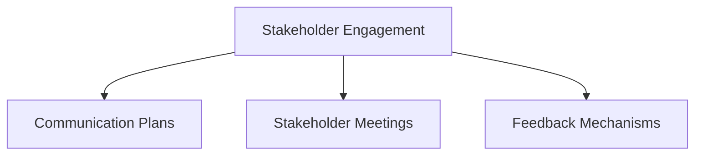
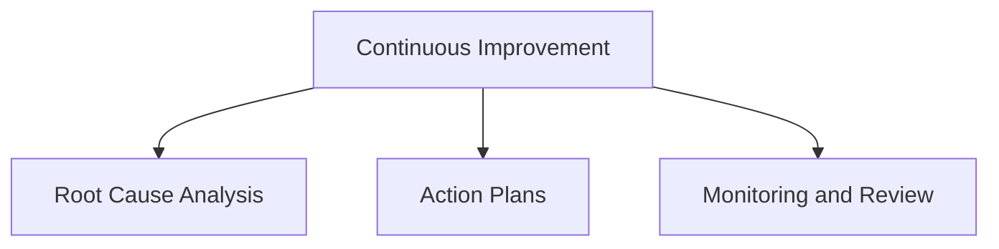
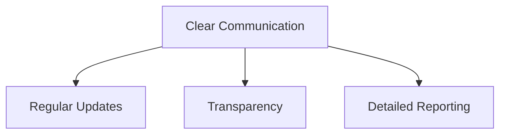

## Introduction

Auditing and assurance are dynamic fields that benefit significantly from advanced techniques and tools. This section explores sophisticated audit techniques, cutting-edge tools and technologies, and best practices to ensure successful audits.

### Advanced Audit Techniques

Advanced audit techniques leverage modern technologies and methodologies to enhance the effectiveness and efficiency of the audit process.

#### Data Analytics in Audits

Data analytics involves using sophisticated tools and techniques to analyze large volumes of data. In the context of audits, data analytics can identify patterns, anomalies, and trends that might indicate compliance issues or areas for improvement.

- **Pattern Identification**: Analyzing data to find consistent patterns that suggest normal behavior or highlight deviations that could indicate potential issues.
- **Anomaly Detection**: Using statistical models and machine learning algorithms to detect anomalies that might signify errors, fraud, or security breaches.
- **Trend Analysis**: Monitoring data over time to identify trends that could impact compliance, such as increasing error rates or emerging risk factors.

#### Continuous Auditing

Continuous auditing is an approach where audit-related activities are performed on a continuous basis rather than at discrete intervals. This method allows for real-time monitoring and timely detection of compliance issues.

- **Real-Time Monitoring**: Implementing systems that continuously monitor transactions and controls to provide immediate insights into compliance status.
- **Automated Alerts**: Setting up automated alerts that notify relevant personnel of any compliance issues as soon as they are detected.
- **Ongoing Assessments**: Regularly evaluating the effectiveness of controls and making necessary adjustments to maintain compliance.

#### Automated Audit Tools

Automated audit tools leverage technology to streamline the audit process, reduce manual effort, and improve accuracy.

- **Audit Management Software**: Tools that help manage the entire audit lifecycle, from planning to reporting. These software solutions can automate many aspects of the audit process, improving efficiency and consistency.
- **Robotic Process Automation (RPA)**: Using RPA to automate repetitive audit tasks, such as data collection and analysis, freeing up auditors to focus on more complex activities.
- **Artificial Intelligence (AI)**: Leveraging AI to analyze data, identify risks, and provide insights that enhance the audit process.

### Audit Tools and Technologies

To support advanced audit techniques, various tools and technologies are available. These tools can significantly enhance the audit process by providing better insights, improving efficiency, and ensuring compliance.

#### Audit Management Software

Audit management software provides a comprehensive solution for managing the audit process. Key features include:

- **Planning and Scheduling**: Tools for planning audit activities, scheduling tasks, and setting deadlines.
- **Documentation Management**: Systems for organizing and managing audit documentation, ensuring all relevant information is easily accessible.
- **Reporting and Analytics**: Features for generating reports and analyzing audit data to provide actionable insights.

#### Data Visualization Tools

Data visualization tools help auditors make sense of complex data by presenting it in a graphical format. This can aid in identifying trends, patterns, and anomalies that might be missed in raw data.

- **Dashboards**: Interactive dashboards that provide real-time insights into audit metrics and compliance status.
- **Graphs and Charts**: Various graphical representations, such as bar charts, line graphs, and pie charts, to visualize audit data.
- **Heat Maps**: Tools that use color-coding to represent data, making it easier to spot areas of concern.

#### Compliance Platforms

Integrated compliance platforms offer a centralized solution for managing audits and compliance activities. These platforms provide a range of features to support the entire compliance lifecycle.

- **Centralized Documentation**: A single repository for all compliance-related documents, ensuring easy access and management.
- **Workflow Automation**: Tools to automate compliance workflows, such as approvals and reviews, improving efficiency.
- **Compliance Reporting**: Features for generating comprehensive compliance reports, helping organizations demonstrate adherence to regulatory requirements.

### Best Practices for Successful Audits

Adhering to best practices can significantly improve the success of audits. These practices help ensure that audits are thorough, efficient, and effective in identifying and addressing compliance issues.

#### Regular Internal Audits

Conducting regular internal audits helps organizations proactively identify and address compliance issues before external audits. Key practices include:

- **Routine Assessments**: Performing regular assessments of controls and processes to ensure ongoing compliance.
- **Internal Review Teams**: Establishing dedicated teams to conduct internal audits, providing an unbiased evaluation of compliance efforts.
- **Continuous Improvement**: Using the findings from internal audits to drive continuous improvement in processes and controls.

#### Stakeholder Engagement

Engaging stakeholders throughout the audit process ensures transparency and support. Key practices include:

- **Communication Plans**: Developing communication plans to keep stakeholders informed about audit activities and findings.
- **Stakeholder Meetings**: Holding regular meetings with stakeholders to discuss audit progress and address any concerns.
- **Feedback Mechanisms**: Implementing mechanisms for stakeholders to provide feedback on the audit process and outcomes.

#### Continuous Improvement

Using audit findings to drive continuous improvement helps organizations enhance their compliance efforts and overall performance. Key practices include:

- **Root Cause Analysis**: Conducting root cause analysis of audit findings to identify underlying issues and prevent recurrence.
- **Action Plans**: Developing and implementing action plans to address audit findings and improve controls.
- **Monitoring and Review**: Regularly monitoring the effectiveness of improvements and making necessary adjustments.

#### Clear Communication

Maintaining clear and open communication with auditors and stakeholders is essential for a smooth audit process. Key practices include:

- **Regular Updates**: Providing regular updates on audit progress and findings to all relevant parties.
- **Transparency**: Being transparent about any issues or challenges encountered during the audit.
- **Detailed Reporting**: Creating detailed reports that clearly explain audit findings, recommendations, and actions taken.

