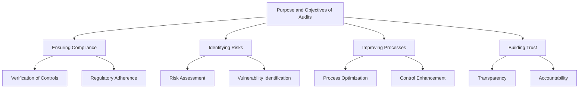
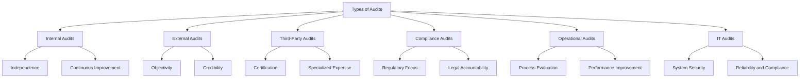
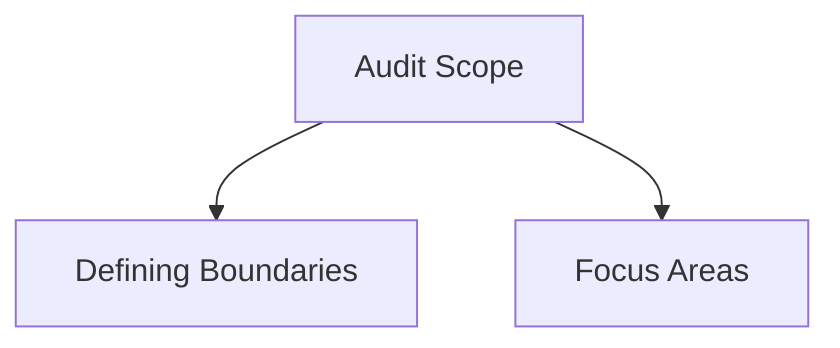
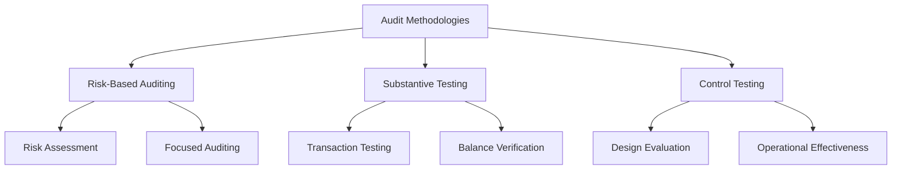

## Overview of Auditing

Auditing and assurance are fundamental aspects of maintaining and verifying compliance within an organization. In this section, we will cover the purpose and objectives of audits, the various types of audits, and the methodologies used in auditing.

### Purpose and Objectives of Audits in Compliance Frameworks

Audits serve multiple purposes and have several key objectives in the context of compliance frameworks:

#### Ensuring Compliance

Ensuring that the organization adheres to all relevant laws, regulations, and internal policies is the primary objective of audits. This involves:

- **Verification of Controls**: Audits check if the necessary controls are in place and functioning as intended to meet compliance requirements.
- **Regulatory Adherence**: Ensuring the organization follows specific regulatory standards applicable to its industry.

#### Identifying Risks

Audits help identify potential risks and vulnerabilities within the organization. This proactive approach includes:

- **Risk Assessment**: Evaluating the likelihood and impact of various risks.
- **Vulnerability Identification**: Finding weak points in systems, processes, or controls that could be exploited.

#### Improving Processes

Audits provide valuable insights and recommendations for improving organizational processes and controls. This involves:

- **Process Optimization**: Identifying inefficiencies and suggesting improvements.
- **Control Enhancement**: Recommending better or additional controls to mitigate identified risks.

#### Building Trust

Successful audits build trust with stakeholders, including customers, partners, and regulatory bodies. This is achieved by:

- **Transparency**: Demonstrating the organization’s commitment to maintaining high standards of compliance and governance.
- **Accountability**: Showing that the organization is accountable for its compliance efforts.

### Types of Audits

Audits can be categorized based on who conducts them and their focus areas. Understanding the different types helps in selecting the appropriate audit for your organization’s needs.

#### Internal Audits

Internal audits are conducted by the organization’s own staff. They focus on evaluating internal controls, processes, and systems to ensure they are functioning correctly and efficiently. Key aspects include:

- **Independence**: Internal auditors should be independent from the areas they audit to avoid conflicts of interest.
- **Continuous Improvement**: Internal audits aim to identify areas for improvement and help the organization enhance its processes.

#### External Audits

External audits are performed by independent third-party auditors. These audits provide an unbiased assessment of the organization’s compliance and controls. Key aspects include:

- **Objectivity**: External auditors provide an objective evaluation, free from internal biases.
- **Credibility**: External audits often carry more weight with stakeholders due to the impartiality of the auditors.

#### Third-Party Audits

Specialized firms conduct third-party audits to certify compliance with specific standards, such as SOC 2 or ISO 27001. These certifications can be essential for building credibility with clients and partners. Key aspects include:

- **Certification**: Achieving recognized certifications that validate the organization’s compliance efforts.
- **Specialized Expertise**: Third-party auditors often have specialized knowledge in particular compliance standards.

#### Compliance Audits

Compliance audits focus specifically on verifying adherence to regulatory requirements. These audits ensure that the organization meets all legal and regulatory obligations. Key aspects include:

- **Regulatory Focus**: Ensuring compliance with specific regulations relevant to the organization’s industry.
- **Legal Accountability**: Demonstrating adherence to laws and regulations to avoid legal penalties.

#### Operational Audits

Operational audits assess the efficiency and effectiveness of the organization’s operational processes. They aim to improve operational performance and identify opportunities for cost savings. Key aspects include:

- **Process Evaluation**: Assessing operational processes for efficiency and effectiveness.
- **Performance Improvement**: Identifying opportunities to enhance operational performance and reduce costs.

#### IT Audits

IT audits examine the controls and procedures related to the organization's information technology systems. They ensure that IT systems are secure, reliable, and compliant with relevant standards. Key aspects include:

- **System Security**: Evaluating the security measures in place to protect IT systems.
- **Reliability and Compliance**: Ensuring IT systems are reliable and comply with industry standards.

### Understanding Audit Scope and Methodologies

#### Audit Scope

The audit scope defines the boundaries and focus areas of the audit. It specifies which systems, processes, and controls will be examined, ensuring that the audit remains focused and relevant. Key considerations include:

- **Defining Boundaries**: Clearly outlining the areas to be audited.
- **Focus Areas**: Identifying specific systems, processes, or controls that will be the focus of the audit.

#### Audit Methodologies

Different methodologies are used in auditing, each with its own strengths and applications. Understanding these methodologies helps in selecting the most appropriate approach for the audit.

##### Risk-Based Auditing

Risk-based auditing focuses on areas with the highest risk to the organization. By prioritizing high-risk areas, auditors can identify and address the most significant threats to compliance and security. Key aspects include:

- **Risk Assessment**: Identifying and assessing risks to prioritize audit efforts.
- **Focused Auditing**: Concentrating on high-risk areas to maximize audit effectiveness.

##### Substantive Testing

Substantive testing involves detailed testing of transactions and balances. This methodology is used to verify the accuracy and completeness of financial records and other critical data. Key aspects include:

- **Transaction Testing**: Examining individual transactions to ensure they are recorded accurately.
- **Balance Verification**: Verifying account balances to ensure they are complete and accurate.

##### Control Testing

Control testing evaluates the design and operating effectiveness of controls. It ensures that the controls in place are functioning as intended and are capable of mitigating risks. Key aspects include:

- **Design Evaluation**: Assessing whether controls are appropriately designed to mitigate identified risks.
- **Operational Effectiveness**: Testing controls to ensure they are operating effectively.

