## Introduction

Preparing for an audit is a critical process that ensures the organization is ready to demonstrate its compliance with relevant regulations and standards. This section will cover the comprehensive steps required to prepare for compliance audits, the role of technical staff during the preparation and execution phases, and how to effectively respond to audit findings and implement corrective actions.

### Steps to Prepare for Compliance Audits

Effective preparation is key to a successful audit. The following steps outline a structured approach to getting ready for compliance audits:

#### Audit Planning

Audit planning is the first step in preparing for a compliance audit. It involves defining the scope, objectives, and timeline of the audit to set clear expectations and ensure comprehensive coverage.

- **Defining the Scope**: Clearly outline the boundaries of the audit, including which systems, processes, and controls will be examined.
- **Setting Objectives**: Establish the goals of the audit, such as verifying compliance with specific regulations, assessing the effectiveness of controls, or identifying areas for improvement.
- **Creating a Timeline**: Develop a schedule that includes key milestones and deadlines to ensure the audit process stays on track.

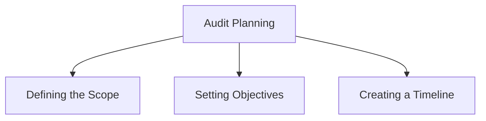

#### Gathering Documentation

Gathering all necessary documents and evidence is crucial for demonstrating compliance. This step ensures that auditors have access to all the information they need to perform a thorough assessment.

- **Collecting Policies and Procedures**: Compile all relevant policies, procedures, and guidelines that govern the organization's operations and compliance efforts.
- **Assembling Logs and Reports**: Gather system logs, audit reports, and compliance status reports that provide evidence of compliance activities.
- **Documenting Controls**: Ensure that documentation for all implemented controls, including their design, implementation, and monitoring processes, is available.

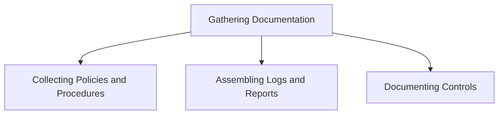

#### Reviewing Controls

Before the audit, it's essential to review and evaluate existing controls to ensure they are functioning as intended. This step involves conducting internal reviews and tests to identify any weaknesses or gaps in the controls.

- **Internal Reviews**: Perform internal assessments to verify that controls are correctly implemented and effective.
- **Control Testing**: Conduct tests to ensure that controls operate as expected and can mitigate the identified risks.
- **Gap Analysis**: Identify any deficiencies or gaps in the controls and develop plans to address them before the audit.

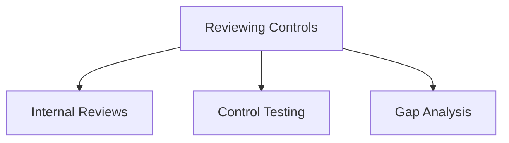

#### Conducting Pre-Audit Assessments

Pre-audit assessments help in identifying and addressing potential issues before the official audit. These assessments ensure that the organization is well-prepared and can proactively address any deficiencies.

- **Mock Audits**: Conduct simulated audits to practice responding to auditor questions and presenting evidence.
- **Self-Assessments**: Perform self-assessments to evaluate compliance with relevant standards and identify areas for improvement.
- **Corrective Actions**: Implement corrective actions based on the findings from pre-audit assessments to enhance readiness for the official audit.

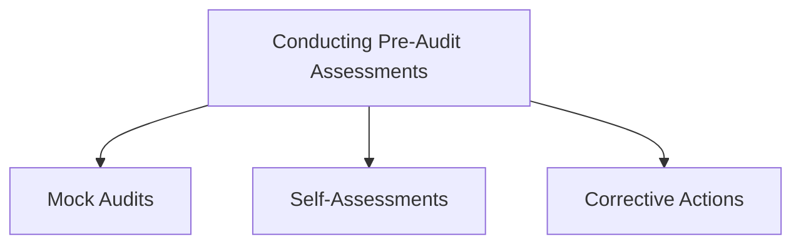

#### Training Staff

Ensuring that staff are aware of their roles and responsibilities during the audit is crucial for a smooth audit process. Training helps prepare the team for interactions with auditors and provides the necessary support during the audit.

- **Role-Specific Training**: Provide training tailored to the specific roles and responsibilities of staff members involved in the audit.
- **Audit Process Overview**: Educate staff on the audit process, including what to expect and how to interact with auditors.
- **Communication Skills**: Train staff on effective communication skills to clearly and accurately convey information to auditors.

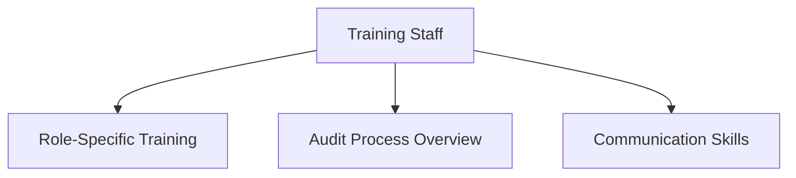

### Role of Technical Staff During Audit Preparation and Execution

Technical staff play a crucial role in ensuring the success of compliance audits. Their responsibilities include implementing controls, providing documentation, assisting auditors, addressing technical questions, and monitoring audit progress.

#### Implementing Controls

Technical staff are responsible for implementing and maintaining the technical controls required for compliance. This includes:

- **Deploying Controls**: Implementing the necessary security measures, such as firewalls, encryption, and access controls.
- **Configuring Systems**: Ensuring that systems are configured according to compliance requirements.
- **Monitoring Controls**: Continuously monitoring the performance and effectiveness of implemented controls.

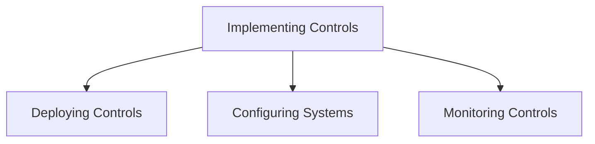

#### Providing Documentation

Technical staff must provide auditors with the necessary technical documentation and evidence to demonstrate compliance. This includes:

- **System Configurations**: Documentation of system settings and configurations.
- **Access Logs**: Records of system access and user activities.
- **Security Policies**: Detailed descriptions of the organization's security policies and procedures.

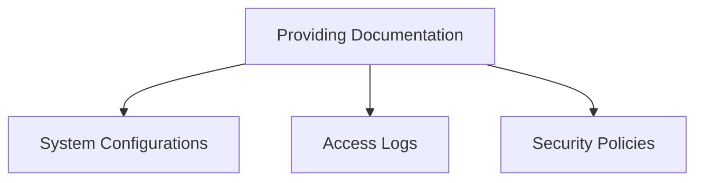

#### Assisting Auditors

Technical staff support auditors by explaining technical systems and processes, demonstrating control implementations, and clarifying technical details.

- **Technical Explanations**: Providing detailed explanations of how systems and controls operate.
- **Demonstrating Controls**: Showing auditors how specific controls are implemented and functioning.
- **Clarifying Details**: Answering technical questions and providing additional information as needed.

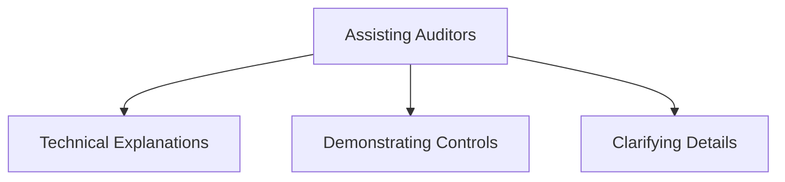

#### Addressing Technical Questions

Technical staff are responsible for addressing technical inquiries and clarifications requested by auditors. This involves:

- **Providing Accurate Information**: Ensuring that all information provided is accurate and detailed.
- **Responding Promptly**: Addressing inquiries in a timely manner to keep the audit process moving smoothly.
- **Clarifying Complex Issues**: Helping auditors understand complex technical issues and their implications for compliance.

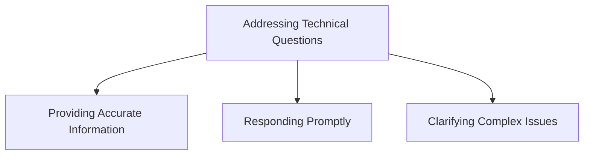

#### Monitoring Audit Progress

Tracking the progress of the audit and ensuring that any issues are promptly addressed is crucial. Technical staff should:

- **Track Milestones**: Monitor the audit timeline and ensure that all milestones are met.
- **Address Findings**: Quickly respond to any issues or findings raised by auditors.
- **Provide Updates**: Keep stakeholders informed of the audit's progress and any significant developments.

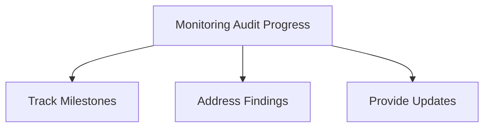

### Responding to Audit Findings and Implementing Corrective Actions

Responding effectively to audit findings and implementing corrective actions is essential for continuous improvement and maintaining compliance.

#### Reviewing Audit Findings

Carefully review the findings and recommendations provided by the auditors to understand the issues and their implications.

- **Understanding Findings**: Analyze the findings to comprehend the underlying issues.
- **Prioritizing Issues**: Identify the most critical issues that need immediate attention.

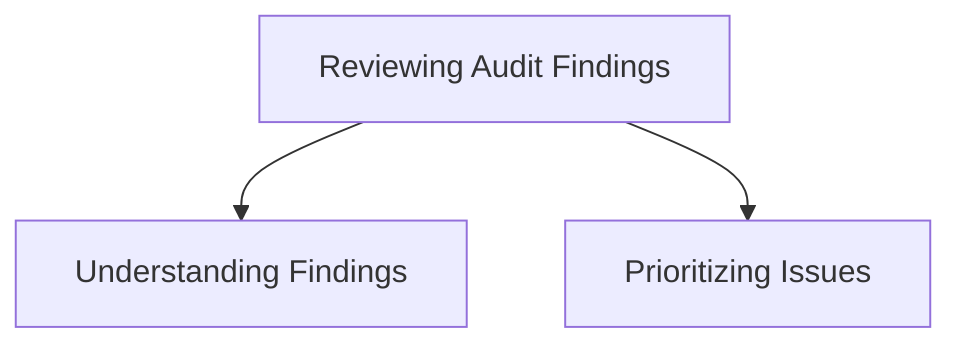

#### Developing Action Plans

Create detailed action plans to address identified issues and improve controls. This involves:

- **Defining Actions**: Specify the actions needed to address each finding.
- **Assigning Responsibilities**: Allocate tasks to appropriate team members.
- **Setting Deadlines**: Establish timelines for completing each action.

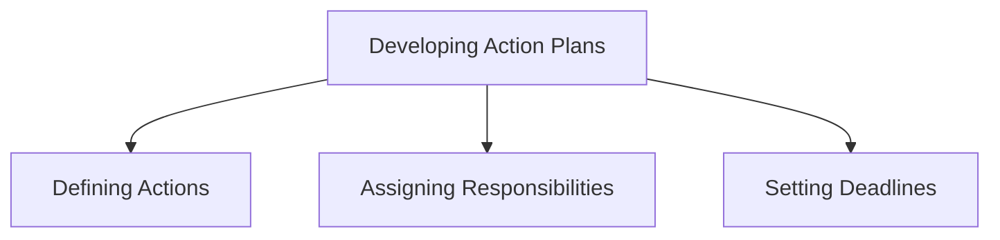

#### Implementing Corrective Actions

Execute the action plans, ensuring that corrective measures are effectively implemented.

- **Executing Actions**: Carry out the specified actions to address audit findings.
- **Tracking Progress**: Monitor the implementation of corrective actions to ensure they are completed on time.
- **Verifying Effectiveness**: Evaluate the effectiveness of corrective actions to ensure they address the issues.

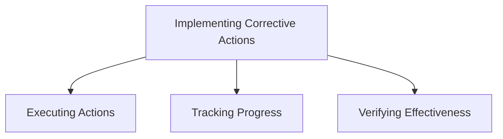

#### Monitoring Improvements

Continuously monitor the improvements to ensure they achieve the desired outcomes.

- **Regular Reviews**: Conduct regular reviews to assess the effectiveness of implemented improvements.
- **Adjusting Plans**: Make necessary adjustments to action plans based on review findings.

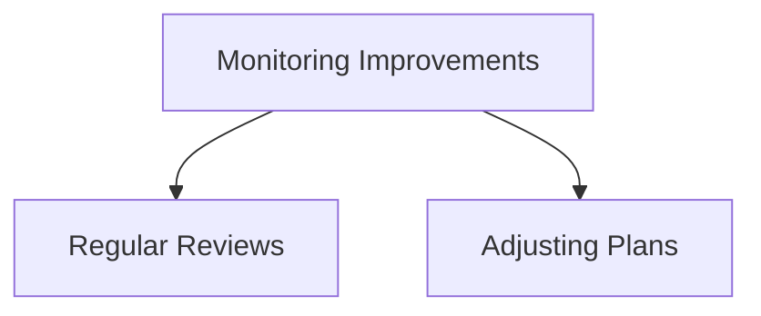

#### Reporting Progress

Regularly update stakeholders on the progress of corrective actions and improvements.

- **Progress Reports**: Create and share reports detailing the status of corrective actions.
- **Stakeholder Communication**: Ensure transparent communication with stakeholders about ongoing improvements and compliance efforts.

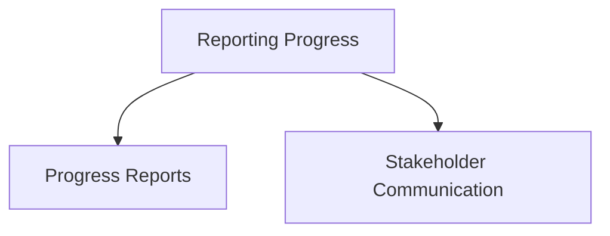

