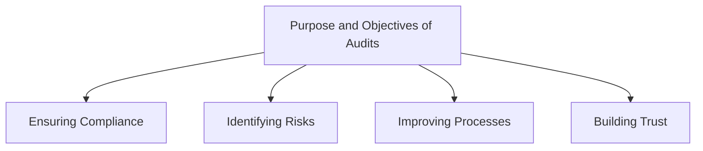
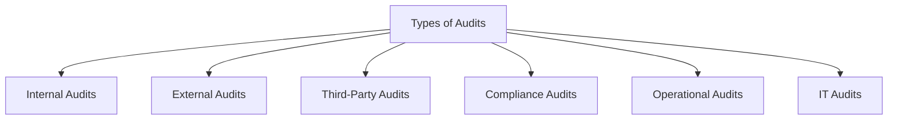
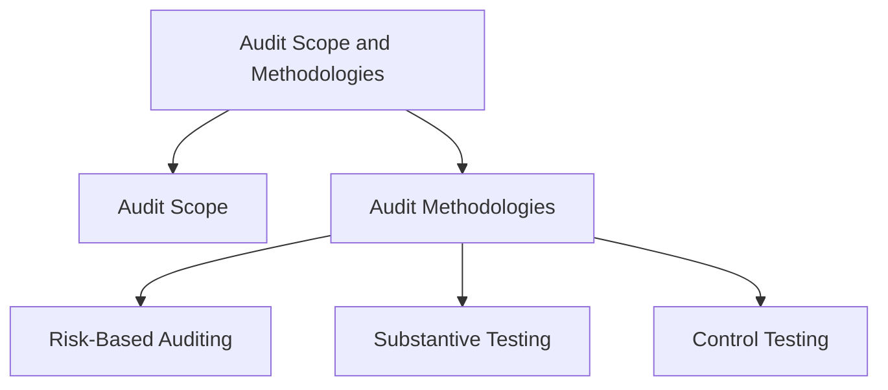
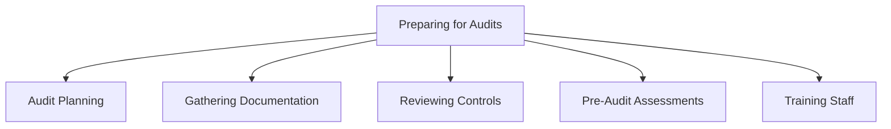
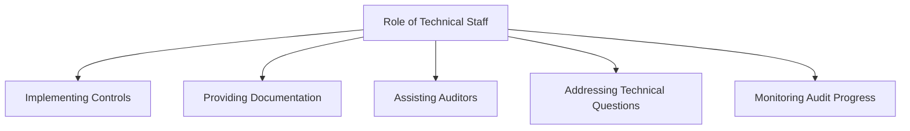
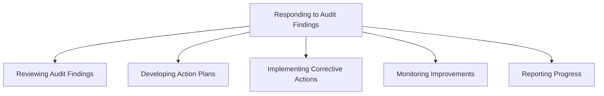
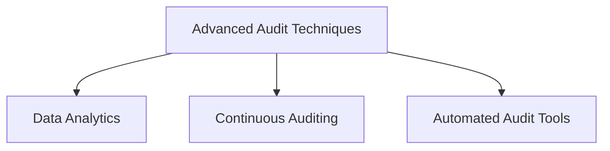
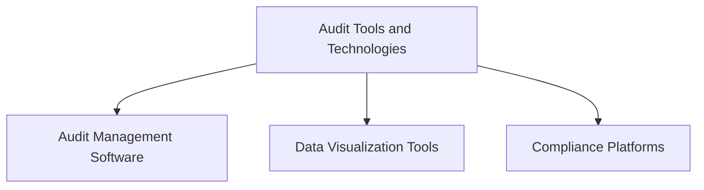
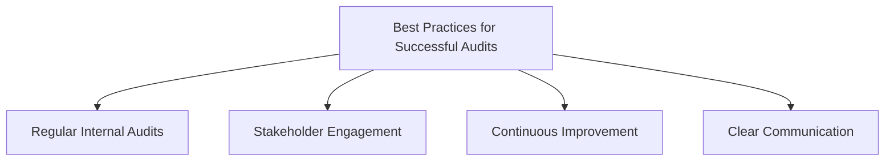

## Introduction
Auditing and assurance are fundamental aspects of maintaining and verifying compliance within an organization. This module will cover the essentials of auditing, from understanding its purpose and types to preparing for audits and responding to findings. The content is designed to be comprehensive, providing detailed narratives and practical insights suitable for a technical audience.

## Overview of Auditing

Audits play a crucial role in ensuring that an organization adheres to regulatory requirements and internal policies. They help identify risks, improve processes, and build trust with stakeholders. Let’s dive into the purpose, types, and methodologies of audits.

### Purpose and Objectives of Audits in Compliance Frameworks

#### Ensuring Compliance
Audits verify that an organization complies with relevant laws, regulations, and internal policies. This involves checking whether the necessary controls are in place and functioning effectively.

#### Identifying Risks
Through audits, organizations can identify potential risks and vulnerabilities. This proactive approach helps in mitigating risks before they become significant issues.

#### Improving Processes
Audits provide valuable insights and recommendations for improving processes and controls. By addressing the weaknesses identified during an audit, organizations can enhance their overall efficiency and effectiveness.

#### Building Trust
Successful audits build trust with stakeholders, including customers, partners, and regulatory bodies. They demonstrate the organization’s commitment to maintaining high standards of compliance and governance.

### Types of Audits

Audits can be categorized based on who conducts them and their focus areas. Understanding the different types helps in selecting the appropriate audit for your organization’s needs.

#### Internal Audits
Internal audits are conducted by the organization’s own staff. They evaluate internal controls, processes, and systems to ensure they are functioning correctly and efficiently.

#### External Audits
External audits are performed by independent third-party auditors. These audits provide an unbiased assessment of the organization’s compliance and controls.

#### Third-Party Audits
Specialized firms conduct third-party audits to certify compliance with specific standards, such as SOC 2 or ISO 27001. These certifications can be essential for building credibility with clients and partners.

#### Compliance Audits
Compliance audits focus specifically on verifying adherence to regulatory requirements. These audits ensure that the organization meets all legal and regulatory obligations.

#### Operational Audits
Operational audits assess the efficiency and effectiveness of the organization’s operational processes. They aim to improve operational performance and identify opportunities for cost savings.

#### IT Audits
IT audits examine the controls and procedures related to the organization's information technology systems. They ensure that IT systems are secure, reliable, and compliant with relevant standards.

### Understanding Audit Scope and Methodologies

#### Audit Scope
The audit scope defines the boundaries and focus areas of the audit. It specifies which systems, processes, and controls will be examined, ensuring that the audit remains focused and relevant.

#### Audit Methodologies
Different methodologies are used in auditing, each with its own strengths and applications.

##### Risk-Based Auditing
Risk-based auditing focuses on areas with the highest risk to the organization. By prioritizing high-risk areas, auditors can identify and address the most significant threats to compliance and security.

##### Substantive Testing
Substantive testing involves detailed testing of transactions and balances. This methodology is used to verify the accuracy and completeness of financial records and other critical data.

##### Control Testing
Control testing evaluates the design and operating effectiveness of controls. It ensures that the controls in place are functioning as intended and are capable of mitigating risks.

## Preparing for Audits

Preparation is key to a successful audit. This section covers the steps to prepare for compliance audits, the role of technical staff, and how to respond to audit findings.

### Steps to Prepare for Compliance Audits

#### Audit Planning
Effective audit planning involves defining the scope, objectives, and timeline of the audit. This helps in setting clear expectations and ensuring that all necessary areas are covered.

#### Gathering Documentation
Collect all necessary documents and evidence required for the audit. This includes policies, procedures, logs, and reports that demonstrate compliance with relevant standards.

#### Reviewing Controls
Evaluate existing controls to ensure they are functioning as intended. This step involves conducting internal reviews and tests to identify any weaknesses or gaps in the controls.

#### Conducting Pre-Audit Assessments
Perform internal reviews to identify and address potential issues before the official audit. Pre-audit assessments help in ensuring that the organization is well-prepared and can address any deficiencies proactively.

#### Training Staff
Ensure that staff are aware of their roles and responsibilities during the audit. Training helps in preparing the team for interactions with auditors and in providing the necessary support during the audit process.

### Role of Technical Staff During Audit Preparation and Execution

#### Implementing Controls
Technical staff play a crucial role in implementing and maintaining technical controls. They ensure that controls are in place and operating effectively to meet compliance requirements.

#### Providing Documentation
Technical staff must provide auditors with necessary technical documentation and evidence. This includes system configurations, access logs, and security policies.

#### Assisting Auditors
Support auditors in understanding technical systems and processes. Technical staff can explain how systems work, demonstrate control implementations, and clarify technical details.

#### Addressing Technical Questions
Respond to technical inquiries and clarifications requested by auditors. This involves providing accurate and detailed explanations to help auditors assess compliance.

#### Monitoring Audit Progress
Track the progress of the audit and ensure that any issues are promptly addressed. Technical staff should be prepared to act quickly on any findings or requests from auditors.

### Responding to Audit Findings and Implementing Corrective Actions

#### Reviewing Audit Findings
Carefully review the findings and recommendations provided by the auditors. Understanding the findings is crucial for developing effective corrective actions.

#### Developing Action Plans
Create detailed action plans to address identified issues and improve controls. Action plans should outline specific steps, responsibilities, and timelines for remediation.

#### Implementing Corrective Actions
Execute the action plans, ensuring that corrective measures are effectively implemented. This may involve updating controls, revising policies, and conducting additional training.

#### Monitoring Improvements
Continuously monitor the improvements to ensure that they achieve the desired outcomes. Regular reviews help in maintaining compliance and preventing recurrence of issues.

#### Reporting Progress
Regularly update stakeholders on the progress of corrective actions and improvements. Transparent communication ensures that everyone is informed and aligned with the compliance goals.

## Advanced Topics for a Technical Audience

### Advanced Audit Techniques

#### Data Analytics in Audits
Using data analytics tools to identify patterns, anomalies, and risks. Data analytics can enhance the accuracy and efficiency of audits by providing deeper insights into compliance data.

#### Continuous Auditing
Implementing systems that continuously monitor and audit compliance in real-time. Continuous auditing allows for ongoing assessment and timely identification of issues.

#### Automated Audit Tools
Leveraging automation to streamline audit processes and improve accuracy. Automated tools can handle repetitive tasks, generate reports, and provide real-time monitoring.

### Audit Tools and Technologies

#### Audit Management Software
Tools that help manage the entire audit lifecycle, from planning to reporting. These software solutions can automate many aspects of the audit process, improving efficiency and consistency.

#### Data Visualization Tools
Visualizing audit data to identify trends and insights. Data visualization helps in making complex data more understandable and actionable.

#### Compliance Platforms
Integrated platforms that provide a centralized solution for managing audits and compliance activities. These platforms offer features such as document management, workflow automation, and reporting.

### Best Practices for Successful Audits

#### Regular Internal Audits
Conducting regular internal audits to proactively identify and address compliance issues. Internal audits help in maintaining a high standard of compliance and readiness for external audits.

#### Stakeholder Engagement
Engaging with stakeholders throughout the audit process to ensure transparency and support. Involving stakeholders helps in gaining their buy-in and understanding of compliance efforts.

#### Continuous Improvement
Using audit findings to drive continuous improvement in compliance practices. Organizations should view audits as opportunities to enhance their processes and controls.

#### Clear Communication
Maintaining clear and open communication with auditors and stakeholders to ensure a smooth

 audit process. Effective communication helps in addressing issues promptly and maintaining a collaborative audit environment.

