## Introduction

We will explore real-world examples of compliance challenges and solutions, analyze notable compliance breaches, and learn from successful implementations. We will also engage in hands-on exercises to simulate control implementation, evidence gathering, and audit preparation. Role-playing scenarios will help practice responding to compliance challenges, providing a comprehensive and practical understanding of compliance in action.

## Case Studies

### Analysis of Compliance Challenges and Solutions in Real-World Scenarios

#### Detailed Examination of Compliance Challenges

Organizations across various industries face unique compliance challenges. By examining these challenges in detail, we can understand the complexities and nuances involved.

**Example 1: Healthcare Industry**

In the healthcare sector, compliance with regulations like HIPAA is critical. A major challenge is ensuring the confidentiality and security of patient data.

- **Challenge**: Ensuring compliance with HIPAA regulations.
- **Solution**: Implementing robust access controls, encryption, and regular security audits.
- **Outcome**: Improved data security and reduced risk of data breaches.

**Example 2: Financial Services**

Financial institutions must comply with regulations such as PCI-DSS to protect payment card information.

- **Challenge**: Protecting sensitive payment card information.
- **Solution**: Deploying encryption, implementing secure payment processing systems, and conducting regular vulnerability assessments.
- **Outcome**: Enhanced security posture and compliance with PCI-DSS requirements.

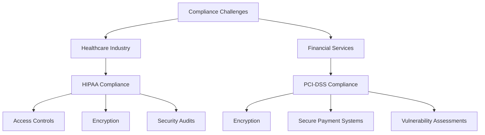

### Review of Notable Compliance Breaches and Their Implications

#### High-Profile Compliance Breaches

Examining high-profile compliance breaches helps us understand what went wrong and how similar incidents can be prevented in the future.

**Example 1: Equifax Data Breach**

- **Incident**: In 2017, Equifax suffered a massive data breach that exposed the personal information of over 147 million people.
- **Cause**: The breach was caused by a failure to patch a known vulnerability in a timely manner.
- **Implications**: The breach resulted in significant financial and reputational damage to Equifax, as well as regulatory fines and legal actions.

**Example 2: Target Data Breach**

- **Incident**: In 2013, Target experienced a data breach that compromised the credit card information of 40 million customers.
- **Cause**: Hackers gained access through a third-party vendor's credentials.
- **Implications**: The breach led to substantial financial losses, legal settlements, and a loss of customer trust.

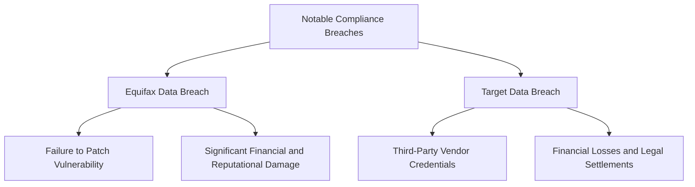

### Learning from Successful Compliance Implementations

#### Case Studies of Successful Implementations

Learning from successful compliance implementations provides valuable insights into best practices and strategies that work.

**Example 1: A Major Bank**

- **Implementation**: A major bank successfully implemented a comprehensive compliance program to meet GDPR requirements.
- **Key Strategies**: Data protection impact assessments, data minimization, and encryption.
- **Outcome**: Achieved compliance with GDPR and enhanced data protection practices.

**Example 2: A Global Tech Company**

- **Implementation**: A global tech company implemented ISO 27001 to strengthen its information security management system.
- **Key Strategies**: Risk assessment, employee training, and continuous monitoring.
- **Outcome**: Improved security posture and certification to ISO 27001.

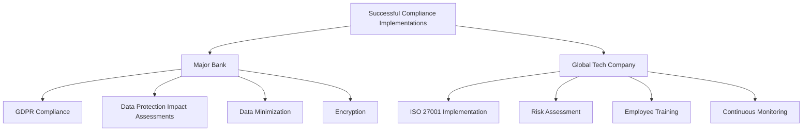

## Hands-on Exercises

### Practical Exercises to Simulate Control Implementation, Evidence Gathering, and Audit Preparation

#### Step-by-Step Control Implementation

Hands-on exercises provide practical experience in implementing compliance controls.

**Exercise 1: Implementing Access Controls**

- **Objective**: Implement role-based access control (RBAC) to secure sensitive data.
- **Steps**:
  1. Identify sensitive data and systems.
  2. Define roles and associated permissions.
  3. Configure access control settings.
  4. Test and validate access controls.

**Exercise 2: Encryption Implementation**

- **Objective**: Encrypt sensitive data to ensure confidentiality.
- **Steps**:
  1. Select an appropriate encryption algorithm.
  2. Implement encryption for data at rest and in transit.
  3. Manage and rotate encryption keys.
  4. Verify and test encryption effectiveness.

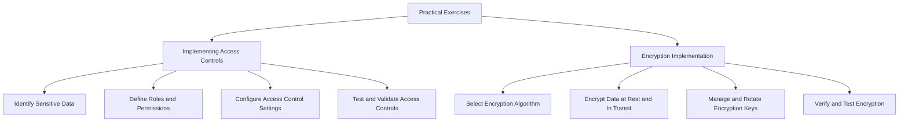

### Role-Playing Scenarios to Practice Responding to Compliance Challenges

#### Scenario-Based Exercises

Role-playing scenarios help participants practice responding to compliance challenges and incidents.

**Scenario 1: Data Breach Response**

- **Roles**: Compliance officer, IT security team, incident response team.
- **Scenario**: A data breach is detected, and the team must respond effectively.
- **Steps**:
  1. Identify and contain the breach.
  2. Conduct a forensic investigation.
  3. Communicate with stakeholders.
  4. Implement corrective actions and review response.

**Scenario 2: Compliance Audit Preparation**

- **Roles**: Compliance manager, technical staff, auditor.
- **Scenario**: Preparing for an upcoming compliance audit.
- **Steps**:
  1. Review and gather necessary documentation.
  2. Conduct internal assessments.
  3. Train staff on audit procedures.
  4. Address potential gaps before the audit.

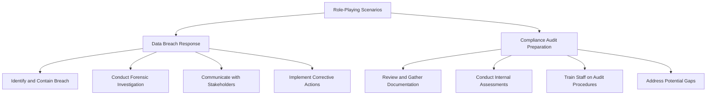

## Advanced Topics for a Technical Audience

### Advanced Case Study Analysis

#### In-Depth Analysis of Complex Compliance Scenarios

Exploring complex compliance scenarios helps understand multi-faceted challenges involving technology, processes, and human factors.

**Example: Multi-National Corporation Compliance**

- **Scenario**: A multi-national corporation faces compliance challenges due to varying regulations across different countries.
- **Challenges**: Harmonizing compliance practices, managing cross-border data transfers, and ensuring consistent implementation.
- **Solutions**: Developing a global compliance framework, using data localization strategies, and implementing standardized controls.

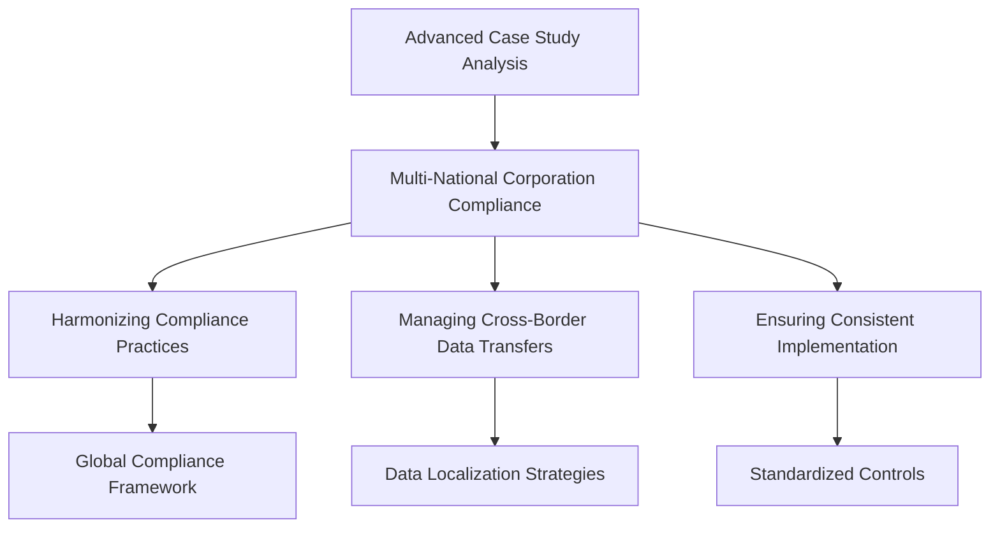

### Comparative Case Studies

#### Comparing Different Compliance Approaches

Comparing different compliance approaches taken by various organizations helps identify strengths and weaknesses.

**Example: Comparing GDPR and CCPA Compliance**

- **Organization 1**: A European company’s approach to GDPR compliance.
- **Organization 2**: A US-based company’s approach to CCPA compliance.
- **Comparison**: Analyzing the similarities, differences, and effectiveness of each approach.

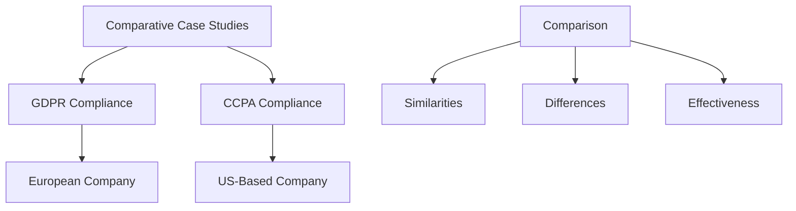

### Lessons from Industry-Specific Compliance

#### Industry-Focused Case Studies

Examining compliance challenges and solutions specific to industries like healthcare, finance, and manufacturing provides tailored insights.

**Example: Healthcare Compliance**

- **Challenge**: Ensuring HIPAA compliance in a large healthcare network.
- **Solution**: Implementing EHR systems with built-in compliance features, regular training for staff, and continuous monitoring.
- **Outcome**: Enhanced patient data security and compliance with HIPAA regulations.

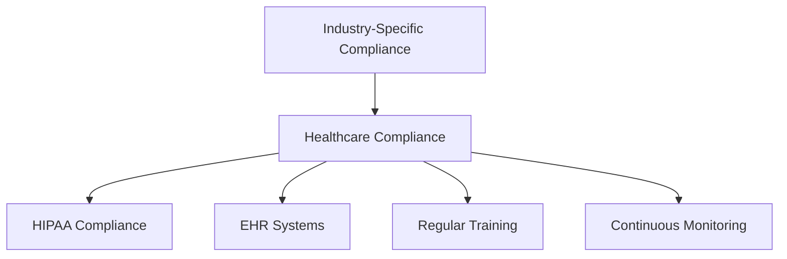

### Real-World Application of Compliance Tools and Technologies

#### Hands-On Exercises Using Industry-Standard Tools

Engaging in practical exercises with compliance tools helps participants understand their real-world applications.

**Exercise: Using SIEM Systems**

- **Objective**: Monitor and respond to security incidents using a SIEM system.
- **Steps**:
  1. Configure the SIEM system.
  2. Set up alerts for suspicious activities.
  3. Analyze and respond to generated alerts.
  4. Report findings and take corrective actions.

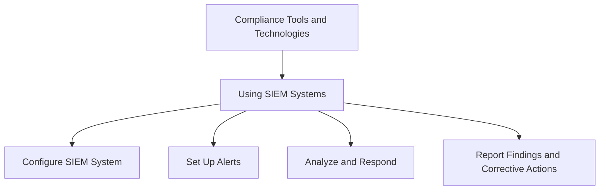

### Collaborative Projects

#### Group Projects to Develop Compliance Strategies

Collaborative projects provide an opportunity for practical application and teamwork.

**Project: Developing a Compliance Strategy for a Hypothetical Organization**

- **Objective**: Work in groups to develop a comprehensive compliance strategy.
- **Steps**:
  1. Identify compliance requirements.
  2. Design and implement controls.
  3. Develop documentation and training materials.
  4. Present and defend the strategy to the class.
  5. Receive and incorporate peer feedback.

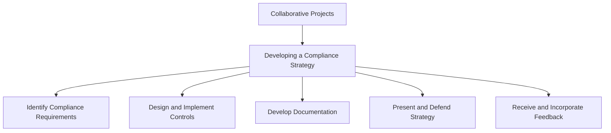

## Conclusion and Future Directions

### Emerging Trends in Compliance

#### Future Trends and Regulatory Changes

Discussing future trends in compliance helps prepare for upcoming challenges and opportunities.

- **Trend 1**: Increased focus on data privacy regulations globally.
- **Trend 2**: Adoption of advanced technologies like AI and blockchain in compliance.
- **Trend 3**: Greater emphasis on continuous compliance and real-time monitoring.

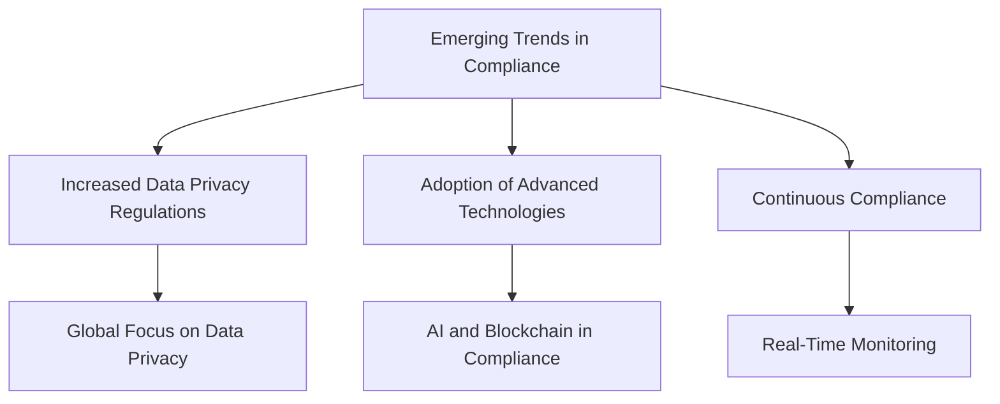

### Continuous Learning and Improvement

#### Ongoing Education and Training

Emphasizing the importance of continuous learning ensures that compliance professionals stay updated and effective.

- **Resources**: Accessing online courses, certifications, and industry publications.
- **Professional Development**: Participating in conferences, workshops, and networking events.
- **Continuous Improvement**: Encouraging a culture of ongoing learning and proactive compliance management.

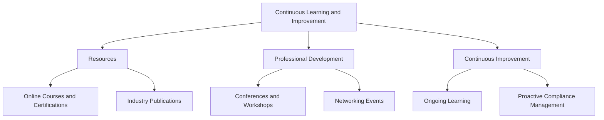

