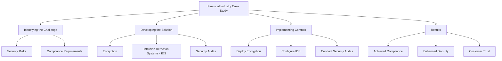
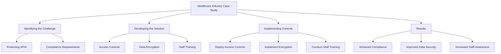
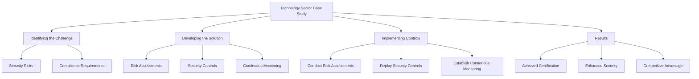

### Financial Industry

#### Case Study: Implementing PCI-DSS Controls in a Financial Institution

Implementing PCI-DSS (Payment Card Industry Data Security Standard) controls is essential for financial institutions to protect cardholder data and ensure secure payment processing. This case study examines how a financial institution successfully implemented PCI-DSS controls to achieve compliance and enhance security.

##### Identifying the Challenge
The financial institution faced challenges in securing payment processing systems and protecting cardholder data against breaches.

- **Security Risks:** The institution needed to address various security risks, including unauthorized access, data breaches, and fraud.
- **Compliance Requirements:** Achieving PCI-DSS compliance was critical to meet industry standards and avoid penalties.

##### Developing the Solution
The institution developed a comprehensive plan to implement PCI-DSS controls, focusing on encryption, intrusion detection, and regular security audits.

- **Encryption:** Implementing encryption for data at rest and in transit to protect sensitive cardholder information.
- **Intrusion Detection Systems (IDS):** Deploying IDS to monitor network traffic and detect potential security breaches.
- **Security Audits:** Conducting regular security audits to ensure compliance with PCI-DSS standards and identify areas for improvement.

##### Implementing Controls
The institution followed a structured approach to deploy and integrate the necessary controls.

- **Deploy Encryption:** Installed and configured encryption software to secure data at rest and during transmission.
- **Configure IDS:** Deployed IDS across the network to monitor traffic and alert security teams of any suspicious activity.
- **Conduct Security Audits:** Regularly audited systems and processes to verify compliance with PCI-DSS requirements.

##### Results
The implementation of PCI-DSS controls led to significant improvements in the institution's security posture.

- **Achieved Compliance:** Successfully met all PCI-DSS requirements and obtained certification.
- **Enhanced Security:** Improved protection of cardholder data and reduced the risk of data breaches.
- **Customer Trust:** Increased customer trust and confidence in the institution's ability to secure payment transactions.

### Healthcare Industry

#### Case Study: Implementing HIPAA Controls in a Healthcare Provider

Healthcare providers must comply with the Health Insurance Portability and Accountability Act (HIPAA) to protect patient information. This case study explores how a healthcare provider implemented HIPAA controls to safeguard electronic protected health information (ePHI).

##### Identifying the Challenge
The healthcare provider needed to address various challenges in protecting patient information and ensuring compliance with HIPAA regulations.

- **Protecting ePHI:** Ensuring the confidentiality, integrity, and availability of electronic protected health information.
- **Compliance Requirements:** Meeting HIPAA's stringent privacy and security rules to avoid penalties and protect patient trust.

##### Developing the Solution
The provider developed a comprehensive plan to implement HIPAA controls, focusing on access controls, data encryption, and staff training.

- **Access Controls:** Implementing strong access controls to ensure that only authorized personnel can access ePHI.
- **Data Encryption:** Encrypting patient records to protect data both at rest and in transit.
- **Staff Training:** Conducting regular training sessions to educate staff on HIPAA compliance and data privacy best practices.

##### Implementing Controls
The provider followed a structured approach to deploy and integrate the necessary controls.

- **Deploy Access Controls:** Configured role-based access controls (RBAC) to restrict access to ePHI based on job functions.
- **Implement Encryption:** Deployed encryption solutions to protect patient data in storage and during transmission.
- **Conduct Staff Training:** Organized training sessions to ensure that all staff members understood their responsibilities under HIPAA.

##### Results
The implementation of HIPAA controls led to significant improvements in the provider's data security and compliance posture.

- **Achieved Compliance:** Successfully met all HIPAA requirements and demonstrated compliance during audits.
- **Improved Data Security:** Enhanced protection of patient information, reducing the risk of breaches.
- **Increased Staff Awareness:** Improved staff awareness of data privacy practices and their role in maintaining compliance.

### Technology Sector

#### Case Study: Implementing ISO 27001 Controls in a Tech Company

ISO 27001 is an international standard for information security management systems (ISMS). This case study examines how a tech company implemented ISO 27001 controls to manage information security risks and protect intellectual property.

##### Identifying the Challenge
The tech company faced challenges in managing information security risks and protecting sensitive data.

- **Security Risks:** Addressing various security risks, including data breaches, intellectual property theft, and cyber attacks.
- **Compliance Requirements:** Achieving ISO 27001 certification to demonstrate commitment to information security and gain a competitive edge.

##### Developing the Solution
The company developed a comprehensive plan to implement ISO 27001 controls, focusing on risk assessments, security controls, and continuous monitoring.

- **Risk Assessments:** Conducting regular risk assessments to identify and mitigate potential security threats.
- **Security Controls:** Implementing a range of security controls, including access management, encryption, and incident response.
- **Continuous Monitoring:** Establishing continuous monitoring processes to detect and respond to security incidents in real-time.

##### Implementing Controls
The company followed a structured approach to deploy and integrate the necessary controls.

- **Conduct Risk Assessments:** Regularly performed risk assessments to identify potential security threats and vulnerabilities.
- **Deploy Security Controls:** Implemented controls such as access management, data encryption, and incident response plans.
- **Establish Continuous Monitoring:** Set up continuous monitoring systems to detect and respond to security incidents promptly.

##### Results
The implementation of ISO 27001 controls led to significant improvements in the company's information security posture.

- **Achieved Certification:** Successfully achieved ISO 27001 certification, demonstrating a strong commitment to information security.
- **Enhanced Security:** Improved protection of sensitive data and intellectual property.
- **Competitive Advantage:** Gained a competitive edge by showcasing ISO 27001 certification to clients and partners.

