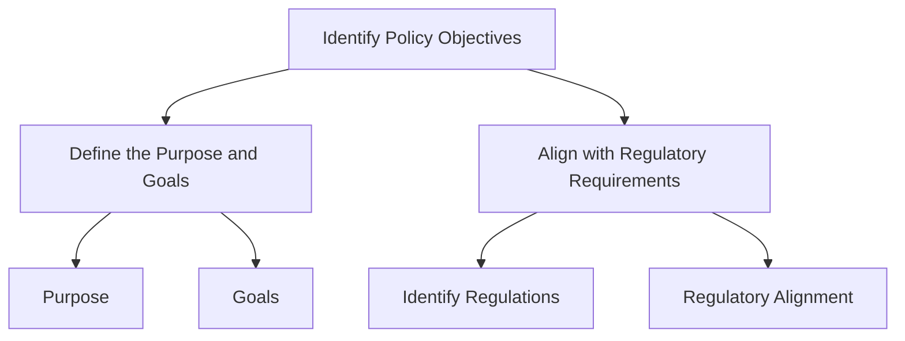
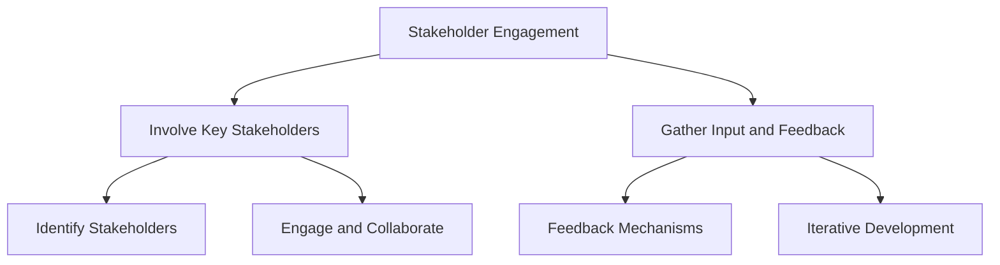
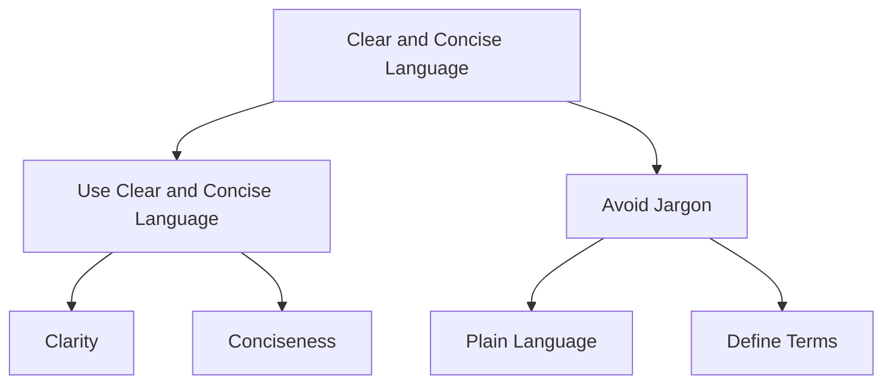
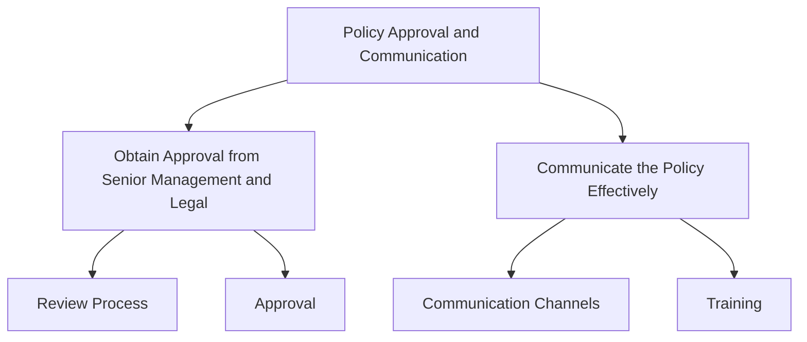
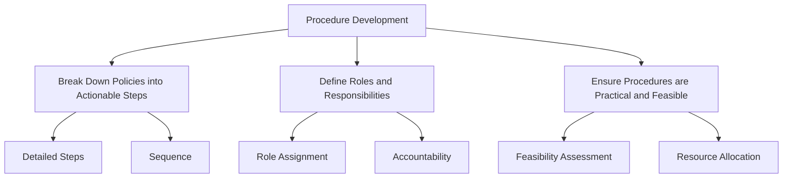
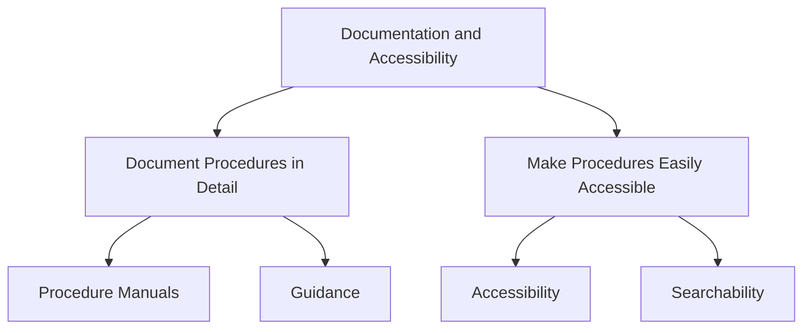
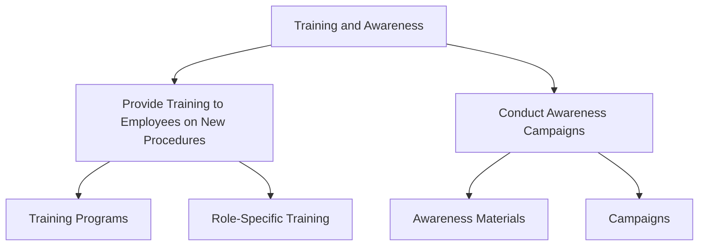
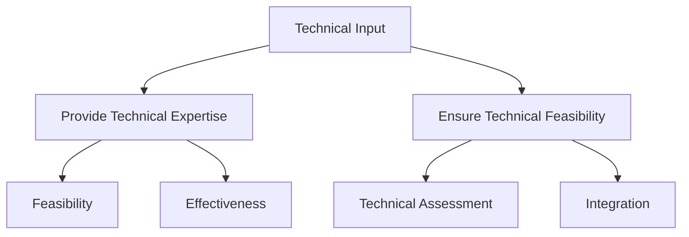
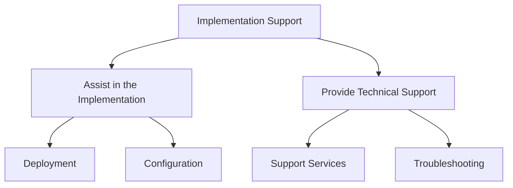
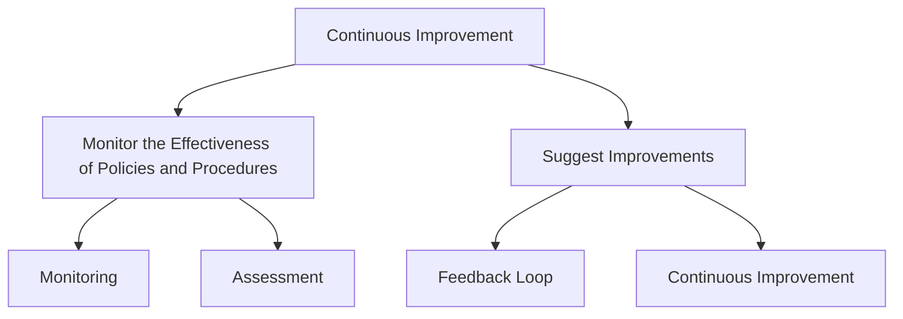

## Best Practices for Developing Clear and Actionable Policies

Developing clear and actionable policies is crucial for guiding an organization's compliance efforts. Effective policies provide direction, set expectations, and ensure consistent application of compliance controls across the organization. Here are the best practices for developing such policies:

### Identify Policy Objectives

#### Define the Purpose and Goals
Policies should have a clear purpose and defined goals. This helps ensure that everyone understands the policy's intent and what it aims to achieve.

- **Purpose:** Clearly state why the policy is necessary and what it aims to address. For example, a data protection policy may aim to protect sensitive information from unauthorized access and breaches.
- **Goals:** Define specific, measurable goals that the policy seeks to achieve. This could include compliance with specific regulations, improvement in data security, or reduction in incidents.

#### Align with Regulatory Requirements
Policies must align with relevant regulatory requirements to ensure compliance and avoid legal penalties.

- **Identify Regulations:** Research and document all applicable regulations and standards that the policy needs to comply with.
- **Regulatory Alignment:** Ensure the policy addresses all necessary regulatory requirements and standards.

### Stakeholder Engagement

#### Involve Key Stakeholders
Engaging key stakeholders in the policy development process ensures that the policy is comprehensive and practical.

- **Identify Stakeholders:** Determine who the key stakeholders are, including senior management, legal, compliance officers, and department heads.
- **Engage and Collaborate:** Involve stakeholders in discussions, gather their input, and incorporate their feedback into the policy development process.

#### Gather Input and Feedback
Collecting input and feedback from stakeholders helps ensure that the policy is effective and feasible.

- **Feedback Mechanisms:** Establish mechanisms for collecting feedback, such as surveys, workshops, and meetings.
- **Iterative Development:** Use the feedback to iteratively refine and improve the policy.

### Clear and Concise Language

#### Use Clear and Concise Language
Policies should be written in clear and straightforward language to ensure they are easily understood by all employees.

- **Clarity:** Avoid ambiguity and ensure that the policy is easy to read and understand.
- **Conciseness:** Keep the policy concise and to the point, focusing on essential information.

#### Avoid Jargon
Minimize the use of technical jargon to prevent confusion and ensure that the policy is accessible to all employees.

- **Plain Language:** Use plain language to make the policy more accessible.
- **Define Terms:** If technical terms are necessary, provide clear definitions.

### Policy Approval and Communication

#### Obtain Approval from Senior Management and Legal
Policies should be reviewed and approved by senior management and the legal team to ensure alignment with organizational goals and compliance with legal requirements.

- **Review Process:** Establish a formal review process involving senior management and legal.
- **Approval:** Obtain necessary approvals before finalizing the policy.

#### Communicate the Policy Effectively
Effective communication ensures that all employees are aware of the policy and understand their responsibilities.

- **Communication Channels:** Use multiple communication channels, such as emails, intranet, and training sessions, to disseminate the policy.
- **Training:** Provide training sessions to explain the policy and its implications.

## Creating Detailed Procedures that Support Policy Implementation

Procedures provide the actionable steps needed to implement policies. Effective procedures ensure that policies are applied consistently and effectively across the organization.

### Procedure Development

#### Break Down Policies into Actionable Steps
Translate policies into clear, actionable steps that employees can follow.

- **Detailed Steps:** Break down the policy into specific actions and tasks.
- **Sequence:** Organize the steps in a logical sequence to ensure smooth implementation.

#### Define Roles and Responsibilities
Clearly define who is responsible for each step in the procedure.

- **Role Assignment:** Assign roles and responsibilities to specific individuals or teams.
- **Accountability:** Ensure that each role has clear accountability for the assigned tasks.

#### Ensure Procedures are Practical and Feasible
Make sure that procedures are realistic and can be effectively implemented within the organization.

- **Feasibility Assessment:** Evaluate the practicality of the procedures.
- **Resource Allocation:** Ensure that the necessary resources are available for implementation.

### Documentation and Accessibility

#### Document Procedures in Detail
Create detailed documentation for each procedure, outlining each step and providing necessary guidance.

- **Procedure Manuals:** Develop comprehensive manuals that describe each procedure.
- **Guidance:** Include detailed guidance and examples to help employees understand and follow the procedures.

#### Make Procedures Easily Accessible
Ensure that all relevant personnel have easy access to the documented procedures.

- **Accessibility:** Store procedures in accessible locations, such as the company intranet.
- **Searchability:** Ensure that procedures are easy to find and navigate.

### Training and Awareness

#### Provide Training to Employees on New Procedures
Conduct training sessions to educate employees on new procedures and ensure they understand their roles and responsibilities.

- **Training Programs:** Develop and deliver training programs for employees.
- **Role-Specific Training:** Tailor training to different roles and responsibilities.

#### Conduct Awareness Campaigns
Run awareness campaigns to reinforce the importance of following procedures and maintaining compliance.

- **Awareness Materials:** Create materials such as posters, emails, and intranet articles to promote awareness.
- **Campaigns:** Launch periodic campaigns to keep compliance top of mind.

## Role of Technical Staff in Policy and Procedure Development

Technical staff play a crucial role in developing and implementing policies and procedures. Their expertise ensures that controls are feasible, effective, and aligned with technical capabilities.

### Technical Input

#### Provide Technical Expertise
Technical staff provide valuable insights into the feasibility and effectiveness of proposed policies and procedures.

- **Feasibility:** Assess whether the proposed controls and procedures can be practically implemented with the existing technology and infrastructure.
- **Effectiveness:** Evaluate the potential effectiveness of controls and procedures in mitigating risks and ensuring compliance.

#### Ensure Technical Feasibility
Ensure that the proposed policies and procedures are technically feasible and can be supported by the organization's IT infrastructure.

- **Technical Assessment:** Conduct technical assessments to determine feasibility.
- **Integration:** Ensure that procedures can be integrated with existing systems and processes.

### Implementation Support

#### Assist in the Implementation
Technical staff help deploy and configure the technical aspects of policies and procedures.

- **Deployment:** Assist in deploying new technologies and configuring systems according to the procedures.
- **Configuration:** Ensure that systems are configured correctly to support compliance controls.

#### Provide Technical Support
Offer ongoing support and troubleshooting to ensure that the procedures are working as intended.

- **Support Services:** Provide technical support services to address issues and ensure smooth operation.
- **Troubleshooting:** Troubleshoot any technical problems that arise during implementation.

### Continuous Improvement

#### Monitor the Effectiveness of Policies and Procedures
Continuously assess the effectiveness of implemented policies and procedures.

- **Monitoring:** Use monitoring

 tools and techniques to track the performance of controls and procedures.
- **Assessment:** Conduct regular assessments to identify areas for improvement.

#### Suggest Improvements
Propose updates and improvements based on feedback, changes in regulatory requirements, and evolving organizational needs.

- **Feedback Loop:** Establish a feedback loop to gather input from stakeholders.
- **Continuous Improvement:** Implement a continuous improvement process to update and refine policies and procedures.

