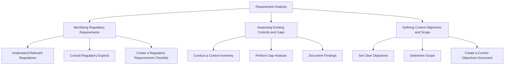
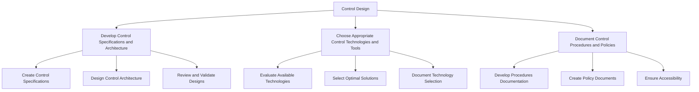
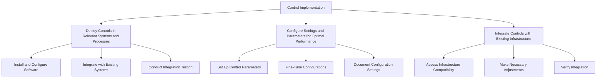
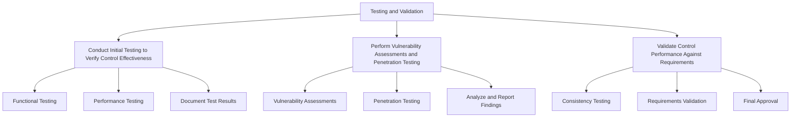
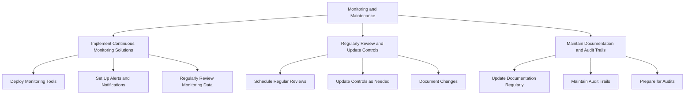

## Introduction

Implementing compliance measures is a strategic process that ensures an organization adheres to regulatory standards, enhances security, and mitigates risks. This module covers the comprehensive steps to implement controls effectively, integrates these controls into various organizational processes, and develops robust policies and procedures. Real-world examples and practical insights provide a thorough understanding for a technical audience.

## Implementing Controls

### Steps to Implement Controls Effectively

#### Requirement Analysis

##### Identifying Regulatory Requirements
Identifying regulatory requirements involves understanding the specific laws, regulations, and standards that apply to your organization. For instance, healthcare organizations must comply with HIPAA, while financial institutions must adhere to PCI-DSS. This step ensures that all applicable regulations are considered when designing and implementing controls.

- **Understand Relevant Regulations:** Research and document all regulations relevant to your industry and organization. This includes federal, state, and local laws as well as industry-specific standards.
- **Consult Regulatory Experts:** Engage with legal and compliance experts to ensure a comprehensive understanding of regulatory requirements.
- **Create a Regulatory Requirements Checklist:** Develop a checklist or matrix to track all identified regulations and their specific requirements.

##### Assessing Existing Controls and Gaps
Evaluating current controls helps identify any gaps or areas of non-compliance. This assessment provides a baseline understanding of the organization's current security posture and highlights areas needing improvement.

- **Conduct a Control Inventory:** List all existing controls and their current status.
- **Perform Gap Analysis:** Compare existing controls against regulatory requirements to identify gaps.
- **Document Findings:** Create a detailed report outlining existing controls, identified gaps, and areas requiring additional controls.

##### Defining Control Objectives and Scope
Clearly defining what each control aims to achieve and its scope is essential for effective implementation. This step involves specifying the areas and processes that will be affected by the control and setting clear objectives.

- **Set Clear Objectives:** Define what each control is intended to achieve, such as protecting data integrity, ensuring access control, or monitoring network traffic.
- **Determine Scope:** Identify the systems, processes, and data that will be impacted by the control.
- **Create a Control Objectives Document:** Document the objectives and scope for each control to guide the implementation process.

#### Control Design

##### Develop Control Specifications and Architecture
Designing controls involves creating detailed specifications and an architecture that outline how the controls will be implemented. This step ensures that controls are tailored to meet identified requirements and are integrated into the organization's infrastructure.

- **Create Control Specifications:** Develop detailed specifications for each control, including functional and technical requirements.
- **Design Control Architecture:** Outline the architecture for implementing the controls, considering how they will integrate with existing systems.
- **Review and Validate Designs:** Engage stakeholders to review and validate the control designs.

##### Choose Appropriate Control Technologies and Tools
Selecting the right technologies and tools is crucial for effective control implementation. This involves evaluating and choosing technologies that meet the control specifications and requirements.

- **Evaluate Available Technologies:** Research and compare different technologies and tools that can fulfill the control requirements.
- **Select Optimal Solutions:** Choose the technologies and tools that best meet the organization's needs, considering factors such as scalability, compatibility, and cost.
- **Document Technology Selection:** Create documentation that outlines the selected technologies and the rationale behind the choices.

##### Document Control Procedures and Policies
Creating comprehensive documentation for control procedures and policies ensures that controls are implemented consistently and can be effectively monitored and maintained.

- **Develop Procedures Documentation:** Write detailed procedures for implementing, monitoring, and maintaining each control.
- **Create Policy Documents:** Develop policies that define the organization's approach to compliance and control implementation.
- **Ensure Accessibility:** Make documentation accessible to all relevant stakeholders.

#### Control Implementation

##### Deploy Controls in Relevant Systems and Processes
Integrating controls into existing systems and processes is a critical step in the implementation process. This involves configuring settings, installing software, and making necessary adjustments to ensure seamless integration.

- **Install and Configure Software:** Deploy control software and configure it according to the specifications.
- **Integrate with Existing Systems:** Ensure that the new controls work seamlessly with existing systems and processes.
- **Conduct Integration Testing:** Perform testing to verify that controls are integrated correctly and functioning as intended.

##### Configure Settings and Parameters for Optimal Performance
Proper configuration of control settings and parameters ensures that the controls provide the intended protection and functionality.

- **Set Up Control Parameters:** Configure control settings and parameters to optimize performance.
- **Fine-Tune Configurations:** Adjust configurations based on initial testing and feedback to ensure optimal performance.
- **Document Configuration Settings:** Keep detailed records of all configuration settings for future reference and troubleshooting.

##### Integrate Controls with Existing Infrastructure
Ensure that the newly implemented controls are compatible with the organization's existing infrastructure.

- **Assess Infrastructure Compatibility:** Evaluate the existing infrastructure to identify any compatibility issues.
- **Make Necessary Adjustments:** Adjust the infrastructure as needed to accommodate the new controls.
- **Verify Integration:** Conduct final integration tests to ensure compatibility and effectiveness.

#### Testing and Validation

##### Conduct Initial Testing to Verify Control Effectiveness
Initial testing ensures that the controls work as expected and meet the defined requirements.

- **Functional Testing:** Perform functional testing to verify that the controls meet their specified requirements.
- **Performance Testing:** Assess the performance of the controls to ensure they do not negatively impact system performance.
- **Document Test Results:** Record the results of all tests to provide a basis for further validation and troubleshooting.

##### Perform Vulnerability Assessments and Penetration Testing
Conducting vulnerability assessments and penetration testing helps identify potential weaknesses in the controls.

- **Vulnerability Assessments:** Use automated tools to scan for vulnerabilities in the implemented controls.
- **Penetration Testing:** Simulate attacks to test the robustness of the controls and identify any weaknesses.
- **Analyze and Report Findings:** Document the findings from vulnerability assessments and penetration testing and develop a plan to address any identified issues.

##### Validate Control Performance Against Requirements
Ensure that the controls perform consistently and meet all defined requirements and objectives.

- **Consistency Testing:** Verify that controls perform consistently under different conditions.
- **Requirements Validation:** Check that the controls meet all regulatory and organizational requirements.
- **Final Approval:** Obtain final approval from stakeholders before moving to continuous monitoring and maintenance.

#### Monitoring and Maintenance

##### Implement Continuous Monitoring Solutions
Continuous monitoring is essential for ensuring the ongoing effectiveness of the controls. This involves using automated tools to monitor control performance and detect any issues.

- **Deploy Monitoring Tools:** Install and configure monitoring tools to continuously track control performance.
- **Set Up Alerts and Notifications:** Configure alerts and notifications to inform relevant personnel of any issues or anomalies.
- **Regularly Review Monitoring Data:** Analyze monitoring data to identify trends and areas for improvement.

##### Regularly Review and Update Controls
Periodic reviews and updates ensure that the controls remain effective and adapt to new threats or changes in regulatory requirements.

- **Schedule Regular Reviews:** Establish a schedule for regular control reviews.
- **Update Controls as Needed:** Modify controls based on review findings and changes in the threat landscape.
- **Document Changes:** Maintain detailed records of all changes to controls and their configurations.

##### Maintain Documentation and Audit Trails
Keeping detailed documentation and audit trails is crucial for demonstrating compliance and supporting audits.

- **Update Documentation Regularly:** Ensure that all control documentation is kept up-to-date with the latest changes and configurations.
- **Maintain Audit Trails:** Record all control activities, updates, and incidents

 in audit trails.
- **Prepare for Audits:** Regularly review documentation and audit trails to ensure readiness for compliance audits.

