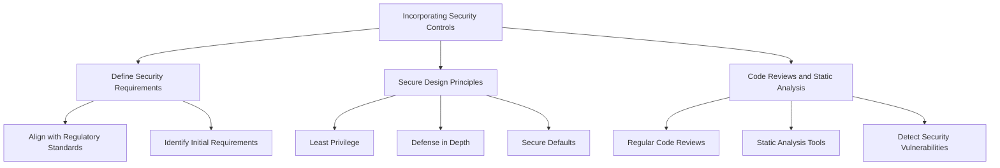
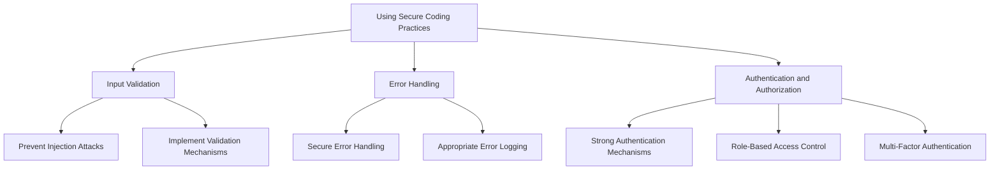
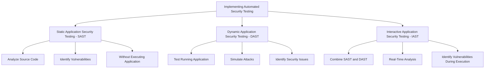
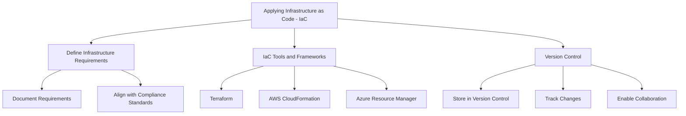
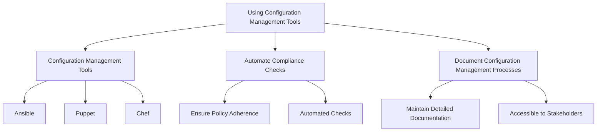
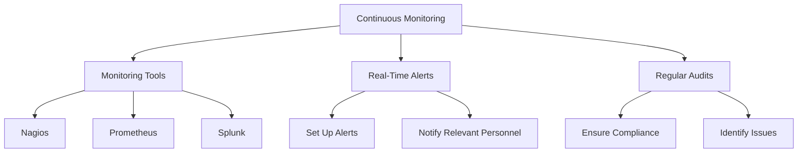
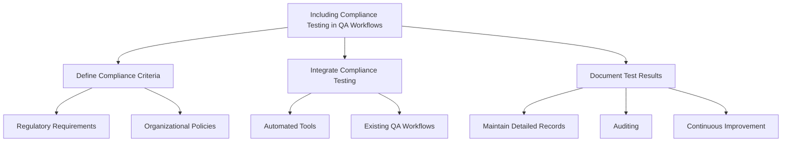
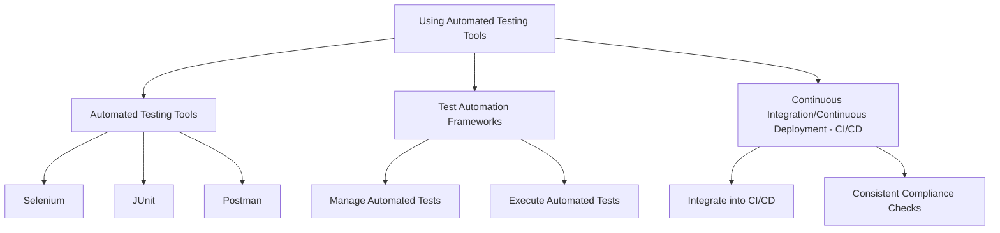
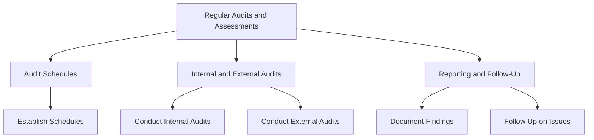

## Introduction

Integrating compliance frameworks into an organization is a multifaceted process that ensures adherence to regulatory standards, enhances security, and mitigates risks. This module explores the steps necessary to implement compliance controls effectively, focusing on integration within software development, operations, and quality assurance processes. The detailed guidelines and real-world examples provided are designed to offer practical insights for a technical audience.

### Software Development (DevSecOps)

#### Incorporating Security Controls
Integrating security controls into the software development lifecycle (SDLC) ensures that security is built into the application from the beginning. This proactive approach helps prevent vulnerabilities and ensures compliance with regulatory requirements.

- **Define Security Requirements:** Identify and define security requirements at the initial stages of the project. These requirements should align with regulatory standards and organizational policies.
- **Secure Design Principles:** Implement secure design principles, such as least privilege, defense in depth, and secure defaults, to ensure that security is a core component of the application architecture.
- **Code Reviews and Static Analysis:** Conduct regular code reviews and use static analysis tools to detect and address security vulnerabilities during the development process.

#### Using Secure Coding Practices
Secure coding practices help developers write code that is resilient to attacks and free from common vulnerabilities.

- **Input Validation:** Ensure that all user inputs are validated to prevent injection attacks and other security issues. Implement robust validation mechanisms and sanitize inputs.
- **Error Handling:** Implement secure error handling to avoid exposing sensitive information through error messages. Ensure that errors are logged appropriately for analysis without revealing details to end users.
- **Authentication and Authorization:** Use strong authentication and authorization mechanisms to protect access to sensitive data and functionality. Implement multi-factor authentication (MFA) and role-based access control (RBAC).

#### Implementing Automated Security Testing
Automated security testing tools can be integrated into the CI/CD pipeline to catch security issues early in the development process.

- **Static Application Security Testing (SAST):** Use SAST tools to analyze the source code for vulnerabilities without executing the application. This helps identify issues such as SQL injection, XSS, and insecure coding practices.
- **Dynamic Application Security Testing (DAST):** Implement DAST tools to test the running application for security vulnerabilities by simulating attacks. This helps identify issues that may not be apparent through static analysis.
- **Interactive Application Security Testing (IAST):** Use IAST tools to combine elements of both SAST and DAST, providing a comprehensive approach to security testing. These tools analyze the application in real-time, during execution, to identify vulnerabilities.

### Operations (DevOps)

#### Applying Infrastructure as Code (IaC)
IaC involves managing and provisioning computing infrastructure through machine-readable configuration files. This approach ensures consistency, repeatability, and scalability.

- **Define Infrastructure Requirements:** Document the infrastructure requirements, including servers, networking, and storage. Ensure that these requirements align with compliance standards.
- **IaC Tools and Frameworks:** Use tools like Terraform, AWS CloudFormation, or Azure Resource Manager to define and manage infrastructure as code.
- **Version Control:** Store IaC configurations in version control systems (e.g., Git) to track changes, enable collaboration, and ensure traceability.

#### Using Configuration Management Tools
Configuration management tools automate the deployment, configuration, and management of systems, ensuring that they remain compliant with security and operational policies.

- **Configuration Management Tools:** Use tools like Ansible, Puppet, or Chef to automate system configuration and management.
- **Automate Compliance Checks:** Implement automated compliance checks to ensure that systems adhere to security and operational policies.
- **Document Configuration Management Processes:** Maintain detailed documentation of configuration management processes and ensure they are accessible to relevant stakeholders.

#### Continuous Monitoring
Continuous monitoring involves using tools and processes to continuously assess the security and compliance status of systems and applications.

- **Monitoring Tools:** Use tools like Nagios, Prometheus, or Splunk to continuously monitor system performance, security, and compliance.
- **Real-Time Alerts:** Set up real-time alerts to notify relevant personnel of any anomalies or security issues.
- **Regular Audits:** Conduct regular audits to ensure that systems remain compliant with regulatory and organizational standards.

### Quality Assurance (QA)

#### Including Compliance Testing in QA Workflows
Incorporating compliance testing into QA workflows ensures that applications meet regulatory and organizational standards before deployment.

- **Define Compliance Criteria:** Establish compliance criteria based on regulatory requirements and organizational policies.
- **Integrate Compliance Testing:** Incorporate compliance testing into existing QA workflows, using automated tools where possible.
- **Document Test Results:** Maintain detailed records of compliance test results for auditing and continuous improvement purposes.

#### Using Automated Testing Tools
Automated testing tools streamline the compliance verification process, ensuring comprehensive coverage and consistent results.

- **Automated Testing Tools:** Use tools like Selenium, JUnit, or Postman for automated testing.
- **Test Automation Frameworks:** Implement test automation frameworks to manage and execute automated tests.
- **Continuous Integration/Continuous Deployment (CI/CD):** Integrate automated testing into CI/CD pipelines to ensure compliance checks are performed consistently.

#### Regular Audits and Assessments
Conducting regular audits and assessments helps verify that controls are effective and the organization remains compliant.

- **Audit Schedules:** Establish a schedule for regular audits and assessments.
- **Internal and External Audits:** Conduct both internal and external audits to gain a comprehensive view of compliance status.
- **Reporting and Follow-Up:** Document audit findings and follow up on any identified issues to ensure

 they are addressed.

