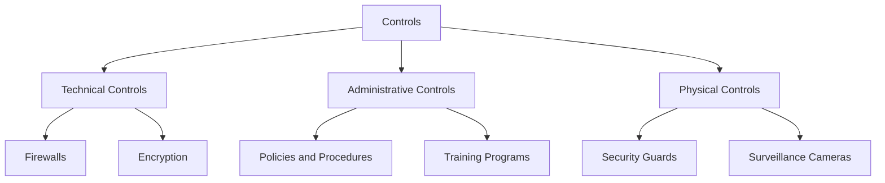
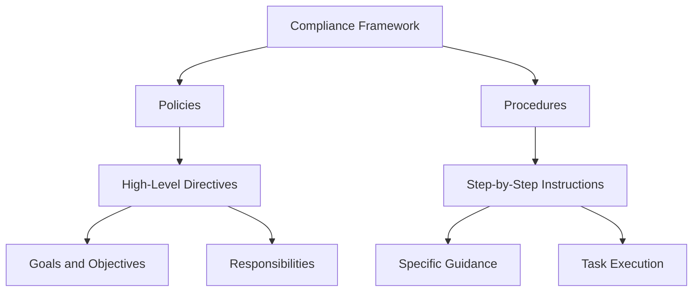
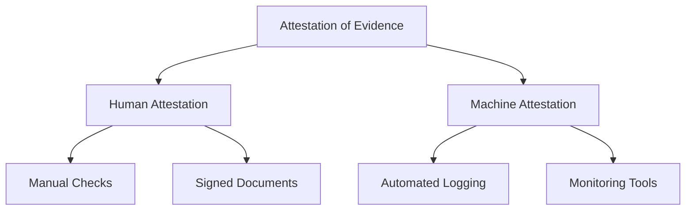
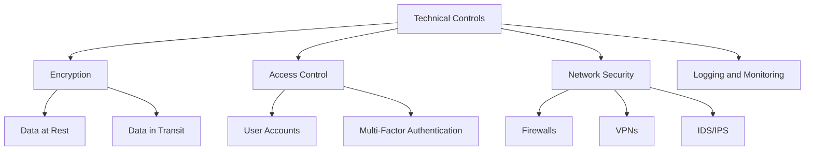
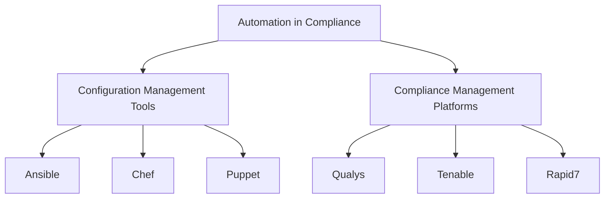
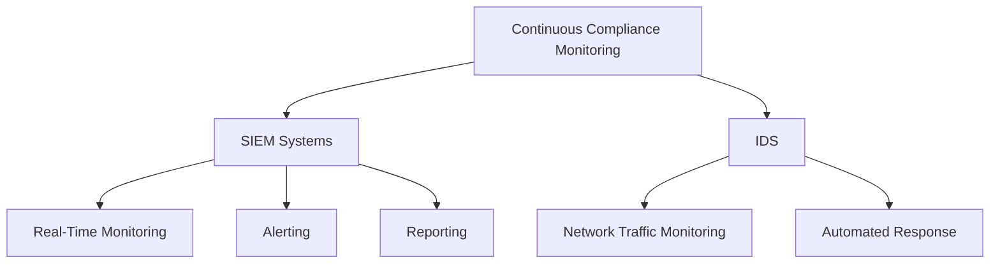
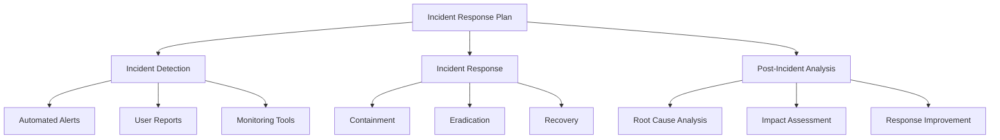
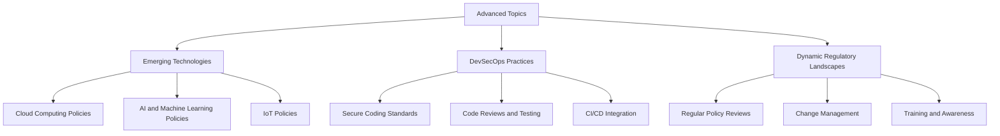

## Understanding Controls

Controls are essential safeguards that organizations implement to manage risks and ensure compliance with regulatory requirements. These controls can be broadly classified into three categories: technical, administrative, and physical.

### Definition and Purpose of Controls

Controls are measures designed to mitigate risks, protect assets, ensure data integrity, and maintain compliance with regulatory standards. They play a crucial role in safeguarding an organization’s information systems and ensuring that operations align with legal and industry standards.

- **Technical Controls**: These controls use technology to protect systems and data. Examples include firewalls, intrusion detection systems, encryption, and access control mechanisms.
- **Administrative Controls**: These involve policies, procedures, and guidelines that define how an organization manages its security and compliance. Examples include risk assessments, security policies, training programs, and incident response plans.
- **Physical Controls**: These measures protect the physical infrastructure of an organization. Examples include security guards, surveillance cameras, access control systems, and environmental controls such as fire suppression systems.

### Examples of Controls Specific to Different Compliance Regimes

Different compliance regimes require specific controls tailored to address their unique requirements. Here are some examples:

#### GDPR (General Data Protection Regulation)

- **Data Encryption**: Encrypting personal data to protect it from unauthorized access.
- **Access Controls**: Implementing strong authentication mechanisms to ensure that only authorized personnel can access personal data.
- **Data Minimization**: Ensuring that only the necessary data is collected and processed.

#### HIPAA (Health Insurance Portability and Accountability Act)

- **Audit Controls**: Implementing mechanisms to record and examine access and other activity in systems containing electronic protected health information (ePHI).
- **Data Backup and Disaster Recovery**: Ensuring that ePHI is regularly backed up and that there are plans in place for recovering data in case of a disaster.
- **Security Risk Analysis**: Conducting regular assessments to identify and mitigate risks to ePHI.

#### PCI-DSS (Payment Card Industry Data Security Standard)

- **Network Segmentation**: Isolating the cardholder data environment from the rest of the network to reduce the scope of compliance.
- **Vulnerability Management**: Regularly scanning for vulnerabilities and applying security patches to systems.
- **Strong Access Control Measures**: Implementing multi-factor authentication for accessing systems that handle payment card data.

#### NIST (National Institute of Standards and Technology)

- **Continuous Monitoring**: Implementing tools and processes to continuously monitor information systems for security threats.
- **Incident Response**: Establishing an incident response plan to detect, respond to, and recover from security incidents.
- **Configuration Management**: Ensuring that systems are configured securely and that configurations are regularly reviewed and updated.

## Policies and Procedures

Policies and procedures are the backbone of an organization's compliance framework. They provide the necessary guidelines and instructions for maintaining compliance and ensuring that controls are effectively implemented and followed.

### Difference Between Policies and Procedures

Policies and procedures, while often mentioned together, serve different purposes within an organization.

- **Policies**: High-level directives that define an organization’s approach to security and compliance. Policies outline the organization’s goals, objectives, and responsibilities. They provide a framework for decision-making and behavior.
  
  Example: A data protection policy that defines how personal data should be collected, processed, and stored to comply with GDPR requirements.

- **Procedures**: Detailed, step-by-step instructions on how to implement policies. Procedures provide specific guidance on how to carry out tasks and activities in a manner consistent with the organization's policies.

  Example: A procedure for encrypting sensitive data before transmitting it over the internet, in line with the data protection policy.

### Examples of Policies and Procedures Across Different Compliance Frameworks

Different compliance frameworks have their own specific requirements for policies and procedures. Here are some examples:

#### GDPR

- **Data Protection Policy**: Outlines how personal data should be handled to ensure compliance with GDPR.
- **Data Breach Response Procedure**: Provides steps to follow in the event of a data breach, including notification requirements and mitigation measures.

#### HIPAA

- **Privacy Policy**: Defines how patient information should be protected and used.
- **Incident Response Procedure**: Details the steps to take in response to a security incident involving ePHI.

#### PCI-DSS

- **Information Security Policy**: Establishes the security requirements for protecting payment card data.
- **Vulnerability Management Procedure**: Describes how to identify, assess, and remediate security vulnerabilities in systems handling payment card data.

#### NIST

- **Access Control Policy**: Specifies the requirements for managing access to information systems.
- **Continuous Monitoring Procedure**: Outlines the processes and tools used for continuous monitoring of security controls.

### Importance of Documenting and Maintaining Policies and Procedures

Documenting and maintaining policies and procedures is crucial for several reasons:

- **Ensuring Consistency**: Provides a consistent approach to managing security and compliance across the organization.
- **Facilitating Training**: Serves as a reference for training employees on compliance requirements and best practices.
- **Supporting Audits**: Provides evidence of compliance during audits and assessments.
- **Enabling Accountability**: Clearly defines roles and responsibilities, ensuring that everyone knows what is expected of them.

## Human Attestation vs. Machine Attestation of Evidence

Attestation of evidence is a critical component of compliance, providing proof that controls and procedures are in place and functioning as intended. This attestation can be performed by humans or automated systems.

### Understanding Human Attestation of Evidence

Human attestation involves individuals reviewing and certifying that compliance controls and procedures are being followed. This can include signing documents, conducting manual checks, and providing written statements.

- **Advantages**:
  - Provides a personal assurance of compliance.
  - Can incorporate human judgment and expertise in evaluating compliance.
- **Disadvantages**:
  - Subject to human error and bias.
  - Can be time-consuming and resource-intensive.

### Role of Human Judgment and Expertise in Verifying Compliance Evidence

Human judgment is crucial in interpreting complex situations, understanding the context of evidence, and making decisions based on experience and expertise. For example, a compliance officer might review access logs and use their knowledge to identify suspicious activity that automated systems might miss.

### Machine Attestation Methods

Machine attestation involves using automated tools and systems to collect, verify, and attest to compliance evidence. This includes automated logging, monitoring tools, and compliance management platforms.

- **Advantages**:
  - Provides consistent and repeatable verification processes.
  - Reduces the risk of human error.
  - Can process large volumes of data quickly and efficiently.
- **Disadvantages**:
  - May lack the context and nuanced understanding that humans can provide.
  - Requires proper configuration and management to ensure accuracy.

## Documenting Compliance

Accurate and comprehensive documentation is essential for demonstrating compliance with regulatory requirements. Documentation provides a record of the controls, policies, and procedures in place, as well as evidence of their effectiveness.

### Importance of Accurate and Comprehensive Documentation

Documentation serves multiple critical purposes in the compliance process:

- **Proof of Compliance**: Provides the necessary evidence to demonstrate compliance during audits and assessments.
- **Audit Trail**: Maintains a traceable history of compliance activities, changes, and decisions.
- **Reference for Training**: Serves as a reference for training employees on compliance requirements and best practices.
- **Supporting Continuous Improvement**: Provides a basis for evaluating and improving compliance controls and procedures.

### Tools and Systems for Managing Compliance Documentation

Managing compliance documentation effectively requires the use of specialized tools and systems. These include:

- **Compliance Management Platforms**: Centralized systems that provide tools for managing compliance activities, documentation, and reporting.
- **Document Management Systems**: Tools for creating, storing, and managing documents and records.
- **Audit Management Systems**: Systems designed to facilitate the planning, execution, and documentation of audits.

### Ensuring Traceability and Accountability Through Documentation Practices

Effective documentation practices ensure that compliance activities are traceable and accountable. This includes:

- **Version Control**: Keeping track of changes to documents and ensuring that the latest versions are used.
- **Access Controls**: Restricting access to sensitive documentation to authorized personnel.
- **Regular Reviews**: Conducting regular reviews of documentation to ensure accuracy and relevance.

## Implementation of Technical Controls

### Detailed Guidance on Technical Controls

Implementing technical controls involves a thorough understanding of various security mechanisms and how they protect information systems. Here are some key technical controls:

- **Encryption**: Encrypting data ensures that it is unreadable to unauthorized users. Encryption can be applied to data at rest, data in transit, and data in use. Key considerations include choosing the right encryption algorithms and managing encryption keys securely.
- **Access Control**: Access control mechanisms ensure that only authorized users can access specific resources. This involves setting up user accounts, defining roles and permissions, and implementing

 multi-factor authentication (MFA) for added security.
- **Network Security**: Network security measures protect the integrity, confidentiality, and availability of data as it travels across networks. Examples include firewalls, virtual private networks (VPNs), and intrusion detection/prevention systems (IDS/IPS).
- **Logging and Monitoring**: Logging and monitoring are critical for detecting and responding to security incidents. This involves setting up log management systems, defining what events to log, and using monitoring tools to analyze logs and detect anomalies.

### Practical Examples and Best Practices

- **Setting Up Encryption**: 
  - Use strong encryption algorithms like AES-256 for data at rest.
  - Implement TLS/SSL for encrypting data in transit.
  - Regularly update and rotate encryption keys.
- **Configuring Access Control**: 
  - Implement the principle of least privilege by assigning minimal permissions necessary for users to perform their tasks.
  - Use role-based access control (RBAC) to manage permissions.
  - Enable MFA for sensitive systems and applications.
- **Network Security Best Practices**: 
  - Configure firewalls to block unauthorized access and monitor traffic for suspicious activity.
  - Use VPNs to secure remote access to corporate networks.
  - Deploy IDS/IPS to detect and prevent potential intrusions.
- **Logging and Monitoring Strategies**: 
  - Use centralized log management systems to collect and analyze logs from different sources.
  - Define log retention policies to ensure logs are available for audits and investigations.
  - Implement real-time monitoring and alerting to quickly detect and respond to security incidents.

## Automation in Compliance

### Using Automation Tools to Streamline Compliance Tasks

Automation can significantly reduce the effort required to manage compliance tasks. By using automation tools, organizations can ensure that compliance controls are consistently applied and maintained.

- **Configuration Management Tools**: Tools like Ansible, Chef, and Puppet can automate the deployment and configuration of compliance controls. These tools use scripts and configuration files to define the desired state of systems and ensure they remain compliant.
- **Compliance Management Platforms**: Platforms like Qualys, Tenable, and Rapid7 provide automated compliance assessments and reporting. They can scan systems for vulnerabilities, check for compliance with security policies, and generate detailed reports.

### Practical Examples of Using Automation Tools

- **Ansible for Compliance Automation**: 
  - Use Ansible playbooks to automate the deployment of security patches and configuration changes.
  - Create Ansible roles to enforce compliance policies, such as ensuring that specific services are running or certain settings are configured.
- **Chef for Configuration Management**: 
  - Write Chef cookbooks to manage system configurations and enforce compliance requirements.
  - Use Chef InSpec to automate compliance testing and validation.
- **Puppet for Infrastructure as Code**: 
  - Define Puppet manifests to configure systems according to compliance standards.
  - Use Puppet modules to implement common compliance controls, such as user management and file permissions.

## Continuous Compliance Monitoring

### Setting Up Continuous Monitoring Systems

Continuous monitoring involves the ongoing assessment of an organization’s security posture to detect and respond to potential threats. This is critical for maintaining compliance and protecting sensitive information.

- **SIEM Systems**: Security Information and Event Management (SIEM) systems collect and analyze security event data from various sources. They provide real-time monitoring, alerting, and reporting capabilities.
- **Intrusion Detection Systems (IDS)**: IDS monitor network traffic for suspicious activity and potential security breaches. They can be configured to generate alerts or take automated actions in response to detected threats.

### Configuring and Using Monitoring Tools

- **SIEM Configuration**: 
  - Define data sources and log collection points for the SIEM system.
  - Create correlation rules to detect patterns indicative of security incidents.
  - Set up dashboards and reports to visualize security data and track compliance metrics.
- **IDS Deployment**: 
  - Configure IDS sensors to monitor critical network segments.
  - Define signatures and rules to detect known threats and suspicious behavior.
  - Integrate IDS with SIEM for centralized monitoring and alerting.

## Incident Response and Management

### Developing and Implementing an Incident Response Plan

An effective incident response plan is essential for quickly detecting, responding to, and recovering from security incidents. The plan should outline the steps to take during different types of incidents and assign roles and responsibilities.

- **Incident Detection**: Establish mechanisms for detecting security incidents, such as automated alerts, user reports, and monitoring tools.
- **Incident Response**: Define the steps to take when an incident is detected, including containment, eradication, and recovery procedures.
- **Post-Incident Analysis**: Conduct a thorough analysis of incidents to identify root causes, assess the impact, and improve response strategies.

### Tools and Techniques for Incident Management

- **Forensic Analysis**: Use forensic tools to collect and analyze evidence from compromised systems. This helps in understanding the scope and impact of incidents.
- **Evidence Preservation**: Implement procedures for preserving evidence to support investigations and potential legal actions.
- **Incident Management Platforms**: Use platforms like ServiceNow, Splunk, and IBM Resilient to manage incident response activities and track progress.

## Risk Management and Assessment

### Conducting Comprehensive Risk Assessments

Risk assessments are critical for identifying, assessing, and mitigating risks to an organization’s information systems. This involves evaluating potential threats, vulnerabilities, and the impact of security incidents.

- **Risk Identification**:using specialized tools and techniques to document and communicate the status of compliance controls.

- **Compliance Management Platforms**: Platforms such as Qualys, Tenable, and Rapid7 can generate automated compliance reports, offering detailed insights into the compliance posture of an organization.
- **Reporting Tools**: Tools like Power BI, Tableau, and Excel can be used to create customized compliance reports, enabling organizations to visualize and analyze compliance data effectively.
- **Dashboards and Metrics**: Developing dashboards and defining key metrics help in visualizing compliance data, tracking progress, and identifying areas for improvement.

## Advanced Topics in Policies and Procedures

### Developing Comprehensive Policies for Emerging Technologies

Emerging technologies such as cloud computing, AI, and IoT present new challenges and opportunities for compliance. Developing comprehensive policies for these technologies involves:

- **Cloud Computing**: Establishing policies for data protection, access control, and security monitoring in cloud environments.
- **AI and Machine Learning**: Developing policies for ethical AI use, data privacy, and algorithmic transparency.
- **IoT**: Creating policies for device security, data encryption, and network segmentation.

### Secure Software Development (DevSecOps Practices)

Incorporating security into the software development lifecycle (SDLC) is critical for ensuring that applications are secure from the start. DevSecOps practices involve:

- **Secure Coding Standards**: Establishing standards and guidelines for writing secure code.
- **Code Reviews and Testing**: Conducting regular code reviews and security testing to identify and fix vulnerabilities.
- **Continuous Integration/Continuous Deployment (CI/CD)**: Integrating security checks into the CI/CD pipeline to ensure that security is maintained throughout the development process.

### Adapting Policies and Procedures to Dynamic Regulatory Landscapes

Regulatory requirements are constantly evolving, and organizations must adapt their policies and procedures accordingly. This involves:

- **Regular Policy Reviews**: Conducting regular reviews of policies and procedures to ensure they remain current and effective.
- **Change Management**: Implementing a robust change management process to handle updates and modifications to policies and procedures.
- **Training and Awareness**: Ensuring that employees are aware of changes to policies and procedures and understand their responsibilities.

## Practical Lab Exercises

### Hands-On Labs for Deploying and Configuring Compliance Controls

Practical lab exercises provide hands-on experience in deploying and configuring compliance controls using industry-standard tools. These labs include:

- **Configuring Firewalls**: Setting up and configuring firewalls to protect network boundaries.
- **Implementing Access Controls**: Deploying access control mechanisms and configuring user roles and permissions.
- **Setting Up SIEM Systems**: Installing and configuring SIEM systems for continuous monitoring and alerting.

### Simulation of Real-World Compliance Scenarios

Simulating real-world compliance scenarios allows participants to apply the concepts learned and practice responding to compliance challenges. These simulations include:

- **Data Breach Response**: Simulating a data breach and practicing the steps involved in detection, containment, and recovery.
- **Compliance Audits**: Conducting mock compliance audits to assess the effectiveness of compliance controls and identify areas for improvement.

### Group Projects for Developing and Implementing Compliance Frameworks

Group projects provide an opportunity for collaborative learning and practical application of compliance concepts. These projects involve:

- **Developing Compliance Frameworks**: Working in groups to develop comprehensive compliance frameworks for hypothetical organizations.
- **Implementing Controls and Policies**: Deploying and configuring controls and policies to meet the requirements of the developed frameworks.
- **Presenting Findings**: Presenting the developed frameworks and implementation results to the class for feedback and discussion.
