Generating and managing evidence is a crucial aspect of maintaining compliance with regulatory standards. This module explores the types of evidence necessary for compliance audits, compares human and machine attestation methods, and emphasizes the importance of accurate documentation. Let's dive into these topics comprehensively to ensure a thorough understanding.

## Types of Evidence

### Definition and Examples of Evidence in Compliance Audits

Evidence in compliance audits refers to any information or data that supports the organization's adherence to regulatory requirements. It's essential for demonstrating that compliance controls are in place and functioning effectively. Here are the main types of evidence:

#### Logs

Logs are detailed records of system activities, providing a chronological record of events. They are indispensable in tracing activities and identifying potential issues.

- **Access Logs**: These logs record who accessed the system, when, and what actions were performed. They are crucial for tracking user activities and ensuring that access controls are enforced.
- **Error Logs**: Capture system errors and issues. These logs help in identifying and troubleshooting problems that could affect compliance.
- **Transaction Logs**: Document transactions processed by the system. They are vital for financial and operational audits, ensuring that all transactions are correctly recorded and verifiable.

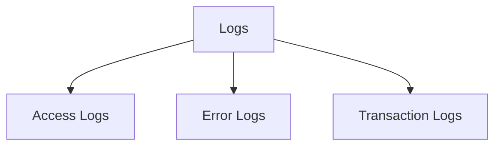

#### Reports

Reports are generated by various monitoring and auditing tools, summarizing compliance status, vulnerabilities, and incidents.

- **Security Audit Reports**: Summarize findings from security audits, highlighting strengths and areas for improvement.
- **Vulnerability Assessment Reports**: Identify and assess vulnerabilities within the system.
- **Compliance Status Reports**: Provide an overview of the organization’s compliance status, indicating whether it meets regulatory requirements.

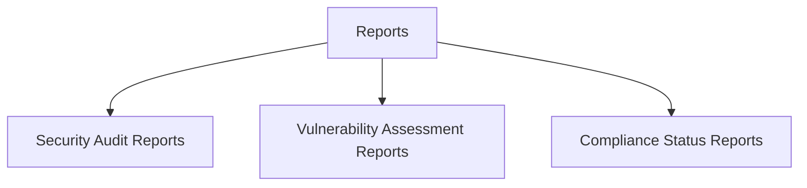

#### Documentation

Documentation includes written materials that outline the organization’s compliance practices.

- **Policies**: High-level documents outlining the organization's approach to compliance.
- **Procedures**: Step-by-step instructions for implementing compliance controls.
- **Training Materials**: Resources used to educate employees on compliance requirements and best practices.

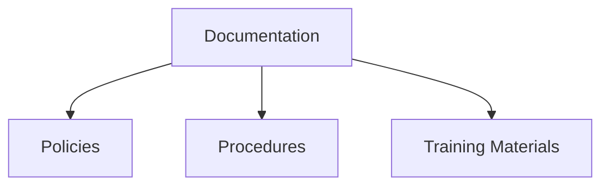

### Techniques for Collecting and Preserving Evidence

Collecting and preserving evidence involves systematic processes to ensure that the evidence remains reliable and accessible. Key techniques include:

#### Automated Logging

Automated logging systems continuously capture and store system activities, ensuring logs are comprehensive and tamper-proof.

- **Continuous Capture**: Logs are automatically generated and stored in real-time, ensuring no activity goes unrecorded.
- **Tamper-Proof Storage**: Logs are stored securely to prevent unauthorized modifications, ensuring the integrity of the data.

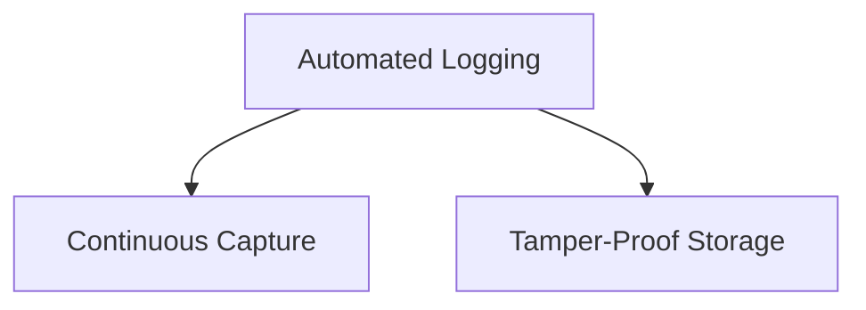

#### Regular Backups

Regularly backing up logs, reports, and documentation prevents data loss. Backups should be stored securely and checked periodically for integrity.

- **Secure Storage**: Backups are stored in secure locations, either on-site or in the cloud, protecting them from physical and digital threats.
- **Integrity Checks**: Regular checks are performed to ensure backup data remains accurate and uncorrupted.

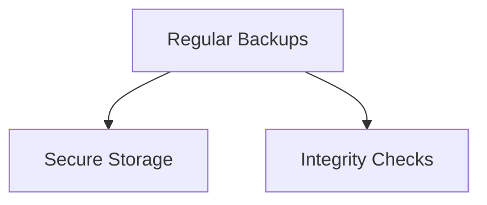

#### Access Controls

Implementing strict access controls ensures that only authorized personnel can view or modify evidence, maintaining the integrity and confidentiality of the evidence.

- **Authorized Access**: Access to evidence is restricted to personnel with appropriate permissions, preventing unauthorized access.
- **Confidentiality**: Measures are in place to protect the confidentiality of sensitive evidence, ensuring it is not disclosed to unauthorized parties.

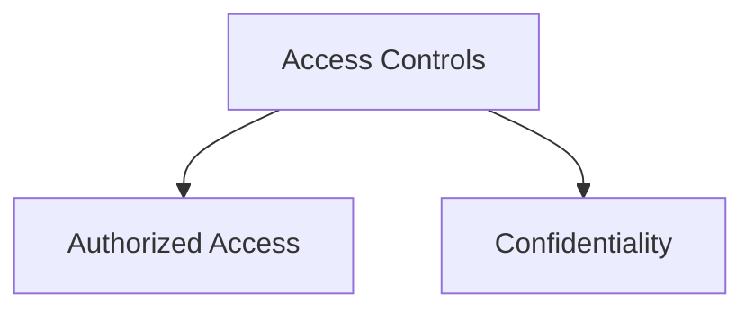

#### Chain of Custody

Establishing a chain of custody documents the handling of evidence from collection to presentation. This includes logging who accessed the evidence and when, ensuring accountability.

- **Documentation**: Detailed records of who accessed the evidence and when, providing a clear audit trail.
- **Accountability**: Ensuring all actions related to evidence handling are logged and traceable, holding individuals accountable for their actions.

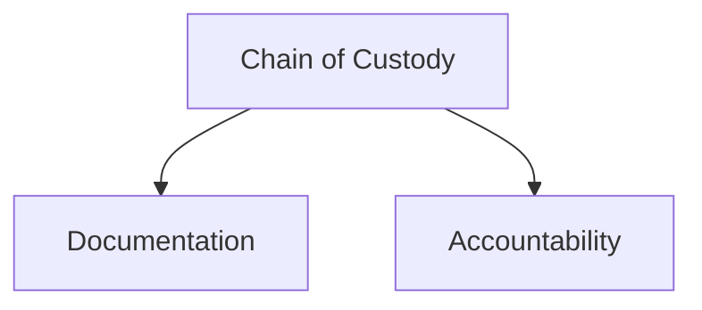

## Human Attestation vs. Machine Attestation

### Understanding Human Attestation of Evidence

Human attestation involves individuals reviewing and certifying that compliance controls are in place and functioning. This can take several forms:

#### Signed Attestations

Documents signed by responsible individuals confirming that specific controls have been implemented and are operational.

- **Responsible Individuals**: Those in charge of implementing and overseeing compliance controls.
- **Confirmation of Controls**: Formal acknowledgment that specific controls are in place and effective.

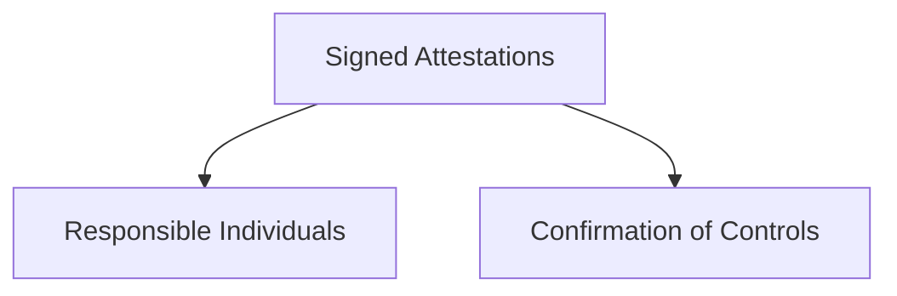

#### Reviews

Periodic reviews conducted by compliance officers or auditors to verify the effectiveness of controls. These reviews may include interviews, observations, and examination of documentation.

- **Periodic Reviews**: Regularly scheduled assessments to ensure ongoing compliance.
- **Interviews**: Conversations with employees to gauge their understanding and adherence to compliance practices.
- **Observations**: Direct observation of processes and controls in action.
- **Documentation Examination**: Reviewing compliance documents to verify their accuracy and completeness.

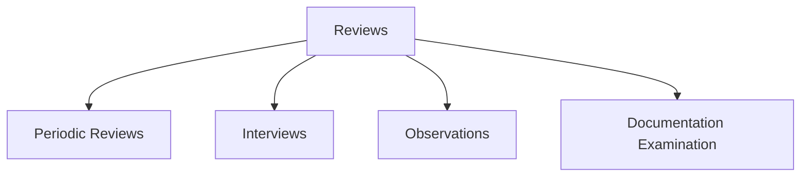

### Role of Human Judgment and Expertise

Human judgment is critical in interpreting complex situations and making nuanced decisions. For example, a compliance officer might review access logs and use their experience to identify suspicious activity that automated systems might miss. Human expertise adds a layer of scrutiny that can be particularly valuable in ambiguous or context-sensitive scenarios.

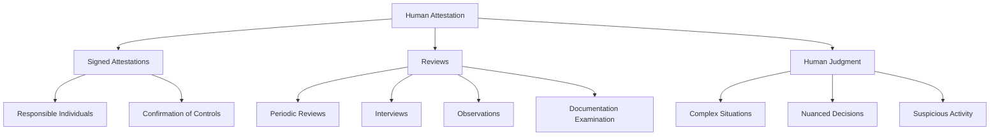

### Machine Attestation Methods

Machine attestation involves using automated tools to generate and verify compliance evidence. This includes:

#### Automated Logging

Systems that automatically log and store data on system activities, ensuring logs are complete and tamper-proof.

- **Continuous Logging**: Logs are continuously generated and stored, providing an uninterrupted record of activities.
- **Tamper-Proof Storage**: Logs are stored securely to prevent tampering, ensuring data integrity.

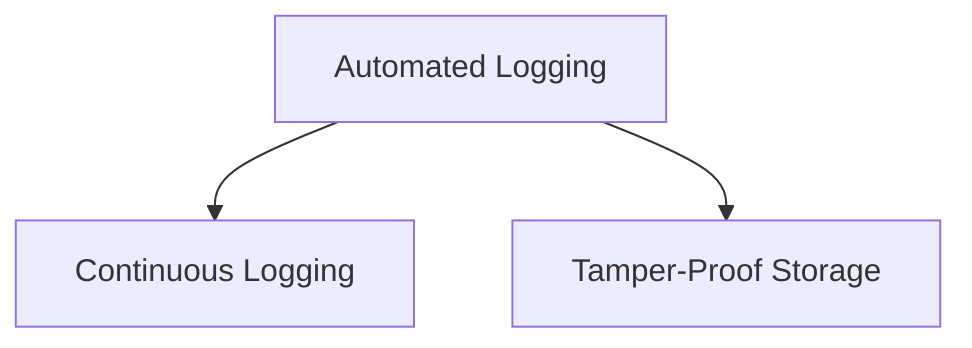

#### Monitoring Tools

Tools that continuously monitor systems for compliance with established controls and generate alerts when issues are detected.

- **Real-Time Monitoring**: Continuous tracking of system activities to identify compliance issues as they occur.
- **Alerts**: Automatic notifications when potential compliance issues are detected, enabling prompt response.

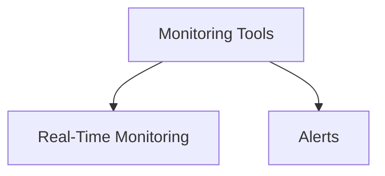

### Benefits and Challenges of Machine-Generated Evidence

**Benefits**:
- **Consistency**: Machine-generated evidence is consistent and free from human error, ensuring reliability.
- **Efficiency**: Automated systems can process and analyze large volumes of data more quickly than humans, increasing operational efficiency.
- **Real-Time Monitoring**: Continuous monitoring tools provide real-time insights into compliance status, allowing for prompt detection and response to issues.

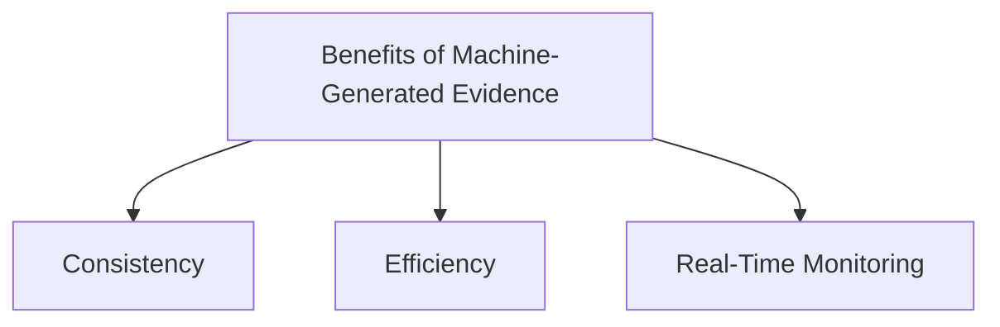

**Challenges**:
- **Lack of Context**: Automated systems may lack the context needed to interpret complex situations accurately, potentially leading to false positives or missed issues.
- **Initial Setup**: Implementing and configuring automated systems can be resource-intensive, requiring significant investment in time and technology.
- **Dependence on Technology**: Over-reliance on automated systems can be problematic if the systems fail or are compromised, necessitating robust backup and recovery plans.

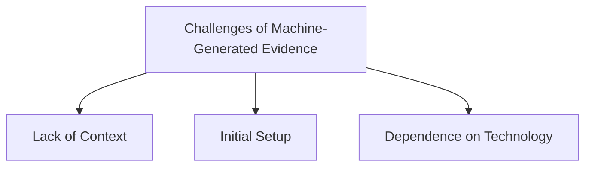

## Documenting Compliance

### Importance of Accurate and Comprehensive Documentation

Accurate and comprehensive documentation is essential for demonstrating compliance and supporting audits. Key reasons include:

- **Proof of Compliance**: Documentation provides tangible evidence that compliance controls are in place and functioning.
- **Audit Support**: Well-maintained documentation simplifies the audit process by providing auditors with clear and detailed records.
- **Training and Awareness**: Documentation serves as a reference for training employees on compliance requirements and best practices.

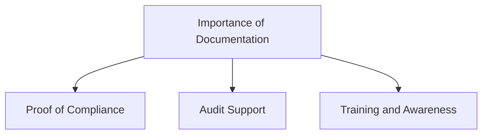

### Tools and Systems for Managing Compliance Documentation

Managing compliance documentation effectively requires specialized tools and systems. These include:

#### Document Management Systems (DMS)

Tools that provide centralized storage, version control, and access management for compliance documents.

- **Centralized Storage**: All compliance documents are stored in a single, organized location, making them easy to access and manage.
- **Version Control**: Ensures that all document revisions are tracked and the latest versions are accessible.
- **Access Management**: Controls who can view or edit documents, protecting sensitive information from unauthorized access.

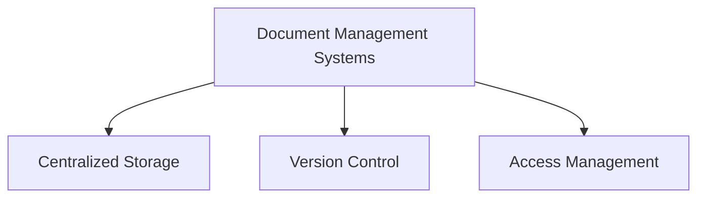

#### Compliance Management Platforms

Integrated platforms that offer features for tracking compliance activities, managing documentation, and generating reports.

- **Tracking Compliance Activities**: Monitoring and recording compliance-related activities to ensure ongoing adherence to regulatory requirements.
- **Managing Documentation**: Organizing and maintaining compliance documents in a structured and accessible manner.
- **Generating Reports**: Creating reports to summarize compliance status and activities, providing insights for management and auditors.

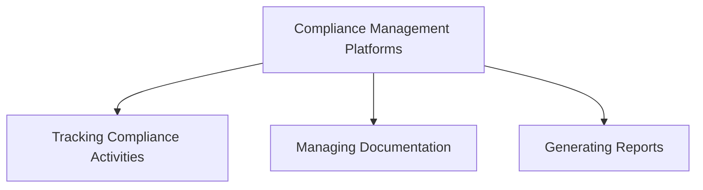

#### Collaboration Tools

Tools that facilitate collaboration and communication among compliance teams, ensuring that everyone has access to the latest information.

- **Facilitating Collaboration**: Enabling team members to work together effectively, share information, and coordinate compliance efforts.
- **Ensuring Access to Information**: Providing all team members with the information they need to perform their duties, regardless of location.

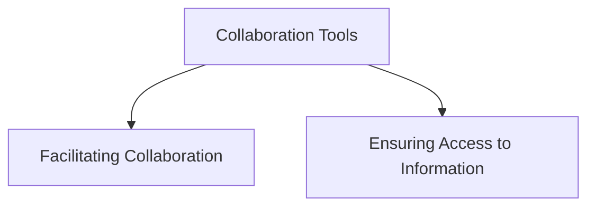

### Ensuring Traceability and Accountability Through Documentation Practices

To maintain traceability and accountability, organizations should adopt the following documentation practices:

#### Version Control

Keep track of changes to documents, ensuring that all revisions are recorded and that the latest versions are used.

- **Tracking Changes**: Recording all changes made to documents, providing a clear history of revisions.
- **Using Latest Versions**: Ensuring that the most current documents are used in compliance activities, reducing the risk of outdated information.

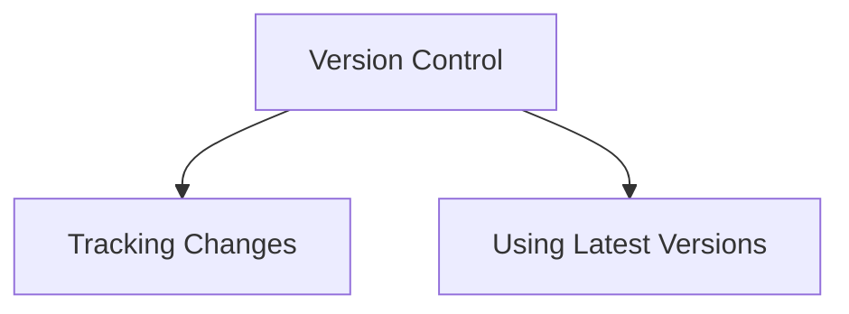

#### Access Controls

Restrict access to sensitive documentation to authorized personnel only, protecting the integrity and confidentiality of the information.

- **Authorized Access**: Limiting access to those with appropriate permissions, preventing unauthorized individuals from viewing or altering documents.
- **Protecting Integrity**: Ensuring that documents are not altered without authorization, maintaining their accuracy and reliability.

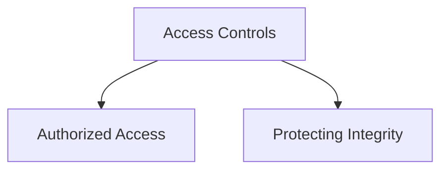

#### Audit Trails

Maintain audit trails that record who accessed or modified documents and when, ensuring accountability.

- **Recording Access**: Documenting all instances of document access, providing a clear record of who viewed or modified the documents.
- **Ensuring Accountability**: Holding individuals accountable for their actions by maintaining detailed records of document interactions.

```mermaid
graph TD;
    A[Audit Trails] --> B[Recording Access]
    A --> C[Ensuring Accountability]
```

## Evidence Management Lifecycle

Effective management of compliance evidence involves understanding its lifecycle, from collection to storage, analysis, and presentation. Each stage requires careful attention to ensure that evidence remains accurate, secure, and accessible.

### Collection

Collecting evidence is the first step in the evidence management lifecycle. Techniques include:

- **Automated Tools**: Use of automated tools to collect data continuously, ensuring comprehensive and consistent evidence collection.
- **Manual Collection**: Manual collection methods, such as interviews and observations, which provide valuable qualitative data.

```mermaid
graph TD;
    A[Collection] --> B[Automated Tools]
    A --> C[Manual Collection]
```

### Storage

Secure storage solutions are crucial for preserving the integrity and confidentiality of evidence.

- **Secure Storage Solutions**: Implementing secure storage solutions that protect evidence from unauthorized access and tampering.
- **Cloud vs. On-Premises**: Considering the benefits and drawbacks of cloud-based storage versus on-premises storage, including factors like accessibility, scalability, and security.

```mermaid
graph TD;
    A[Storage] --> B[Secure Storage Solutions]
    A --> C[Cloud vs. On-Premises]
```

### Analysis

Analyzing evidence helps in identifying compliance issues and ensuring that controls are effective.

- **Analysis Tools**: Utilizing tools and techniques for analyzing compliance evidence, such as data analytics and forensic tools.
- **Real-Time vs. Periodic Analysis**: Balancing the need for real-time analysis with periodic reviews to ensure ongoing compliance.

```mermaid
graph TD;
    A[Analysis] --> B[Analysis Tools]
    A --> C[Real-Time vs. Periodic Analysis]
```

### Presentation

Preparing evidence for audits and presenting findings in a clear, concise manner is essential for demonstrating compliance.

- **Preparing for Audits**: Organizing and preparing evidence for presentation during audits, ensuring that it meets regulatory standards.
- **Reports and Dashboards**: Creating comprehensive reports and dashboards that summarize compliance status and highlight key findings.

```mermaid
graph TD;
    A[Presentation] --> B[Preparing for Audits]
    A --> C[Reports and Dashboards]
```

## Advanced Techniques for Collecting and Preserving Evidence

### Immutable Logs

Using advanced technologies like blockchain to create immutable logs ensures that evidence cannot be tampered with, providing a secure and trustworthy record.

- **Blockchain Technology**: Leveraging blockchain to maintain a tamper-proof log of activities, enhancing the security and reliability of evidence.
- **Ensuring Log Integrity**: Techniques to ensure that logs remain intact and unaltered, providing a trustworthy record of events.

```mermaid
graph TD;
    A[Immutable Logs] --> B[Blockchain Technology]
    A --> C[Ensuring Log Integrity]
```

### Forensic Readiness

Preparing systems and processes for forensic analysis ensures that evidence can be quickly and effectively gathered during incidents.

- **Forensic Tools**: Utilizing forensic tools to collect and analyze evidence from compromised systems.
- **Incident Procedures**: Establishing procedures for evidence collection during incidents, ensuring that evidence is handled correctly and remains admissible.

```mermaid
graph TD;
    A[Forensic Readiness] --> B[Forensic Tools]
    A --> C[Incident Procedures]
```

