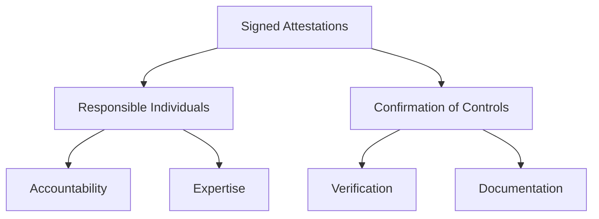
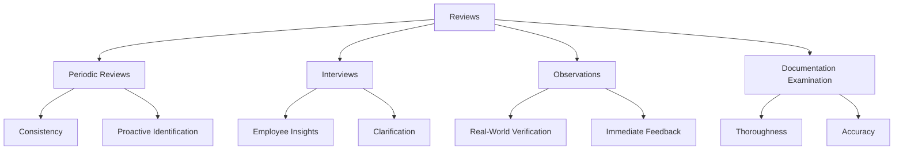
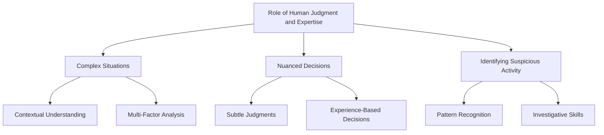
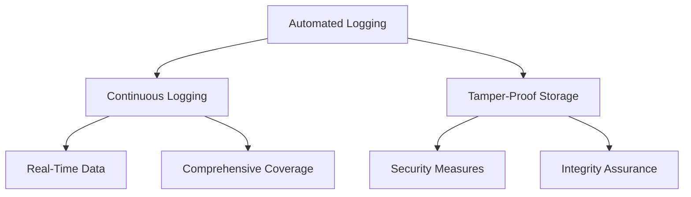
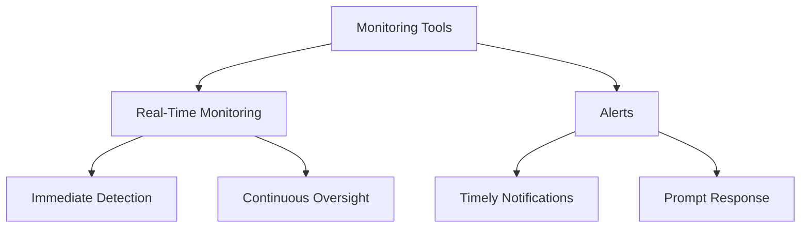
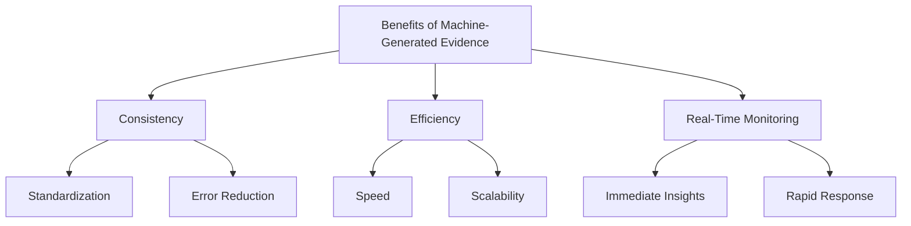
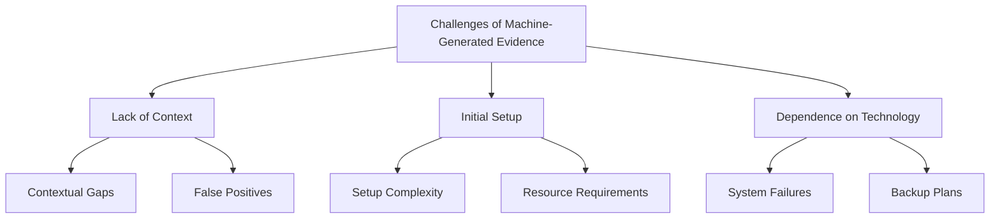

## Understanding Human Attestation of Evidence

Human attestation involves individuals verifying and certifying that compliance controls are in place and functioning effectively. This verification can take various forms, each with its own advantages and considerations.

### Signed Attestations

#### Responsible Individuals
Signed attestations are documents signed by individuals who are responsible for implementing and overseeing compliance controls. These individuals are often subject matter experts or senior staff who have a thorough understanding of the controls and their implementation.

- **Accountability:** The signatures provide a clear line of accountability, indicating who is responsible for the controls.
- **Expertise:** Responsible individuals bring their expertise to bear, ensuring that controls are accurately assessed and reported.

#### Confirmation of Controls
Signed attestations confirm that specific controls are in place and operational. This formal acknowledgment is essential for audits and regulatory reviews.

- **Verification:** The act of signing confirms that the controls have been verified and are functioning as intended.
- **Documentation:** These documents serve as official records of compliance, useful for both internal reviews and external audits.

### Reviews

Reviews involve a thorough assessment of compliance controls by compliance officers or auditors. This process can include several methods to ensure a comprehensive evaluation.

#### Periodic Reviews
Regularly scheduled reviews help maintain ongoing compliance and identify any emerging issues.

- **Consistency:** Periodic reviews ensure that controls are consistently applied and maintained.
- **Proactive Identification:** They help in identifying potential issues before they become significant problems.

#### Interviews
Interviews with employees provide insights into the practical application of compliance controls and uncover any gaps in understanding or implementation.

- **Employee Insights:** Interviews can reveal practical issues that might not be evident through documentation alone.
- **Clarification:** They offer an opportunity to clarify any misunderstandings about compliance requirements.

#### Observations
Direct observation of processes and controls in action helps verify that they are being followed correctly.

- **Real-World Verification:** Observations ensure that documented procedures are actually being followed in practice.
- **Immediate Feedback:** Observers can provide immediate feedback and suggestions for improvement.

#### Documentation Examination
Examining compliance documentation ensures that it is complete, accurate, and up-to-date.

- **Thoroughness:** Documentation reviews ensure that all necessary records are maintained.
- **Accuracy:** They help verify the accuracy and completeness of compliance documentation.

## Role of Human Judgment and Expertise

Human judgment and expertise play a critical role in verifying compliance evidence. Unlike automated systems, humans can interpret complex situations, make nuanced decisions, and identify subtleties that machines might miss.

### Complex Situations
Humans are better equipped to handle complex scenarios that require a deep understanding of context and multiple factors.

- **Contextual Understanding:** Human reviewers can consider the broader context in which controls operate.
- **Multi-Factor Analysis:** They can analyze multiple factors simultaneously, providing a comprehensive assessment.

### Nuanced Decisions
Human expertise allows for nuanced decisions that take into account the subtleties of compliance requirements and organizational practices.

- **Subtle Judgments:** Humans can make subtle judgments that are beyond the capabilities of automated systems.
- **Experience-Based Decisions:** Decisions are informed by experience and expertise, leading to more accurate assessments.

### Identifying Suspicious Activity
Human reviewers can identify suspicious activity that automated systems might overlook.

- **Pattern Recognition:** Experienced reviewers can recognize patterns that indicate potential issues.
- **Investigative Skills:** They can investigate further to confirm suspicions and take appropriate actions.

## Machine Attestation Methods

Machine attestation involves using automated tools and systems to generate and verify compliance evidence. This approach leverages technology to provide consistent and efficient compliance verification.

### Automated Logging

Automated logging systems capture and store data on system activities, ensuring logs are comprehensive and tamper-proof.

#### Continuous Logging 
Logs are generated continuously, providing a real-time record of activities.

- **Real-Time Data:** Continuous logging ensures that all activities are recorded as they happen.
- **Comprehensive Coverage:** Logs cover all relevant activities, providing a complete picture of system operations.

#### Tamper-Proof Storage
Logs are stored securely to prevent unauthorized modifications, ensuring data integrity.

- **Security Measures:** Logs are protected by security measures such as encryption and access controls.
- **Integrity Assurance:** Tamper-proof storage ensures that logs remain accurate and trustworthy.

### Monitoring Tools

Monitoring tools continuously monitor systems for compliance with established controls and generate alerts when issues are detected.

#### Real-Time Monitoring
Monitoring tools provide real-time insights into system activities and compliance status.

- **Immediate Detection:** Real-time monitoring ensures that compliance issues are detected immediately.
- **Continuous Oversight:** Systems are continuously monitored, reducing the risk of undetected issues.

#### Alerts
Automated alerts notify relevant personnel of potential compliance issues, enabling prompt response.

- **Timely Notifications:** Alerts provide timely notifications of potential issues.
- **Prompt Response:** Automated alerts enable quick response to compliance breaches, minimizing impact.

## Benefits and Challenges of Machine-Generated Evidence

### Benefits

#### Consistency
Machine-generated evidence is consistent and free from human error, ensuring reliability.

- **Standardization:** Automated systems apply the same standards consistently.
- **Error Reduction:** Eliminates the risk of human error, ensuring more reliable evidence.

#### Efficiency
Automated systems can process and analyze large volumes of data more quickly than humans, increasing operational efficiency.

- **Speed:** Automated systems can perform tasks faster than manual processes.
- **Scalability:** Systems can handle large volumes of data without compromising performance.

#### Real-Time Monitoring
Continuous monitoring tools provide real-time insights into compliance status, allowing for prompt detection and response to issues.

- **Immediate Insights:** Real-time data provides immediate insights into compliance status.
- **Rapid Response:** Enables quick identification and resolution of compliance issues.

### Challenges

#### Lack of Context
Automated systems may lack the context needed to interpret complex situations accurately, potentially leading to false positives or missed issues.

- **Contextual Gaps:** Systems may not understand the broader context of activities.
- **False Positives:** Lack of context can result in incorrect alerts or missed issues.

#### Initial Setup
Implementing and configuring automated systems can be resource-intensive, requiring significant investment in time and technology.

- **Setup Complexity:** Initial setup and configuration can be complex and time-consuming.
- **Resource Requirements:** Requires significant investment in technology and expertise.

#### Dependence on Technology
Over-reliance on automated systems can be problematic if the systems fail or are compromised, necessitating robust backup and recovery plans.

- **System Failures:** Dependence on technology increases vulnerability to system failures.
- **Backup Plans:** Requires robust backup and recovery plans to mitigate risks.

