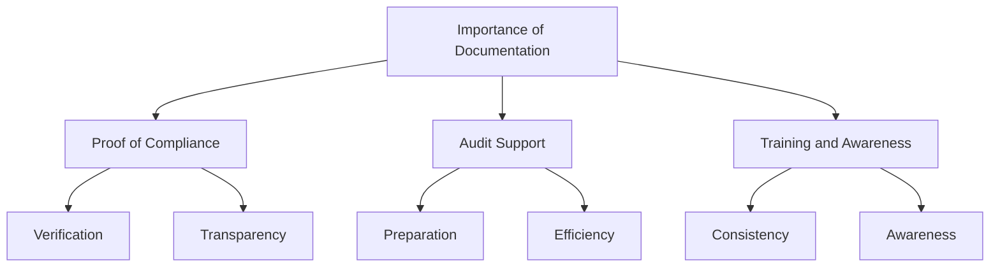
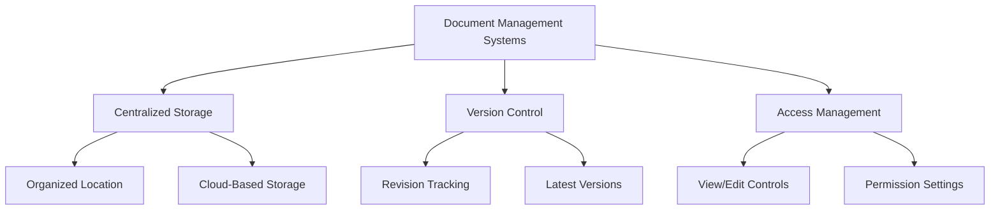
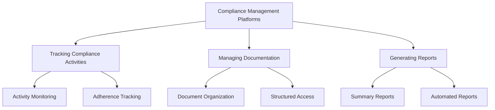
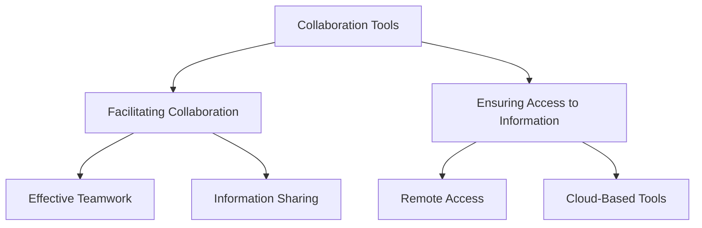
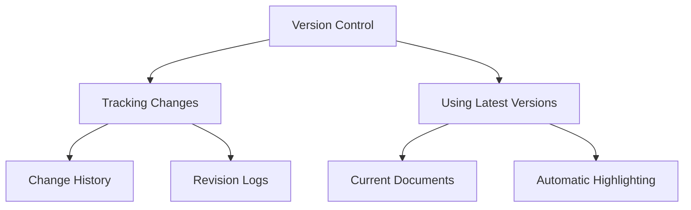
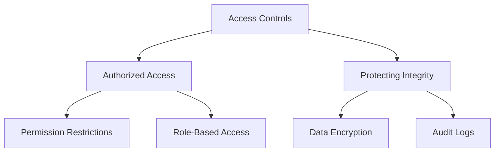
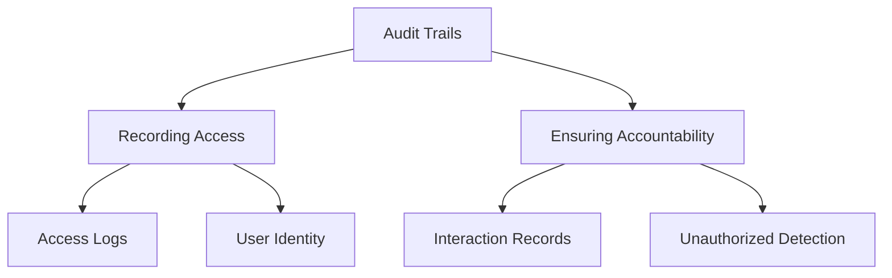

## Importance of Accurate and Comprehensive Documentation

Accurate and comprehensive documentation is essential for demonstrating compliance and supporting audits. It ensures that all compliance activities are traceable, verifiable, and auditable. Here's why it's important:

### Proof of Compliance

Documentation provides tangible evidence that compliance controls are in place and functioning effectively.

- **Verification:** Auditors and regulatory bodies require documented proof that controls are implemented and maintained.
- **Transparency:** Detailed records provide transparency into compliance activities, showing that the organization is committed to following regulations.

### Audit Support

Comprehensive documentation simplifies the audit process by providing auditors with clear and detailed records.

- **Preparation:** Well-organized documentation helps prepare for audits, ensuring that all necessary information is readily available.
- **Efficiency:** Reduces the time and effort required during audits, as auditors can quickly verify compliance through existing records.

### Training and Awareness

Documentation serves as a reference for training employees on compliance requirements and best practices.

- **Consistency:** Ensures that all employees receive consistent information about compliance procedures.
- **Awareness:** Helps build awareness of compliance responsibilities and the importance of following established procedures.

## Tools and Systems for Managing Compliance Documentation

Managing compliance documentation effectively requires specialized tools and systems. These tools help organize, store, and manage documents, ensuring they are accessible and secure.

### Document Management Systems (DMS)

Document Management Systems (DMS) provide centralized storage, version control, and access management for compliance documents.

- **Centralized Storage:**
  - All compliance documents are stored in a single, organized location, making them easy to access and manage.
  - Example: A cloud-based DMS that allows all compliance documents to be stored and accessed from anywhere.

- **Version Control:**
  - Ensures that all document revisions are tracked and the latest versions are accessible.
  - Example: A DMS that tracks changes to documents, allowing users to view previous versions and see who made changes.

- **Access Management:**
  - Controls who can view or edit documents, protecting sensitive information from unauthorized access.
  - Example: Setting permissions in the DMS to restrict access to certain documents to authorized personnel only.

### Compliance Management Platforms

Compliance Management Platforms offer integrated features for tracking compliance activities, managing documentation, and generating reports.

- **Tracking Compliance Activities:**
  - Monitoring and recording compliance-related activities to ensure ongoing adherence to regulatory requirements.
  - Example: A platform that tracks training sessions, policy updates, and compliance audits.

- **Managing Documentation:**
  - Organizing and maintaining compliance documents in a structured and accessible manner.
  - Example: A system that categorizes documents by type, date, and regulatory requirement.

- **Generating Reports:**
  - Creating reports to summarize compliance status and activities, providing insights for management and auditors.
  - Example: Automated report generation that compiles data from various compliance activities into comprehensive summaries.

### Collaboration Tools

Collaboration tools facilitate communication and teamwork among compliance teams, ensuring everyone has access to the latest information.

- **Facilitating Collaboration:**
  - Enabling team members to work together effectively, share information, and coordinate compliance efforts.
  - Example: Using collaboration platforms like Microsoft Teams or Slack to discuss compliance issues and share documents.

- **Ensuring Access to Information:**
  - Providing all team members with the information they need to perform their duties, regardless of location.
  - Example: Cloud-based collaboration tools that allow remote access to compliance documents and discussions.

## Ensuring Traceability and Accountability Through Documentation Practices

Traceability and accountability are critical in compliance management. Proper documentation practices help achieve these goals by maintaining detailed records of all compliance activities.

### Version Control

Version control ensures that all changes to documents are tracked, providing a clear history of revisions.

- **Tracking Changes:**
  - Recording all changes made to documents, providing a clear history of revisions.
  - Example: A version control system that logs who made changes, what changes were made, and when.

- **Using Latest Versions:**
  - Ensuring that the most current documents are used in compliance activities, reducing the risk of outdated information.
  - Example: Automatically highlighting the latest version of a document for users.

### Access Controls

Implementing strict access controls ensures that only authorized personnel can view or modify compliance documentation.

- **Authorized Access:**
  - Limiting access to those with appropriate permissions, preventing unauthorized individuals from viewing or altering documents.
  - Example: Setting role-based access controls in a DMS to restrict document access.

- **Protecting Integrity:**
  - Ensuring that documents are not altered without authorization, maintaining their accuracy and reliability.
  - Example: Using encryption and audit logs to protect document integrity.

### Audit Trails

Maintaining audit trails that record who accessed or modified documents and when, ensuring accountability.

- **Recording Access:**
  - Documenting all instances of document access, providing a clear record of who viewed or modified the documents.
  - Example: An audit trail that logs each access to a compliance document, including user identity and time.

- **Ensuring Accountability:**
  - Holding individuals accountable for their actions by maintaining detailed records of document interactions.
  - Example: Using audit trails to track changes and access, ensuring that any unauthorized activities are detected and addressed.

