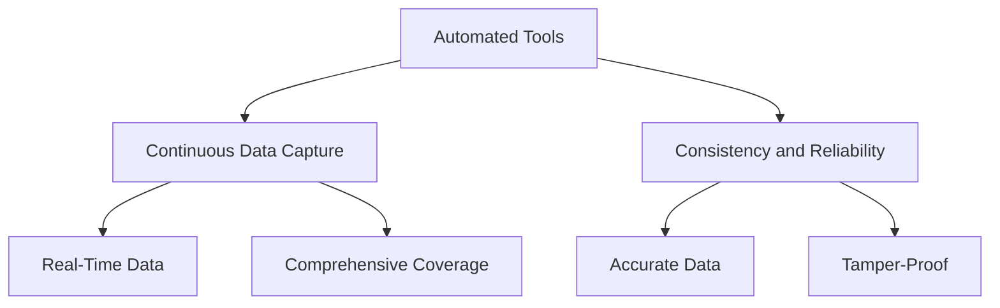
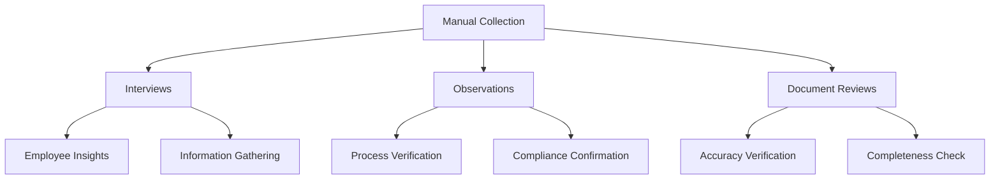
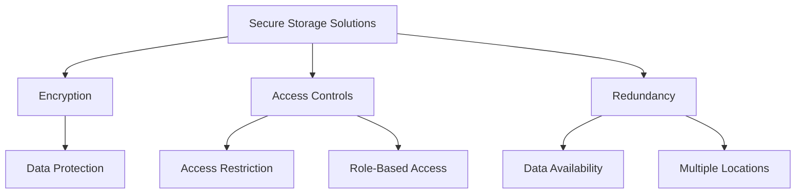
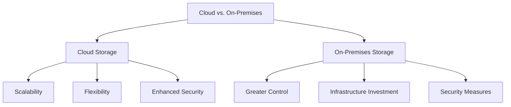
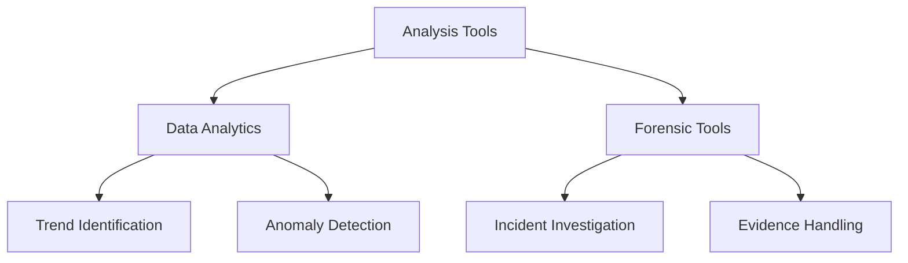
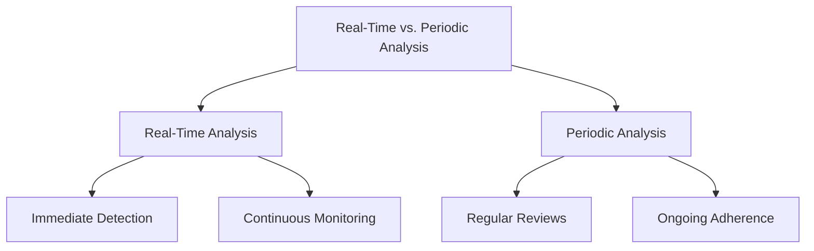
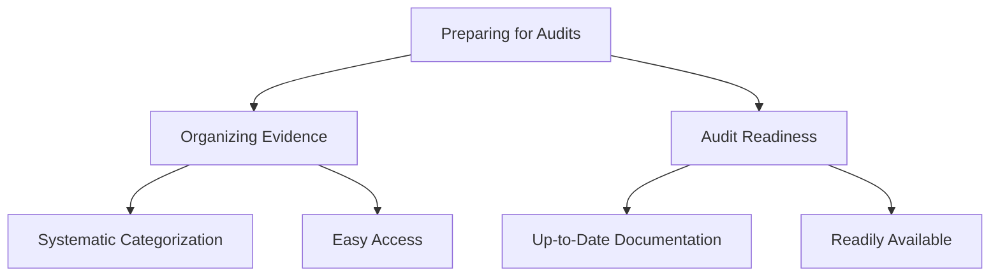
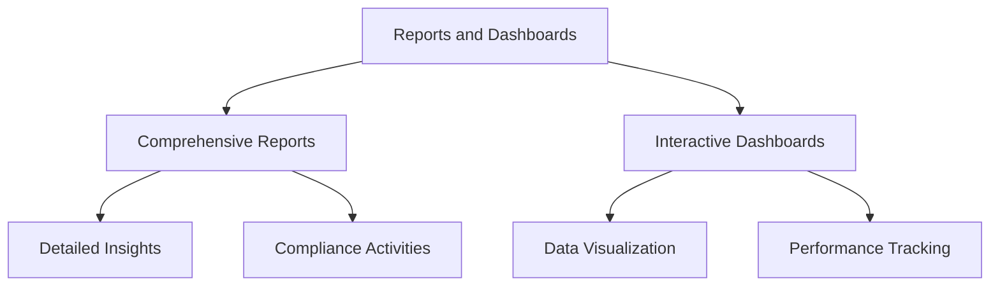

## Introduction
Effective management of compliance evidence involves understanding its lifecycle, from collection to storage, analysis, and presentation. Each stage requires careful attention to ensure that evidence remains accurate, secure, and accessible.

### Collection

Evidence collection is the first step in the evidence management lifecycle. It involves gathering all necessary data to demonstrate compliance with regulatory requirements. There are two primary methods of evidence collection: automated tools and manual collection.

#### Automated Tools

Automated tools play a crucial role in collecting evidence efficiently and consistently. These tools continuously gather data, ensuring comprehensive coverage and reducing the risk of human error.

- **Continuous Data Capture:**
  - Automated tools capture data in real-time, ensuring that all relevant activities are recorded.
  - Example: Security Information and Event Management (SIEM) systems that collect and analyze security event data from various sources.

- **Consistency and Reliability:**
  - Automated tools provide consistent and reliable data collection, ensuring that evidence is accurate and tamper-proof.
  - Example: Automated logging systems that record access logs, transaction logs, and error logs.

#### Manual Collection

Manual collection involves human effort to gather evidence through various methods. This approach is often used to collect qualitative data that automated tools cannot capture.

- **Interviews:**
  - Conducting interviews with employees to gather insights and information about compliance practices.
  - Example: Interviewing IT staff to understand the implementation of access controls.

- **Observations:**
  - Directly observing processes and controls in action to verify compliance.
  - Example: Observing a data backup process to ensure it follows documented procedures.

- **Document Reviews:**
  - Reviewing existing documentation to verify its accuracy and completeness.
  - Example: Examining training materials to ensure they cover all necessary compliance topics.

### Storage

Secure storage solutions are critical for preserving the integrity and confidentiality of evidence. Proper storage ensures that evidence remains accessible and protected from unauthorized access or tampering.

#### Secure Storage Solutions

Implementing secure storage solutions is essential for protecting evidence from physical and digital threats.

- **Encryption:**
  - Encrypting stored data to protect it from unauthorized access.
  - Example: Using AES-256 encryption for storing compliance logs and documents.

- **Access Controls:**
  - Implementing access controls to restrict who can view or modify stored evidence.
  - Example: Setting up role-based access controls to limit access to sensitive compliance data.

- **Redundancy:**
  - Using redundant storage solutions to prevent data loss due to hardware failures or other issues.
  - Example: Storing backups in multiple locations to ensure data availability.

#### Cloud vs. On-Premises

Choosing between cloud and on-premises storage involves considering various factors, including security, scalability, and cost.

- **Cloud Storage:**
  - Cloud storage solutions offer scalability, flexibility, and often enhanced security features.
  - Example: Using a cloud service provider that complies with industry standards such as ISO 27001 or SOC 2.

- **On-Premises Storage:**
  - On-premises storage solutions provide greater control over data but may require significant investment in infrastructure and security measures.
  - Example: Setting up a secure on-site data center with physical and digital security controls.

### Analysis

Analyzing evidence helps in identifying compliance issues and ensuring that controls are effective. This stage involves using various tools and techniques to interpret collected data and draw meaningful insights.

#### Analysis Tools

Utilizing analysis tools is essential for examining compliance evidence thoroughly and accurately.

- **Data Analytics:**
  - Applying data analytics techniques to identify trends, patterns, and anomalies in compliance data.
  - Example: Using statistical analysis to detect unusual patterns in access logs.

- **Forensic Tools:**
  - Employing forensic tools to investigate security incidents and ensure that evidence is handled correctly.
  - Example: Using digital forensics software to analyze data breaches and trace their origins.

#### Real-Time vs. Periodic Analysis

Balancing the need for real-time analysis with periodic reviews ensures ongoing compliance and timely identification of issues.

- **Real-Time Analysis:**
  - Continuous monitoring and analysis of compliance data to detect and address issues immediately.
  - Example: Real-time monitoring of network traffic for signs of unauthorized access.

- **Periodic Analysis:**
  - Conducting regular reviews and audits of compliance data to ensure ongoing adherence to regulations.
  - Example: Quarterly audits of compliance documentation and controls.

### Presentation

Preparing evidence for audits and presenting findings in a clear, concise manner is essential for demonstrating compliance.

#### Preparing for Audits

Organizing and preparing evidence for presentation during audits ensures that it meets regulatory standards.

- **Organizing Evidence:**
  - Categorizing and compiling evidence systematically to facilitate easy access during audits.
  - Example: Creating a structured folder system for storing audit-related documents.

- **Audit Readiness:**
  - Ensuring that all necessary documentation and evidence are up-to-date and readily available.
  - Example: Regularly updating compliance logs and reports to reflect the latest activities.

#### Reports and Dashboards

Creating comprehensive reports and dashboards that summarize compliance status and highlight key findings is crucial for effective communication.

- **Comprehensive Reports:**
  - Generating detailed reports that provide insights into compliance activities and outcomes.
  - Example: A compliance status report summarizing audit findings, risk assessments, and remediation efforts.

- **Interactive Dashboards:**
  - Using interactive dashboards to visualize compliance data and track key performance indicators.
  - Example: A dashboard displaying real-time compliance metrics, such as the number of open audit findings and resolved issues.

