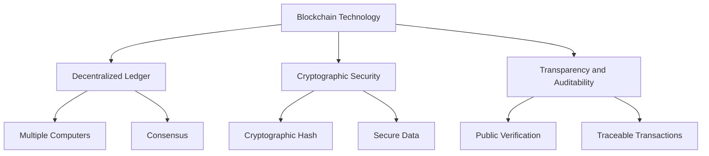
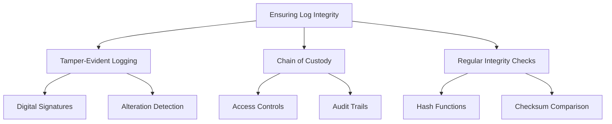
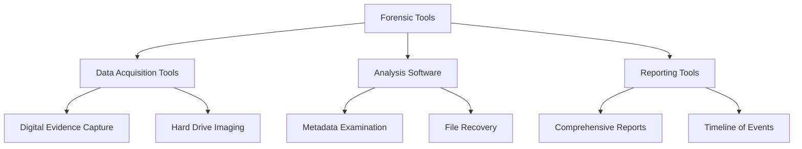
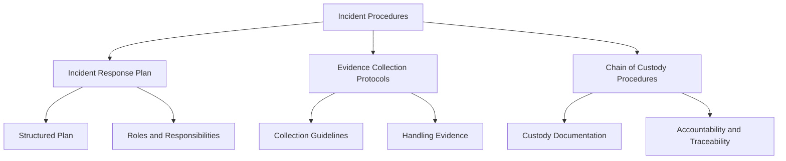

## Introduction

In the ever-evolving landscape of compliance and security, traditional methods of collecting and preserving evidence are often augmented by advanced techniques. These techniques not only enhance the integrity and reliability of evidence but also ensure that organizations are better prepared to respond to incidents and audits.

### Immutable Logs

Immutable logs are a critical component in ensuring that the data collected for compliance purposes cannot be tampered with or altered. This enhances the reliability and trustworthiness of the evidence.

#### Blockchain Technology

Blockchain technology provides a robust solution for creating immutable logs. By leveraging the decentralized and cryptographic nature of blockchain, organizations can ensure that once data is recorded, it cannot be changed.

- **Decentralized Ledger:**
  - A blockchain is a decentralized ledger that records transactions across multiple computers. This decentralization ensures that no single entity can alter the records without consensus.
  - Example: Using blockchain to record access logs, where each entry is added as a block and linked to the previous block, forming a chain that is resistant to tampering.

- **Cryptographic Security:**
  - Blockchain employs cryptographic techniques to secure data. Each block contains a cryptographic hash of the previous block, transaction data, and a timestamp.
  - Example: Encrypting each log entry before adding it to the blockchain ensures that the data is both secure and verifiable.

- **Transparency and Auditability:**
  - The transparency of blockchain allows for easy auditing, as all transactions are publicly verifiable and traceable.
  - Example: Auditors can independently verify the integrity of logs by examining the blockchain, ensuring that all entries are accurate and unaltered.

#### Ensuring Log Integrity

Ensuring the integrity of logs is paramount in maintaining trust in the data used for compliance purposes. Immutable logs, supported by advanced technologies, provide a solution to this challenge.

- **Tamper-Evident Logging:**
  - Logs are designed to be tamper-evident, meaning any attempt to alter the data will be detectable.
  - Example: Using digital signatures to sign log entries, where any alteration will invalidate the signature.

- **Chain of Custody:**
  - Maintaining a chain of custody for logs ensures that all access and modifications are tracked and documented.
  - Example: Implementing access controls and audit trails to monitor who accessed the logs and when, ensuring accountability.

- **Regular Integrity Checks:**
  - Performing regular integrity checks to verify that logs have not been altered.
  - Example: Using hash functions to generate and compare checksums of log files at regular intervals.

### Forensic Readiness

Forensic readiness involves preparing systems and processes in advance to facilitate efficient and effective forensic investigations. This ensures that evidence is collected, preserved, and analyzed correctly in the event of an incident.

#### Forensic Tools

Forensic tools are essential for collecting and analyzing digital evidence. These tools help investigators uncover, preserve, and document evidence in a manner that is admissible in court or regulatory reviews.

- **Data Acquisition Tools:**
  - Tools that capture and preserve digital evidence from various sources, such as hard drives, network logs, and cloud services.
  - Example: Using tools like EnCase or FTK Imager to create forensic images of hard drives, ensuring that all data is captured without alteration.

- **Analysis Software:**
  - Software that helps analyze the collected data to uncover hidden information, patterns, and anomalies.
  - Example: Using forensic analysis tools like Autopsy or X-Ways Forensics to examine file metadata, recover deleted files, and identify suspicious activities.

- **Reporting Tools:**
  - Tools that generate comprehensive reports detailing the findings of forensic investigations.
  - Example: Generating a detailed report that includes a timeline of events, identified vulnerabilities, and recommended remediation steps.

#### Incident Procedures

Having well-defined incident procedures ensures that evidence is collected and preserved correctly during an incident, maintaining its integrity and admissibility.

- **Incident Response Plan:**
  - A structured plan outlining the steps to be taken during an incident to ensure a swift and effective response.
  - Example: An incident response plan that includes roles and responsibilities, communication protocols, and specific actions for different types of incidents.

- **Evidence Collection Protocols:**
  - Protocols detailing how to collect and handle evidence during an incident to preserve its integrity.
  - Example: Guidelines on how to isolate affected systems, document the scene, and use forensic tools to collect digital evidence.

- **Chain of Custody Procedures:**
  - Procedures to maintain a documented chain of custody for all collected evidence.
  - Example: A chain of custody form that tracks who collected the evidence, how it was stored, and who accessed it, ensuring accountability and traceability.

