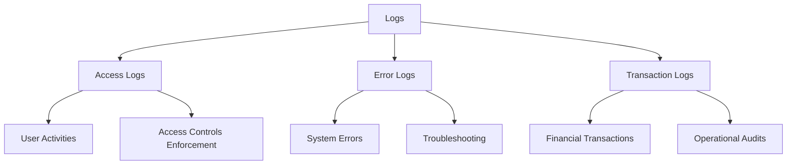
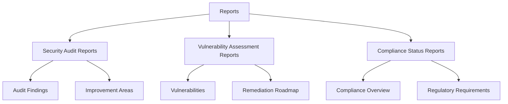
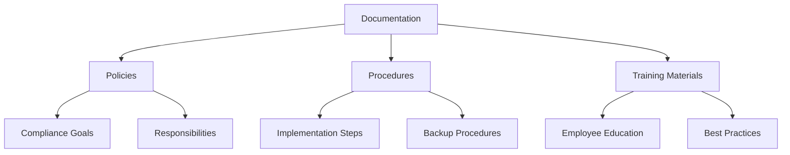
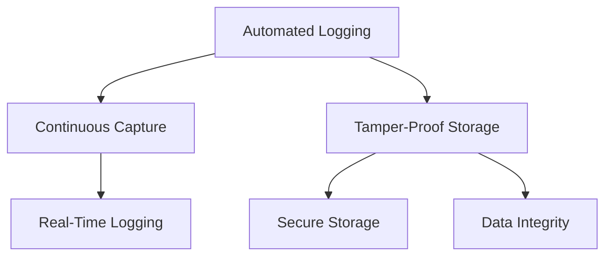
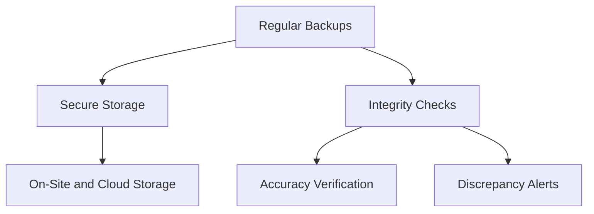
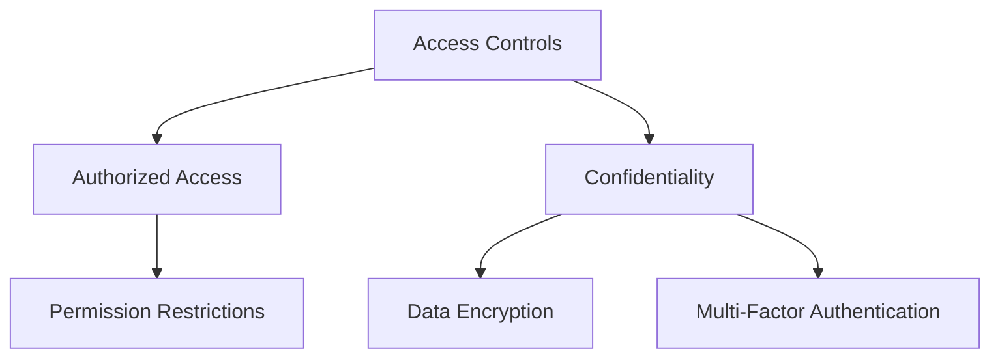
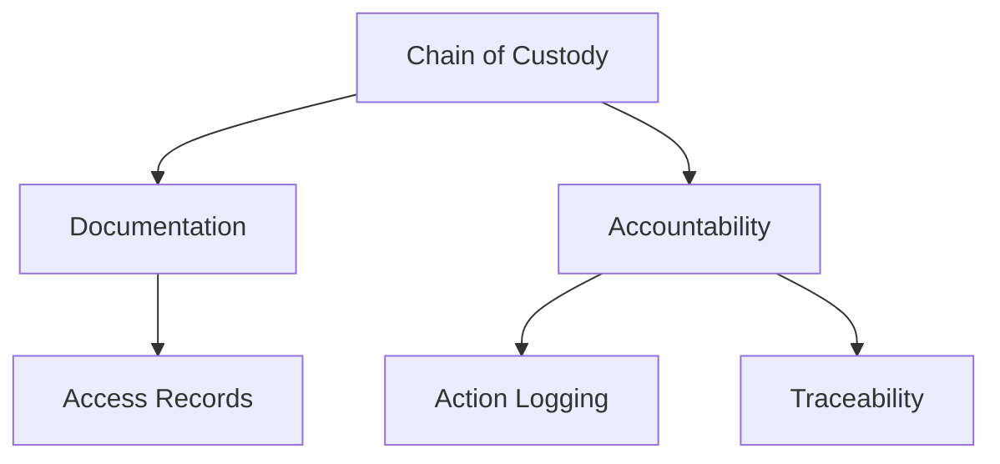

## Introduction

Generating and managing evidence is a crucial aspect of maintaining compliance with regulatory standards. This module explores the types of evidence necessary for compliance audits, compares human and machine attestation methods, and emphasizes the importance of accurate documentation. Let's dive into these topics comprehensively to ensure a thorough understanding.

## Types of Evidence  

## Definition and Examples of Evidence in Compliance Audits

In compliance audits, evidence is critical for demonstrating that an organization meets regulatory requirements. Evidence includes various forms of data and documentation that show compliance controls are in place and functioning effectively.

### Logs

Logs are records of events that occur within a system. They provide a detailed and chronological account of system activities, helping trace actions and identify issues.

- **Access Logs:**
  - Access logs track who accessed the system, the time of access, and the actions performed. 
  - They are essential for tracking user activities, ensuring access controls are enforced, and detecting unauthorized access.
  - Example: Log entries showing that user "JohnDoe" accessed the financial database at 10:30 AM and exported a report.

- **Error Logs:**
  - Error logs capture system errors and issues, providing insights into system malfunctions.
  - They help identify and troubleshoot problems that could affect compliance and system performance.
  - Example: Log entries detailing a failure in the data backup process, indicating potential risks to data integrity.

- **Transaction Logs:**
  - Transaction logs document transactions processed by the system, ensuring all activities are correctly recorded and verifiable.
  - They are vital for financial and operational audits, providing a clear trail of transactions.
  - Example: Log entries recording a series of financial transactions, including timestamps, transaction IDs, and involved accounts.

### Reports

Reports are generated by monitoring and auditing tools, summarizing the compliance status, vulnerabilities, and incidents.

- **Security Audit Reports:**
  - Summarize findings from security audits, highlighting strengths and areas for improvement.
  - Example: A report detailing the results of a quarterly security audit, identifying gaps in firewall configurations and recommending enhancements.

- **Vulnerability Assessment Reports:**
  - Identify and assess vulnerabilities within the system, providing a roadmap for remediation.
  - Example: A report highlighting critical vulnerabilities in the organization's web applications, along with suggested fixes.

- **Compliance Status Reports:**
  - Provide an overview of the organization’s compliance status, indicating whether it meets regulatory requirements.
  - Example: A report summarizing the compliance status of various departments with respect to GDPR, noting areas of non-compliance and steps taken to address them.

### Documentation

Documentation includes written materials that outline the organization’s compliance practices and procedures.

- **Policies:**
  - High-level documents that define the organization’s approach to compliance, including goals and responsibilities.
  - Example: A data protection policy outlining how personal data should be handled to comply with GDPR requirements.

- **Procedures:**
  - Detailed, step-by-step instructions on how to implement compliance controls.
  - Example: A procedure for conducting regular data backups, including specific steps and schedules.

- **Training Materials:**
  - Resources used to educate employees on compliance requirements and best practices.
  - Example: A training manual on data privacy, covering topics such as data handling, breach response, and employee responsibilities.

## Techniques for Collecting and Preserving Evidence

Effective evidence collection and preservation are crucial for maintaining the reliability and accessibility of compliance data. Here are key techniques:

### Automated Logging

Automated logging systems continuously capture and store system activities, ensuring logs are comprehensive and tamper-proof.

- **Continuous Capture:**
  - Logs are automatically generated and stored in real-time, ensuring no activity goes unrecorded.
  - Example: An automated logging system that records all user logins, data access, and system errors continuously.

- **Tamper-Proof Storage:**
  - Logs are stored securely to prevent unauthorized modifications, ensuring the integrity of the data.
  - Example: Using secure log storage solutions that implement encryption and access controls to protect log integrity.

### Regular Backups

Regularly backing up logs, reports, and documentation prevents data loss and ensures that evidence remains accessible.

- **Secure Storage:**
  - Backups are stored in secure locations, either on-site or in the cloud, protecting them from physical and digital threats.
  - Example: Weekly backups of compliance logs stored in an encrypted cloud storage solution.

- **Integrity Checks:**
  - Regular checks are performed to ensure backup data remains accurate and uncorrupted.
  - Example: Automated integrity checks that verify the accuracy of backups and alert administrators if discrepancies are found.

### Access Controls

Implementing strict access controls ensures that only authorized personnel can view or modify evidence, maintaining the integrity and confidentiality of the evidence.

- **Authorized Access:**
  - Access to evidence is restricted to personnel with appropriate permissions, preventing unauthorized access.
  - Example: Access control policies that limit log access to security and compliance teams.

- **Confidentiality:**
  - Measures are in place to protect the confidentiality of sensitive evidence, ensuring it is not disclosed to unauthorized parties.
  - Example: Encrypting sensitive compliance documentation and requiring multi-factor authentication for access.

### Chain of Custody

Establishing a chain of custody documents the handling of evidence from collection to presentation. This includes logging who accessed the evidence and when, ensuring accountability.

- **Documentation:**
  - Detailed records of who accessed the evidence and when, providing a clear audit trail.
  - Example: A chain of custody log that records each instance of evidence access, including the user’s identity and purpose.

- **Accountability:**
  - Ensuring all actions related to evidence handling are logged and traceable, holding individuals accountable for their actions.
  - Example: A compliance officer’s access to transaction logs is logged, including the reason for access and any actions taken.

