## Introduction

Implementing compliance measures is a strategic process that ensures an organization adheres to regulatory standards, enhances security, and mitigates risks. This module covers the comprehensive steps to implement controls effectively, integrates these controls into various organizational processes, and develops robust policies and procedures. Real-world examples and practical insights provide a thorough understanding for a technical audience.

## Implementing Controls

### Steps to Implement Controls Effectively

Implementing controls is essential to achieving compliance and protecting organizational assets. Here are the detailed steps:

#### Requirement Analysis

Identifying regulatory and business requirements is the first step in implementing controls. This involves:

- **Identifying Regulatory Requirements**: Understand the specific laws, regulations, and standards that apply to your organization. For instance, healthcare organizations must comply with HIPAA, while financial institutions must adhere to PCI-DSS.
- **Assessing Existing Controls and Gaps**: Evaluate current controls to identify any gaps or areas of non-compliance. This helps in understanding what additional controls are needed.
- **Defining Control Objectives and Scope**: Clearly define what each control aims to achieve and its scope. This includes specifying the areas and processes that will be affected by the control.

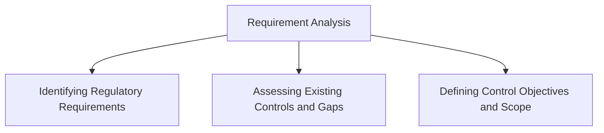

#### Control Design

Once requirements are understood, the next step is to design the controls.

- **Develop Control Specifications and Architecture**: Design controls tailored to meet identified requirements. Create detailed specifications and an architecture outlining how the controls will be implemented.
- **Choose Appropriate Control Technologies and Tools**: Select technologies and tools that will be used to implement the controls. For instance, choose encryption software for data protection or intrusion detection systems for network security.
- **Document Control Procedures and Policies**: Create documentation outlining how the controls will be implemented, monitored, and maintained. This documentation should be detailed and accessible to all relevant stakeholders.

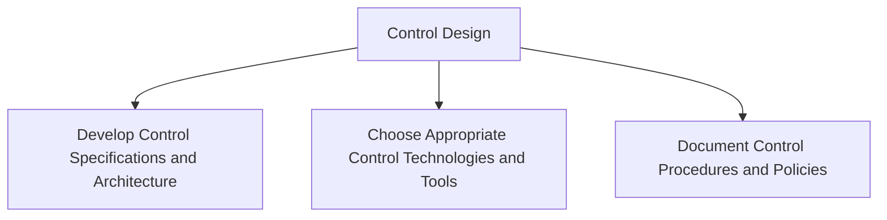

#### Control Implementation

Implementing the designed controls involves several critical steps.

- **Deploy Controls in Relevant Systems and Processes**: Integrate the controls into existing systems and processes. This could involve installing new software, configuring settings, or modifying existing procedures.
- **Configure Settings and Parameters for Optimal Performance**: Ensure the controls are configured correctly to provide the intended protection and functionality.
- **Integrate Controls with Existing Infrastructure**: Make sure the new controls work seamlessly with existing systems and infrastructure. This may require adjustments to ensure compatibility and efficiency.

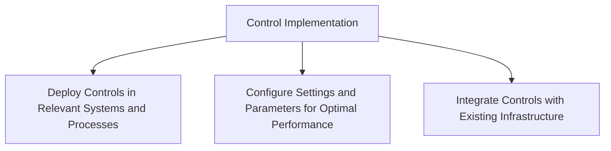

#### Testing and Validation

After implementation, it is crucial to test and validate the controls.

- **Conduct Initial Testing to Verify Control Effectiveness**: Perform initial tests to ensure the controls work as expected. This includes functional testing to verify that controls meet their specified requirements.
- **Perform Vulnerability Assessments and Penetration Testing**: Conduct assessments to identify potential vulnerabilities. Penetration testing can help simulate attacks to test the controls’ robustness.
- **Validate Control Performance Against Requirements**: Ensure the controls perform consistently and meet all defined requirements and objectives.

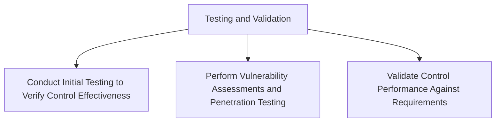

#### Monitoring and Maintenance

Continuous monitoring and maintenance are essential to ensure the longevity and effectiveness of the controls.

- **Implement Continuous Monitoring Solutions**: Use automated tools and systems to continuously monitor the performance and effectiveness of the controls.
- **Regularly Review and Update Controls**: Periodically review the controls and update them as necessary to address new threats or changes in regulatory requirements.
- **Maintain Documentation and Audit Trails**: Keep detailed records of all control activities, updates, and incidents. This documentation is crucial for audits and ongoing compliance.

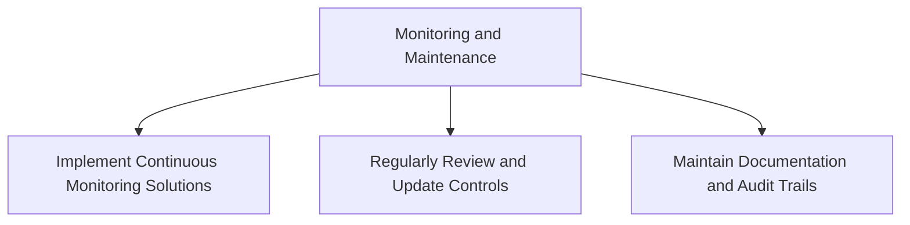

### Integration of Controls into Software Development, Operations, and Quality Assurance Processes

Integrating controls into the organization’s core processes ensures that compliance and security are maintained throughout the lifecycle of software development, operational activities, and quality assurance.

#### Software Development (DevSecOps)

Integrating security into the software development lifecycle (DevSecOps) involves:

- **Incorporating Security Controls**: Embed security controls into every stage of the development process, from design to deployment.
- **Using Secure Coding Practices**: Train developers on secure coding practices to prevent common vulnerabilities such as SQL injection, cross-site scripting (XSS), and buffer overflows.
- **Implementing Automated Security Testing**: Integrate automated security testing tools into CI/CD pipelines to catch security issues early in the development process.

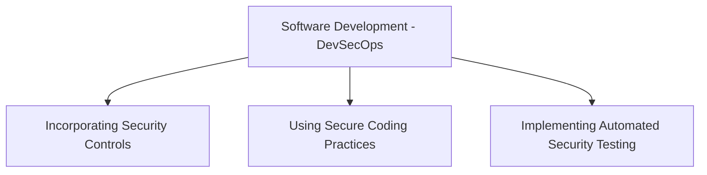

#### Operations (DevOps)

Incorporating compliance controls into operational processes ensures that systems remain secure and compliant.

- **Applying Infrastructure as Code (IaC)**: Use IaC to manage and enforce security and compliance controls across all infrastructure components. This ensures consistency and reduces manual errors.
- **Using Configuration Management Tools**: Deploy configuration management tools like Ansible, Puppet, or Chef to automate the deployment and maintenance of compliance controls.
- **Continuous Monitoring**: Implement monitoring solutions to continuously track system performance, detect anomalies, and ensure compliance with regulatory requirements.

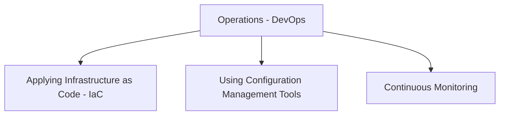

#### Quality Assurance (QA)

Integrating compliance into QA processes helps verify that controls are effective and that the organization remains compliant.

- **Including Compliance Testing in QA Workflows**: Incorporate compliance testing into regular QA activities to ensure that all software and systems meet compliance standards.
- **Using Automated Testing Tools**: Leverage automated testing tools to streamline compliance verification and ensure comprehensive coverage.
- **Regular Audits and Assessments**: Conduct regular audits and assessments to validate the effectiveness of controls and identify areas for improvement.

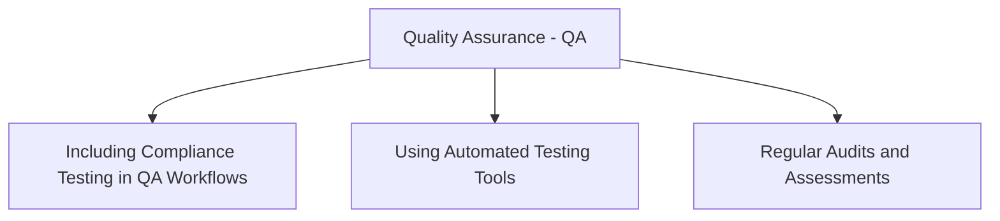

### Case Studies and Examples of Control Implementation in Real-World Scenarios

Real-world examples and case studies provide practical insights into how controls are implemented across different industries. Here are a few examples:

#### Financial Industry

**Case Study: Implementing PCI-DSS Controls in a Financial Institution**

- **Challenge**: Ensuring the security of payment processing systems to comply with PCI-DSS standards.
- **Solution**: Implementing encryption for data at rest and in transit, deploying intrusion detection systems, and conducting regular security audits.
- **Outcome**: Achieved PCI-DSS compliance, enhanced security of payment systems, and reduced risk of data breaches.

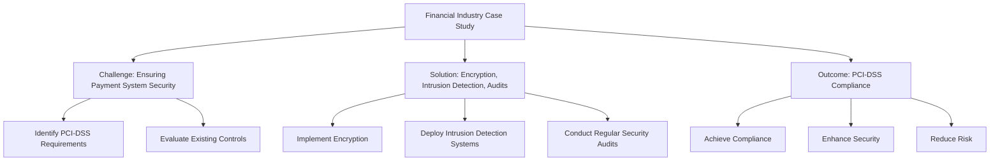

#### Healthcare Industry

**Case Study: Implementing HIPAA Controls in a Healthcare Provider**

- **Challenge**: Protecting patient data and ensuring compliance with HIPAA regulations.
- **Solution**: Implementing access controls, encrypting patient records, and training staff on data privacy practices.
- **Outcome**: Improved data security, reduced risk of data breaches, and achieved HIPAA compliance.

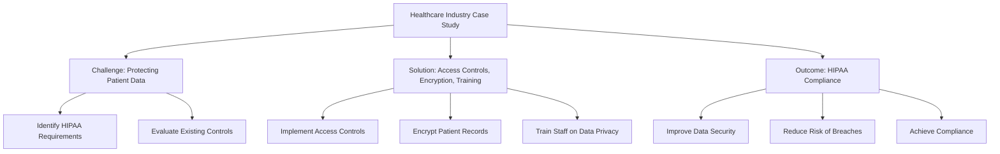

#### Technology Sector

**Case Study: Implementing ISO 27001 Controls in a Tech Company**

- **Challenge**: Managing information security risks and protecting intellectual property.
- **Solution**: Conducting risk assessments, implementing security controls, and establishing a continuous monitoring program.
- **Outcome**: Improved security posture, achieved ISO 27001 certification, and enhanced customer trust.

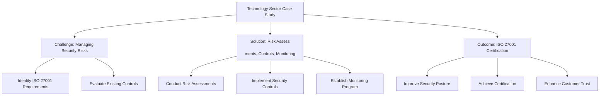

## Developing Policies and Procedures

### Best Practices for Developing Clear and Actionable Policies

Developing effective policies is crucial for guiding the organization’s compliance efforts. Here are best practices to consider:

#### Identify Policy Objectives

- **Define the Purpose and Goals**: Clearly articulate the purpose and goals of the policy. Ensure that these objectives align with regulatory requirements and business goals.
- **Align with Regulatory Requirements**: Make sure the policy addresses all relevant regulatory requirements and standards.

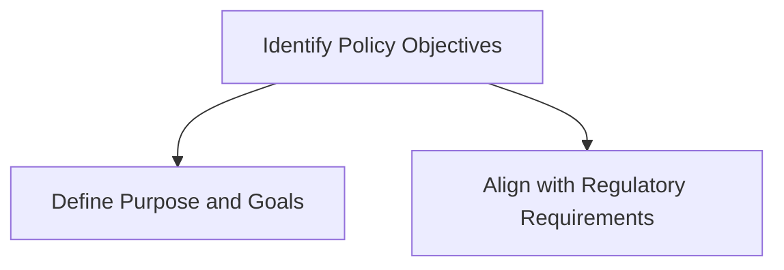

#### Stakeholder Engagement

- **Involve Key Stakeholders**: Engage key stakeholders in the policy development process to gather diverse perspectives and ensure buy-in.
- **Gather Input and Feedback**: Solicit input and feedback from relevant departments to ensure the policy is practical and effective.

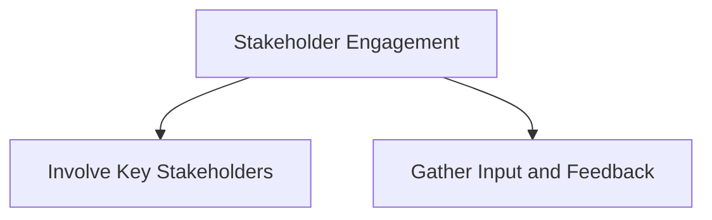

#### Clear and Concise Language

- **Use Clear and Concise Language**: Write policies in clear, straightforward language to ensure they are easily understood by all employees.
- **Avoid Jargon**: Minimize the use of technical jargon to prevent confusion and ensure clarity.

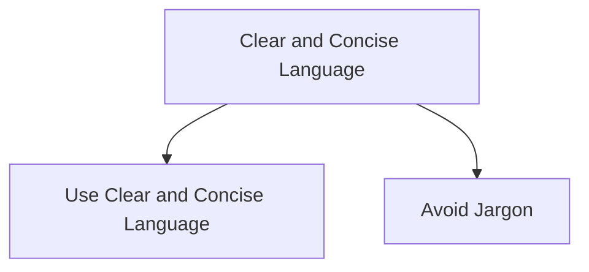

#### Policy Approval and Communication

- **Obtain Approval from Senior Management and Legal**: Ensure that the policy is reviewed and approved by senior management and the legal team.
- **Communicate the Policy Effectively**: Communicate the policy to all employees through training sessions, emails, and company intranet.

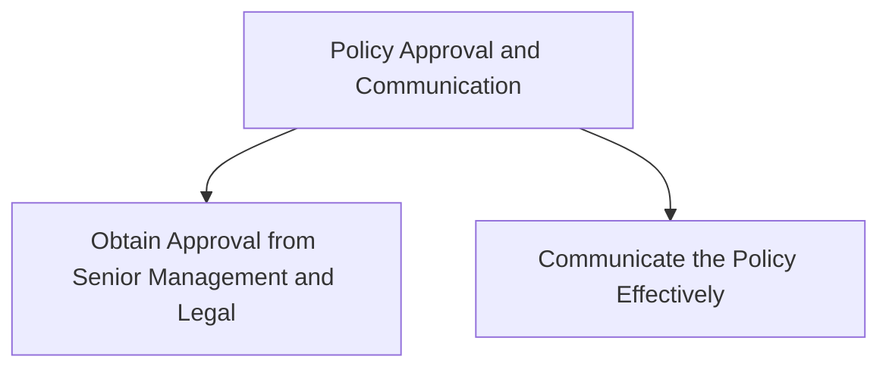

### Creating Detailed Procedures that Support Policy Implementation

Procedures are the actionable steps that support policy implementation. Here’s how to develop effective procedures:

#### Procedure Development

- **Break Down Policies into Actionable Steps**: Translate policies into clear, actionable steps that can be easily followed by employees.
- **Define Roles and Responsibilities**: Clearly define who is responsible for each step in the procedure.
- **Ensure Procedures are Practical and Feasible**: Make sure that procedures are realistic and can be effectively implemented within the organization.

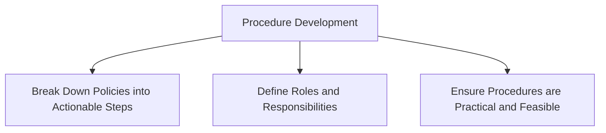

#### Documentation and Accessibility

- **Document Procedures in Detail**: Create detailed documentation for each procedure, outlining each step and providing necessary guidance.
- **Make Procedures Easily Accessible**: Ensure that all relevant personnel have easy access to the documented procedures, either through the company intranet or other accessible platforms.

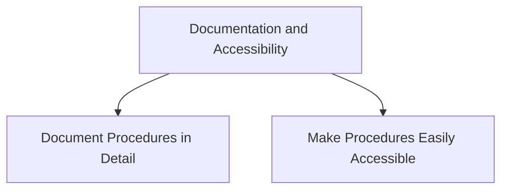

#### Training and Awareness

- **Provide Training to Employees on New Procedures**: Conduct training sessions to educate employees on new procedures and ensure they understand their roles and responsibilities.
- **Conduct Awareness Campaigns**: Run awareness campaigns to reinforce the importance of following procedures and maintaining compliance.

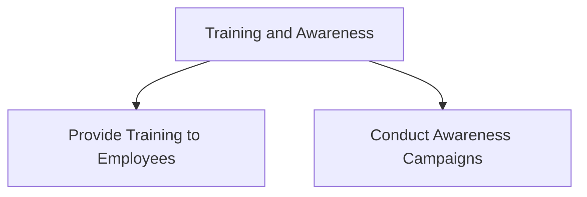

### Role of Technical Staff in Policy and Procedure Development

Technical staff play a crucial role in developing and implementing policies and procedures. Here’s how:

#### Technical Input

- **Provide Technical Expertise**: Technical staff provide valuable insights into the feasibility and effectiveness of proposed policies and procedures.
- **Ensure Technical Feasibility**: Assess whether the proposed controls and procedures can be practically implemented with the existing technology and infrastructure.

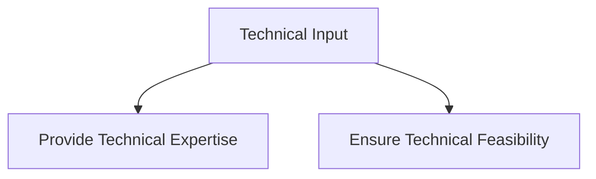

#### Implementation Support

- **Assist in the Implementation**: Help deploy and configure the technical aspects of policies and procedures.
- **Provide Technical Support**: Offer ongoing support and troubleshooting to ensure that the procedures are working as intended.

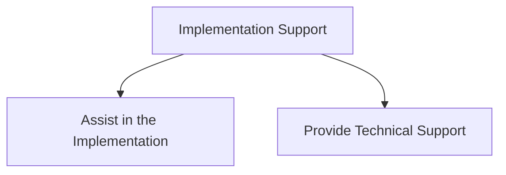

#### Continuous Improvement

- **Monitor the Effectiveness of Policies and Procedures**: Continuously assess the effectiveness of implemented policies and procedures.
- **Suggest Improvements**: Propose updates and improvements based on feedback, changes in regulatory requirements, and evolving organizational needs.

```mermaid
graph TD;
    A[Continuous Improvement] --> B[Monitor the Effectiveness]
    A --> C[Suggest Improvements]
```

