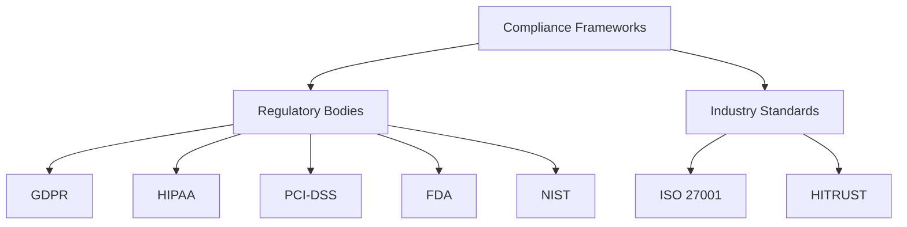
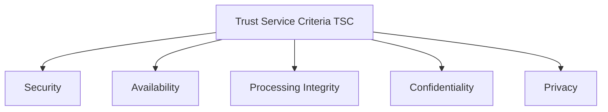
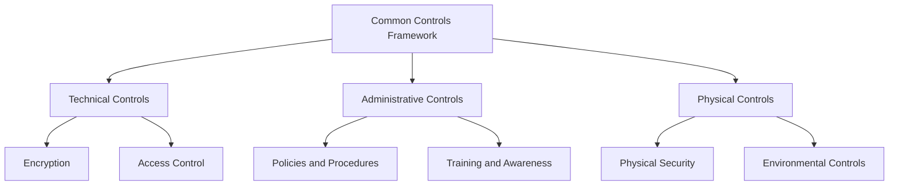
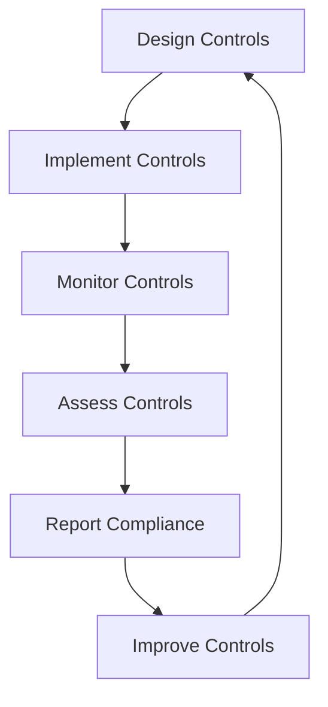

# Overview of Compliance Frameworks

## Understanding Regulatory and Industry-Specific Compliance

Compliance frameworks are structured sets of guidelines, standards, and best practices that organizations follow to meet regulatory requirements, ensure data security, and protect privacy. These frameworks are essential in establishing a systematic approach to managing and mitigating risks.

### Definition of Compliance Frameworks

Compliance frameworks are systematic guidelines and practices designed to help organizations meet regulatory, legal, and industry-specific requirements. They provide a structured approach to managing compliance obligations, ensuring that organizations implement appropriate controls, policies, and procedures to protect sensitive information and maintain operational integrity.

### Importance of Compliance

Compliance ensures that organizations adhere to laws and regulations, protect sensitive data, maintain customer trust, and avoid legal and financial penalties. It plays a crucial role in mitigating risks associated with data breaches, financial misconduct, and other non-compliance issues. By following compliance frameworks, organizations can demonstrate their commitment to security and privacy, which can enhance their reputation and trustworthiness.

### Major Regulatory Bodies and Their Compliance Frameworks

Different regulatory bodies oversee various compliance frameworks based on industry and geographical location. Each framework has specific requirements tailored to address the unique challenges and risks associated with different sectors.

- **GDPR (General Data Protection Regulation)**: A regulation in EU law on data protection and privacy for all individuals within the European Union and the European Economic Area.
- **HIPAA (Health Insurance Portability and Accountability Act)**: A US law designed to provide privacy standards to protect patients' medical records and other health information.
- **PCI-DSS (Payment Card Industry Data Security Standard)**: A set of security standards designed to ensure that all companies that accept, process, store, or transmit credit card information maintain a secure environment.
- **FDA (Food and Drug Administration)**: A US federal agency responsible for protecting public health by ensuring the safety, efficacy, and security of drugs, biological products, and medical devices.
- **NIST (National Institute of Standards and Technology)**: A US agency that provides a catalog of security and privacy controls for federal information systems and organizations.
- **ISO 27001**: An international standard for managing information security.
- **HITRUST (Health Information Trust Alliance)**: A certifiable framework that provides organizations with a comprehensive, flexible, and efficient approach to regulatory compliance and risk management.

### Importance of Compliance for Technical Roles

Compliance has a direct impact on several technical areas, including software development, IT operations, and system engineering. 

#### Impact of Compliance on Technical Roles

Compliance requirements influence how technical teams design, implement, and maintain systems and applications. For instance, software developers must integrate security features to protect sensitive data, while IT operations teams must ensure that systems are configured and monitored to meet compliance standards.

#### Legal and Financial Consequences of Non-Compliance

Non-compliance can result in severe penalties, including fines, legal action, and damage to an organization’s reputation. For example, data breaches due to non-compliance with GDPR can lead to hefty fines and loss of customer trust.

#### Role of Technical Staff in Maintaining Compliance

Technical staff play a crucial role in implementing and monitoring compliance controls, ensuring that systems and processes align with regulatory requirements. They are responsible for deploying technical safeguards, conducting regular security assessments, and maintaining compliance documentation.

# Key Components of Compliance Frameworks

## Trust Service Criteria (TSC)

The Trust Service Criteria (TSC) are a set of principles used to evaluate and report on the controls of service organizations. They cover five main categories:

- **Security**: Protecting information and systems against unauthorized access.
- **Availability**: Ensuring that information and systems are available for operation and use as committed.
- **Processing Integrity**: Ensuring that system processing is complete, valid, accurate, timely, and authorized.
- **Confidentiality**: Protecting information designated as confidential.
- **Privacy**: Ensuring that personal information is collected, used, retained, disclosed, and disposed of in accordance with the entity's privacy notice.

## Common Controls Framework

A common controls framework includes controls that are applicable across multiple compliance requirements. These controls are often categorized into technical, administrative, and physical controls.

### Technical Controls

Technical controls are implemented through technology to protect information and systems. Examples include:

- **Encryption**: Protecting data by converting it into a code to prevent unauthorized access.
- **Access Control**: Ensuring that only authorized individuals have access to information and systems.
- **Logging and Monitoring**: Recording and analyzing activities within systems to detect and respond to security incidents.

### Administrative Controls

Administrative controls involve policies, procedures, and practices designed to manage the administrative aspects of an organization’s security posture. Examples include:

- **Policies and Procedures**: Documented guidelines on how to manage and protect information.
- **Training and Awareness**: Programs to educate employees about compliance requirements and security best practices.
- **Risk Assessments**: Regular evaluations of potential risks to the organization's information and systems.

### Physical Controls

Physical controls are measures to protect the physical infrastructure of an organization. Examples include:

- **Physical Security**: Measures such as locks, access cards, and surveillance systems to protect physical assets.
- **Environmental Controls**: Systems to protect against environmental threats like fire, flood, and temperature extremes.

# Regulatory and Industry-Specific Compliance Frameworks

## Healthcare Compliance (e.g., HIPAA, HITRUST)

### HIPAA Privacy and Security Rules

HIPAA sets national standards for the protection of health information. It includes requirements for the privacy and security of medical records and other personal health information. HIPAA mandates the implementation of safeguards to ensure the confidentiality, integrity, and availability of electronic protected health information (ePHI).

### HITRUST CSF

The HITRUST Common Security Framework (CSF) is a certifiable framework that provides organizations with a comprehensive, flexible, and efficient approach to regulatory compliance and risk management. HITRUST CSF integrates various healthcare regulations and standards, including HIPAA, to provide a unified approach to managing healthcare data security.

### Technical Requirements for Healthcare Data Protection

Healthcare organizations must implement technical safeguards to protect ePHI. These include:

- **Encryption**: Encrypting ePHI to protect it from unauthorized access.
- **Access Control**: Implementing measures to ensure that only authorized individuals can access ePHI.
- **Audit Controls**: Recording and examining activity in systems that contain or use ePHI to detect and respond to potential security incidents.

## Financial Services Compliance (e.g., PCI-DSS, SOX)

### PCI-DSS

The Payment Card Industry Data Security Standard (PCI-DSS) is a set of security standards designed to ensure that all companies that accept, process, store, or transmit credit card information maintain a secure environment. PCI-DSS requirements include the implementation of firewalls, encryption, access control, and regular security testing.

### SOX

The Sarbanes-Oxley Act (SOX) mandates strict reforms to improve financial disclosures and prevent accounting fraud. SOX includes requirements for internal controls over financial reporting, such as maintaining accurate records and implementing security measures to protect financial data.

### Technical Measures for Ensuring Compliance in Financial Services

Financial services organizations must implement several technical measures to ensure compliance, including:

- **Secure Payment Processing Systems**: Ensuring that systems used to process payments are secure and compliant with PCI-DSS standards.
- **Regular Security Audits**: Conducting regular audits to identify and address security vulnerabilities.
- **Strict Access Control Measures**: Implementing access controls to ensure that only authorized personnel can access sensitive financial information.

## Industry-Specific Compliance Frameworks

### Government and Defense (e.g., NIST SP 800-53)

### NIST SP 800-53

NIST Special Publication 800-53 provides a catalog of security and privacy controls for federal information systems and organizations to protect operations and assets. It includes controls for access control, incident response, continuous monitoring, and more.

### Technical Controls and Security Measures Required by NIST

Organizations must implement various technical controls and security measures to comply with NIST SP 800-53, including:

- **Access Control**: Implementing measures to control access to systems and information based on user roles and responsibilities.
- **Incident Response**: Establishing procedures to detect, respond to, and recover from security incidents.
- **Continuous Monitoring**: Regularly monitoring systems and networks to detect and respond to potential security threats.

### Pharmaceutical and Healthcare Products (e.g., FDA CFR Part 11)

### FDA CFR Part 11

FDA CFR Part 11 sets forth the criteria under which the FDA considers electronic records and electronic signatures to be trustworthy, reliable, and equivalent to paper records and handwritten signatures. It includes requirements for system validation, audit trails, and electronic signatures.

### Compliance Considerations for Pharmaceutical and Healthcare Product Industries

Organizations must implement various controls to comply with FDA CFR Part 11, including:

-

 **Audit Trails**: Implementing audit trails to record user actions and system changes.
- **System Validations**: Validating systems to ensure they function as intended and comply with regulatory requirements.
- **Access Controls**: Implementing measures to ensure that only authorized personnel can access electronic records and systems.

# Implementing Compliance Frameworks in Organizations

## Implementing Compliance Controls

### Lifecycle of Compliance Controls

Implementing compliance controls involves several key stages, each critical to ensuring that the controls are effective and meet regulatory requirements.

### Design Controls

Designing controls involves identifying specific compliance requirements and developing controls to address them. This includes determining the necessary technical, administrative, and physical controls and ensuring they are integrated into the organization's systems and processes.

### Implement Controls

Implementing controls involves deploying and configuring the identified controls within the organization’s systems and processes. This includes setting up technical controls such as encryption and access control mechanisms, as well as administrative controls like policies and procedures.

### Monitor Controls

Monitoring controls involves continuously tracking the effectiveness of the implemented controls. This can be done through automated tools, such as Security Information and Event Management (SIEM) systems, as well as manual checks and audits.

### Assess Controls

Assessing controls involves regularly evaluating the performance of the implemented controls to ensure they are meeting compliance requirements. This can include conducting internal audits, vulnerability assessments, and risk assessments.

### Report Compliance

Reporting compliance involves documenting and communicating the status of the implemented controls to stakeholders and regulatory bodies. This includes generating audit reports, assessment reports, and other compliance documentation.

### Improve Controls

Improving controls involves continuously enhancing the implemented controls based on monitoring results and compliance assessments. This can include updating policies, refining technical controls, and addressing identified vulnerabilities.

## Role of Technical Staff in Compliance

### Responsibilities of Technical Roles

Technical staff are responsible for implementing and maintaining compliance controls, monitoring systems for compliance, and responding to compliance issues. Their specific responsibilities include:

- **Implementing Technical Controls**: Deploying and configuring technical safeguards, such as encryption and access control mechanisms.
- **Monitoring Systems**: Using tools and technologies to continuously monitor the effectiveness of compliance controls.
- **Responding to Incidents**: Detecting, responding to, and recovering from security incidents and compliance breaches.

### Collaboration Between Technical Teams and Compliance Officers

Effective compliance requires collaboration between technical teams and compliance officers. This collaboration ensures that controls are implemented correctly and that compliance requirements are met. It involves:

- **Regular Communication**: Ensuring that technical teams and compliance officers regularly communicate about compliance requirements and control implementations.
- **Joint Assessments**: Conducting joint assessments to evaluate the effectiveness of controls and identify areas for improvement.
- **Coordinated Responses**: Working together to respond to compliance incidents and breaches, ensuring that appropriate actions are taken to address issues.

# Compliance Monitoring and Reporting

## Monitoring Strategies

### Techniques for Continuous Monitoring

Continuous monitoring involves using automated tools and manual checks to track the effectiveness of compliance controls. Techniques include:

- **Automated Monitoring Tools**: Utilizing tools such as SIEM systems, intrusion detection systems, and vulnerability scanners to monitor systems in real-time.
- **Manual Checks**: Conducting regular manual reviews and assessments to ensure that controls are functioning as intended.

### Real-Time vs. Periodic Monitoring Approaches

Real-time monitoring provides immediate detection of compliance issues, allowing for swift response and remediation. Periodic monitoring involves conducting regular checks at set intervals, such as monthly or quarterly, to identify and address compliance issues.

### Tools and Technologies for Compliance Monitoring

Various tools and technologies can be used for compliance monitoring, including:

- **SIEM Systems**: Tools that collect and analyze security event data from across the organization to detect and respond to potential security threats.
- **Intrusion Detection Systems (IDS)**: Tools that monitor network traffic for suspicious activity and potential security breaches.
- **Vulnerability Scanners**: Tools that scan systems and networks for known vulnerabilities and provide recommendations for remediation.

## Reporting Requirements

### Types of Compliance Reports

Compliance reporting involves generating various types of reports to document and communicate the status of compliance controls. These reports include:

- **Audit Reports**: Detailed reports of internal and external audits, including findings and recommendations.
- **Assessment Reports**: Reports that document the results of risk assessments, vulnerability assessments, and other evaluations.
- **Compliance Documentation**: Documentation that demonstrates compliance with regulatory requirements, including policies, procedures, and evidence of control implementation.

### Role of Documentation and Evidence in Compliance Reporting

Accurate and comprehensive documentation is essential for proving compliance during audits and assessments. This documentation includes:

- **Policies and Procedures**: Written guidelines that outline the organization’s approach to managing compliance.
- **Evidence of Control Implementation**: Records and logs that demonstrate the implementation and effectiveness of compliance controls.
- **Audit Trails**: Detailed records of user actions and system changes that provide a traceable history of compliance activities.

### Tools for Generating and Managing Compliance Reports

Various tools can be used to generate and manage compliance reports, including:

- **Compliance Management Platforms**: Software solutions that provide a centralized platform for managing compliance activities and documentation.
- **Reporting Tools**: Tools that automate the generation of compliance reports, including audit reports, assessment reports, and other documentation.

# Case Studies and Practical Applications

## Case Studies in Compliance

### Case Study Analysis

Analyzing real-world scenarios can provide valuable insights into the application of compliance frameworks and the challenges faced by organizations. Case studies include:

- **Examination of Notable Compliance Breaches and Their Implications**: Analyzing high-profile compliance breaches to understand their causes and consequences. This can include reviewing the technical and administrative failures that led to the breaches and identifying lessons learned.
- **Successful Compliance Implementation Stories and Lessons Learned**: Reviewing successful compliance implementations to identify best practices and strategies for achieving compliance. This can include examining how organizations effectively implemented and monitored compliance controls.
- **Technical Analysis of Compliance Failures and Remediation Strategies**: Conducting technical analyses of compliance failures to identify the root causes and recommend remediation strategies. This can include reviewing technical controls, administrative practices, and incident response procedures.

## Practical Exercises and Simulations

### Hands-On Simulations

Hands-on simulations provide practical experience in implementing and monitoring compliance controls. These exercises include:

- **Simulation Exercises to Simulate Control Implementation, Compliance Monitoring, and Reporting**: Practical exercises that simulate real-world scenarios, allowing participants to practice implementing and monitoring compliance controls and generating compliance reports.
- **Role-Playing Scenarios to Practice Responding to Compliance Challenges**: Role-playing exercises that simulate compliance challenges, allowing participants to practice responding to incidents and addressing compliance issues.
- **Lab Exercises for Configuring and Deploying Compliance Controls Using Industry-Standard Tools**: Practical lab exercises that provide hands-on experience with configuring and deploying compliance controls using industry-standard tools and technologies.

# Conclusion and Next Steps

## Future Trends in Compliance

### Emerging Technologies

Emerging technologies are shaping the future of compliance monitoring and data security. These technologies include:

- **Impact of AI, Blockchain, and IoT on Compliance Monitoring and Data Security**: Exploring how artificial intelligence, blockchain, and the Internet of Things (IoT) can enhance compliance monitoring and data security. This includes examining the potential benefits and challenges of these technologies.
- **Predictions for Future Regulatory Changes and Compliance Requirements**: Anticipating future changes in regulatory requirements and preparing for them. This includes monitoring regulatory developments and updating compliance practices to stay compliant with new standards.
- **Adapting Technical Practices to Meet Evolving Compliance Standards**: Updating technical practices to stay compliant with new and evolving standards. This includes implementing new technologies and practices to enhance compliance and security.

## Career Development in Compliance

### Career Paths in Compliance

Exploring different career paths in compliance can provide valuable insights into the roles and responsibilities in compliance management and governance. Career paths include:

- **Roles and Responsibilities in Compliance Management and Governance**: Examining the different roles and responsibilities in compliance management and governance, including compliance officers, auditors, and security professionals.
- **Certification Options and Continuing Education Resources for Career Advancement**: Identifying certifications and continuing education resources to advance a career in compliance. This includes exploring certification programs such as Certified Information Systems Auditor (CISA), Certified Information Security Manager (CISM), and Certified Information Systems Security Professional (CISSP).
- **Networking and Professional Organizations for Compliance Professionals**: Joining professional organizations and networking with other compliance professionals for career growth. This includes participating in industry events, conferences, and professional associations.

