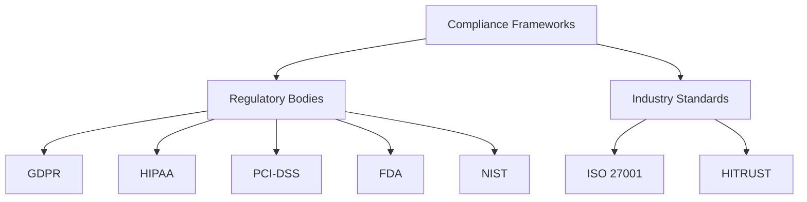
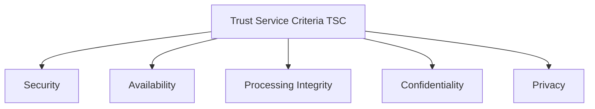
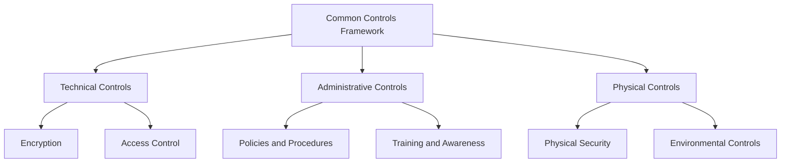

## Section 1: Overview of Compliance Frameworks

### Lesson 1: Understanding Regulatory and Industry-Specific Compliance

**Objective:** Introduce you to the concept of compliance frameworks and their significance in various industries and regulatory environments.

#### Introduction to Compliance Frameworks

Compliance frameworks are structured sets of guidelines, standards, and best practices that organizations follow to meet regulatory requirements, ensure data security, and protect privacy. These frameworks are essential in establishing a systematic approach to managing and mitigating risks.

- **Definition of compliance frameworks**:
  Compliance frameworks are systematic guidelines and practices designed to help organizations meet regulatory, legal, and industry-specific requirements.

- **Importance of compliance**:
  Compliance ensures that organizations adhere to laws and regulations, protect sensitive data, maintain customer trust, and avoid legal and financial penalties.

- **Major regulatory bodies and their compliance frameworks**:
  Different regulatory bodies oversee various compliance frameworks based on industry and geographical location.




#### Importance of Compliance for Technical Roles

Compliance has a direct impact on several technical areas, including software development, IT operations, and system engineering.

- **Impact of compliance on technical roles**:
  Compliance requirements influence how technical teams design, implement, and maintain systems and applications.

- **Legal and financial consequences of non-compliance**:
  Non-compliance can result in severe penalties, including fines, legal action, and damage to an organization’s reputation.

- **Role of technical staff in maintaining compliance**:
  Technical staff play a crucial role in implementing and monitoring compliance controls, ensuring that systems and processes align with regulatory requirements.

### Lesson 2: Key Components of Compliance Frameworks

**Objective:** Explain the key components that make up compliance frameworks and how they contribute to organizational security and operational standards.

#### Trust Service Criteria (TSC)

The Trust Service Criteria (TSC) are a set of principles used to evaluate and report on the controls of service organizations. They cover five main categories:

- **Security**:
  Protecting information and systems against unauthorized access.

- **Availability**:
  Ensuring that information and systems are available for operation and use as committed.

- **Processing Integrity**:
  Ensuring that system processing is complete, valid, accurate, timely, and authorized.

- **Confidentiality**:
  Protecting information designated as confidential.

- **Privacy**:
  Ensuring that personal information is collected, used, retained, disclosed, and disposed of in accordance with the entity's privacy notice.



#### Common Controls Framework

A common controls framework includes controls that are applicable across multiple compliance requirements. These controls are often categorized into technical, administrative, and physical controls.

- **Technical Controls**:
  Controls that are implemented through technology, such as encryption and access control mechanisms.

- **Administrative Controls**:
  Policies, procedures, and practices designed to manage the administrative aspects of an organization’s security posture.

- **Physical Controls**:
  Measures to protect the physical infrastructure, such as locks, surveillance systems, and environmental controls.



## Section 2: Regulatory and Industry-Specific Compliance Frameworks

### Lesson 3: Regulatory Compliance Frameworks

**Objective:** Explore major regulatory compliance frameworks and their specific requirements.

#### Healthcare Compliance (e.g., HIPAA, HITRUST)

- **HIPAA Privacy and Security Rules**:
  HIPAA sets national standards for the protection of health information. It includes requirements for the privacy and security of medical records and other personal health information.

- **HITRUST CSF**:
  The HITRUST Common Security Framework (CSF) is a certifiable framework that provides organizations with a comprehensive, flexible, and efficient approach to regulatory compliance and risk management.

- **Technical requirements for healthcare data protection**:
  Implementation of technical safeguards, such as encryption, access control, and audit controls, to protect electronic health information.

#### Financial Services Compliance (e.g., PCI-DSS, SOX)

- **PCI-DSS**:
  The Payment Card Industry Data Security Standard (PCI-DSS) is a set of security standards designed to ensure that all companies that accept, process, store, or transmit credit card information maintain a secure environment.

- **SOX**:
  The Sarbanes-Oxley Act (SOX) mandates strict reforms to improve financial disclosures and prevent accounting fraud. It includes requirements for internal controls and reporting accuracy.

- **Technical measures for ensuring compliance in financial services**:
  Implementation of secure payment processing systems, regular security audits, and strict access control measures.

### Lesson 4: Industry-Specific Compliance Frameworks

**Objective:** Discuss compliance frameworks tailored to specific industries and their unique regulatory requirements.

#### Government and Defense (e.g., NIST SP 800-53)

- **NIST SP 800-53**:
  NIST Special Publication 800-53 provides a catalog of security and privacy controls for federal information systems and organizations to protect operations and assets.

- **Technical controls and security measures required by NIST**:
  Implementation of security controls, such as access control, incident response, and continuous monitoring, to ensure the security and privacy of federal information systems.

#### Pharmaceutical and Healthcare Products (e.g., FDA CFR Part 11)

- **FDA CFR Part 11**:
  This regulation sets forth the criteria under which the FDA considers electronic records and electronic signatures to be trustworthy, reliable, and equivalent to paper records and handwritten signatures.

- **Compliance considerations for pharmaceutical and healthcare product industries**:
  Implementation of controls for electronic records and signatures, including audit trails, system validations, and access controls.

## Section 3: Implementing Compliance Frameworks in Organizations

### Lesson 5: Implementing Compliance Controls

**Objective:** Discuss strategies and best practices for implementing controls to meet compliance requirements.

#### Lifecycle of Compliance Controls

- **Design Controls**:
  Identifying and designing controls that address specific compliance requirements.

- **Implement Controls**:
  Deploying and configuring controls within the organization’s systems and processes.

- **Monitor Controls**:
  Continuously monitoring the effectiveness of controls through automated tools and manual checks.

- **Assess Controls**:
  Regularly evaluating the performance of controls to ensure they meet compliance requirements.

- **Report Compliance**:
  Documenting and reporting the status of controls to stakeholders and regulatory bodies.

- **Improve Controls**:
  Continuously improving controls based on monitoring results and compliance assessments.

 ```mermaid
graph TD;
    A[Design Controls] --> B[Implement Controls]
    B --> C[Monitor Controls]
    C --> D[Assess Controls]
    D --> E[Report Compliance]
    E --> F[Improve Controls]
    F --> A
```


#### Role of Technical Staff in Compliance

- **Responsibilities of technical roles**:
  Technical staff are responsible for implementing and maintaining compliance controls, monitoring systems for compliance, and responding to compliance issues.

- **Collaboration between technical teams and compliance officers**:
  Effective compliance requires collaboration between technical teams and compliance officers to ensure that controls are implemented correctly and that compliance requirements are met.

### Lesson 6: Compliance Monitoring and Reporting

**Objective:** Explain the importance of continuous monitoring and reporting in maintaining compliance.

#### Monitoring Strategies

- **Techniques for continuous monitoring**:
  Use of automated tools and manual checks to continuously monitor the effectiveness of compliance controls.

- **Real-time vs. periodic monitoring approaches**:
  Real-time monitoring provides immediate detection of compliance issues, while periodic monitoring involves regular checks at set intervals.

- **Tools and technologies for compliance monitoring**:
  Use of Security Information and Event Management (SIEM) systems, intrusion detection systems, and other monitoring tools to track and analyze compliance data.

#### Reporting Requirements

- **Types of compliance reports**:
  Audit reports, assessment reports, and other documentation that demonstrate compliance with regulatory requirements.

- **Role of documentation and evidence in compliance reporting**:
  Accurate and comprehensive documentation is essential for proving compliance during audits and assessments.

- **Tools for generating and managing compliance reports**:
  Use of compliance management platforms and reporting tools to create and maintain compliance documentation.

## Section 4: Case Studies and Practical Applications

### Lesson 7: Case Studies in Compliance

**Objective:** Analyze real-world scenarios to illustrate the application of compliance frameworks and challenges faced by organizations.

#### Case Study Analysis

- **Examination of notable compliance breaches and their implications**:
  Analyzing high-profile compliance breaches to understand their causes and consequences.

- **Successful compliance implementation stories and lessons learned**:
  Reviewing successful compliance implementations to identify best practices and lessons learned.

- **Technical analysis of compliance failures and remediation strategies**:
  Examining technical failures that led to compliance breaches and identifying remediation strategies.

### Lesson 8: Practical Exercises and Simulations

**Objective:** Engage students in practical exercises to

 apply theoretical knowledge of compliance frameworks.

#### Hands-on Simulations

- **Simulation exercises to simulate control implementation, compliance monitoring, and reporting**:
  Hands-on exercises to practice implementing and monitoring compliance controls.

- **Role-playing scenarios to practice responding to compliance challenges**:
  Simulating real-world compliance challenges to practice problem-solving and response strategies.

- **Lab exercises for configuring and deploying compliance controls using industry-standard tools**:
  Practical lab exercises to gain hands-on experience with compliance tools and technologies.

## Section 5: Conclusion and Next Steps

### Lesson 9: Future Trends in Compliance

**Objective:** Discuss emerging trends and technologies shaping the future of compliance frameworks.

#### Emerging Technologies

- **Impact of AI, blockchain, and IoT on compliance monitoring and data security**:
  Exploring how emerging technologies can enhance compliance monitoring and data security.

- **Predictions for future regulatory changes and compliance requirements**:
  Anticipating future changes in regulatory requirements and preparing for them.

- **Adapting technical practices to meet evolving compliance standards**:
  Updating technical practices to stay compliant with new and evolving standards.

### Lesson 10: Career Development in Compliance

**Objective:** Provide guidance on career pathways and professional development opportunities in compliance roles.

#### Career Paths in Compliance

- **Roles and responsibilities in compliance management and governance**:
  Exploring different career paths in compliance and their responsibilities.

- **Certification options and continuing education resources for career advancement**:
  Identifying certifications and continuing education resources to advance a career in compliance.

- **Networking and professional organizations for compliance professionals**:
  Joining professional organizations and networking with other compliance professionals for career growth.

