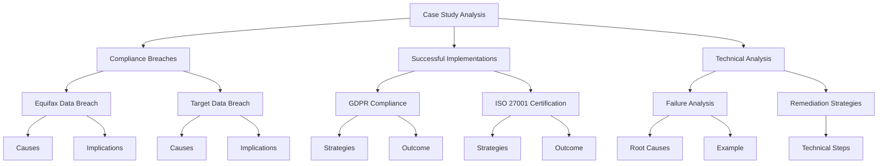
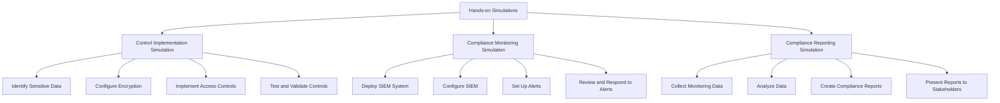
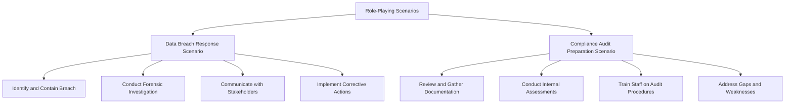
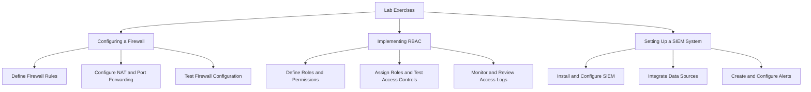

## Case Studies in Compliance

### Case Study Analysis

Analyzing real-world scenarios helps illustrate the practical application of compliance frameworks and the challenges organizations face. Through examining notable compliance breaches, successful implementations, and technical analyses of compliance failures, we can extract valuable lessons and strategies.

#### Examination of Notable Compliance Breaches and Their Implications
Understanding the causes and impacts of major compliance breaches helps organizations learn from past mistakes and improve their own practices.

- **Equifax Data Breach (2017):**
  - **Incident:** A cyberattack exploited a vulnerability in a web application framework, leading to the exposure of personal information of 147 million individuals.
  - **Causes:** Failure to patch a known vulnerability, inadequate network segmentation, and insufficient monitoring and response mechanisms.
  - **Implications:** Significant financial losses, regulatory fines, legal actions, and severe damage to the company’s reputation.

- **Target Data Breach (2013):**
  - **Incident:** Hackers gained access to Target’s network through a third-party vendor, compromising the payment card information of 40 million customers.
  - **Causes:** Lack of strong third-party security controls, inadequate network segmentation, and delayed detection and response.
  - **Implications:** Financial losses, legal settlements, and loss of customer trust.

#### Successful Compliance Implementation Stories and Lessons Learned
Examining successful compliance initiatives provides insights into best practices and effective strategies for achieving compliance.

- **A Major Bank’s GDPR Compliance:**
  - **Initiative:** The bank implemented a comprehensive data protection program to comply with GDPR.
  - **Key Strategies:** Conducting data protection impact assessments, implementing data minimization techniques, and ensuring robust encryption and access controls.
  - **Outcome:** Achieved GDPR compliance, enhanced data protection practices, and built customer trust.

- **A Global Tech Company’s ISO 27001 Certification:**
  - **Initiative:** The company sought ISO 27001 certification to strengthen its information security management system.
  - **Key Strategies:** Conducting risk assessments, implementing security controls, and establishing continuous monitoring.
  - **Outcome:** Improved security posture, achieved ISO 27001 certification, and enhanced customer confidence in their services.

#### Technical Analysis of Compliance Failures and Remediation Strategies
Analyzing the technical aspects of compliance failures helps identify root causes and develop effective remediation strategies.

- **Failure Analysis:**
  - **Example:** A healthcare provider suffered a data breach due to inadequate encryption and access controls.
  - **Root Causes:** Weak encryption protocols, insufficient access control mechanisms, and lack of regular security audits.
  - **Remediation Strategies:** Upgrading encryption methods, implementing multi-factor authentication, and conducting regular security assessments.

- **Remediation Strategy Implementation:**
  - **Technical Steps:** 
    - Deploy stronger encryption algorithms and ensure proper key management.
    - Implement role-based access control (RBAC) and multi-factor authentication.
    - Establish a continuous monitoring and audit program to detect and address security issues promptly.

## Practical Exercises and Simulations

### Hands-on Simulations

Engaging in practical exercises and simulations allows students to apply theoretical knowledge of compliance frameworks in a controlled, realistic environment. This hands-on approach helps solidify understanding and develop practical skills.

#### Simulation Exercises to Simulate Control Implementation, Compliance Monitoring, and Reporting
Simulation exercises provide a realistic environment for students to practice implementing and monitoring compliance controls, as well as generating reports.

- **Control Implementation Simulation:**
  - **Objective:** Implement encryption and access controls in a simulated IT environment.
  - **Steps:**
    - Identify sensitive data and determine appropriate encryption methods.
    - Configure encryption settings and manage encryption keys.
    - Implement role-based access controls to restrict access to sensitive data.
    - Test and validate the effectiveness of the controls.

- **Compliance Monitoring Simulation:**
  - **Objective:** Set up continuous monitoring for compliance controls.
  - **Steps:**
    - Deploy a Security Information and Event Management (SIEM) system.
    - Configure the SIEM to collect and analyze security events from various sources.
    - Set up alerts for potential compliance violations.
    - Review and respond to alerts, documenting the actions taken.

- **Compliance Reporting Simulation:**
  - **Objective:** Generate compliance reports based on monitoring data.
  - **Steps:**
    - Collect data from the SIEM and other monitoring tools.
    - Analyze the data to identify compliance status and any issues.
    - Create detailed compliance reports, including audit logs and incident summaries.
    - Present the reports to stakeholders and discuss remediation actions if necessary.

#### Role-Playing Scenarios to Practice Responding to Compliance Challenges
Role-playing scenarios help students practice responding to various compliance challenges, enhancing their problem-solving and decision-making skills.

- **Data Breach Response Scenario:**
  - **Roles:** Compliance officer, IT security team, incident response team.
  - **Scenario:** A data breach is detected, and the team must respond effectively.
  - **Steps:**
    - Identify and contain the breach.
    - Conduct a forensic investigation to determine the cause and extent of the breach.
    - Communicate with stakeholders, including affected individuals and regulatory bodies.
    - Implement corrective actions and review the response process for improvements.

- **Compliance Audit Preparation Scenario:**
  - **Roles:** Compliance manager, technical staff, auditor.
  - **Scenario:** Preparing for an upcoming compliance audit.
  - **Steps:**
    - Review and gather necessary documentation and evidence.
    - Conduct internal assessments to identify and address potential issues.
    - Train staff on audit procedures and their roles during the audit.
    - Address any gaps or weaknesses identified during the internal assessments.

#### Lab Exercises for Configuring and Deploying Compliance Controls Using Industry-Standard Tools
Lab exercises provide practical experience with industry-standard tools, helping students develop the skills needed to configure and deploy compliance controls effectively.

- **Lab Exercise 1: Configuring a Firewall:**
  - **Objective:** Configure a firewall to protect a network.
  - **Steps:**
    - Define firewall rules to allow and deny specific traffic.
    - Configure network address translation (NAT) and port forwarding.
    - Test the firewall configuration to ensure it is working correctly.

- **Lab Exercise 2: Implementing Role-Based Access Control (RBAC):**
  - **Objective:** Set up RBAC in a simulated environment.
  - **Steps:**
    - Define roles and permissions based on organizational needs.
    - Assign roles to users and test access controls.
    - Monitor and review access logs to ensure compliance.

- **Lab Exercise 3: Setting Up a SIEM System:**
  - **Objective:** Deploy and configure a SIEM system for continuous monitoring.
  - **Steps:**
    - Install and configure the SIEM software.
    - Integrate data sources, such as firewalls, intrusion detection systems, and servers.
    - Create and configure alerts for potential security incidents.

