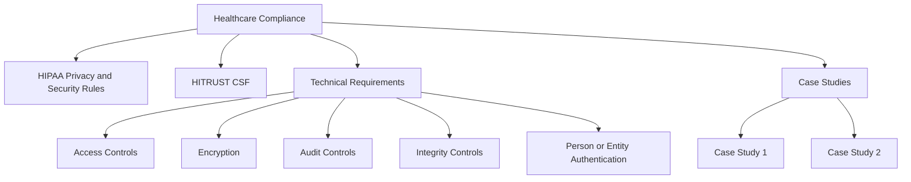
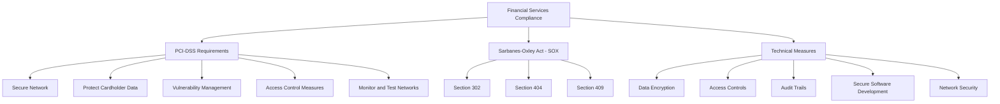
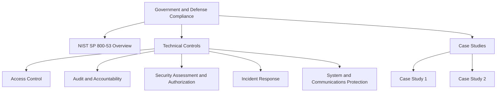
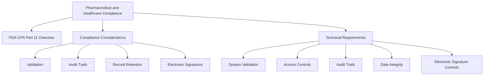

## Regulatory Compliance Frameworks

### Healthcare Compliance (e.g., HIPAA, HITRUST)

#### Overview of HIPAA Privacy and Security Rules
The Health Insurance Portability and Accountability Act (HIPAA) establishes national standards to protect individuals' medical records and other personal health information. The Privacy Rule regulates the use and disclosure of Protected Health Information (PHI), while the Security Rule specifies safeguards to ensure the confidentiality, integrity, and security of electronic PHI (ePHI).

#### Introduction to HITRUST CSF and Its Role in Healthcare Compliance
The HITRUST Common Security Framework (CSF) provides a comprehensive and certifiable framework for managing healthcare data security and compliance. HITRUST CSF integrates and harmonizes various security standards, including HIPAA, to help organizations address compliance and risk management in the healthcare sector.

#### Technical Requirements for Healthcare Data Protection
- **Access Controls:** Ensure only authorized personnel have access to ePHI.
- **Encryption:** Protect ePHI during transmission and storage.
- **Audit Controls:** Implement mechanisms to record and examine access and other activity in information systems containing ePHI.
- **Integrity Controls:** Ensure ePHI is not improperly altered or destroyed.
- **Person or Entity Authentication:** Verify that persons or entities seeking access to ePHI are who they claim to be.

#### Case Studies Illustrating Compliance Challenges and Solutions in Healthcare Organizations
- **Case Study 1:** A large hospital network implements access controls and encryption to protect patient data, resulting in improved compliance and reduced data breach incidents.
- **Case Study 2:** A healthcare provider adopts HITRUST CSF, integrating various compliance requirements into a unified framework, which streamlines their compliance efforts and enhances data security.

### Financial Services Compliance (e.g., PCI-DSS, SOX)

#### Explanation of PCI-DSS Requirements for Payment Card Industry Compliance
The Payment Card Industry Data Security Standard (PCI-DSS) is a set of security standards designed to ensure that all companies that accept, process, store, or transmit credit card information maintain a secure environment. Key requirements include:
- **Build and Maintain a Secure Network:** Install and maintain a firewall configuration to protect cardholder data.
- **Protect Cardholder Data:** Encrypt transmission of cardholder data across open, public networks.
- **Maintain a Vulnerability Management Program:** Use and regularly update anti-virus software and develop and maintain secure systems and applications.
- **Implement Strong Access Control Measures:** Restrict access to cardholder data by business need-to-know and assign a unique ID to each person with computer access.
- **Regularly Monitor and Test Networks:** Track and monitor all access to network resources and cardholder data.

#### Introduction to Sarbanes-Oxley Act (SOX) and Its Impact on Financial Reporting
The Sarbanes-Oxley Act (SOX) was enacted to protect investors from fraudulent financial reporting by corporations. It mandates strict reforms to improve financial disclosures and prevent accounting fraud. Key provisions impacting IT include:
- **Section 302:** Requires senior management to certify the accuracy of financial statements.
- **Section 404:** Requires management and external auditors to report on the adequacy of the company's internal control over financial reporting.
- **Section 409:** Requires real-time disclosure of material changes in financial condition or operations.

#### Technical Measures for Ensuring Compliance in Financial Services
- **Data Encryption:** Protect sensitive financial data both at rest and in transit.
- **Access Controls:** Implement role-based access controls to ensure that only authorized individuals can access financial data.
- **Audit Trails:** Maintain detailed logs of all access and changes to financial data to provide accountability and facilitate audits.
- **Secure Software Development:** Follow secure coding practices and conduct regular security assessments to ensure the integrity of financial applications.
- **Network Security:** Implement firewalls, intrusion detection/prevention systems, and regular vulnerability assessments to secure the financial network infrastructure.

## Industry-Specific Compliance Frameworks

### Government and Defense (e.g., NIST SP 800-53)

#### Overview of NIST Special Publication 800-53 and Its Role in Federal Information Systems Compliance
NIST SP 800-53 provides a catalog of security and privacy controls for federal information systems and organizations. These controls are designed to protect the operations, assets, and individuals by ensuring the security and privacy of information systems.

#### Technical Controls and Security Measures Required by NIST
- **Access Control:** Limiting information system access to authorized users.
- **Audit and Accountability:** Creating, protecting, and retaining information system audit records to enable the monitoring and reporting of unauthorized system activity.
- **Security Assessment and Authorization:** Conducting periodic assessments of security controls and authorizing the operation of information systems.
- **Incident Response:** Establishing procedures to respond to and recover from security incidents.
- **System and Communications Protection:** Implementing technical measures to protect the integrity and confidentiality of transmitted information.

#### Case Studies Highlighting Compliance Challenges in Government Agencies
- **Case Study 1:** A federal agency implements NIST SP 800-53 controls to secure its information systems, resulting in improved compliance and reduced security incidents.
- **Case Study 2:** A government contractor adopts NIST standards, enhancing their security posture and gaining approval to handle sensitive government data.

### Pharmaceutical and Healthcare Products (e.g., FDA CFR Part 11)

#### Introduction to FDA Regulations, Particularly CFR Part 11 for Electronic Records and Signatures
FDA CFR Part 11 establishes the criteria under which the FDA considers electronic records and electronic signatures to be trustworthy, reliable, and equivalent to paper records and handwritten signatures. It applies to electronic records in clinical studies, drug manufacturing, and other regulated industries.

#### Compliance Considerations for Pharmaceutical and Healthcare Product Industries
- **Validation:** Ensuring that electronic systems used to create, modify, and maintain electronic records are validated to ensure accuracy, reliability, consistent intended performance, and the ability to discern invalid or altered records.
- **Audit Trails:** Implementing secure, computer-generated, time-stamped audit trails to record the date and time of operator entries and actions that create, modify, or delete electronic records.
- **Record Retention:** Maintaining electronic records in a way that ensures their integrity, authenticity, and availability for the required retention period.
- **Electronic Signatures:** Implementing controls to ensure that electronic signatures are unique to one individual and are verifiable.

#### Technical Requirements for Electronic Records and Signatures
- **System Validation:** Ensuring that systems are thoroughly tested and validated to meet regulatory requirements.
- **Access Controls:** Limiting system access to authorized individuals.
- **Audit Trails:** Maintaining detailed audit trails to track all changes to electronic records.
- **Data Integrity:** Ensuring the accuracy and consistency of data throughout its lifecycle.
- **Electronic Signature Controls:** Implementing mechanisms to verify the identity of individuals who sign electronic records and ensuring signatures cannot be repudiated.

