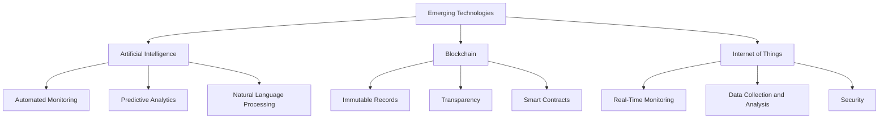
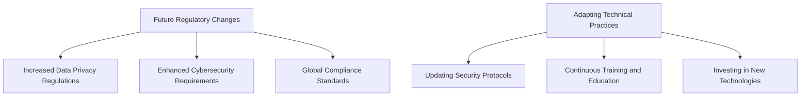
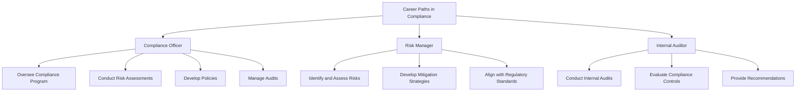
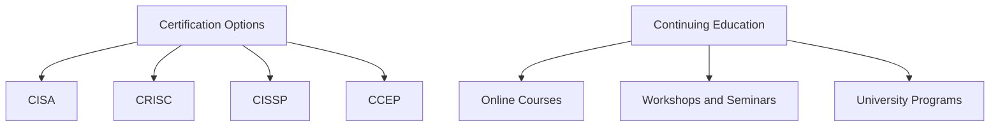
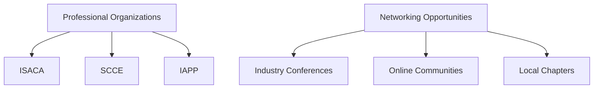

## Future Trends in Compliance

### Emerging Technologies

As technology advances, new tools and systems are being developed that significantly impact compliance monitoring and data security. Here are some key emerging technologies:

#### Impact of AI, Blockchain, and IoT on Compliance Monitoring and Data Security
- **Artificial Intelligence (AI):**
  - **Automated Monitoring:** AI can be used to automate the monitoring of compliance controls, quickly identifying anomalies and potential compliance breaches.
  - **Predictive Analytics:** AI algorithms can predict potential compliance issues by analyzing historical data and identifying patterns.
  - **Natural Language Processing (NLP):** AI-powered NLP tools can help in the analysis of large volumes of regulatory texts, making it easier to understand and comply with complex regulations.

- **Blockchain:**
  - **Immutable Records:** Blockchain technology ensures that once data is recorded, it cannot be altered, providing a tamper-proof record of transactions and activities.
  - **Transparency:** Blockchain offers a transparent ledger, making it easier to track and audit compliance-related activities.
  - **Smart Contracts:** Automated contracts that execute when certain conditions are met can help ensure compliance with regulatory requirements.

- **Internet of Things (IoT):**
  - **Real-Time Monitoring:** IoT devices can provide real-time data on various aspects of operations, helping to ensure compliance with regulatory standards.
  - **Data Collection and Analysis:** IoT devices can collect vast amounts of data that can be analyzed to monitor compliance and identify potential issues.
  - **Security:** Ensuring the security of IoT devices is critical, as they can be vulnerable to attacks that could lead to compliance breaches.

#### Predictions for Future Regulatory Changes and Compliance Requirements
The regulatory landscape is constantly evolving, and organizations must stay ahead of these changes to maintain compliance. Key predictions include:
- **Increased Data Privacy Regulations:** With growing concerns over data privacy, regulations like GDPR and CCPA will continue to influence new laws globally.
- **Enhanced Cybersecurity Requirements:** As cyber threats become more sophisticated, regulatory bodies will impose stricter cybersecurity requirements to protect sensitive data.
- **Global Compliance Standards:** There will be a push towards harmonizing compliance standards across different regions to simplify compliance for multinational organizations.

#### Adapting Technical Practices to Meet Evolving Compliance Standards
Organizations must adapt their technical practices to stay compliant with evolving standards. This involves:
- **Regularly Updating Security Protocols:** Ensure that security protocols are updated to meet the latest regulatory requirements and address emerging threats.
- **Continuous Training and Education:** Keep technical staff informed about new regulations and best practices through continuous training and education programs.
- **Investing in New Technologies:** Adopt new technologies that can help enhance compliance efforts, such as AI, blockchain, and advanced monitoring tools.

## Career Development in Compliance

### Career Paths in Compliance

Compliance roles are critical in ensuring that organizations adhere to laws, regulations, and internal policies. Here are some common career paths in compliance:

#### Roles and Responsibilities in Compliance Management and Governance
- **Compliance Officer:** Oversee the compliance program, ensuring that the organization adheres to regulatory requirements and internal policies. Responsibilities include conducting risk assessments, developing compliance policies, and managing audits.
- **Risk Manager:** Identify and assess risks that could impact the organization’s compliance. Develop strategies to mitigate these risks and ensure that risk management practices align with regulatory standards.
- **Internal Auditor:** Conduct internal audits to evaluate the effectiveness of compliance controls and identify areas for improvement. Provide recommendations for enhancing compliance efforts.

#### Certification Options and Continuing Education Resources for Career Advancement
To advance in compliance roles, professionals can pursue various certifications and continuing education opportunities:
- **Certifications:**
  - **Certified Information Systems Auditor (CISA):** Focuses on auditing, control, and assurance.
  - **Certified in Risk and Information Systems Control (CRISC):** Emphasizes risk management.
  - **Certified Information Systems Security Professional (CISSP):** Covers a broad range of security topics.
  - **Certified Compliance & Ethics Professional (CCEP):** Specializes in compliance and ethics.

- **Continuing Education:**
  - **Online Courses:** Platforms like Coursera, edX, and LinkedIn Learning offer courses on compliance, risk management, and information security.
  - **Workshops and Seminars:** Attend industry conferences and workshops to stay updated on the latest trends and best practices in compliance.
  - **University Programs:** Many universities offer degree programs and certifications in compliance, cybersecurity, and risk management.

#### Networking and Professional Organizations for Compliance Professionals
Joining professional organizations and networking with peers can provide valuable resources and opportunities for career development:
- **Professional Organizations:**
  - **ISACA:** Provides resources for IT governance, risk management, and compliance professionals.
  - **Society of Corporate Compliance and Ethics (SCCE):** Offers training, certification, and networking opportunities for compliance professionals.
  - **International Association of Privacy Professionals (IAPP):** Focuses on data privacy and offers certifications and resources.

- **Networking Opportunities:**
  - **Industry Conferences:** Attend conferences like RSA Conference, Black Hat, and ISACA conferences to network with peers and learn about the latest trends and technologies.
  - **Online Communities:** Join online forums and groups on platforms like LinkedIn to connect with other compliance professionals and share knowledge.
  - **Local Chapters:** Participate in local chapters of professional organizations to engage with the community and attend local events and meetings.

