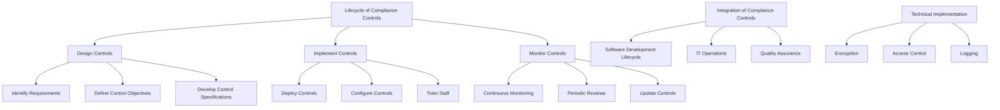
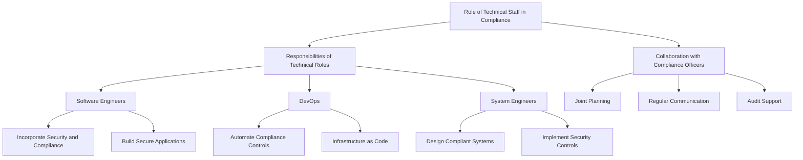
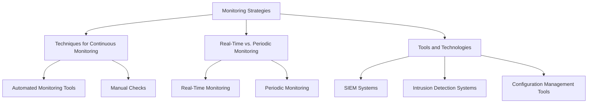
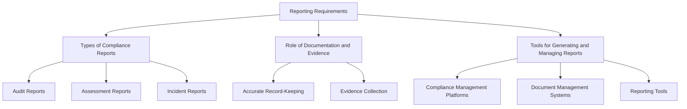

## Implementing Compliance Controls

### Lifecycle of Compliance Controls

Implementing effective compliance controls involves a structured lifecycle that includes designing, implementing, and monitoring controls. Here's an in-depth look at each step:

#### Steps Involved in Designing, Implementing, and Monitoring Compliance Controls
1. **Design Controls:**
   - **Identify Requirements:** Determine the regulatory and business requirements that the controls must address.
   - **Define Control Objectives:** Establish what each control is intended to achieve.
   - **Develop Control Specifications:** Create detailed specifications for each control, including how it will function and integrate with existing systems.

2. **Implement Controls:**
   - **Deploy Controls:** Integrate the designed controls into the organization's systems and processes.
   - **Configure Controls:** Set up the controls according to the specifications, ensuring they operate effectively and securely.
   - **Train Staff:** Educate relevant personnel on how to use and maintain the controls.

3. **Monitor Controls:**
   - **Continuous Monitoring:** Implement systems to continuously monitor the effectiveness of controls.
   - **Periodic Reviews:** Conduct regular assessments to ensure controls are functioning as intended.
   - **Update Controls:** Modify controls as necessary to address new threats or changes in regulatory requirements.

#### Integration of Compliance Controls into Organizational Processes
Compliance controls must be seamlessly integrated into various organizational processes to be effective. This includes:
- **Software Development Lifecycle (SDLC):** Incorporate security and compliance checks at each stage of development, from design to deployment.
- **IT Operations:** Embed compliance controls into daily operations, such as access management, data encryption, and system logging.
- **Quality Assurance (QA):** Ensure that compliance is part of the QA process, including testing for security vulnerabilities and compliance with regulatory standards.

#### Technical Implementation of Specific Controls
- **Encryption:** Use encryption to protect data at rest and in transit. Implement key management practices to secure encryption keys.
- **Access Control:** Implement role-based access control (RBAC) to restrict access to sensitive information based on user roles.
- **Logging:** Set up logging to record system activities, including access logs, error logs, and transaction logs. Ensure logs are securely stored and regularly reviewed.

### Role of Technical Staff in Compliance

Technical staff, including software engineers, DevOps, and system engineers, play a crucial role in ensuring compliance. Here are their key responsibilities:

#### Responsibilities of Technical Roles
- **Software Engineers:** Incorporate security and compliance requirements into code development. Ensure applications are built with security features and adhere to best practices.
- **DevOps:** Automate the deployment and management of compliance controls using tools like Ansible, Puppet, or Chef. Ensure that infrastructure as code (IaC) practices include compliance checks.
- **System Engineers:** Design and maintain system architectures that meet compliance requirements. Implement and manage security controls, such as firewalls, intrusion detection systems, and encryption.

#### Collaboration Between Technical Teams and Compliance Officers
- **Joint Planning:** Technical teams and compliance officers should work together during the planning phase to identify compliance requirements and design appropriate controls.
- **Regular Communication:** Maintain open lines of communication between technical teams and compliance officers to address compliance issues promptly.
- **Audit Support:** Technical staff should assist compliance officers during audits by providing necessary documentation, logs, and evidence of compliance controls.

## Compliance Monitoring and Reporting

### Monitoring Strategies

Continuous monitoring is essential for maintaining compliance. Here are some key monitoring strategies:

#### Techniques for Continuous Monitoring of Compliance Controls
- **Automated Monitoring Tools:** Use tools like Security Information and Event Management (SIEM) systems to automatically collect and analyze security data from various sources.
- **Manual Checks:** Conduct regular manual reviews of systems and processes to ensure compliance controls are functioning correctly.
  
#### Real-Time vs. Periodic Monitoring Approaches
  - **Real-Time Monitoring:** Provides immediate detection of compliance issues, allowing for quick response and mitigation.
  - **Periodic Monitoring:** Involves scheduled assessments and reviews, which can provide a comprehensive evaluation of compliance over time.

#### Tools and Technologies for Compliance Monitoring
- **SIEM Systems:** Collect and analyze security events from across the organization, providing a centralized view of compliance status.
- **Intrusion Detection Systems (IDS):** Monitor network traffic for signs of suspicious activity and potential security breaches.
- **Configuration Management Tools:** Ensure that systems remain in compliance with security policies by continuously monitoring and managing configurations.

### Reporting Requirements

Accurate and timely reporting is crucial for demonstrating compliance. Here are the key aspects of compliance reporting:

#### Types of Compliance Reports
- **Audit Reports:** Detailed documentation of audit findings, including any compliance issues identified and recommended corrective actions.
- **Assessment Reports:** Evaluations of compliance controls, typically conducted periodically to ensure ongoing adherence to regulatory requirements.
- **Incident Reports:** Documentation of security incidents, including details of the incident, response actions taken, and steps to prevent future occurrences.

#### Role of Documentation and Evidence in Compliance Reporting
- **Accurate Record-Keeping:** Maintain detailed records of all compliance-related activities, including control implementations, monitoring results, and incident responses.
- **Evidence Collection:** Gather and securely store evidence that demonstrates compliance with regulatory requirements. This may include logs, audit trails, and system configurations.

#### Tools for Generating and Managing Compliance Reports
- **Compliance Management Platforms:** Use platforms like Archer or MetricStream to automate the generation and management of compliance reports.
- **Document Management Systems:** Implement systems to organize, store, and retrieve compliance documentation efficiently.
- **Reporting Tools:** Use tools like Power BI or Tableau to create and visualize compliance reports, making it easier to identify trends and areas for improvement.

