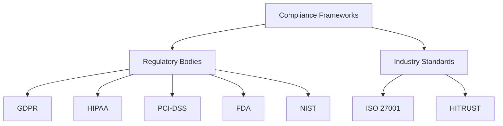
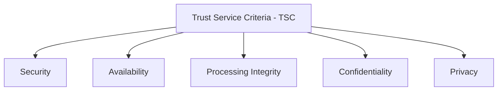
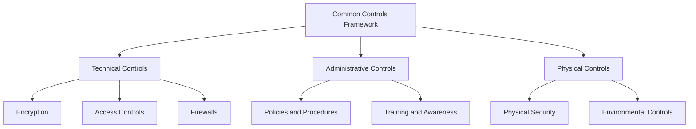

## Overview of Compliance Frameworks

### Understanding Regulatory and Industry-Specific Compliance
Compliance frameworks are structured sets of guidelines, standards, and best practices that organizations follow to meet regulatory requirements, ensure data security, and protect privacy. These frameworks are essential in establishing a systematic approach to managing and mitigating risks.

#### Definition of Compliance Frameworks

Compliance frameworks are structured sets of guidelines, standards, and best practices that organizations follow to meet regulatory requirements, ensure data security, and protect privacy. These frameworks provide a systematic approach to managing and mitigating risks, ensuring that organizations operate within legal and ethical boundaries.

#### Importance of Compliance

Compliance is crucial for several reasons:

- **Security:** Ensures that sensitive information is protected against unauthorized access, breaches, and other security threats.
- **Privacy:** Safeguards personal data, ensuring that it is collected, used, and stored in accordance with privacy laws and regulations.
- **Operational Integrity:** Maintains the reliability and functionality of organizational processes, reducing the risk of disruptions and operational failures.
- **Trust:** Builds trust with customers, partners, and regulatory bodies by demonstrating a commitment to high standards of governance and ethical conduct.

#### Overview of Major Regulatory Bodies and Their Compliance Frameworks

Different regulatory bodies oversee various compliance frameworks based on industry and geographical location. Some key frameworks include:

- **GDPR (General Data Protection Regulation):** A regulation in EU law on data protection and privacy in the European Union and the European Economic Area.
- **HIPAA (Health Insurance Portability and Accountability Act):** A US law designed to provide privacy standards to protect patients' medical records and other health information.
- **PCI-DSS (Payment Card Industry Data Security Standard):** A set of security standards designed to ensure that all companies that accept, process, store, or transmit credit card information maintain a secure environment.
- **FDA (Food and Drug Administration):** A US regulatory body that oversees the safety and efficacy of food, pharmaceuticals, and medical devices.
- **NIST (National Institute of Standards and Technology):** A US agency that develops and promotes measurement standards, including cybersecurity standards.

#### Importance of Compliance for Technical Roles

##### Impact on Software Development, IT Operations, and System Engineering

Compliance requirements influence how technical teams design, implement, and maintain systems and applications. Key impacts include:

- **Software Development:** Developers must incorporate security and privacy features into their code, adhere to secure coding practices, and ensure that applications comply with relevant regulations.
- **IT Operations:** IT teams must implement and manage infrastructure controls, such as access controls, encryption, and monitoring systems, to ensure compliance.
- **System Engineering:** Engineers must design and maintain systems that meet compliance standards, including ensuring data integrity, availability, and confidentiality.

##### Legal and Financial Consequences of Non-Compliance

Non-compliance can result in severe penalties, including:

- **Fines:** Regulatory bodies can impose substantial fines for non-compliance. For example, GDPR fines can reach up to 4% of annual global turnover or €20 million, whichever is higher.
- **Legal Action:** Organizations may face lawsuits from affected parties, leading to legal costs and potential settlements.
- **Reputational Damage:** Non-compliance can damage an organization's reputation, leading to loss of customer trust and business opportunities.

##### Role of Technical Staff in Maintaining and Ensuring Compliance:**
Technical staff play a crucial role in implementing and monitoring compliance controls. Their responsibilities include:
- **Implementing Controls:** Deploying technical controls, such as firewalls, encryption, and access controls, to protect data and systems.
- **Monitoring Systems:** Continuously monitoring systems for compliance with regulations and detecting potential security incidents.
- **Documenting Compliance:** Maintaining accurate records of compliance activities, such as audit logs, system configurations, and incident response actions.

### Key Components of Compliance Frameworks

#### Trust Service Criteria (TSC)

##### Explanation of the Five TSC Categories

The Trust Service Criteria (TSC) are principles used to evaluate and report on the controls of service organizations. The five TSC categories include:

- **Security:** Protecting information and systems against unauthorized access.
- **Availability:** Ensuring that information and systems are available for operation and use as committed.
- **Processing Integrity:** Ensuring that system processing is complete, valid, accurate, timely, and authorized.
- **Confidentiality:** Protecting information designated as confidential.
- **Privacy:** Ensuring that personal information is collected, used, retained, disclosed, and disposed of in accordance with the entity's privacy notice.

##### Role of TSC in Guiding Compliance Requirements
The TSC provides a framework for organizations to design, implement, and assess their controls. It ensures that all critical aspects of information security and privacy are addressed, promoting consistency and reliability in compliance practices.

#### Common Controls Framework

##### Overview of Common Controls Shared Across Multiple Compliance Frameworks:
Many compliance frameworks share common controls that address fundamental aspects of security, privacy, and operational integrity. These controls can be categorized into:

- **Technical Controls:** Implemented through technology, such as encryption, firewalls, and intrusion detection systems.
- **Administrative Controls:** Policies, procedures, and practices designed to manage the administrative aspects of an organization’s security posture.
- **Physical Controls:** Measures to protect the physical infrastructure, such as locks, surveillance systems, and environmental controls.

##### Examples of Controls and Their Applicability
- **Technical Controls:** 
  - **Encryption:** Protects data by converting it into a secure format that can only be read by authorized users.
  - **Access Controls:** Restricts access to systems and data based on user roles and permissions.
  - **Firewalls:** Monitors and controls incoming and outgoing network traffic based on predetermined security rules.
- **Administrative Controls:** 
  - **Policies and Procedures:** Written guidelines that outline security practices and expectations.
  - **Training and Awareness:** Programs designed to educate employees about security risks and best practices.
- **Physical Controls:** 
  - **Physical Security:** Measures like locks and access cards to secure facilities.
  - **Environmental Controls:** Systems that protect against environmental threats such as fire, flood, and temperature extremes.

##### Mapping Common Controls to Specific Compliance Frameworks
Each compliance framework may have specific requirements for controls, but common controls often serve as a foundation. For example:
- **GDPR:** Emphasizes data protection and privacy controls, including encryption and access controls.
- **HIPAA:** Requires controls to protect health information, such as physical security measures and access controls.
- **PCI-DSS:** Focuses on securing payment card information, requiring encryption, firewalls, and access controls.

