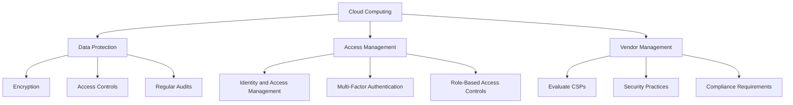
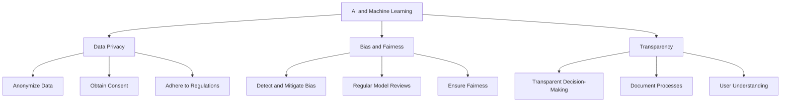
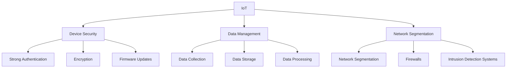
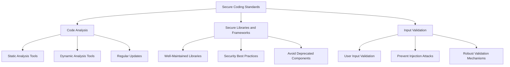
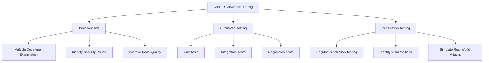
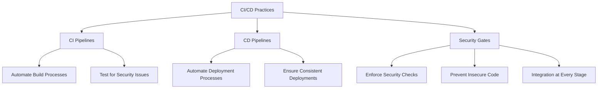
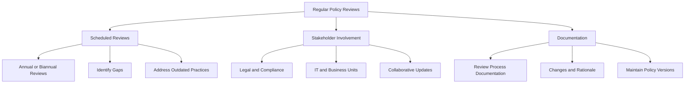
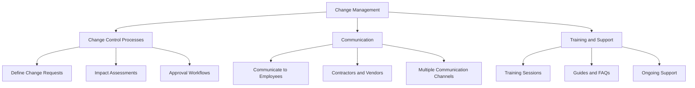
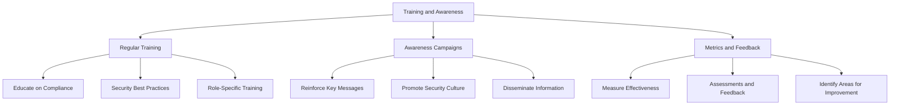

## Developing Comprehensive Policies for Emerging Technologies

### Introduction
Emerging technologies such as cloud computing, AI and machine learning, and IoT present unique challenges and opportunities for compliance. Developing comprehensive policies for these technologies ensures that organizations can leverage their benefits while maintaining security and compliance.

### Cloud Computing
Cloud computing involves delivering computing services—servers, storage, databases, networking, software, and more—over the internet ("the cloud"). It offers flexibility, scalability, and cost savings but also introduces new security and compliance challenges.

- **Data Protection:** Ensure that data stored in the cloud is protected through encryption, access controls, and regular audits. Define clear policies for data classification, handling, and storage.
- **Access Management:** Implement robust identity and access management (IAM) practices to control who can access cloud resources. Use multi-factor authentication (MFA) and role-based access controls (RBAC) to enhance security.
- **Vendor Management:** Evaluate cloud service providers (CSPs) for their security practices and compliance with relevant regulations. Establish contracts that specify security and compliance requirements.

### AI and Machine Learning
AI and machine learning technologies can analyze vast amounts of data, identify patterns, and make decisions. However, they also raise concerns about data privacy, bias, and transparency.

- **Data Privacy:** Develop policies to ensure that AI systems handle data responsibly. This includes anonymizing data, obtaining consent, and adhering to data protection regulations.
- **Bias and Fairness:** Implement measures to detect and mitigate bias in AI models. Regularly review and update models to ensure fairness and avoid discriminatory outcomes.
- **Transparency:** Ensure that AI systems are transparent and explainable. Document how decisions are made and provide mechanisms for users to understand and challenge AI-driven decisions.

### IoT (Internet of Things)
IoT devices connect to the internet and each other, collecting and exchanging data. This interconnectedness increases the attack surface and poses security and privacy risks.

- **Device Security:** Ensure that IoT devices are secure by implementing strong authentication, encryption, and regular firmware updates.
- **Data Management:** Develop policies for the collection, storage, and processing of data from IoT devices. Ensure data is encrypted and access is restricted.
- **Network Segmentation:** Segment IoT devices from the main network to limit the impact of potential breaches. Use firewalls and intrusion detection systems to monitor and control traffic.

## Secure Software Development (DevSecOps Practices)

DevSecOps integrates security practices into the DevOps process, ensuring that security is a core part of the software development lifecycle (SDLC). This approach promotes collaboration between development, operations, and security teams to deliver secure software.

### Secure Coding Standards
Secure coding standards provide guidelines for writing code that is secure and free from vulnerabilities. These standards help developers avoid common security pitfalls and follow best practices.

- **Code Analysis:** Use static and dynamic analysis tools to detect vulnerabilities in code. Regularly review and update coding standards to address new security threats.
- **Secure Libraries and Frameworks:** Use well-maintained libraries and frameworks that follow security best practices. Avoid using deprecated or untrusted components.
- **Input Validation:** Ensure that all user inputs are validated to prevent injection attacks and other security issues. Implement robust validation mechanisms and sanitize inputs.

### Code Reviews and Testing
Code reviews and testing are essential practices for identifying and addressing security vulnerabilities before software is deployed.

- **Peer Reviews:** Conduct peer reviews to ensure that code is examined by multiple developers. Peer reviews help identify potential security issues and improve code quality.
- **Automated Testing:** Use automated testing tools to perform security testing, including unit tests, integration tests, and regression tests. Automated tests ensure that security checks are consistently applied.
- **Penetration Testing:** Conduct regular penetration testing to identify and exploit vulnerabilities in the application. Penetration tests simulate real-world attacks and provide insights into potential security weaknesses.

### Continuous Integration/Continuous Deployment (CI/CD)
CI/CD practices automate the integration and deployment of code changes, ensuring that software is continuously tested and deployed in a secure manner.

- **CI Pipelines:** Implement CI pipelines to automate the build, test, and integration processes. CI pipelines ensure that code changes are automatically tested for security issues.
- **CD Pipelines:** Use CD pipelines to automate the deployment of code changes to production. CD pipelines ensure that deployments are consistent, repeatable, and secure.
- **Security Gates:** Integrate security gates into CI/CD pipelines to enforce security checks at every stage of the development lifecycle. Security gates help prevent insecure code from being deployed.

## Adapting Policies and Procedures to Dynamic Regulatory Landscapes

Regulatory requirements are constantly evolving, and organizations must adapt their policies and procedures to stay compliant. This involves regular reviews, effective change management, and ongoing training and awareness programs.

### Regular Policy Reviews
Regularly reviewing policies ensures that they remain current and effective in addressing new regulatory requirements and security threats.

- **Scheduled Reviews:** Establish a regular schedule for policy reviews, such as annually or biannually. Regular reviews help identify and address gaps or outdated practices.
- **Stakeholder Involvement:** Involve relevant stakeholders, including legal, compliance, IT, and business units, in the policy review process. Collaboration ensures comprehensive and effective policy updates.
- **Documentation:** Document the review process, including changes made, rationale, and approval. Maintain a record of policy versions and updates for audit purposes.

### Change Management
Effective change management ensures that policy and procedure updates are implemented smoothly and that all affected parties are aware of the changes.

- **Change Control Processes:** Establish formal change control processes to manage policy updates. This includes defining change requests, impact assessments, and approval workflows.
- **Communication:** Communicate changes to all relevant parties, including

 employees, contractors, and third-party vendors. Use multiple communication channels to ensure broad awareness.
- **Training and Support:** Provide training and support to help employees understand and implement policy changes. Offer resources such as training sessions, guides, and FAQs.

### Training and Awareness
Ongoing training and awareness programs ensure that employees understand compliance requirements and can effectively implement policies and procedures.

- **Regular Training:** Conduct regular training sessions to educate employees on compliance requirements, security best practices, and policy updates. Tailor training to different roles and responsibilities.
- **Awareness Campaigns:** Launch awareness campaigns to reinforce key compliance messages and promote a culture of security. Use posters, emails, and intranet articles to disseminate information.
- **Metrics and Feedback:** Measure the effectiveness of training and awareness programs through assessments and feedback. Use metrics such as participation rates, quiz scores, and employee feedback to identify areas for improvement.

