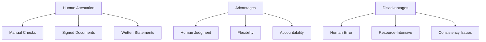
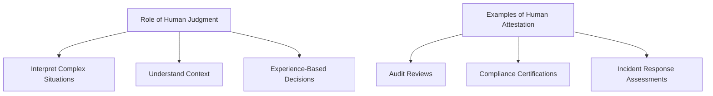
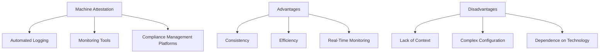

## Understanding Human Attestation of Evidence

### Definition and Explanation

Human attestation involves individuals reviewing and certifying that compliance controls and procedures are being followed. This can include signing documents, conducting manual checks, and providing written statements. Human attestation leverages the expertise and judgment of individuals to verify compliance evidence.

- **Manual Checks:** Human auditors or compliance officers manually review logs, reports, and other documents to ensure that compliance controls are being adhered to.
- **Signed Documents:** Individuals, often senior management or compliance officers, sign off on documents to attest that certain compliance requirements have been met.
- **Written Statements:** Written certifications or attestations provided by individuals affirming that compliance processes are followed correctly.

### Advantages and Disadvantages

#### Advantages
- **Human Judgment:** Humans can interpret complex situations, understand context, and make informed decisions based on experience.
- **Flexibility:** Human attestation allows for flexibility in assessing compliance, considering various factors that automated systems might overlook.
- **Accountability:** Provides a clear line of responsibility and accountability, as specific individuals are accountable for their attestations.

#### Disadvantages
- **Human Error:** Susceptible to errors, omissions, and biases, which can affect the accuracy and reliability of the attestation.
- **Resource-Intensive:** Manual processes can be time-consuming and require significant human resources.
- **Consistency Issues:** Human judgment can vary, leading to inconsistencies in compliance verification.

## Role of Human Judgment and Expertise in Verifying Compliance Evidence

### Importance of Human Judgment

Human judgment is crucial in interpreting complex situations, understanding the context of evidence, and making decisions based on experience and expertise. Human auditors can assess the adequacy of controls, identify potential issues, and provide insights that automated systems might miss.

### Examples of Human Attestation in Compliance

- **Audit Reviews:** Compliance officers review audit logs to identify unusual activities and verify that access controls are properly implemented.
- **Compliance Certifications:** Senior management provides certifications that the organization complies with specific regulatory requirements.
- **Incident Response Assessments:** Human experts evaluate the response to security incidents, ensuring that proper procedures were followed and identifying areas for improvement.

## Machine Attestation Methods

### Definition and Explanation

Machine attestation involves using automated tools and systems to collect, verify, and attest to compliance evidence. This includes automated logging, monitoring tools, and compliance management platforms that continuously assess compliance controls.

- **Automated Logging:** Systems automatically record events, actions, and changes in real-time, providing a comprehensive log of activities.
- **Monitoring Tools:** Tools that continuously monitor network traffic, system activities, and user behaviors to detect compliance violations.
- **Compliance Management Platforms:** Integrated platforms that automate compliance tasks, generate reports, and provide real-time insights into the compliance status.

### Examples

- **Automated Logging:** Tools like Splunk or Graylog collect and analyze log data to ensure compliance with logging requirements.
- **Monitoring Tools:** Solutions like Nagios or SolarWinds monitor system performance and security, alerting administrators to potential issues.
- **Compliance Management Platforms:** Platforms like Qualys or Rapid7 provide automated compliance assessments, vulnerability scanning, and reporting capabilities.

### Advantages and Disadvantages

#### Advantages
- **Consistency:** Automated systems provide consistent and repeatable processes for verifying compliance, reducing variability.
- **Efficiency:** Automation can process large volumes of data quickly and accurately, saving time and resources.
- **Real-Time Monitoring:** Provides continuous, real-time insights into the compliance status, enabling prompt detection and response to issues.

#### Disadvantages
- **Lack of Context:** Automated systems may miss nuanced or context-specific issues that require human judgment.
- **Complex Configuration:** Requires proper setup, configuration, and maintenance to ensure accurate and reliable results.
- **Dependence on Technology:** Relies on the accuracy and reliability of the underlying technology, which can sometimes fail or be compromised.

