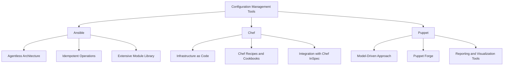
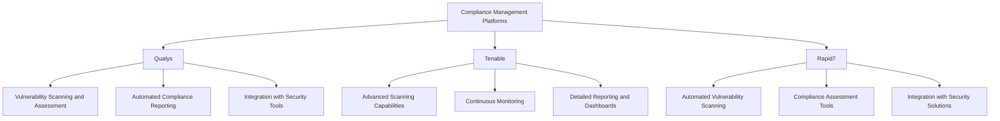
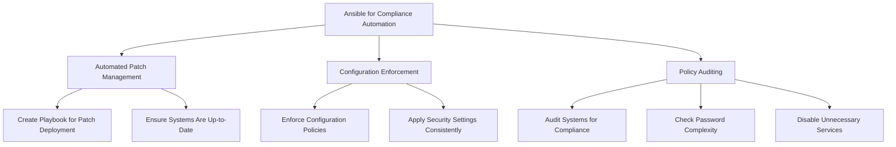
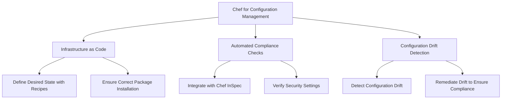
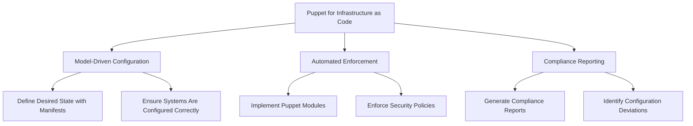

## Using Automation Tools to Streamline Compliance Tasks

### Introduction
Automation tools are essential for streamlining compliance tasks, reducing manual effort, and ensuring consistency and accuracy in compliance processes. These tools can help organizations manage and enforce compliance controls more efficiently.

### Configuration Management Tools
Configuration management tools help automate the deployment, configuration, and management of systems. These tools ensure that systems are configured correctly and consistently, reducing the risk of human error and improving compliance.

#### Ansible
- **Overview:** Ansible is an open-source automation tool that automates software provisioning, configuration management, and application deployment. It uses simple, human-readable YAML files called playbooks to define automation tasks.
- **Benefits:** 
  - Agentless architecture, which simplifies deployment and management.
  - Idempotent operations, ensuring tasks can be repeated without adverse effects.
  - Extensive module library for managing various systems and applications.

#### Chef
- **Overview:** Chef is a powerful automation platform that transforms infrastructure into code. It automates the management of infrastructure and applications, enabling continuous compliance.
- **Benefits:**
  - Infrastructure as Code (IaC) approach, allowing version control and repeatability.
  - Chef recipes and cookbooks provide reusable code for managing infrastructure.
  - Integration with compliance tools like Chef InSpec for automated compliance checks.

#### Puppet
- **Overview:** Puppet is an open-source configuration management tool that automates the provisioning, configuration, and management of servers and applications. It uses a declarative language to define the desired state of systems.
- **Benefits:**
  - Model-driven approach, defining the desired state of infrastructure.
  - Puppet Forge provides a vast repository of pre-built modules and configurations.
  - Powerful reporting and visualization tools for compliance and audit purposes.

### Compliance Management Platforms
Compliance management platforms provide a centralized solution for managing compliance activities, automating assessments, and generating reports. These platforms help organizations maintain compliance with various regulatory standards by providing tools for continuous monitoring, risk assessment, and remediation.

#### Qualys
- **Overview:** Qualys is a cloud-based security and compliance platform that offers a wide range of solutions, including vulnerability management, policy compliance, and web application security.
- **Benefits:**
  - Comprehensive vulnerability scanning and assessment capabilities.
  - Automated compliance reporting and policy enforcement.
  - Integration with other security tools for a unified compliance approach.

#### Tenable
- **Overview:** Tenable provides comprehensive solutions for vulnerability management and compliance. It offers tools like Nessus and Tenable.io for scanning, assessing, and managing vulnerabilities and compliance requirements.
- **Benefits:**
  - Advanced scanning capabilities for detecting vulnerabilities and misconfigurations.
  - Continuous monitoring and assessment of compliance controls.
  - Detailed reporting and dashboards for compliance visibility.

#### Rapid7
- **Overview:** Rapid7 offers a range of security and compliance solutions, including vulnerability management, incident detection, and response. Its platform helps organizations improve their security posture and maintain compliance.
- **Benefits:**
  - Automated vulnerability scanning and remediation workflows.
  - Comprehensive compliance assessment and reporting tools.
  - Integration with other security solutions for enhanced compliance management.

## Practical Examples of Using Automation Tools

### Ansible for Compliance Automation

#### Overview
Ansible simplifies compliance automation by using playbooks to define and enforce compliance policies across systems. It can automate tasks such as patch management, configuration enforcement, and policy auditing.

#### Practical Example
- **Automated Patch Management:** Create an Ansible playbook to automate the deployment of security patches across all servers. This ensures that all systems are up-to-date with the latest security updates.
- **Configuration Enforcement:** Use Ansible to enforce configuration policies, such as ensuring that specific security settings are applied consistently across all systems.
- **Policy Auditing:** Develop playbooks to audit systems for compliance with specific policies, such as checking for password complexity requirements or ensuring that unnecessary services are disabled.

### Chef for Configuration Management

#### Overview
Chef automates configuration management by treating infrastructure as code. It uses recipes and cookbooks to define and enforce configurations, ensuring that systems remain in a compliant state.

#### Practical Example
- **Infrastructure as Code:** Use Chef recipes to define the desired state of infrastructure, such as ensuring that specific packages are installed and configured correctly.
- **Automated Compliance Checks:** Integrate Chef with InSpec to perform automated compliance checks, such as verifying that security settings meet regulatory requirements.
- **Configuration Drift Detection:** Use Chef to detect and remediate configuration drift, ensuring that systems remain compliant with defined policies.

### Puppet for Infrastructure as Code

#### Overview
Puppet automates the provisioning, configuration, and management of infrastructure using a model-driven approach. It defines the desired state of systems and enforces configurations to maintain compliance.

#### Practical Example
- **Model-Driven Configuration:** Use Puppet manifests to define the desired state of infrastructure, ensuring that systems are configured according to compliance requirements.
- **Automated Enforcement:** Implement Puppet modules to automate the enforcement of security policies, such as ensuring that firewalls are configured correctly and that only authorized users have access to systems.
- **Compliance Reporting:** Use Puppet’s reporting capabilities to generate compliance reports, providing visibility into the state of configurations and identifying any deviations from compliance policies.

