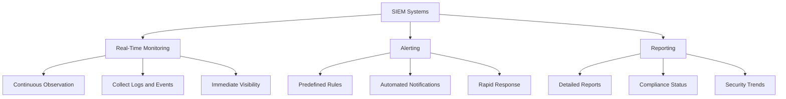
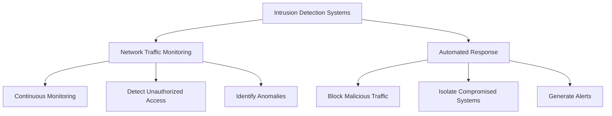
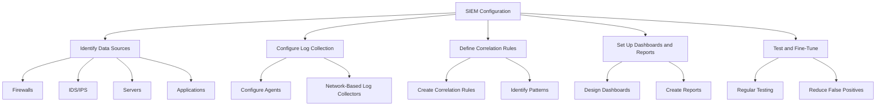
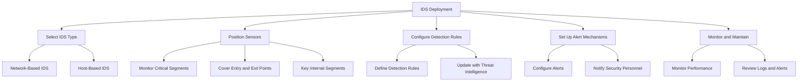

## Setting Up Continuous Monitoring Systems

### Introduction

Continuous compliance monitoring is an ongoing process that ensures an organization’s security controls are effective and that compliance requirements are being met. This involves the use of various tools and technologies to monitor systems, networks, and applications in real time.

### SIEM Systems
Security Information and Event Management (SIEM) systems collect, analyze, and report on security-related data from various sources within an organization. SIEM systems provide real-time monitoring, alerting, and reporting capabilities, helping organizations detect and respond to security incidents promptly.

#### Real-time Monitoring
- **Overview:** Real-time monitoring involves continuously observing systems and networks for security events and anomalies. SIEM systems collect logs and events from various sources, such as firewalls, servers, and applications.
- **Benefits:** Provides immediate visibility into potential security incidents, enabling rapid response and mitigation. Real-time monitoring helps detect unauthorized access, malware infections, and other security threats.

#### Alerting
- **Overview:** SIEM systems generate alerts based on predefined rules and correlations. Alerts notify security teams of potential security incidents, allowing them to investigate and respond quickly.
- **Benefits:** Automated alerting reduces the time it takes to detect and respond to security incidents. Alerts can be customized to prioritize critical events and minimize false positives.

#### Reporting
- **Overview:** SIEM systems generate detailed reports on security events, compliance status, and overall security posture. Reports can be scheduled or generated on-demand to provide insights into security trends and compliance efforts.
- **Benefits:** Reporting helps organizations demonstrate compliance with regulatory requirements and internal policies. It provides valuable insights into security trends, helping organizations identify areas for improvement.

### Intrusion Detection Systems (IDS)
Intrusion Detection Systems monitor network traffic for suspicious activities and potential threats. IDS can be either network-based (NIDS) or host-based (HIDS). They analyze traffic patterns and compare them against known attack signatures or behavioral patterns to detect intrusions.

#### Network Traffic Monitoring
- **Overview:** IDS continuously monitor network traffic to detect unauthorized access, malware, and other threats. They inspect packet contents and traffic patterns to identify anomalies and known attack signatures.
- **Benefits:** Provides visibility into network activity and helps detect security breaches early. Network traffic monitoring is essential for identifying threats that bypass perimeter defenses.

#### Automated Response
- **Overview:** Some IDS can be configured to take automated actions in response to detected threats. These actions may include blocking malicious traffic, isolating compromised systems, or generating alerts for further investigation.
- **Benefits:** Automated responses help mitigate threats quickly, reducing the impact of security incidents. They enhance the overall security posture by providing immediate action against detected threats.

## Configuring and Using Monitoring Tools

### SIEM Configuration

**Overview:**
Configuring a SIEM system involves setting up data sources, defining correlation rules, and creating dashboards and reports. Proper configuration ensures that the SIEM system effectively monitors security events and provides actionable insights.

#### Steps to Configure SIEM
- **Identify Data Sources:** Determine which systems and devices will send log data to the SIEM system. Common data sources include firewalls, intrusion detection systems, servers, and applications.
- **Configure Log Collection:** Set up log collection mechanisms to gather data from identified sources. This may involve configuring agents on endpoints or using network-based log collectors.
- **Define Correlation Rules:** Create rules to correlate events from different sources, identifying patterns indicative of security incidents. Correlation rules help detect complex attack scenarios that single events might not reveal.
- **Set Up Dashboards and Reports:** Design dashboards to visualize security data and create reports that provide insights into compliance status and security trends. Dashboards should highlight critical metrics and incidents for quick analysis.
- **Test and Fine-Tune:** Regularly test the SIEM configuration to ensure it accurately detects and reports incidents. Fine-tune rules and settings to reduce false positives and improve detection accuracy.

### IDS Deployment

**Overview:**
Deploying an IDS involves selecting the appropriate type of IDS, positioning sensors, configuring detection rules, and setting up alert mechanisms. Effective deployment ensures that the IDS monitors critical network segments and detects threats accurately.

#### Steps to Deploy IDS
- **Select IDS Type:** Choose between network-based IDS (NIDS) and host-based IDS (HIDS) based on the organization's needs. NIDS monitor network traffic, while HIDS monitor individual hosts.
- **Position Sensors:** Strategically place IDS sensors to monitor critical network segments. Sensors should cover entry and exit points, as well as key internal network segments.
- **Configure Detection Rules:** Define rules and signatures to detect known attack patterns and anomalies. Regularly update detection rules to include the latest threat intelligence.
- **Set Up Alert Mechanisms:** Configure the IDS to generate alerts for detected threats. Alerts should be sent to security personnel for investigation and response.
- **Monitor and Maintain:** Continuously monitor IDS performance and update configurations as needed. Regularly review logs and alerts to identify potential improvements.

