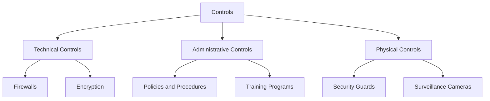
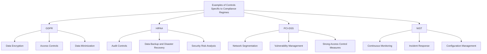

## Understanding Controls

### Definition and Purpose of Controls

#### Definition of Controls
Controls are measures implemented by organizations to manage risks, protect assets, ensure data integrity, and maintain compliance with regulatory standards. They are essential safeguards that help organizations operate within legal and industry standards.

#### Importance and Purpose of Controls
- **Risk Management:** Controls help identify, assess, and mitigate risks that could impact the organization’s operations, security, and compliance.
- **Protection of Assets:** By implementing controls, organizations can protect their physical, financial, and informational assets from threats and vulnerabilities.
- **Ensuring Data Integrity:** Controls ensure that data is accurate, consistent, and reliable, which is crucial for decision-making and regulatory compliance.
- **Compliance with Regulatory Standards:** Controls ensure that the organization adheres to laws, regulations, and industry standards, avoiding legal penalties and reputational damage.

#### Classification of Controls
- **Technical Controls:** Use technology to protect systems and data.
- **Administrative Controls:** Involve policies, procedures, and guidelines that manage security and compliance.
- **Physical Controls:** Protect the physical infrastructure of an organization.

### Technical Controls

#### Examples and Explanation
- **Firewalls:** Devices or software that monitor and control incoming and outgoing network traffic based on predetermined security rules. They act as barriers between trusted and untrusted networks.
- **Intrusion Detection Systems (IDS):** Tools that monitor network or system activities for malicious activities or policy violations. They can alert administrators to potential threats.
- **Encryption:** The process of converting data into a code to prevent unauthorized access. It can be applied to data at rest (stored data) and data in transit (data being transmitted).
- **Access Control Mechanisms:** Systems that restrict access to resources based on user roles and permissions. This includes methods like multi-factor authentication (MFA) and role-based access control (RBAC).

#### Implementation and Best Practices
- **Firewalls:** Regularly update firewall rules and configurations to reflect current security needs. Monitor and analyze firewall logs to detect unusual activities.
- **Intrusion Detection Systems:** Implement IDS to monitor critical network segments and systems. Ensure IDS signatures and rules are updated to detect the latest threats.
- **Encryption:** Use strong encryption algorithms (e.g., AES-256) and manage encryption keys securely. Encrypt sensitive data both at rest and in transit.
- **Access Control Mechanisms:** Implement MFA for accessing sensitive systems. Use RBAC to ensure users have the minimum necessary access based on their roles.

### Administrative Controls

#### Examples and Explanation
- **Policies and Procedures:** Formalized rules and guidelines that dictate how an organization manages its security and compliance efforts. Examples include data protection policies, acceptable use policies, and incident response procedures.
- **Risk Assessments:** The process of identifying, analyzing, and evaluating risks to the organization’s operations and assets. Regular risk assessments help prioritize security measures.
- **Training Programs:** Educational programs designed to inform employees about security policies, best practices, and their roles in maintaining compliance. Training should be ongoing and updated regularly.
- **Incident Response Plans:** Detailed plans that outline the steps to take in response to a security incident. These plans help minimize damage and ensure a quick recovery.

#### Implementation and Best Practices
- **Policies and Procedures:** Develop comprehensive policies that cover all aspects of security and compliance. Ensure they are easily accessible and regularly reviewed and updated.
- **Risk Assessments:** Conduct risk assessments periodically and whenever significant changes occur in the organization. Use the results to inform security strategies and controls.
- **Training Programs:** Implement mandatory security training for all employees. Tailor training programs to different roles and responsibilities within the organization.
- **Incident Response Plans:** Develop and test incident response plans regularly. Ensure all employees understand their roles in the event of an incident.

### Physical Controls

#### Examples and Explanation
- **Security Guards:** Personnel responsible for monitoring and protecting physical premises. They can prevent unauthorized access and respond to physical security incidents.
- **Surveillance Cameras:** Cameras used to monitor and record activities in and around the organization’s facilities. They act as a deterrent and provide evidence in case of incidents.
- **Access Control Systems:** Systems that regulate entry to physical locations using methods such as keycards, biometric scans, or PIN codes. These systems ensure only authorized personnel can access sensitive areas.
- **Environmental Controls:** Measures that protect physical infrastructure from environmental threats like fire, flood, and extreme temperatures. Examples include fire suppression systems and climate control systems.

#### Implementation and Best Practices
- **Security Guards:** Train security personnel thoroughly and ensure they understand the organization’s security policies and procedures.
- **Surveillance Cameras:** Place cameras strategically to cover all critical areas. Regularly maintain and review camera footage.
- **Access Control Systems:** Implement robust access control systems that use multiple authentication methods. Regularly audit access logs and review access permissions.
- **Environmental Controls:** Install and maintain environmental controls to protect physical infrastructure. Conduct regular drills and inspections to ensure these controls function correctly.

### Examples of Controls Specific to Different Compliance Regimes

#### GDPR (General Data Protection Regulation)

- **Data Encryption:** Encrypt personal data to protect it from unauthorized access. Ensure encryption keys are managed securely.

- **Access Controls:** Implement strong authentication mechanisms to ensure that only authorized personnel can access personal data. Use MFA and RBAC to enhance security.

- **Data Minimization:** Ensure that only the necessary data is collected and processed. Regularly review data collection practices to minimize data usage.

#### HIPAA (Health Insurance Portability and Accountability Act)

- **Audit Controls:** Implement mechanisms to record and examine access and other activity in systems containing electronic protected health information (ePHI). Regularly review audit logs for unusual activity.

- **Data Backup and Disaster Recovery:** Ensure that ePHI is regularly backed up and that there are plans in place for recovering data in case of a disaster. Test backup and recovery processes periodically.

- **Security Risk Analysis:** Conduct regular assessments to identify and mitigate risks to ePHI. Use the results to inform security strategies and controls.

#### PCI-DSS (Payment Card Industry Data Security Standard)

- **Network Segmentation:** Isolate the cardholder data environment from the rest of the network to reduce the scope of compliance. Use firewalls and VLANs to achieve segmentation.

- **Vulnerability Management:** Regularly scan for vulnerabilities and apply security patches to systems. Use automated tools to identify and remediate vulnerabilities promptly.

- **Strong Access Control Measures:** Implement MFA for accessing systems that handle payment card data. Use RBAC to restrict access based on user roles and responsibilities.

#### NIST (National Institute of Standards and Technology)

- **Continuous Monitoring:** Implement tools and processes to continuously monitor information systems for security threats. Use SIEM systems to collect and analyze security data in real-time.

- **Incident Response:** Establish an incident response plan to detect, respond to, and recover from security incidents. Regularly test and update the plan.

- **Configuration Management:** Ensure that systems are configured securely and that configurations are regularly reviewed and updated. Use automated tools to manage and enforce configurations.

