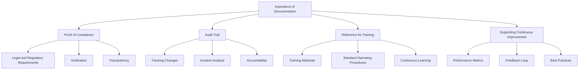
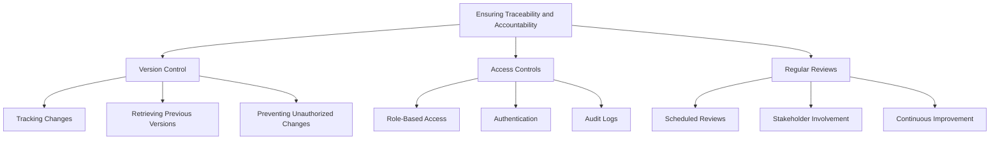

## Importance of Accurate and Comprehensive Documentation

### Proof of Compliance
Accurate and comprehensive documentation serves as tangible evidence that an organization is adhering to regulatory requirements and compliance standards. This proof is crucial during audits and inspections to demonstrate that the necessary controls and procedures are in place and functioning effectively.

- **Legal and Regulatory Requirements:** Many compliance frameworks mandate specific documentation to verify adherence to policies and procedures.
- **Verification:** Documentation allows auditors to verify that compliance measures have been properly implemented and maintained.
- **Transparency:** Provides a clear record of the organization’s compliance efforts, fostering trust with regulators, customers, and stakeholders.

### Audit Trail
An audit trail is a chronological record of all compliance-related activities, providing a history of actions taken, changes made, and decisions implemented. This trail is essential for tracking the implementation and effectiveness of compliance controls.

- **Tracking Changes:** Documentation captures changes to systems, processes, and controls, allowing for thorough tracking and auditing.
- **Incident Analysis:** Helps in analyzing incidents by providing detailed records of what occurred and the responses taken.
- **Accountability:** Ensures that all actions are recorded, enabling accountability for compliance activities.

### Reference for Training
Documentation serves as a valuable resource for training employees on compliance requirements and best practices. It ensures that all staff members have access to the same information, promoting consistency in understanding and implementing compliance measures.

- **Training Materials:** Provides detailed guidelines and procedures for new employees and ongoing training programs.
- **Standard Operating Procedures (SOPs):** Clear and detailed SOPs help employees understand their roles and responsibilities in maintaining compliance.
- **Continuous Learning:** Updated documentation reflects current practices and standards, supporting continuous learning and improvement.

### Supporting Continuous Improvement
Comprehensive documentation is crucial for identifying areas of improvement in compliance processes. It enables organizations to review their practices, assess effectiveness, and make necessary adjustments to enhance their compliance posture.

- **Performance Metrics:** Documentation provides data for measuring the performance of compliance controls and identifying gaps or weaknesses.
- **Feedback Loop:** Encourages a feedback loop where employees can report issues or suggest improvements based on documented procedures.
- **Best Practices:** Helps in benchmarking against industry best practices and implementing improvements.

## Tools and Systems for Managing Compliance Documentation

### Compliance Management Platforms
Compliance management platforms provide a centralized system for managing all aspects of compliance, including documentation, assessments, and reporting. These platforms streamline the compliance process and ensure that documentation is accurate, accessible, and up-to-date.

- **Features:** Automated compliance assessments, document management, reporting tools, and real-time monitoring.
- **Examples:** Qualys, MetricStream, and RSA Archer.
- **Benefits:** Enhances efficiency, reduces manual effort, and improves the accuracy of compliance documentation.

### Document Management Systems
Document management systems (DMS) are designed to store, manage, and track electronic documents. These systems facilitate the organization and retrieval of compliance-related documents, ensuring that they are secure and easily accessible.

- **Features:** Document storage, version control, access controls, and collaboration tools.
- **Examples:** SharePoint, DocuWare, and M-Files.
- **Benefits:** Ensures documents are organized, secure, and can be easily accessed and updated by authorized personnel.

### Audit Management Systems
Audit management systems streamline the audit process by providing tools for planning, executing, and documenting audits. These systems help ensure that audits are thorough, efficient, and well-documented.

- **Features:** Audit planning, checklists, task management, and reporting tools.
- **Examples:** AuditBoard, Wolters Kluwer TeamMate, and Galvanize HighBond.
- **Benefits:** Enhances audit efficiency, improves documentation accuracy, and ensures thorough audit coverage.

```mermaid
graph TD;
    A[Tools for Managing Compliance Documentation] --> B[Compliance Management Platforms]
    A --> C[Document Management Systems]
    A --> D[Audit Management Systems]
    B --> E[Features]
    B --> F[Examples]
    B --> G[Benefits]
    C --> H[Features]
    C --> I[Examples]
    C --> J[Benefits]
    D --> K[Features]
    D --> L[Examples]
    D --> M[Benefits]
    E --> N[Automated Assessments]
    E --> O[Document Management]
    E --> P[Reporting Tools]
    E --> Q[Real-Time Monitoring]
    F --> R[Qualys]
    F --> S[MetricStream]
    F --> T[RSA Archer]
    G --> U[Efficiency]
    G --> V[Reduced Manual Effort]
    G --> W[Improved Accuracy]
    H --> X[Document Storage]
    H --> Y[Version Control]
    H --> Z[Access Controls]
    H --> AA[Collaboration Tools]
    I --> AB[SharePoint]
    I --> AC[DocuWare]
    I --> AD[M-Files]
    J --> AE[Organization]
    J --> AF[Security]
    J --> AG[Easy Access]
    K --> AH[Audit Planning]
    K --> AI[Checklists]
    K --> AJ[Task Management]
    K --> AK[Reporting Tools]
    L --> AL[AuditBoard]
    L --> AM[Wolters Kluwer TeamMate]
    L --> AN[Galvanize HighBond]
    M --> AO[Enhanced Efficiency]
    M --> AP[Improved Accuracy]
    M --> AQ[Thorough Coverage]
```

## Ensuring Traceability and Accountability Through Documentation Practices

### Version Control
Version control is crucial for maintaining the integrity and accuracy of compliance documentation. It ensures that all changes to documents are tracked, allowing organizations to maintain a history of revisions and updates.

- **Tracking Changes:** Records all changes made to documents, including who made the changes and when.
- **Retrieving Previous Versions:** Allows retrieval of previous document versions if needed for review or audit purposes.
- **Preventing Unauthorized Changes:** Ensures that only authorized individuals can make changes to critical compliance documents.

### Access Controls
Access controls are essential for protecting compliance documentation from unauthorized access and ensuring that sensitive information is only available to authorized personnel.

- **Role-Based Access:** Assigns access permissions based on user roles, ensuring that individuals can only access documents relevant to their responsibilities.
- **Authentication:** Requires users to authenticate their identity before accessing compliance documents.
- **Audit Logs:** Maintains logs of who accessed or modified documents, providing a record for accountability and audit purposes.

### Regular Reviews
Regular reviews of compliance documentation are necessary to ensure that documents remain accurate, relevant, and up-to-date. This practice helps organizations adapt to changing regulatory requirements and internal policies.

- **Scheduled Reviews:** Establish a regular schedule for reviewing and updating compliance documentation.
- **Stakeholder Involvement:** Involve relevant stakeholders in the review process to ensure comprehensive and accurate updates.
- **Continuous Improvement:** Use feedback from reviews to improve documentation practices and ensure ongoing compliance.

