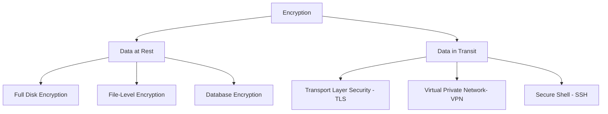
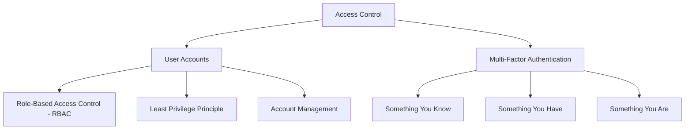
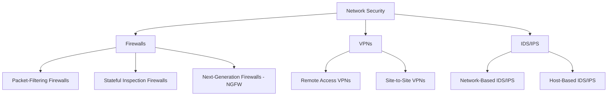
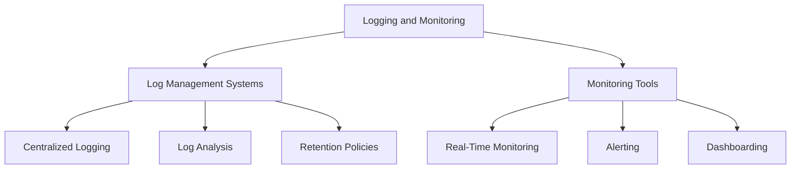

## Detailed Guidance on Technical Controls

### Encryption: Data at Rest, Data in Transit

#### Encryption:
Encryption is the process of converting information or data into a code, especially to prevent unauthorized access. It is a critical component of data security that ensures information is only accessible to those with the decryption key.

#### Data at Rest
Data at rest refers to inactive data that is stored physically in any digital form (e.g., databases, data warehouses, spreadsheets, archives). Encrypting data at rest protects it from unauthorized access and breaches.

- **Full Disk Encryption (FDE):** Encrypts the entire disk drive, ensuring that all data stored on it is protected. Tools like BitLocker (for Windows) and VeraCrypt can be used for FDE.
- **File-Level Encryption:** Encrypts individual files or directories rather than the entire disk. This allows more granular control over what is encrypted. Tools such as EFS (Encrypting File System) and GnuPG are commonly used.
- **Database Encryption:** Involves encrypting data within a database. Techniques include Transparent Data Encryption (TDE), which encrypts the database files on disk, and column-level encryption, which encrypts specific columns in a database table.

##### Best Practices for Data at Rest
- **Use Strong Encryption Algorithms:** Utilize algorithms like AES-256, which provide robust security.
- **Manage Encryption Keys Securely:** Use Hardware Security Modules (HSMs) to generate, store, and manage keys securely.
- **Regularly Update and Rotate Encryption Keys:** Periodically update encryption keys to mitigate the risk of them being compromised.

#### Data in Transit
Data in transit is data actively moving from one location to another, such as across the internet or through a private network. Encrypting data in transit protects it from interception and eavesdropping.

- **Transport Layer Security (TLS):** Encrypts data between web servers and clients (browsers). It ensures secure HTTP (HTTPS) connections, protecting data such as login credentials and personal information during transmission.
- **Virtual Private Network (VPN):** Encrypts data transmitted between remote users and the corporate network. VPNs create a secure tunnel over the internet, preventing unauthorized access.
- **Secure Shell (SSH):** Encrypts terminal sessions and file transfers, providing secure remote access to servers and network devices.

##### Best Practices for Data in Transit
- **Implement TLS for Web Traffic:** Ensure that all web traffic is encrypted using TLS to secure data exchange.
- **Use VPNs for Remote Access:** VPNs should be used to secure communications between remote users and the organization’s network.
- **Utilize SSH for Secure Remote Access:** Use SSH for encrypted command-line access and secure file transfers.

### Access Control: User Accounts, Multi-Factor Authentication

#### Access Control
Access control is the selective restriction of access to a place or other resources. It ensures that only authorized individuals can access specific data or systems, based on their roles and responsibilities.

#### User Accounts
User accounts are unique identities created for individuals to access systems and data. Managing these accounts effectively is crucial for maintaining security.

- **Role-Based Access Control (RBAC):** Assigns access rights based on user roles within an organization. Each role has specific permissions, ensuring that users only access information necessary for their job functions.
- **Least Privilege Principle:** Grants users the minimum levels of access, or permissions, needed to perform their job functions. This minimizes the potential damage from accidental or intentional misuse of access.
- **Account Management:** Involves the creation, management, and deactivation of user accounts. This includes processes for onboarding new employees, managing role changes, and deactivating accounts when employees leave the organization.

##### Best Practices for User Accounts
- **Regularly Review and Update User Roles:** Conduct periodic reviews to ensure that user roles and permissions align with their current responsibilities.
- **Automate Account Provisioning and De-Provisioning:** Use automated tools to manage user accounts efficiently, reducing the risk of human error.
- **Enforce Strong Password Policies:** Implement policies that require complex passwords and regular password changes. Encourage or mandate the use of password managers.

#### Multi-Factor Authentication (MFA)
MFA is an authentication method that requires users to present two or more verification factors to gain access to a resource. This adds an additional layer of security beyond just a username and password.

- **Something You Know:** A password or PIN.
- **Something You Have:** A physical token, mobile device, or smart card.
- **Something You Are:** Biometrics such as fingerprints, facial recognition, or iris scans.

##### Best Practices for MFA
- **Implement MFA for All Sensitive Systems:** Ensure that MFA is enabled for accessing critical applications and systems.
- **Use Time-Based One-Time Passwords (TOTP):** Implement TOTP solutions such as Google Authenticator or Authy for generating time-based codes.
- **Regularly Review MFA Settings:** Periodically check and update MFA configurations and devices to maintain security.

### Network Security: Firewalls, VPNs, IDS/IPS

#### Network Security
Network security involves policies, practices, and technologies to protect the integrity, confidentiality, and accessibility of computer networks and data. It defends against unauthorized access, misuse, malfunction, modification, destruction, or improper disclosure.

#### Firewalls
Firewalls are network security devices that monitor and control incoming and outgoing network traffic based on predetermined security rules.

- **Packet-Filtering Firewalls:** Inspect packets and block traffic based on source and destination addresses, ports, or protocols. They provide a basic level of security by filtering incoming and outgoing packets.
- **Stateful Inspection Firewalls:** Track the state of active connections and make decisions based on the context of traffic. They provide more advanced filtering by considering the state and context of the traffic.
- **Next-Generation Firewalls (NGFW):** Combine traditional firewall functions with advanced features like deep packet inspection, intrusion prevention, and application control. NGFWs provide a comprehensive approach to network security.

##### Best Practices for Firewalls
- **Regularly Update Firewall Rules:** Ensure that firewall rules reflect current security policies and address new threats.
- **Monitor Firewall Logs:** Continuously monitor and analyze firewall logs to detect unusual activities.
- **Implement Network Segmentation:** Use firewalls to segment networks, isolating sensitive areas to reduce the risk of widespread breaches.

#### Virtual Private Networks (VPNs)
VPNs create secure connections over the internet by encrypting data transmitted between remote users and the corporate network.

- **Remote Access VPNs:** Provide secure connections for individual users, allowing them to access the corporate network from remote locations.
- **Site-to-Site VPNs:** Connect entire networks in different locations, enabling secure communication between branch offices.

##### Best Practices for VPNs
- **Use Strong Encryption Protocols:** Implement protocols like IPsec or OpenVPN for secure communication.
- **Regularly Update VPN Software:** Keep VPN clients and servers up to date to protect against vulnerabilities.
- **Monitor VPN Connections:** Track VPN usage and monitor for unusual activities to identify potential security issues.

#### Intrusion Detection/Prevention Systems (IDS/IPS)
IDS/IPS are security systems that monitor network traffic for suspicious activities and potential threats, and can take action to block or alert on such activities.

- **Network-Based IDS/IPS:** Monitor entire network segments for malicious activity. They analyze network traffic to detect threats in real-time.
- **Host-Based IDS/IPS:** Monitor individual devices or servers, providing detailed insights into specific systems. They focus on the behavior of individual hosts.

##### Best Practices for IDS/IPS
- **Deploy IDS/IPS Strategically:** Place IDS/IPS devices at critical points within the network to maximize coverage.
- **Regularly Update Signatures and Rules:** Ensure that IDS/IPS signatures and detection rules are current to detect the latest threats.
- **Analyze IDS/IPS Logs:** Regularly review logs and alerts to identify and respond to potential security incidents.

### Logging and Monitoring: Log Management Systems, Monitoring Tools

#### Logging and Monitoring
Logging and monitoring are essential for maintaining the security and performance of IT systems. They involve collecting, analyzing, and storing log data to track system activities and detect anomalies.

#### Log Management Systems
Log management systems collect, analyze, and store log data from various sources, providing insights into system operations and security events.

- **Centralized Logging:** Aggregates logs from multiple sources into a

 central repository, making it easier to analyze and correlate data.
- **Log Analysis:** Uses tools to analyze log data for trends, anomalies, and potential security incidents. This helps in identifying and responding to threats.
- **Retention Policies:** Define how long logs should be stored to meet compliance requirements and support forensic investigations.

##### Best Practices for Log Management Systems
- **Implement Centralized Logging:** Use a centralized system to collect and manage logs from different sources for better visibility and control.
- **Use Automated Analysis Tools:** Employ tools to automatically analyze logs and generate alerts for suspicious activities.
- **Establish Clear Retention Policies:** Define and enforce policies for log retention to ensure compliance and support investigations.

#### Monitoring Tools
Monitoring tools continuously track the performance and security of systems, networks, and applications, providing real-time insights and alerts.

- **Real-Time Monitoring:** Provides immediate visibility into system performance and security events, enabling quick responses to issues.
- **Alerting:** Notifies administrators of potential issues or security incidents, allowing them to take prompt action.
- **Dashboarding:** Visualizes monitoring data for easier analysis and decision-making, helping administrators understand system health at a glance.

##### Best Practices for Monitoring Tools
- **Track Key Metrics:** Monitor critical performance and security metrics to maintain system health and security.
- **Set Up Alerts:** Configure alerts for critical issues that require immediate attention, ensuring timely responses.
- **Regularly Review Monitoring Data:** Periodically review and analyze monitoring data to identify trends, potential problems, and areas for improvement.

## Practical Examples and Best Practices

### Setting Up Encryption

#### Data at Rest
- **Use AES-256 Encryption:** Implement AES-256 for disk and file-level encryption to provide strong security.
- **Implement Transparent Data Encryption (TDE):** Use TDE for database encryption to protect data at the database level.
- **Secure Encryption Keys with HSMs:** Use Hardware Security Modules to securely generate, store, and manage encryption keys.

#### Data in Transit
- **Use TLS to Secure Web Traffic:** Ensure that all web traffic is encrypted using TLS, protecting data exchanged over the internet.
- **Implement VPNs with Strong Protocols:** Use VPNs with IPsec or OpenVPN to secure remote access and data transmission.
- **Utilize SSH for Secure Remote Access:** Use SSH for encrypted command-line access and secure file transfers.

### Configuring Access Control

#### User Accounts
- **Implement Role-Based Access Control (RBAC):** Assign permissions based on user roles to ensure users only access necessary resources.
- **Enforce the Least Privilege Principle:** Grant users the minimum level of access needed for their job functions to reduce security risks.
- **Regularly Review and Update Roles:** Conduct periodic reviews of user roles and permissions to ensure they align with current responsibilities.

#### Multi-Factor Authentication (MFA)
- **Implement MFA for Critical Systems:** Ensure MFA is enabled for accessing sensitive systems and applications to enhance security.
- **Use TOTP Solutions:** Implement time-based one-time password solutions like Google Authenticator for additional security.
- **Regularly Review MFA Settings:** Periodically check and update MFA configurations to maintain effective security.

### Network Security Best Practices

#### Firewalls
- **Regularly Update Firewall Rules:** Ensure firewall rules are current and reflect security policies.
- **Monitor Firewall Logs:** Continuously monitor and analyze logs to detect unusual activities.
- **Implement Network Segmentation:** Use firewalls to segment networks, isolating sensitive areas to limit the spread of potential breaches.

#### VPNs
- **Use Strong Encryption Protocols:** Implement IPsec or OpenVPN for secure communication.
- **Regularly Update VPN Software:** Keep VPN clients and servers up to date to protect against vulnerabilities.
- **Monitor VPN Connections:** Track usage and monitor for unusual activities to identify security issues.

#### IDS/IPS
- **Deploy IDS/IPS Strategically:** Place devices at critical points in the network to maximize coverage.
- **Regularly Update Signatures and Rules:** Ensure signatures and detection rules are current to detect the latest threats.
- **Analyze Logs and Alerts:** Review logs and alerts to identify and respond to potential security incidents.

### Logging and Monitoring Strategies

#### Log Management Systems
- **Implement Centralized Logging:** Use a centralized system to collect and manage logs from different sources.
- **Use Automated Analysis Tools:** Employ tools to analyze logs and generate alerts for suspicious activities.
- **Establish Clear Retention Policies:** Define and enforce policies for log retention to ensure compliance and support investigations.

#### Monitoring Tools
- **Track Key Metrics:** Monitor critical performance and security metrics.
- **Set Up Alerts:** Configure alerts for critical issues that require immediate attention.
- **Regularly Review Monitoring Data:** Periodically review data to identify trends, potential problems, and areas for improvement.

```mermaid
graph TD;
    A[Practical Examples and Best Practices] --> B[Setting Up Encryption]
    A --> C[Configuring Access Control]
    A --> D[Network Security Best Practices]
    A --> E[Logging and Monitoring Strategies]
    B --> F[Data at Rest]
    B --> G[Data in Transit]
    F --> H[Use AES-256 Encryption]
    F --> I[Implement Transparent Data Encryption]
    F --> J[Secure Encryption Keys with HSMs]
    G --> K[Use TLS to Secure Web Traffic]
    G --> L[Implement VPNs with Strong Protocols]
    G --> M[Utilize SSH for Secure Remote Access]
    C --> N[User Accounts]
    C --> O[Multi-Factor Authentication]
    N --> P[Implement Role-Based Access Control]
    N --> Q[Enforce the Least Privilege Principle]
    N --> R[Regularly Review and Update Roles]
    O --> S[Implement MFA for Critical Systems]
    O --> T[Use TOTP Solutions]
    O --> U[Regularly Review MFA Settings]
    D --> V[Firewalls]
    D --> W[VPNs]
    D --> X[IDS/IPS]
    V --> Y[Regularly Update Firewall Rules]
    V --> Z[Monitor Firewall Logs]
    V --> AA[Implement Network Segmentation]
    W --> AB[Use Strong Encryption Protocols]
    W --> AC[Regularly Update VPN Software]
    W --> AD[Monitor VPN Connections]
    X --> AE[Deploy IDS/IPS Strategically]
    X --> AF[Regularly Update Signatures and Rules]
    X --> AG[Analyze Logs and Alerts]
    E --> AH[Log Management Systems]
    E --> AI[Monitoring Tools]
    AH --> AJ[Implement Centralized Logging]
    AH --> AK[Use Automated Analysis Tools]
    AH --> AL[Establish Clear Retention Policies]
    AI --> AM[Track Key Metrics]
    AI --> AN[Set Up Alerts]
    AI --> AO[Regularly Review Monitoring Data]
```

