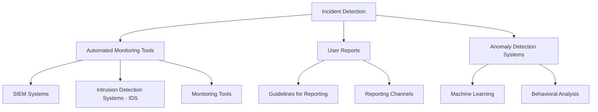
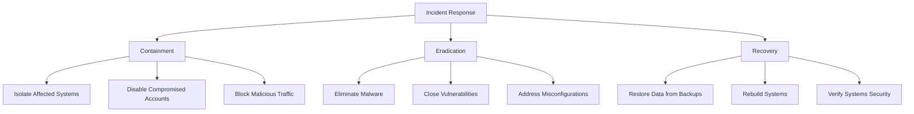
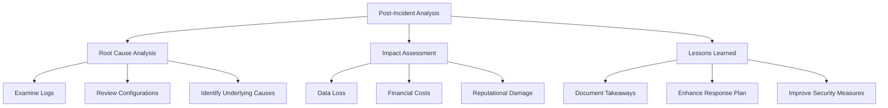
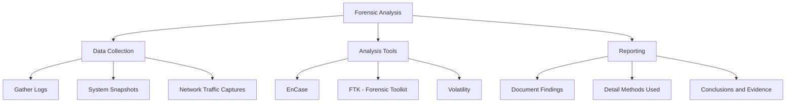
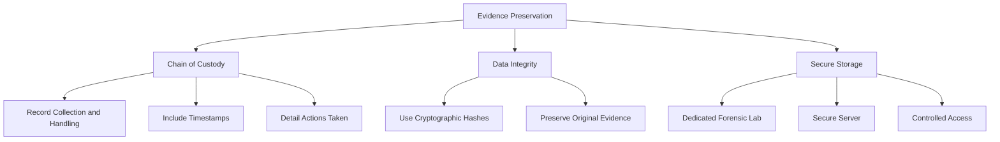
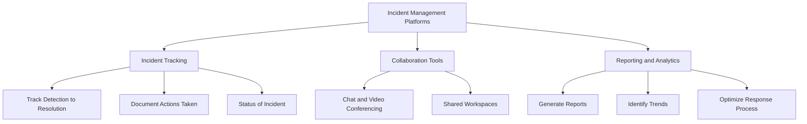

## Developing and Implementing an Incident Response Plan

### Introduction

An Incident Response Plan (IRP) is a comprehensive, documented approach outlining the steps to be taken during and after a security incident. The goal is to effectively manage and mitigate the impact of incidents, ensuring quick recovery and minimizing damage.

### Incident Detection
Incident detection involves identifying potential security incidents promptly to initiate an appropriate response. Detection can be achieved through various means, such as automated monitoring tools, user reports, and anomaly detection systems.

- **Automated Monitoring Tools:** Utilize SIEM systems, intrusion detection systems (IDS), and other monitoring tools to detect suspicious activities and potential security breaches in real-time.
- **User Reports:** Encourage employees to report unusual activities or suspected security incidents. Provide clear guidelines and channels for reporting incidents.
- **Anomaly Detection Systems:** Implement systems that use machine learning and behavioral analysis to identify deviations from normal activity patterns, which may indicate a security incident.

### Incident Response:
Incident response is the process of addressing and managing the aftermath of a security incident. It involves containment, eradication, and recovery steps to mitigate the impact and restore normal operations.

- **Containment:** Immediate actions taken to limit the spread and impact of an incident. This may include isolating affected systems, disabling compromised accounts, or blocking malicious traffic.
- **Eradication:** Removing the root cause of the incident, such as eliminating malware, closing vulnerabilities, or addressing misconfigurations.
- **Recovery:** Restoring affected systems and services to normal operation. This involves restoring data from backups, rebuilding systems, and verifying that the systems are secure and functioning correctly.

### Post-Incident Analysis
Post-incident analysis, also known as post-mortem, is a critical step in the incident response process. It involves reviewing the incident to understand its causes, impact, and the effectiveness of the response. The goal is to learn from the incident and improve future response efforts.

- **Root Cause Analysis:** Identify the underlying cause of the incident to prevent recurrence. This involves examining logs, system configurations, and other relevant data.
- **Impact Assessment:** Evaluate the impact of the incident on the organization, including data loss, financial costs, and reputational damage.
- **Lessons Learned:** Document the key takeaways from the incident, including what worked well and what needs improvement. Use this information to enhance the incident response plan and security measures.

## Tools and Techniques for Incident Management

### Forensic Analysis
Forensic analysis involves the detailed examination of systems and data to understand the nature and scope of an incident. This process is critical for identifying the attack vectors, compromised systems, and the extent of the damage.

- **Data Collection:** Gather all relevant data, including logs, system snapshots, and network traffic captures. Ensure that the data collection process preserves the integrity of the evidence.
- **Analysis Tools:** Use forensic tools to analyze collected data. Common tools include EnCase, FTK (Forensic Toolkit), and Volatility for memory analysis.
- **Reporting:** Document findings in a comprehensive report that details the methods used, evidence collected, and conclusions drawn. This report may be used for legal proceedings or internal review.

### Evidence Preservation
Evidence preservation is essential for maintaining the integrity of data collected during an incident investigation. Proper evidence handling ensures that the data is admissible in legal proceedings and provides a reliable basis for analysis.

- **Chain of Custody:** Maintain a detailed record of who collected, handled, and analyzed the evidence. This record should include timestamps, actions taken, and individuals involved.
- **Data Integrity:** Use cryptographic hashes to verify the integrity of collected data. Ensure that original evidence is preserved in a read-only state to prevent tampering.
- **Secure Storage:** Store evidence in a secure location, such as a dedicated forensic lab or a secure server, with controlled access to prevent unauthorized handling.

### Incident Management Platforms
Incident management platforms provide a centralized solution for tracking and managing incidents. These platforms streamline the incident response process, ensuring that all steps are documented and that communication is efficient.

- **Incident Tracking:** Track all incidents from detection to resolution. This includes documenting actions taken, individuals involved, and the status of the incident.
- **Collaboration Tools:** Facilitate communication and collaboration among incident response team members. Features may include chat, video conferencing, and shared workspaces.
- **Reporting and Analytics:** Generate reports on incident response activities, providing insights into trends, response times, and areas for improvement. Analytics tools help identify patterns and optimize the incident response process.

