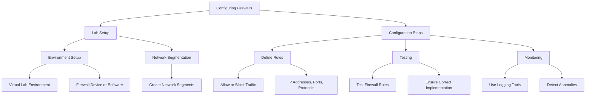
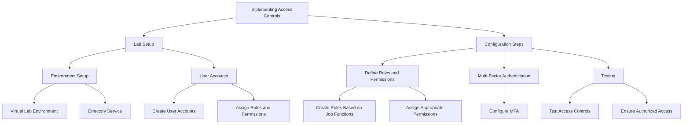
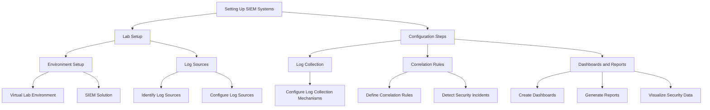
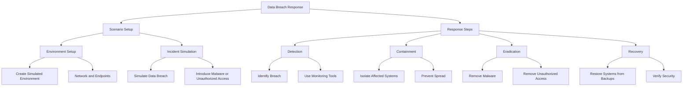
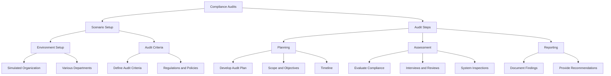
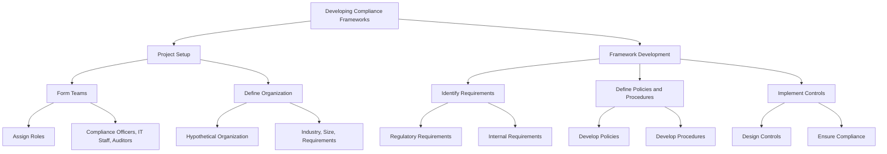
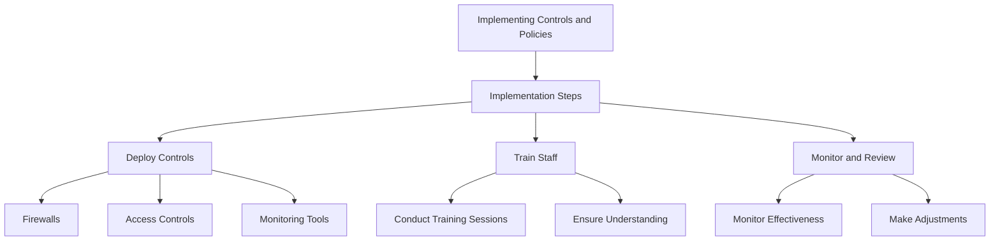
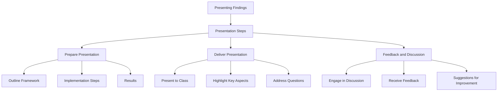

## Hands-On Labs for Deploying and Configuring Compliance Controls

### Introduction
Practical lab exercises provide hands-on experience with deploying and configuring compliance controls. These labs help participants understand the technical aspects of compliance and develop the skills needed to implement and manage compliance measures effectively.

### Configuring Firewalls
Firewalls are critical components of network security, controlling incoming and outgoing traffic based on predetermined security rules. Configuring firewalls involves setting up rules to block unauthorized access while allowing legitimate traffic.

- **Lab Setup:**
  - **Environment:** Set up a virtual lab environment with a firewall device or software firewall.
  - **Network Segmentation:** Create different network segments (e.g., internal, DMZ, external) to apply firewall rules.
- **Configuration Steps:**
  - **Define Rules:** Create firewall rules to allow or block traffic based on IP addresses, ports, and protocols.
  - **Testing:** Test the firewall rules to ensure they are correctly implemented and effectively blocking unauthorized traffic.
  - **Monitoring:** Use logging and monitoring tools to track firewall activity and detect any anomalies.

### Implementing Access Controls
Access controls ensure that only authorized users can access specific resources. Implementing access controls involves setting up user accounts, defining roles and permissions, and applying authentication mechanisms.

- **Lab Setup:**
  - **Environment:** Set up a virtual lab environment with a directory service (e.g., Active Directory) and a few sample applications.
  - **User Accounts:** Create user accounts with different roles and permissions.
- **Configuration Steps:**
  - **Define Roles and Permissions:** Create roles based on job functions and assign appropriate permissions to each role.
  - **Multi-Factor Authentication (MFA):** Configure MFA to add an extra layer of security to the authentication process.
  - **Testing:** Test the access controls to ensure users can access only the resources they are authorized to use.

### Setting Up SIEM Systems
SIEM systems provide real-time analysis of security alerts generated by network hardware and applications. Setting up a SIEM system involves configuring log sources, defining correlation rules, and creating dashboards and reports.

- **Lab Setup:**
  - **Environment:** Set up a virtual lab environment with a SIEM solution (e.g., Splunk, ELK Stack).
  - **Log Sources:** Identify and configure log sources, such as firewalls, IDS/IPS, and servers.
- **Configuration Steps:**
  - **Log Collection:** Configure log collection mechanisms to gather data from identified sources.
  - **Correlation Rules:** Define correlation rules to detect patterns indicative of security incidents.
  - **Dashboards and Reports:** Create dashboards and reports to visualize security data and provide insights.

## Simulation of Real-World Compliance Scenarios

Simulation exercises provide participants with practical experience in handling compliance challenges. These exercises mimic real-world scenarios, allowing participants to apply their knowledge and skills in a controlled environment.

### Data Breach Response
Responding to a data breach involves detecting the breach, containing the damage, eradicating the threat, and recovering affected systems.

- **Scenario Setup:**
  - **Environment:** Create a simulated environment with a network and several endpoints.
  - **Incident:** Simulate a data breach by introducing a malware infection or unauthorized access.
- **Response Steps:**
  - **Detection:** Identify the breach using monitoring tools and log analysis.
  - **Containment:** Isolate affected systems to prevent the spread of the breach.
  - **Eradication:** Remove the malware or unauthorized access from affected systems.
  - **Recovery:** Restore systems from backups and verify their security.

### Compliance Audits
Conducting compliance audits involves evaluating an organization’s adherence to regulatory requirements and internal policies.

- **Scenario Setup:**
  - **Environment:** Set up a simulated organization with various departments and compliance requirements.
  - **Audit Criteria:** Define audit criteria based on relevant regulations and policies.
- **Audit Steps:**
  - **Planning:** Develop an audit plan, including scope, objectives, and timeline.
  - **Assessment:** Evaluate the organization’s compliance with audit criteria through interviews, document reviews, and system inspections.
  - **Reporting:** Document audit findings and provide recommendations for improvement.

## Group Projects for Developing and Implementing Compliance Frameworks

Group projects allow participants to collaborate on developing and implementing compliance frameworks. These projects provide practical experience and foster teamwork and problem-solving skills.

### Developing Compliance Frameworks
Participants work together to create comprehensive compliance frameworks tailored to a hypothetical organization.

- **Project Setup:**
  - **Teams:** Form groups with participants assigned different roles (e.g., compliance officers, IT staff, auditors).
  - **Organization:** Define a hypothetical organization, including its industry, size, and regulatory requirements.
- **Framework Development:**
  - **Identify Requirements:** Identify the regulatory and internal requirements applicable to the organization.
  - **Define Policies and Procedures:** Develop policies and procedures to address the identified requirements.
  - **Implement Controls:** Design and implement controls to ensure compliance with the policies and procedures.

### Implementing Controls and Policies
Participants implement the developed compliance framework within the hypothetical organization.

- **Implementation Steps:**
  - **Deploy Controls:** Deploy the designed controls, such as firewalls, access controls, and monitoring tools.
  - **Train Staff:** Conduct training sessions to ensure all employees understand and follow the new policies and procedures.
  - **Monitor and Review:** Continuously monitor the effectiveness of the controls and policies and make adjustments as needed.

### Presenting Findings
Groups present their developed compliance frameworks and implementation results to the class for feedback and discussion.

- **Presentation Steps:**
  - **Prepare Presentation:** Create a presentation that outlines the developed framework, implementation steps, and results.
  - **Deliver Presentation:** Present to the class, highlighting key aspects and addressing questions.
  - **Feedback and Discussion:** Engage in a discussion with classmates and instructors, receiving feedback and suggestions for improvement.

