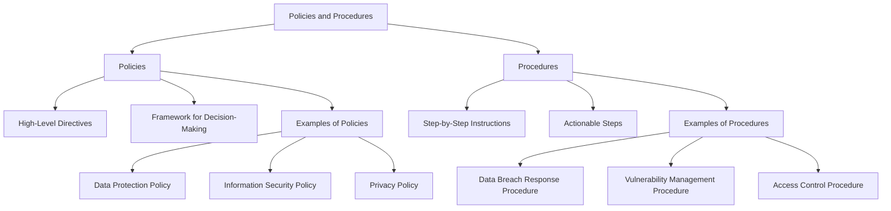
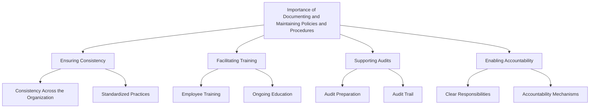

## Difference Between Policies and Procedures

### Definitions and Distinctions Between Policies and Procedures

#### Policies
- **Definition:** High-level directives that define an organization’s approach to security and compliance. Policies outline the organization’s goals, objectives, and responsibilities, providing a framework for decision-making and behavior.
- **Purpose:** Policies establish the organization's stance on various issues, guiding behavior and decision-making processes. They ensure that all employees understand the importance of compliance and security and know the general principles they need to follow.

#### Procedures
- **Definition:** Detailed, step-by-step instructions on how to implement policies. Procedures provide specific guidance on how to carry out tasks and activities in a manner consistent with the organization's policies.
- **Purpose:** Procedures translate the high-level directives of policies into actionable steps. They ensure that tasks are performed consistently and correctly, supporting the overall goals outlined in the policies.

### Examples of Policies and Procedures

#### Policies
- **Data Protection Policy:** Defines how personal data should be collected, processed, and stored to comply with GDPR requirements.
- **Information Security Policy:** Establishes the security requirements for protecting information assets.
- **Privacy Policy:** Outlines how an organization protects and uses personal information, in compliance with regulations like HIPAA.

#### Procedures
- **Data Breach Response Procedure:** Provides steps to follow in the event of a data breach, including notification requirements and mitigation measures.
- **Vulnerability Management Procedure:** Describes how to identify, assess, and remediate security vulnerabilities in systems.
- **Access Control Procedure:** Details how to implement and manage access controls to ensure that only authorized individuals can access sensitive information.

## Examples of Policies and Procedures Across Different Compliance Frameworks

### GDPR (General Data Protection Regulation)

#### Data Protection Policy
- **Purpose:** To ensure that personal data is collected, processed, and stored in compliance with GDPR.
- **Key Elements:** Data minimization, data accuracy, data security, and data subject rights.
- **Implementation Steps:**
  - Identify and document the types of personal data collected.
  - Implement data protection measures such as encryption and access controls.
  - Regularly review and update data protection practices.

#### Data Breach Response Procedure
- **Purpose:** To provide a structured response to data breaches, minimizing harm and ensuring regulatory compliance.
- **Key Elements:** Breach detection, notification, containment, eradication, and recovery.
- **Implementation Steps:**
  - Establish a breach response team.
  - Develop procedures for identifying and containing breaches.
  - Define notification requirements to inform affected individuals and regulatory authorities.

### HIPAA (Health Insurance Portability and Accountability Act)

#### Privacy Policy
- **Purpose:** To protect the privacy of patients’ health information.
- **Key Elements:** Use and disclosure of protected health information (PHI), patient rights, administrative requirements.
- **Implementation Steps:**
  - Train staff on HIPAA privacy rules.
  - Implement administrative, physical, and technical safeguards.
  - Regularly review and update privacy practices.

#### Incident Response Procedure
- **Purpose:** To address security incidents involving ePHI effectively.
- **Key Elements:** Incident detection, response, reporting, and mitigation.
- **Implementation Steps:**
  - Develop an incident response plan.
  - Train staff on incident response procedures.
  - Regularly test and update the incident response plan.

### PCI-DSS (Payment Card Industry Data Security Standard)

#### Information Security Policy
- **Purpose:** To protect cardholder data and ensure PCI-DSS compliance.
- **Key Elements:** Access control, data encryption, vulnerability management, monitoring, and testing.
- **Implementation Steps:**
  - Develop and implement security policies and procedures.
  - Conduct regular security training for employees.
  - Perform ongoing risk assessments and vulnerability scans.

#### Vulnerability Management Procedure
- **Purpose:** To identify, assess, and mitigate vulnerabilities in payment systems.
- **Key Elements:** Vulnerability scanning, patch management, risk assessment.
- **Implementation Steps:**
  - Schedule regular vulnerability scans.
  - Prioritize and apply security patches.
  - Document and track remediation efforts.

### NIST (National Institute of Standards and Technology)

#### Access Control Policy
- **Purpose:** To manage access to information systems and ensure only authorized users can access sensitive data.
- **Key Elements:** User authentication, authorization, access reviews.
- **Implementation Steps:**
  - Implement role-based access controls (RBAC).
  - Conduct regular access reviews and audits.
  - Enforce multi-factor authentication (MFA).

#### Continuous Monitoring Procedure
- **Purpose:** To maintain ongoing awareness of information security, vulnerabilities, and threats.
- **Key Elements:** Security information and event management (SIEM), log management, real-time monitoring.
- **Implementation Steps:**
  - Deploy and configure SIEM tools.
  - Establish logging and monitoring practices.
  - Regularly review and analyze security events.

```mermaid
graph TD;
    A[Examples of Policies and Procedures] --> B[GDPR]
    A --> C[HIPAA]
    A --> D[PCI-DSS]
    A --> E[NIST]
    B --> F[Data Protection Policy]
    B --> G[Data Breach Response Procedure]
    C --> H[Privacy Policy]
    C --> I[Incident Response Procedure]
    D --> J[Information Security Policy]
    D --> K[Vulnerability Management Procedure]
    E --> L[Access Control Policy]
    E --> M[Continuous Monitoring Procedure]
    F --> N[Purpose: GDPR Compliance]
    F --> O[Key Elements: Data Minimization, Security]
    F --> P[Implementation Steps]
    G --> Q[Purpose: Data Breach Response]
    G --> R[Key Elements: Detection, Notification]
    G --> S[Implementation Steps]
    H --> T[Purpose: Protect PHI]
    H --> U[Key Elements: Use and Disclosure]
    H --> V[Implementation Steps]
    I --> W[Purpose: Address Incidents]
    I --> X[Key Elements: Detection, Response]
    I --> Y[Implementation Steps]
    J --> Z[Purpose: Protect Cardholder Data]
    J --> AA[Key Elements: Access Control, Encryption]
    J --> AB[Implementation Steps]
    K --> AC[Purpose: Mitigate Vulnerabilities]
    K --> AD[Key Elements: Scanning, Patching]
    K --> AE[Implementation Steps]
    L --> AF[Purpose: Manage Access]
    L --> AG[Key Elements: Authentication, Authorization]
    L --> AH[Implementation Steps]
    M --> AI[Purpose: Continuous Monitoring]
    M --> AJ[Key Elements: SIEM, Log Management]
    M --> AK[Implementation Steps]
```

## Importance of Documenting and Maintaining Policies and Procedures

### Ensuring Consistency
- **Consistency Across the Organization:** Documenting policies and procedures ensures that all employees follow the same guidelines, promoting uniformity in operations and compliance efforts.
- **Standardized Practices:** Written policies and procedures provide a reference point for consistent practices, reducing ambiguity and variability in how tasks are performed.

### Facilitating Training
- **Employee Training:** Policies and procedures serve as training materials for new employees, helping them understand the organization’s compliance requirements and their roles.
- **Ongoing Education:** Regularly updated documents ensure that all staff members stay informed about changes in compliance requirements and best practices.

### Supporting Audits
- **Audit Preparation:** Comprehensive documentation provides the evidence needed to demonstrate compliance during audits. It shows that the organization has established and follows the required controls.
- **Audit Trail:** Well-documented policies and procedures create an audit trail that can be reviewed to verify compliance over time.

### Enabling Accountability
- **Clear Responsibilities:** Policies and procedures clearly define roles and responsibilities, ensuring that everyone knows what is expected of them.
- **Accountability Mechanisms:** Documented processes make it easier to hold individuals accountable for their actions and adherence to compliance standards.

