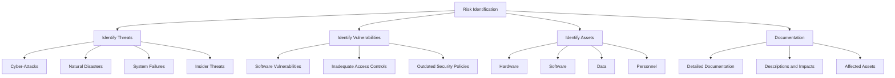
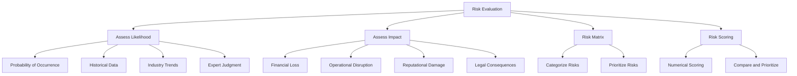
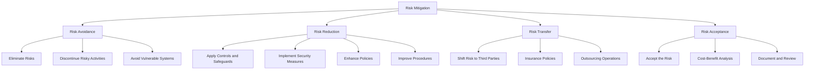

## Conducting Comprehensive Risk Assessments

### Introduction

Risk management is a critical aspect of maintaining compliance and ensuring the security of an organization's information systems. A comprehensive risk assessment involves identifying potential risks, evaluating their impact, and implementing strategies to mitigate them.

### Risk Identification

Risk identification is the first step in the risk management process. It involves identifying and documenting potential risks that could affect the organization’s operations, assets, and compliance status.

- **Identify Threats:** Recognize various types of threats that can impact the organization, such as cyber-attacks, natural disasters, system failures, and insider threats.
- **Identify Vulnerabilities:** Determine the weaknesses in the organization’s systems, processes, and controls that could be exploited by threats. This includes software vulnerabilities, inadequate access controls, and outdated security policies.
- **Identify Assets:** List all critical assets that need protection, including hardware, software, data, and personnel. Understanding the value and importance of each asset helps prioritize risk management efforts.
- **Documentation:** Create detailed documentation of identified risks, including descriptions, potential impacts, and affected assets. This documentation forms the basis for further risk assessment and management activities.

### Risk Evaluation

Risk evaluation, also known as risk analysis, involves assessing the identified risks to determine their potential impact on the organization. This step helps prioritize risks based on their severity and likelihood.

- **Assess Likelihood:** Determine the probability of each identified risk occurring. This can be based on historical data, industry trends, and expert judgment.
- **Assess Impact:** Evaluate the potential impact of each risk on the organization. Consider factors such as financial loss, operational disruption, reputational damage, and legal consequences.
- **Risk Matrix:** Create a risk matrix to categorize risks based on their likelihood and impact. This visual tool helps prioritize risks and identify those that require immediate attention.
- **Risk Scoring:** Assign a numerical score to each risk based on its likelihood and impact. This quantitative approach provides a clear basis for comparing and prioritizing risks.

### Risk Mitigation

Risk mitigation involves developing and implementing strategies to reduce the likelihood and impact of identified risks. Effective risk mitigation helps protect the organization from potential threats and ensures compliance with regulatory requirements.

- **Risk Avoidance:** Implement measures to eliminate risks entirely. This may involve discontinuing risky activities or avoiding the use of vulnerable systems or processes.
- **Risk Reduction:** Apply controls and safeguards to minimize the likelihood or impact of risks. This can include implementing security measures, enhancing policies, and improving procedures.
- **Risk Transfer:** Shift the risk to a third party, such as through insurance policies or outsourcing certain operations. This approach does not eliminate the risk but mitigates its impact on the organization.
- **Risk Acceptance:** Accept the risk when the cost of mitigation exceeds the potential impact, or when the risk is deemed to be within acceptable limits. This approach should be documented and regularly reviewed.

