## Future Trends in Attestation

### Emerging technologies and their impact on attestation (e.g., AI, blockchain)

Emerging technologies are poised to revolutionize attestation in compliance, providing new tools and methods to ensure accuracy and reliability.

#### Artificial Intelligence (AI)
AI is transforming attestation by automating complex decision-making processes and improving accuracy. AI can analyze vast amounts of data, identify patterns, and predict compliance issues before they occur.

#### Blockchain
Blockchain technology offers immutable, tamper-proof records, making it ideal for attestation. By providing a secure and transparent way to store data, blockchain ensures that attestation records cannot be altered.

### Predictions for the future of compliance automation

The future of compliance automation is likely to be shaped by several key trends:

#### Integration of AI and Machine Learning
AI and machine learning will become integral parts of compliance automation, enabling more sophisticated analysis and real-time decision-making.

#### Increased Use of Blockchain for Secure Attestation
Blockchain will be increasingly used to create secure, transparent, and immutable attestation records, enhancing trust and reliability.

#### Evolution of Regulatory Requirements
Regulatory bodies will continue to evolve their requirements to accommodate new technologies and ensure robust compliance practices.

## Career Development in Compliance Automation

### Skills and knowledge required for compliance automation roles

To succeed in compliance automation roles, professionals need a combination of technical and compliance-related skills:

#### Technical Skills
- Proficiency in programming and scripting languages (e.g., Python, Java).
- Understanding of automation tools and platforms.
- Knowledge of AI and machine learning applications.

#### Compliance Knowledge
- Deep understanding of regulatory requirements and compliance frameworks.
- Experience with compliance audits and assessments.
- Knowledge of risk management and control implementation.

### Certifications and training programs

Several certifications and training programs can enhance career prospects in compliance automation:

#### Certifications
- Certified Information Systems Auditor (CISA)
- Certified Information Security Manager (CISM)
- Certified in Risk and Information Systems Control (CRISC)
- Certified Compliance and Ethics Professional (CCEP)

#### Training Programs
- Online courses on AI and machine learning.
- Workshops on compliance automation tools and platforms.
- Continuing education programs in cybersecurity and risk management.

```mermaid
graph TD;
    A[Training Programs] --> B[AI and Machine Learning Courses]
    A --> C[Compliance Automation Workshops]
    A --> D[Continuing Education Programs]
```

### Networking and professional organizations for compliance professionals

Joining professional organizations and networking with peers can provide valuable resources and opportunities:

#### Professional Organizations
- Information Systems Audit and Control Association (ISACA)
- International Association of Privacy Professionals (IAPP)
- Association of Certified Fraud Examiners (ACFE)
- Society of Corporate Compliance and Ethics (SCCE)

#### Networking Opportunities
- Attending industry conferences and seminars.
- Participating in online forums and discussion groups.
- Engaging with mentors and industry leaders.

## Summary and Key Takeaways

This module has provided a comprehensive overview of human and machine attestation, highlighting their differences, advantages, challenges, and practical applications.

### Key Concepts Recap
- **Human Attestation**: It Relies on human judgment and expertise but can be prone to errors and resource-intensive.
- **Machine Attestation**: It Provides consistent and efficient real-time monitoring, but it may miss context-specific details and needs substantial initial setup.

### Importance of understanding both human and machine attestation

Understanding both human and machine attestation is crucial for developing effective compliance strategies that leverage the strengths of each approach.

#### Balancing Approaches
- Combining human judgment with automated processes for comprehensive compliance.
- Using machine attestation for routine tasks and human attestation for complex, context-sensitive situations.

### Encouragement to embrace automation while maintaining human oversight

Embracing automation can significantly enhance compliance efforts, but maintaining human oversight is essential to address complex scenarios and ensure comprehensive compliance.

#### Embrace Automation
- Leverage automated tools to improve efficiency and accuracy.
- Continuously monitor and update automated systems to adapt to changing compliance requirements.

#### Maintain Human Oversight
- Ensure human experts are involved in critical decision-making processes.
- Regularly review and audit automated systems to ensure they function correctly and meet compliance standards.

