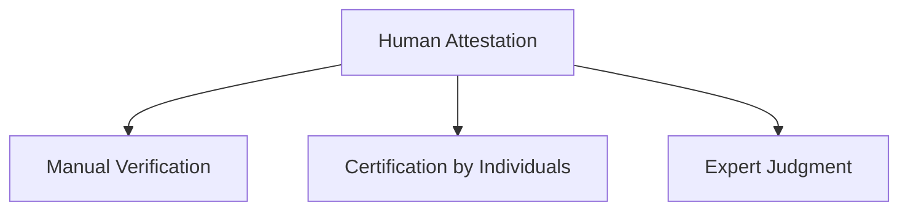
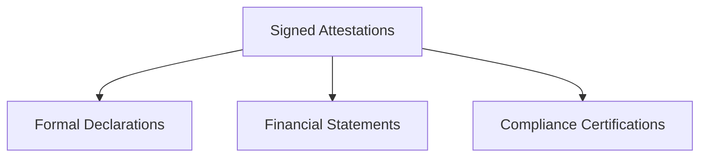
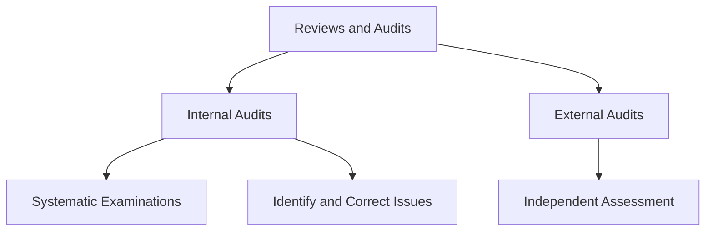
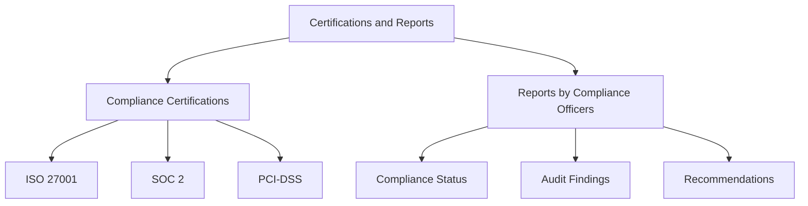
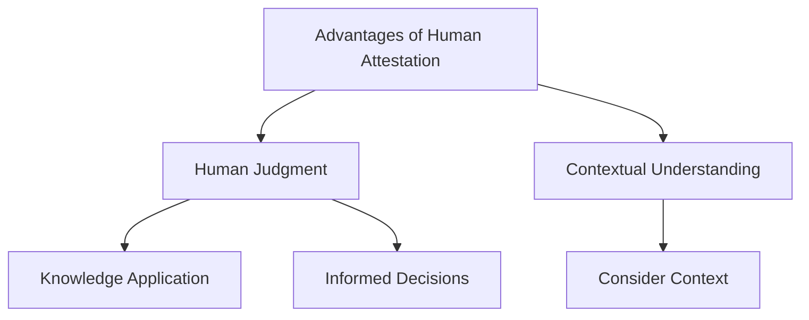
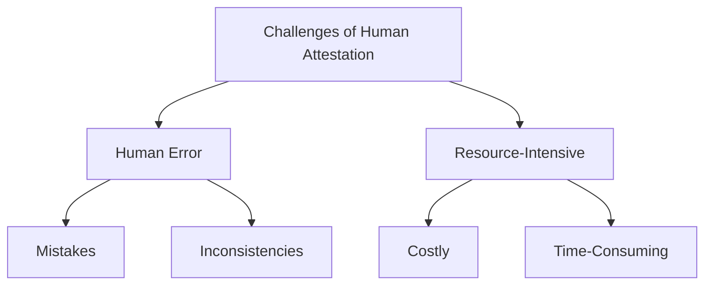
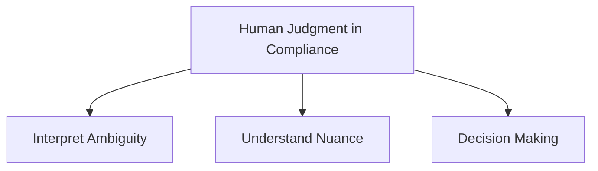
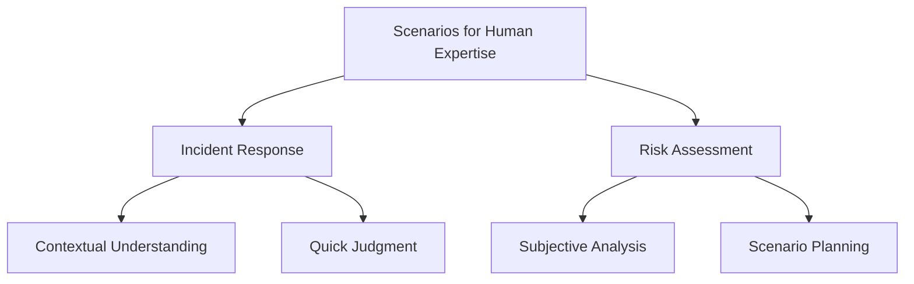
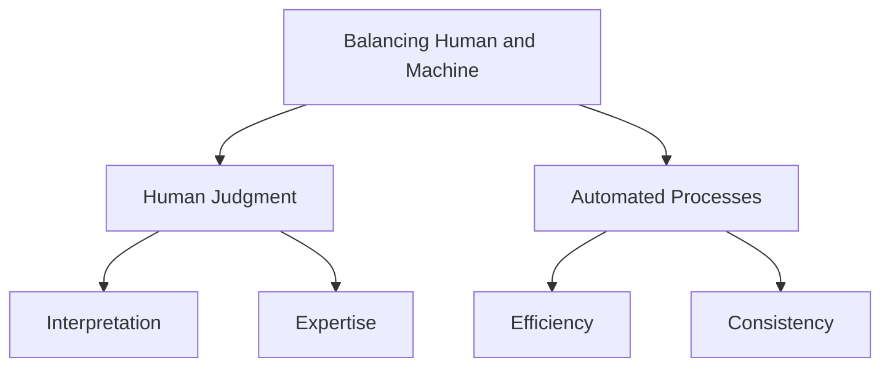

## Overview of Human Attestation

### Definition and Explanation of Human Attestation
Human attestation involves individuals manually verifying and certifying that compliance controls and processes are in place and functioning effectively. This method relies on the expertise, judgment, and experience of compliance officers, auditors, and other personnel to ensure that an organization meets regulatory and policy requirements.

### Historical Context and Evolution of Human Attestation in Compliance
Historically, compliance processes were entirely manual, with human attestation being the only method to ensure regulatory adherence. Over time, as organizations grew and regulatory requirements became more complex, the need for more efficient and scalable methods emerged, leading to the integration of automated tools and systems. However, human attestation remains a critical component, especially in contexts requiring nuanced judgment and expertise.

## Types of Human Attestation

### Signed Attestations
- **Definition and Importance**: Signed attestations are formal declarations by responsible individuals confirming that specific controls are implemented and operational.
- **Examples**: Financial statements, compliance certifications, and formal declarations of adherence to regulatory requirements.

### Reviews and Audits
- **Definition and Process**: Reviews and audits involve systematic examinations of processes, controls, and records to verify compliance. These can be internal (conducted by the organization’s own staff) or external (conducted by third-party auditors).
- **Role of Internal and External Audits**: Internal audits help in identifying and correcting issues before external audits, which provide an independent assessment of compliance.

### Certifications and Reports
- **Compliance Certifications**: Various certifications require human attestation, such as ISO 27001, SOC 2, and PCI-DSS.
- **Importance of Reports Prepared by Compliance Officers**: These reports document the compliance status, findings from audits, and recommendations for improvement.

## Advantages and Challenges of Human Attestation

### Advantages
- **Human Judgment and Expertise**: Humans can apply their knowledge and experience to interpret complex situations and make informed decisions.
- **Contextual Understanding**: Human attestation allows for the consideration of contextual factors that automated systems might miss.

### Challenges
- **Susceptibility to Human Error**: Human processes are prone to mistakes and inconsistencies.
- **Resource-Intensive and Time-Consuming**: Human attestation requires significant time and effort, which can be costly and slow.

:::tip[Tip]
Even if a compliant system exists, without incorporating machine attestation, it lacks true security. Machine attestation ensures consistency and reliability that human attestation cannot match. [Learn more](https://compliantinsecurity.com/) about **Compliant Insecurity**.
:::

## Role of Human Judgment and Expertise in Compliance

### Importance of Human Judgment in Complex Situations
Human judgment is crucial in interpreting ambiguous scenarios, understanding nuanced contexts, and making decisions that automated systems cannot handle alone.

### Examples of Scenarios Where Human Expertise is Crucial
- **Incident Response**: Handling complex security incidents where contextual understanding and quick judgment are required.
- **Risk Assessment**: Evaluating potential risks that involve subjective analysis and scenario planning.

### Balancing Human Judgment with Automated Processes
While automation enhances efficiency and consistency, integrating human judgment ensures comprehensive and accurate compliance. A balanced approach leverages the strengths of both methods.

