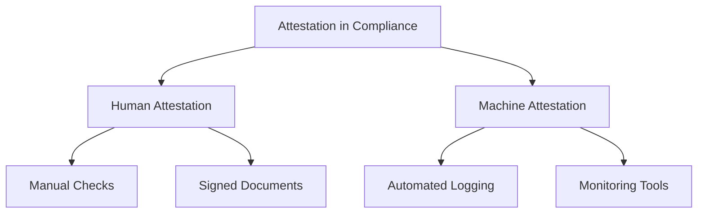
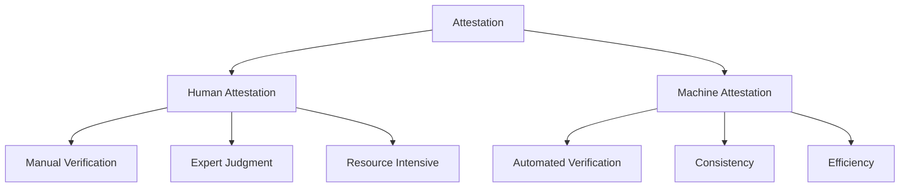
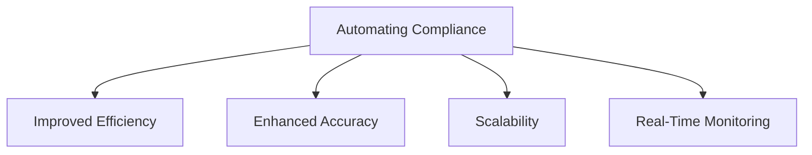

## Introduction

### Definition and Importance

#### Overview of Attestation in Compliance
Attestation in compliance refers to the process of validating and certifying that specific controls and processes within an organization meet regulatory and policy requirements. This validation can be performed by humans, machines, or a combination of both. Attestation ensures that organizations adhere to compliance frameworks, demonstrating their commitment to maintaining high standards of security, privacy, and operational integrity.

#### Differences Between Human and Machine Attestation
Human attestation involves individuals manually verifying and certifying compliance controls, while machine attestation utilizes automated tools and systems to perform these tasks. Understanding the differences between these two methods is crucial for organizations transitioning to automated compliance processes.

##### Human Attestation
- **Manual Verification**: Involves human review and confirmation.
- **Expert Judgment**: Relies on human expertise and contextual understanding.
- **Resource Intensive**: Requires significant time and effort from compliance officers and auditors.

##### Machine Attestation
- **Automated Verification**: Utilizes tools and systems to perform checks and generate evidence.
- **Consistency**: Provides uniform and repeatable results.
- **Efficiency**: Reduces time and resource requirements, allowing for real-time monitoring and response.

:::tip[Tip]
Even if a compliant system exists, without incorporating machine attestation, it lacks true security. Machine attestation ensures consistency and reliability that human attestation cannot match. [Learn more](https://compliantinsecurity.com/) about **Compliant Insecurity**.
:::

#### Relevance to Automating Compliance Processes
Automating compliance processes involves leveraging machine attestation to enhance the efficiency, accuracy, and scalability of compliance activities. This shift reduces the dependency on manual efforts and allows for continuous monitoring and real-time response to compliance issues.

#### Benefits of Automating Compliance
- **Improved Efficiency**: Automation reduces the time and effort required for compliance tasks.
- **Enhanced Accuracy**: Automated systems minimize the risk of human error.
- **Scalability**: Automation supports the ability to manage compliance across large and complex environments.
- **Real-Time Monitoring**: Provides continuous oversight and immediate detection of compliance violations.

